- cile navrhu cislicoveho systemu
  - rychlost, vykon, propustost, minimalni slozitost, plocha, spotreba (prikon)

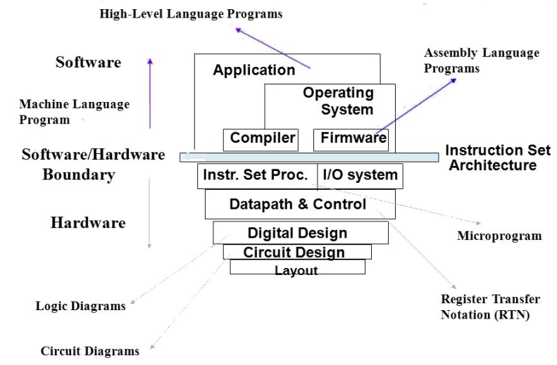

- historie
  - abakus
  - mechanicke PC
  - derne stitky
  - elektronkove PC (1. generace)
  - tranzistorove PC (2. generace)
  - integrovane obvody (3. generace)
  - procesory 4. generace (multiprocosorove systemy, atd)

- mooruv zakon
  - empiricke pravidlo -> pocet tranzistoru na cipu (vykon) se cca kazde dva roky zdvojnasobi
  - neni nejspis pravda? viz obrazek (stagnace)

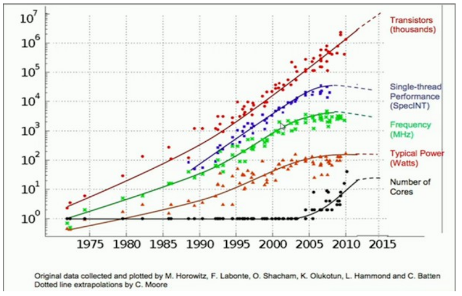

- logicke obvody
  - digitalni
    - diskretni stavy (rozhodovaci urovne 0/1)
    - tvoren hradly (logickymi cleny)
  - kombinacni (vystup je funkci vstupu) vs sekvencni (uchovava vnitrni stavy = zpetne vazby) obvody
    - Mealyho (`Y=f(X,Y)`)
    - Mooruv (`Y=f(Z)`)
  - analogovy
    - vyhoda je rychlost a zjednoduseni (viz diferencialni rovnice)
    - nevyhoda je opakovatelnost
  - popis logickeho obvodu
    - vyraz (logicka funkce), pravdivostni tabulka, K-mapa, schematem, programem (HDL = HW description language)
  - zakladni logicke funkce (hradla): AND, OR, XOR, NOT, NAND, ...
  - zakladni pametove cleny (klopne obvody): RS, D, JK
  - dalsi stavebni prvky: buffery, drivery, pameti, registry, dekodery, multiplexery, citace, ...
  - programovatelne klopne obvody (napr. FPGA)
  - charakteristiky technlogie
    - zpozdeni
    - spotreba
    - fanin (pocet vstupu)
    - fanout (pocet vystupu)
    - sumova odolnost
    - operacni teplota

- zobrazeni cisel
  - pocitacova aritmetika - implementace aritmetickych operaci a funkci - algoritmy pro HW i SW (kriticka je presnost zobrazeni)
  - zakladni zapis cisel
    - 6 mamutu = 6 kamenku
    - rimsky ciselny system - 1,5,10,50,100,500,1000 = I,V,X,C,L,D,M => nevhodny pro reprezentaci velkych cisel
  - pozicni ciselny system (poprve v cine) = hodnota symbolu je dana polohou
    - smiseny pozicni system = zaklad neni konstanta (2, 10, ...) ale vektor (H:M:S)
    - pozicni system s pevnym zakladem R (radix) - dekadicky, binarni, osmickovy, atd
      - nejvyhodnejsi o zakladu `e` -> 3

- booleovska algebra
  - negace (`~0 = 1; ~1 = 0`)
  - komutativita (`a + b = b +a`)
  - distributivita (`a & (b + c) = (a & b) + (a & c)`)
  - neutralita 0/1, k (`x + 0 = x; x & 1 = x`)
  - komplementarita (`x + ~x = 1; x & ~x = 0`)
  - asociativita (prezavorkovani)
  - absorpce (`x + (x & y) = x`)
  - idempotence (`x + x = x; x & x = x`)
  - DeMogranovy zakony
    - `~x & ~y = ~(x + y); ~x + ~y = ~(x & y)`

- hazardy
  - prechodny jev obvodu (glitch), ustaleni
  - pozor na nedefinovany vstup (pripojit na 0/1)
  - pozor na kmitani

- zobrazeni celych cisel v binarni pozicni soustave
  - kladna cisla
    - 1 byte => 0-255 (2^8)
    - 2 bytes => 0-65535 (2^16)
  - znamenkova cisla (1 byte)
    - primi kod
      - MSB = znamenko (0 => +, 1 => -)
      - napr `0x84 = -4`; je treba urcite znamena a podle toho scitat/odcitat; 2 nuly!!
    - inverzni kod
      - kladna cisla primo, zaporna inverzne
      - `4 = 0000 0100`
      - `-4 = 1111 1011`
      - porad mame 2 nuly!! -> mezi krok k doplnovemu kodu
    - doplnkovy kod
      - stejny jako inverzni kod ale pricteme +1 => odstraneni problemu dvou nul a navyseni rozsahu
      - zobrazeni -128 az 127 (`2^(n-1)` az `2^(n-1)-1`)
      - snadna realizace aritmetiky (scitani odcitani)
    - kod s posunutou nulou
      - dohodnuta pozice 0 napr 0 = 127 => -4 = 123
      - lepsi porovnavani (vyssi cislo je vyssi)
      - nasobeni je treba osetrit (scitani, odcitani je v pohode)

- zobrazeni realych cisel
  - fixni desetinna tecka - `0001.1100 = 1.75`
  - exponencialni format (IEEE 754) <https://www.youtube.com/watch?v=8afbTaA-gOQ>

    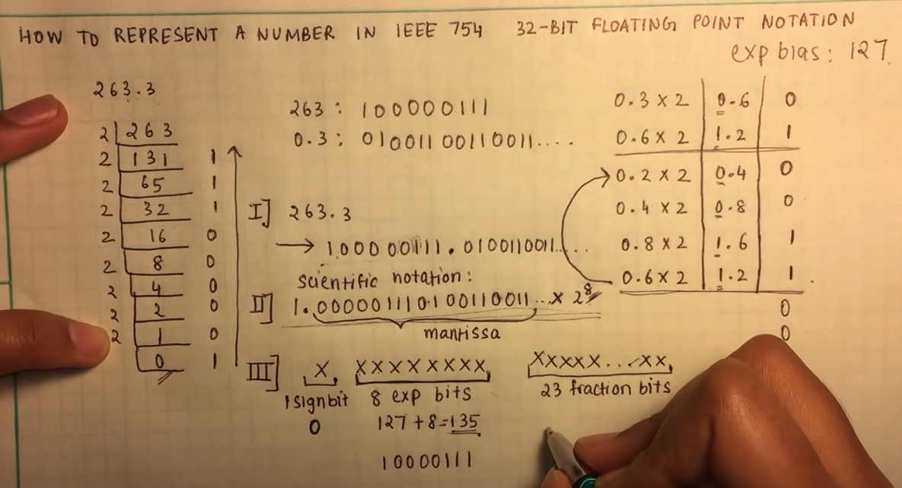

- ALU (aritmeticko-logicka jednotka)
  - zakladni prvek pro provadeni aritmetickych a logickych operaci
  - podstatny vliv na celkovy vykon CPU!
  - obsahuje vstupy (typicky dva), vystup, rizeni (opcode), status (carry, overflow, zero)

    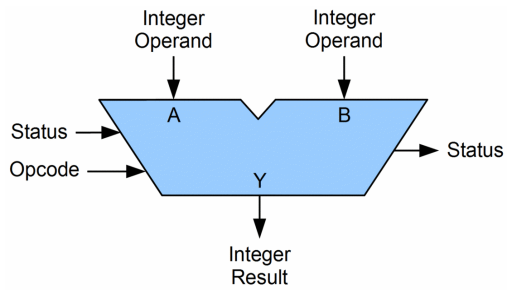

  - 1-bitova scitacka (half adder)
    - `A + B -> S, Cout`
    - `S = A xor B; Cout = A & B`
  - 1-bitova scitacka (full adder)
    - `A + B + Cin -> S, Cout`

    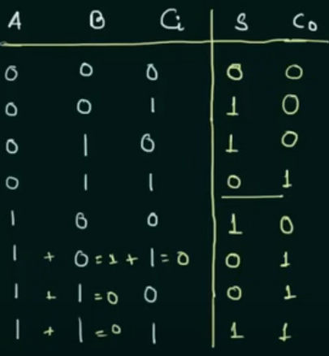

    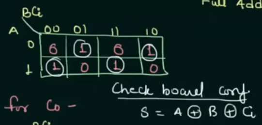

    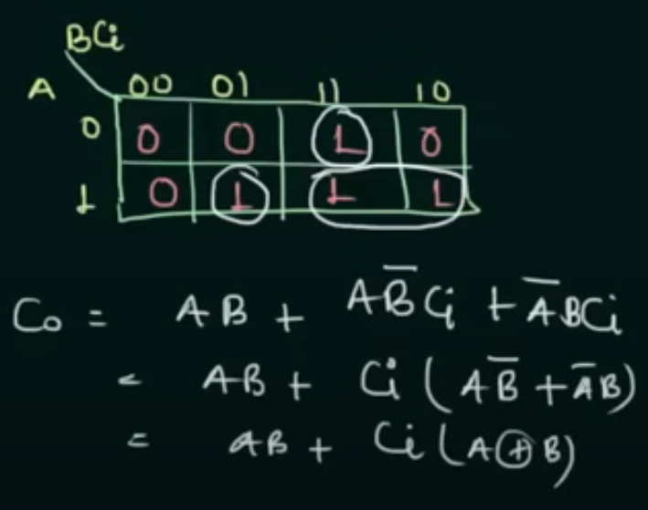

    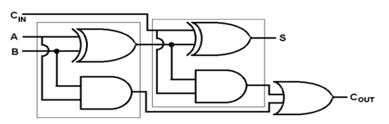

    - full adder ze dvou half adderu
      - kaskadovite propojit, `Cou = Cout1 + Cout2`

        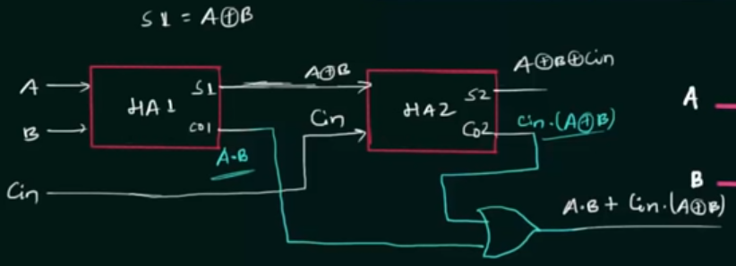

  - konstrukce scitatky
    - zalezi na pozadavcich (plocha, rychlost, spotreba); existuje mnoho ruznych reseni implementace

- RCA (Ripple Carry Adder)
  - propojeni N 1-bitovych full adderu => muzeme scitat/odcitat vice bitova cisla
  - prenos (`Cout`) prochazi od LSB k MSB

    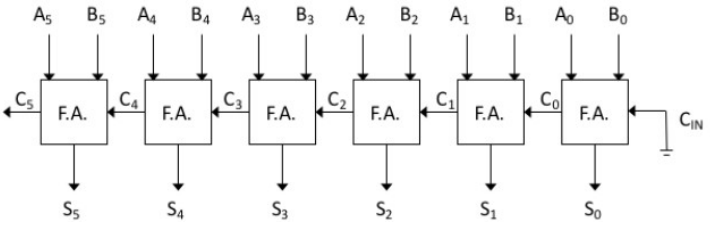

  - doba souctu je umerna poctu bitu
  - zpozdeni (`3+(N-1)*2`)
    - 3 -> vypocet `C0_out`
    - 2 -> prenost carry v dalsich (`A+B` jiz mame spocitane, prenost ceka pouze na `Cin` viz cervena cara v obrazku)

        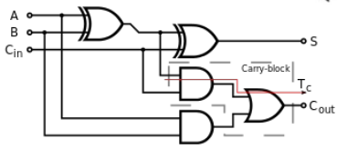

  - terminologie prenosu
    - generace: `Cout = 1` nezavisle na `Cin` => `G = A & B`
    - propagace: `Cin = Cout` => `P = A xor B`
    - anihilace: `Cout = 0` nezavisle na `Cin` => `A = 0, B = 0`

  - priznaky (flagy)
    - Carry = `Cn`
    - Overeflow = `Cn xor Cn-1`
    - Zero = `~(S0 + S1 + S2 + ... + Sn)`

        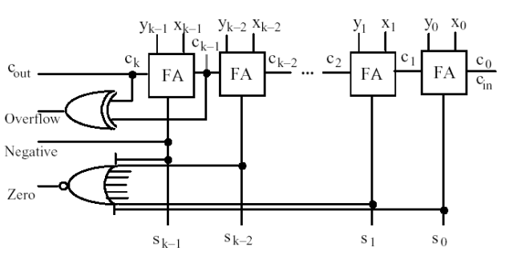

- paralelni asynchronni symator
  - zakladni myslenka: celkova doba souctu RCA scitacky nemusi vzdy odpovidat nejhorsimu pripadu
  - doplneni obvodu pri indikaci dokonceni operace souctu
  - celkova doba souctu je promenna -> zavisi na operandech `A` a `B`
  - kdy? -> jeli generace (`A & B = 1`) nebo anihilace (`A = 0 & B = 0`)
  - vyskytem je sumator, "rozpada" na vetsi pocet samostatne pracujicich casti
  - vyska zlutych poli vyjadruje zpozdeni

    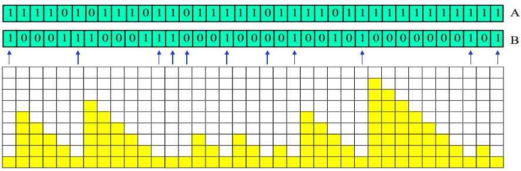

- odhad prumerne delky vypoctu
  - P(gnerace) = 0.25, P(anihilace) 0.25, P(propagace) = 0.5
  - stedni doba vypoctu `L = log2(1.25N)` kde N je pocet bitu scitacky
  - tento konec je treba detekovat -> vice logiky -> zabira vice prostoru?

    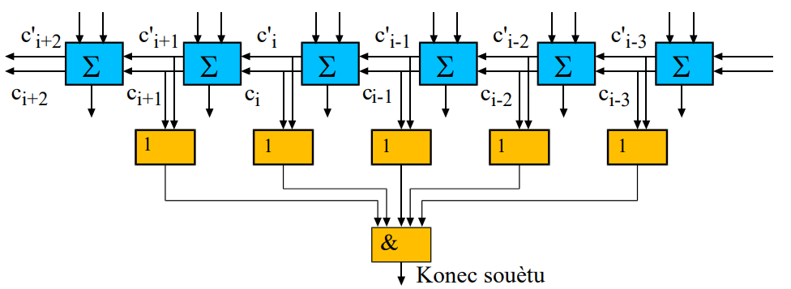

- CLA (Carry Lookahead)
  - sctacka s "predikci" prenosu
  - funkci prenosu (to co nam definuje zpozdeni) muzeme teoreticky rozvinout do libovolne urovne jako dvouurovnovou funkci `Ci = f(Ai, Bi, A-1, Bi-1, ..., A0, B0, C0)`

    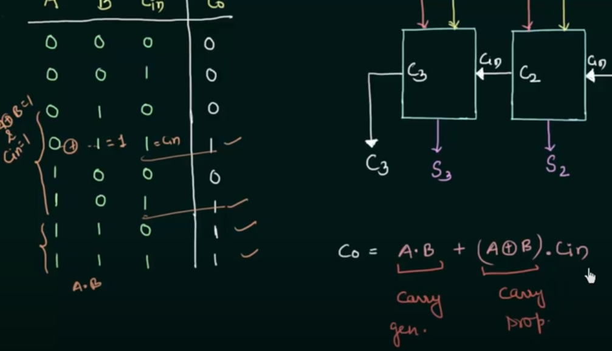

  - muzeme generalizovat: `Ci+1 = Gi + (Pi & Ci)`
    - `C1 = G0 + (P0 & C0)`
    - `C2 = G1 + (P1 & C1) = G1 + (P1 & (G0 + (P0 & C0))) = G1 + ((P1 & G0) + (P1 & P0 & C0)) = G1 + (P1 & G0) + (P1 & P0 & C0)`
    - a tak dale

  - predikujeme (vypocitavame) vsechny prenody pro 4 bitovou scitacku
  - pokud tento obvod pridame k scitacce -> zjednodusime vlastni scitacku
  - vysledna funkce je slozitejsi -> vyssi cena a spotreba, ale je podstatne rychlejsi
  - vsechny vstupy (A,B,Cin) dame do k-mapy -> optimalizace rovnic

    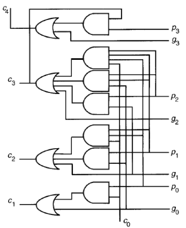

  - vsechny prenosy jsou "okamzite" (se spozdenim ktere ja dano samotnym pridavnym obvodem)
    - `O(3)`: 1 zpozdeni za generovani `Pi` a `Gi` + zpozdeni za generovani `Ci`
    - dalsi zpozdeni za propagaci carry do sumaci (souctu) -> vypocet `O(5)`
  - typicka sirka carry lookaheadu je 4 bity
  - serializace Carry Lookaheadu (L za sebou jdoucich urovni carry lookaheadu)
    - zpozdeni `1+2L+2` (1 generace `Pi` a `Gi`, + 2 propagace carry zkrz jeden lookahead, +2 propagace carry do sumaci (souctu))
      - pro 16b scitacku se 4 lookahead bloky => `1+2*4+2 = 11`
  - stromova struktura Carry Lookaheadu (T - urovni stromu)
    - generujeme `G` a `P` pro skupinu
    - rychlost `O(log N)`, plocha `O(N log N)`
    - zpozdeni 1 + 4 + 4 => (1 za generaci `Pi` a `Gi`, +4 za propagaci pres 2 vrstvy, +4 za propagaci do sumaci)

    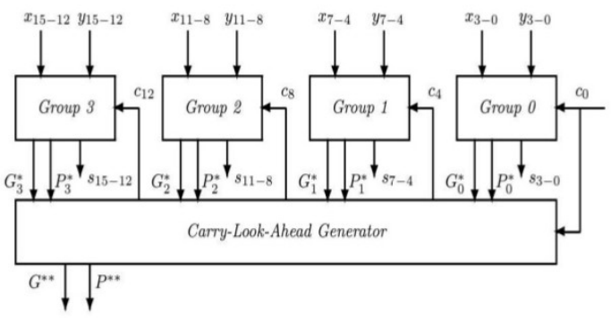

- CSA (Carry Skip Adder, Carry Bypass Adder)
  - scitacku rozdelime na jednotlive bloky ve kterych zjistujeme jestli dochazi k propagaci nebo je C vypocitan (musime pockat)
  - dva mozne pripady
    - propagace (`Cout = Cin` bud 0 nebo 1)
    - "vypocet" (`Cout = f(A,B)`)
      - nekde v bloku dochazi ke generaci nebo k anihilaci -> musime pockat nez se `Cout` vypocita
  - implementace -> vezmeme propagacni signaly jednotlivych full adderu a jejich logickym soucinem (`&`) budeme ridit multiplexer ktery vezme carry bud hned v prvniho bloku (skip) nebo z posledniho (cekame na vypocet)
  - vypocet propagaci je se zpozdenim 1

    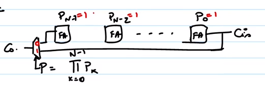

    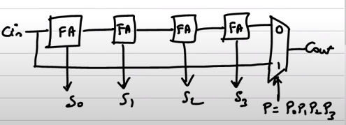

  - vetsinou se skipuji 4 bity -> propojenim vice bloku muzeme implementovat libovolnou sirku scitacky
  - v praxi jsou prvni bloky male kvuli rychlemu vypoctu carry, potom se bloky postupne o 1 zvetsuji (protoze i bypass ma zpozdeni), od prostred se bloky zase zacnou zmensovat aby se na vysledek carry necekalo nez se vypocte cely blok
  - i tento typ se da stavet stromove

    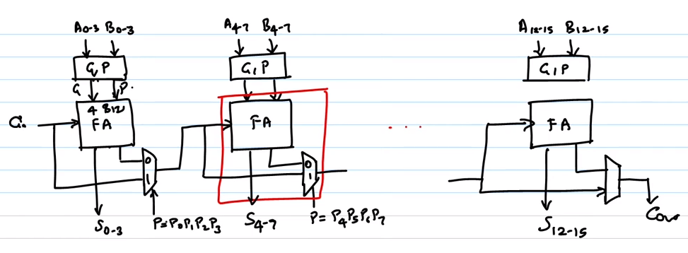

- CSA (Carry-Select Adder)
  - vypocitava n-bitove soucty pro oba mozne prenosy
  - po prichodu prenosu z predchoziho bloku uz jen provede vyber spravneho vysledku pomoci multiplexeru
  - pro optimalni zpozdeni je vypocetni slozitost `o(sqrt(N))` a plocha `O(N)`
  - velikost bloku nesmi byt stejna => pak to vede k lepsim vysledkum
  - jednotlive vysledky S4, S5, atd zavisi pouze jen na vstupnim Ci (viz CLA)

    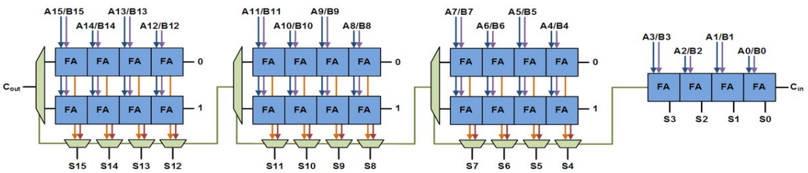

- CIA (Carry-Inc Adder)
  - obdobny princip jako CSA
  - misto vypoctu obou vysledku + vyberu spravneho pres multiplexer je informace dekovana jednoduseji pres G, P signaly a vyber je delan pomoci funkci XOR
  - rychlejsi kriticka cesta diky absenci multiplexeru
  - potreba cca polovina hradel

- Odcitacka
  - secteme `A + (-B)`
  - udelame dvojkovy doplnek +1 kde +1 je dano jako Cin = 1

  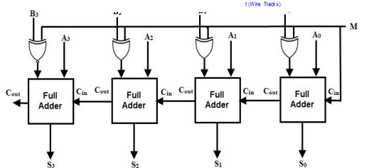

- Seriova scitacka
  - scitame stream cisel ktery je rizen hodinovym signalem

  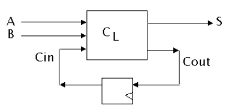

- Citace
  - slouzi napr pro citani cyklu (0...N)
  - jako citac lze pouzit scitacku ale vetsinou zbytecne narocne
  - mohou byt synchronni (stejny hodinovy signal) nebo asynchronni (ruzny hodinovy signal)
  - Straing Ring Counter
    - kruvove cirkulujici `1` (nevyhoda je ze se musi manualne nastavit po resetu)

    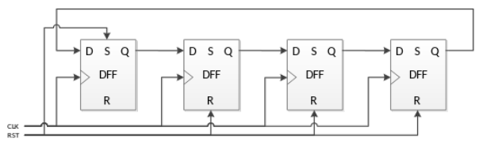

  - Twisted Ring Counter
    - do kruhu spojeny register s invertovanym prenosem mezi MSB a LSB

    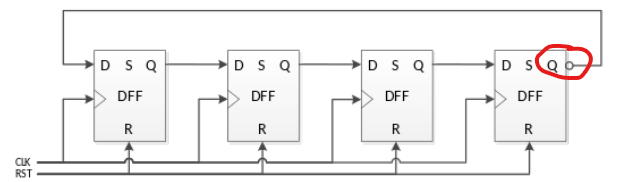

    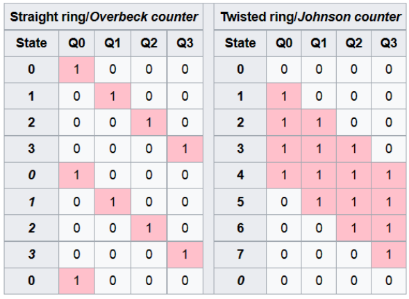
