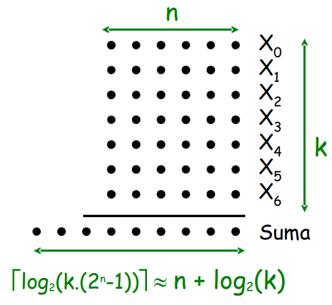
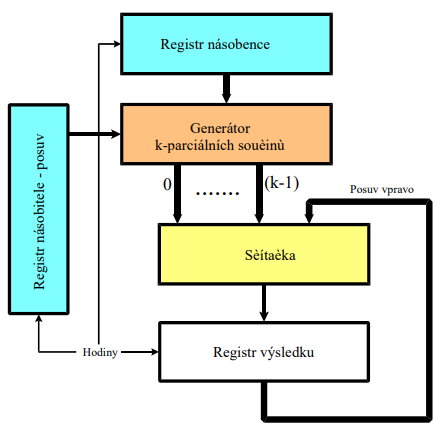
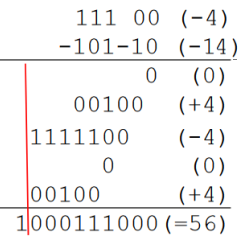
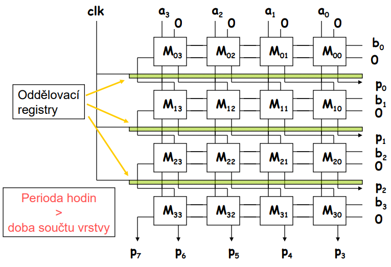

- akcelerovane algoritmy nasobeni
  - snadardni uzivatel CPU muze ovlivnit rychlost provadeni opraci jen jeho vyberem
  - jina situace je pri navrhu digitalnich systemu na bazi treba FPGA
  - navrh specializovanych funkcich bloku muze probihat i na urovni obvodoveho reseni - delicky, nasobicky, atd.

- charakteristika pouzivanych metod a algoritmu nasobeni
  - sekvencni meotody
    - boothuv algoritmus a jeho modifikace
  - paralelni (iterativni metody)
    - paralelni citace
    - iteracni aritmeticka pole
  - pouziti specialniho kodovani
    - logaritmicke zobrazeni cisel
    - modularni aritmetika (kody zbytkovych trid)

- posuvne jednotky (shifters)
  - rotace (doleva/doprava) (`100111 <- 110011 -> 111001`)
  - logicky posuv (doleva/doprava) (`100110 <- 110011 -> 011001`)
  - aritmeticky posuv (doleva/doprava) (`100110 <- 110011 -> 111001`)
    - zachovava znamenko (MSB)
  - vstup: seriovy/paralelni
  - vystup: seriovy/paralelni
  - smer: vlevo/vpravo
  - pocet kroku: 1 az N (volitelne)

    

- univerzalni posuvny register (paralelni I/O)
  - rizeni pomoci signalu `S0` a `S1` -> volba funkce
    - nacteni dat
    - posuv vlevo
    - posuv vpravo
    - bez akce (reserved)
  - posuv o N bitu vyzaduje N taktu

  

- Barrel Shifter
  - univerzalni posuvna jednotka zalozena na ciste kombinacni logice
  - vystup je jednoznacnou funkci vstupu
  - okamzita zmena na vstupu = zmena na vystupu

- Posuvna jednotka (multiplexerem)
  - implementace pomoci multiplexeru
  - nevyhoda: pro vyssi N je vysoky rad multiplexeru
  - vstup kazdeho multiplexeru je o jedna posunuty -> vyberem si vyberu posun o N bitu ktery chci

  

- Logaritmicka posuvna jednotka
  - K urovni, kazda posouva o 2^b (b = 1...K)
  - vstupy b pak volba - posunout/neposunout v dane urovni
  - pro N bitovy vstup, K = log(N)
  - kazdy multiplexer ma dva vstupu (index ktery mu odpovida a index o `2^b` v levo) -> rizeni multiplexeru = vyber jestli dojde k posunu o `2^b` nebo ne

  

- Posuvna jednotka (matice)
  - maticove propojeni -> 1 uroven logiky => velmi rychle
  - podobne jako barrel shifter ale barrel shifter muze mit slozitou kombinacni logiku => zpozdeni
  - x = vstup
  - y = vystup
  - shift urcuje posuv
  
  

- vytvareni soucinu

    

- viceoperandove scitani
  - soucet vetsiho poctu cisel:
    - nasobeni vektoru
    - vypocet strednich hodnot
    - digitalni filtrace

    

    - seriova implementace

        

      - volba typu scitacky ovlivnuje rychlost
      - doba souctu roste superlinerarni s `k`, je-li `n` konstatni
      - doba souctu reoste logaritmicky s `n` pro konstantni `k`
        - superlinarni ~ loglinearni, oznaceni `k * log(k)`
    - vytvoreni vysledku soucinu dvou cisel

        

- vytvareni parcialnich soucinu

    

  - vytvareni parcialnich soucinu pro zakladni metodu nasobeni
    - test jednoho bitu , postup po jednom bitu)
    - parcialni soucin vznikne jakou soucit nasobence a jednoho bitu nasobitele!!
    - doba nasobeni roste supeerlinearni s `n` (pouzijeme-li scitacku s logaritmickou zavislosti doby souctu)
      - `T_seriove = O(n * log(n))`

- nasobeni - posub a soucet
  - posuv vlevo a soucet
    - parcialni souciny se scitaji zdola nahoru
    - metoda vyzaduje scitacku o sirce `2n` bitu => mensi rychlost
  - posuv vpravo a soucet
    - parcialni souciny se scitaji shora dolu
    - metoda vyzaduje scitacku o sirce `n` bitu

- nasobicka (seriovo-paralelni, seriova)
  - zakladni sekvencni metoda binarniho nasobeni
  - pocet cyklu je linearne zavisly na delce nasobeni
  - delka soucinu (vysledku) = `2n`
  - delka scitacky je rovna `n` bitu
    - postup od nizsich radu nasobitele (vyhodnejsi! delka scitacky!)

      

  - scitacka bud paralelni n-bitova pak `T=O(n*?)`
    - `?` zalezi na typu sticatky (napr pro CLA `? = log(n)`)
  - nebo seriova (1-bitova) pak `T=O(n*n)`

- akcelerace pouzitim vetsiho poctu scitacek
  - urychleni celeho procesu
  - zvyseni rychlosti je omezeno tim, ze jsou scitacky vlastne razeny seriove
  - predchozi nevyhodu lze odstranit
    - pouzitim specialne navrzenych vicevstupovych scitacek
    - pouzitim stromove struktury scitacek (HW narocne)

    

- akcelerace pouzitim vicevstupovych scitacek
  - redukuju se pocet cyklu ale vyssi obvodova slozitost
  
  

- stromove usporadani scitacek
  - pocet urovni "stromu" je umerny algoritmu poctu parcialnich soucinu a tedy `log(n)`
  - celkova rychlost
    - `N + log(N)` -> vse paralelne
    - `N * log(N)` -> pipeline po vrstvach

   

- nasobeni zapornych cisel
  - Necht `B = (bn-1, bn-2, ..., b2, b1, b0)`
    - `bn-1` => znamenkovy bit (MSB)
  - zaporny nasobenec
    - expanzi znamenoveho bitu dostaneme spravny vysledek

      

    - je to dano tim ze soucet cisel v doplnkovem kodu dava spravny vysledek
    - nasobitel je kladny => tudiz jeho znamenovy bit vysledek neovlivni (zaporny je pouze nasobenec)
  - zaporny nasobitel
    - musime odecist korkcni clen od vysledku soucinu
    - pokud je nasobitel < 0 => odecteme nasobence v nejlevejsi casti vysledku

      

  - nevyhoda!!:
    - `(-4) * (-14)` na 5 bitech (4 bity data + 1 bit znamenko)
      - vysedek bude `2*5 bitu = 10 bitu`
      - => nutnost sirit znamenko dilcich soucinu a scitat dilci souciny i pro bity rozsireneho znamenka nasobitele
    - => lepsi je pouzit boothuv algoritmus

    

- Boothuv algoritmus (2,1)
  - 2,1 -> testujeme 2 bity a posouvame se po 1 bitu
  - prubezne prekodovani nasobitele - kazda skupina jednicek je nahrazena dvemi jednickami, jejihz vahy maji opacna znamenka
  - nasobitel vyjadreny ciframi `0/1` se prevede do soustavi s ciframi `{-1 0 1}`

  - ```
    0 0 -> +0
    0 1 -> +1
    1 0 -> -1
    1 1 -> -0
    ```

  - napr. -14 = 10010(0) => -1 +0 +1 -1 +0

    
  
  - vyhoda: metoda uniformnim zpusobem umoznuje nasobeni zapornych cisel zobrazenych v doplnkovem kodu
  - nevyhoda: postup pouze po 1 bitu -> parvialnich soucinu je stale `n`

- nasobeni v soustave se zakladem > 2
  - pocet kroku sekvencniho nasobeni zavisi na poctu cifer operandu (nasobitele)
  - provadime-li nasobeni v soustave `2^k`, kde delka nasobitele je `n` bitu, je treba secist `n/k` parcialnich soucinu
  - parcialni souciny nelze v tomto pripade obecne generovat jednoduse jako tomu bylo u binarniho nasobeni
    - ale je mozno si je predstavit

- nasobeni se zakladem 4
  - pri pouziti zakladu 4 (k = 2; cifry 0-3) pro nasobeni je treba jen polovina operaci souctu => urychleni 2x

  

- formovani nasobku nasobence
  - metoda vyuziva operandu `0*A , 1*A, 2*A, 3*A`
    - => lze je snadno vytvorit posuvy krome 3*A protoze 3 neni mocnina 2
    - da se vypocist predem a ulozit do registru a nebo nahradit napriklad `4A - A` (oboje je mocnina 2)
    - chceme prekodovat nasobitele tak ze pouziti "neprijemneho" operandu odpada

- prekodovani nasobitele
  - pro zaklad soustavy r=4 mohou byt cifry `bi {0,1,2,3}` nahrazeny ciframi z rosahu `{-2,-1,0,1,2}`
  - tato transformace se provede tak aby algebraicka hodnota nasobitele zustala zachovana

  

- cil prekodovani
  - odstranit "neprijemne" nasobky nasobence
    - `3A (5A, 6A, 7A, ...)` pro vyssi zaklady
  - maximalizovat pocet 0 -> mene parcialnich soucinu (resp 0)

- eliminovat moznost vyskytu paru cifer `1 1` nebo `-1 -1`
  - `0111 0111 -> 1 0 0 -1 1 0 0 -1`

- metoda prekodovani
  - oznacime-li cifru modu `mj` a cifru kodu `bj`, pak plati:

    

- Boothuv algoritmus (3,2)
  - testujeme 3 bity, posouvame se o 2 bity

  

- Boothuv algormtus (4,3)
  - redukuje se pocet parcialnich soucinu

  

- Boothuv algoritmus - obecne

  <https://www.youtube.com/watch?v=meSn0UXmgac>

  

  <https://www.youtube.com/watch?v=tnLKU07b-HA>

  

- paralelni algoritmy nasobeni
  - predchozi sekvencni metody vyzadovaly dokonceni souctu z predchoziho cyklu drive nez mohl byt zahajen novy cyklus
  - soucet parcialnich soucinu muze probehnout paralelni (komutace souctu) => urychleni
  - tzv. iteracni techniky nasobeni

  

  - vytvareni parcialnich soucinu v soustave o zakladu `2^m`
    pouziti dilcich nasobicek (tvori soucin cifer)

    

  - redukce parcialnich soucinu pomoci dilcich nasobicek

    

  - redukce vysky matice zobecnenymi scitackami

    

  - redukce parcialnich souctu paralelnimi citaci (5,5,4)
    - "nejhorsi" pripad - kazda tecka je hodota `1` => `3 + 3 + 3 + 3 + 3 = 15` => potrebujeme 4 bity na representaci

    

    - vysledny soucin je ziskan po secteni poslednich dvou radku scitackou (CLA, RCA, ...)
  - pocet redukcnich urovni?
    - jedna vrstva paralelnich scitacu redukuje souvisly pas o vysce `r` na vysku `s`
    - pri analyze se postupuje opacne -> chceme najit tzv. redukcni posloupnos = vyjadruje vystky jednotlivych redukcnich sloupcu

    

- implementace paralelnich scitacu
  - obecne paralelni scitace
    - scitaji vazene jednicky v k-bitovych sloupcich
    - `(3,2), (7,3), (15,4), (5,5,4), ...`
  - specializovane paralelni scitace
    - scitaji vazene jednicky v k-bitovych sloupcich + j internich vstupnich prenosu
    - generuji vystupni pole a j internich vystupnich prenosu
    - `(4,2), (7,2), (11,2), ...`

- citac (4,2)
  - postaveny ze dvou citacu (3,2), ale s jednim internim vstupnim "prenosem" a jednim internim vystupnim "prenosem"

  

- redukce nasobicky 8x8
  
  

- Scitacka typu CSA
  - obecne typ scitacky nepropagujici carry vlevo ale postupuje ke zpracovani dalsi vrstve

  - ```
     1011
    +1001
    -----
     2012
    ```

  - full adder ktery poskytuje prenos dalsi vrsve misto toho aby preno prochazel napric celou paralelni scitackou
  - lze oznacit jako paralelni scitac (3,2)
  - CSA (Carry Save Adder)

  

  - CSA pro redukci matice parcialnich soucinu
    - 6 bitova CSA scitacka redukuje tri 6-bitova vstupni slova na jeden 6-bitovy a jeden 6-bitovy (posunuty vystup)

    

- nasobicka Wallace

  - kombinace HA (2,2) a FA (3,2)
  - rychle paralelni scitani parcialnich soucinu
  - <https://www.youtube.com/watch?v=75JidRFYAQ0>

  

- iteracni aritmeticka pole
  - predstavuji pole bunek stejneho typu (nebo nekolika malo typu)
  - nejcastejsi organizace 2D ktere maji pravidelnou propojovaci strukturu
    - urcena pro vykonavani aritmetickych operaci
  - funkce bunek nemusi byt konstantni (implementace mnoziny operaci jednom polem)

- zakladni typ nasobicky (naivni)
  - nejdelsi cesta = zpozdeni
  - defakto kopiruje strukturu parcialnich soucinu

    

- upravy zakladniho typu pole pro nasobeni
  - cile uprav:
    - zkraceni kriticke cesty signalu v polu
    - rozsireni o nasobeni zapornych ciel
    - generace parcialnich soucinu uvnitr bunek
    - zavedeni pipelingu
    - zlepseni topologie polo pro snazsi implementaci

- nasobicka s upravou (vylepsena)
  
  

- pole pro nasobeni se znamenkem
  - expanze znemenka kazdeho parcialniho soucinu (a provedeni zaverecne korekce) na sirku vysledneho soucinu

  

- Nasobicka Baugh-Wooley

  - vzdycky kdyz se pouzije znamenkovy bit tak se vysledek zneguje
  - pro `a3 b3` je to negace negace vysledku, takze bez negace
  
  

  

  

- priklad pole pro nasobeni
  
  

  - zpozdeni (delka kriticke cesty)
  - ve ctvercovem formatu pole

    

- pipelining
  - rozdeleni provadejici jednotky do stupnu s priblizne stejnou operacni dobou
  - oddeleni stupnu pomoci registru (latch), aby bylo moznost cinnost separovat
  - hodinovy kmitocet je urcen nejpomalejsim stupnem
    - velmi rychle hodiny
  - delsi doba latence
    - doba ktera uplyne od vlozeni vstupnich operandu do vystupnu vysledku prochazejiciho od techze operandu
  - lze dosahnout velke sirky pasma, pokud se provadi velike mnozstvi nezavislych nasobeni
    - kazdy takt hodin generuje jeden vysledek

  

- existuji i dalsi pole napr pole pro nasobeni s prekodovanim (booth) nebo pole pro nasobeni CSA (vysledek bez carry + prenos)
- struktura jedna bunky nasobicky

  

- pole pro nasobeni CSA
  - kazda bunka Mxy je jedna CSA scitacka

  

  - nasobeni se znamenkem

    

- taktez muze fungovat v pipeline rezimu (latch registry)
- zaver pole nasobeni
  - nepatri mezi nejrychlejsi implementace
  - regularni strukturu
  - pouzivaji pouze kratke vodice (k bezprostrednim sousedum)
  - jednoduchy a efektivni navrh v technologii VLSI
  - jednoduche zavedeni pipelingu => zvyseni vykonu
  - pole lze vyuzit pro vicero matematickych funkci
