- delicky
  - ruzne moznosti implementace
  - prevodem do jineho ciselneho systemu (napr logaritmicky)
  - s obnovou zbytku/bez obnovy zbytku, SRT (akceleracni tabulky)
  - deleni konstantou (; deleni pomoci inverze = nasobeni cisel 1/x -> viz nasobicky)
  - konvergencni deleni
  - deleni opakovanym odcitanim
  - aidtivni iterace (newtonova metoda)

- nekonvencni ciselne systemy
  - nejrozsirenejsi ciselny system pouzivany v ALU: binarni + dvojkovy doplnek pro zaporna cisla
  - dalsi ciselne systemy se pouzivaji hlavne pro specialni aplikace
    - LNS = logaritmicky ciselny system
    - kody zbytkovych trid (RNS)
    - ciselny systestem se zapornym zakladem
    - ciselny system se znamenky pro jednotlive cislice

- LNS (= logaritmicky ciselny system)
  - reprezentace realnych cisel v pocitacovych sytemech (zejmena zpracovani signalu)
  - v LNS je cislo `X` reprezentovano jako `log2|X|`
    - plus specialni reprezentace 0 protoze `log2(0)` neni definovany
  - operace v LNS (plati pro `A > B`)
    - MUL: `log2(A * B) = log2(A) + log2(B)`
    - DIV: `log2(A / B) = log2(A) - log2(B)`
    - ADD: `log2(A + B) = log2(A) + log2(1 + 2^(log2(B) - log2(A)))`
    - SUB: `log2(A - B) = log2(A) + log2(1 - 2^(log2(B) - log2(A)))`
    - SQRT: `log2(SQRT(A)) = 1/2 * log2(A)`
    - => jednodussi nasobeni a deleni ale slozitejsi scitani a odcitani
    - slozitejsi obvody => vetsi plocha, spotreba, cena?

- kody zbytkovych trid (RNS)
  - = Residual Number System
  - modularni nasobeni je zakladni operaci kryptografie
    - nektere kryptograficke metody navic vyuzivaji modularni exponencialni funkci
  - otazka: ktera reprezentace cisel je nejefektivnejsi?
  - zaklady uz ve 3. stol. n. l.
  - necht `m1, m2, ..., mk-1, mk` (moduli) jsou prirozena cisla navzajem nesoudelna (bez spolecneho delitele) a `M = m1 * m2 * ... * mk`
    - potom libovolne cislo z `[0, M-1]` muzeme reprezentovat pomoci k-tice cisel `(x1, x2, ..., xk)` kde:

    - ```
      x0 = X mod m0
      x1 = X mod m1
      .
      .
      xk = X mod mk
      ```

    - z matematicke hlediska se jedna o soustavu linearnich kongruenci, hledame-li X
  - `(m0, m1, ..., mk-1)` tvori bazi RNS => oznacujeme ji jako `Bk`
  - oznaceni `X=(x0 | x1 | ... | xk-1)RNS(m0 | m1 | ... | mk-1)`
  - nebo take `xi = X mod mi`
  - priklady

  - ```
    84 = (0|4|0)RNS(7|5|3)
    1 = (1|1|1)RNS(7|5|3)
    2 = (2|2|2)RNS(7|5|3)
    3 = (3|3|0)RNS(7|5|3)
    123 = (3|4|3|0)RNS(8|7|5|3)
    ```

  - residualni ciselny system neni pozicni!!
  - pro moduly `(7|5|3)` existuje jednoznacna reprezentace cisel rozsahu `0-104` `(0 az (7*5*3-1)`
  - potreba obousmerne konverze

    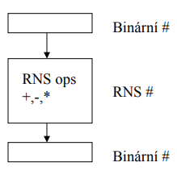

  - jake vyhody prinaseji operace v kodech zbytkovych trid?
    - scitani a odcitani je jednoduche (pouze secteme jednotlive zbytky po deleni `Xi +- Yi`)
    - nasobeni je take jednoduche (pouze jednotlive polozky vynasobime `Xi * Yi`)
    - celociselna mocnina `Xi * P`
    - deleni je obtizne
  
  - zaporna cisla muzeme reprezentovate jako doplnek (`(M-X) mod mi`)
    - `x = (xk-1 | ... | x0) -> -x = (mk-1 - xk-1 | ... | m0 - x0)`
    - `x = 21 = (5|0|1|0)RNS(8|7|5|3)`
    - `-x = -21 = (8-5|7-0|5-1|3-0) = (3|0|4|0)RNS(8|8|5|3)`
  - vyber modulu (priklad)
    - `5=(5|5|0|2)RNS(8|7|5|3) -> 101 101 000 10 (11-bits)`
    - ucinnost reprezentace je pomer rozsahu RNS s moznym rozsahem binarniho ekvivalentu napr `8*7*5*3 / 2^11 = 41%`
    - muzeme volit napriklad prvocisla
  - vyhody
    - paralelni vypocet `+ - *` (jednotlive zbytky zvlast); navic operuje jen s malymi cisly
    - pridavanim prvocisel lze zvysovat fault tolerance
      - napr pri prechodu od `(7|5|3)` na `(7|5|3|2)` => posledni zbytek nam urcuje paritu
  - nevyhody
    - nelze jednoduse provadet deleni
    - porovnavani neni trivialni
    - pomerne narocna konverze do binarni podoby
    - obtizna detekce preteceni

  - jak provest konverzi?
    - konverze binarni (NBC = normal binary code) -> RNS
    - muzeme pouzit lookup tabulky (nemusime delit velka cisla) ale musim ji nekde ulozit?
    - bez lookup tabulky priklad
      - prevod `(6|4|0)RNS(7|5|3)`

        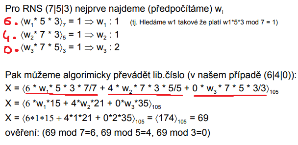
  
  - porovnavani
    - je mozne provest konverzi RNS -> NBC a pak porovnat standardnim zpusobem
    - jiny zpusob:
      - prevest do systemu se smisenym zakladem (MRS = mixed radix system) ve kterem lze cisla porovnat
      - pro provadeni aritmetickych operaci neni MRS vhodny (porovnavani je ale jednoduche)

- MRS (Mixed Radix System; system se smisenym zakladem)
  - `X = (Zk-1 | Zk-2 | ... | Z0)MRS(mk-1 | mk-2 | ... | m0)`
  - `X = (Zk-1 * mk-1 * mk-2 * ... * m0) + (zk-2 * mk-2 * ... * m0) + (z1 * m1) + z0`
  - vlastnost
    - cifra MRS z0 je pouze v radu jednotek => pro MRS potrebujeme mene prvocisel nez pro RNS
  - 1) `x0 = z0`
        - protoze `x0 = (X mod m0)`; vsechna ostatni cisla jsou nasobkem `m0 -> x0 = z0`
    2) `X-x0 = (xk-1' | ... | x1' | -)RNS(mk-1 | ... | m1 | -) = (zk-1 | zk-2 | ... | z1 | 0)MRS(mk-2 | mk-3 | ... | m0)`
        - `xi' = <xi - x0>mi`
    3) `(x-x0)/m0`
    - a tak se pokracuje dale...dedukce, deleni, opakovani
    - na zacatku jsme tvrdili, ze je delni v RNS obtizne ale ted jsme ho delali?
      - trik: vime ze vysledek bude vzdy cele cislo
  
  - priklad
    - `Y(1|3|2)RNS(7|5|3) = (Z2|Z1|Z0)MRS(5|3)`
    - `Z0 = x0 = 2`
    - `y-2 = (6|1|0)RNS(7|5|3)=(Z2|Z1|0)MRS(5|3)`
      - `(1-2) mod 7 = 6`
    - dal nevim :( ale vysledek je `(0|2|2)MRS(5|3) => (0*5*3)+(2*3)+2 = 8`
      - `z` s vyssim indexemma vyssi vahu -> porovnavani je jednoduche? => porovnavame cisla z leva do prava

- ciselne systemy se zapornym zakladem
  - zadklad `r` ciselneho systemu s konstanim zakladem - obvykle kladne cislo `r > 1`
  - zaklad `r` muze byt i zaporny `r = -B` kde `B` je kladne cele cislo
    - rozsah cislic: `xi = 0, 1, ..., B-1`
    - hodnota n-tice `(xn-1, xn-2, ..., x0)`

      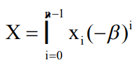

- priklad negativni desitkova soustava (`B = 10`)
- cisla negativniho dekadickeho systemu o sirce 3 cislic:
  - `(192)-10 = (1*100)-(9*10)+(2*1)=12`; `(012)-10 = (0*100)-(1*10)+2 = -8`
    - kazda suda pozice ma kladne znamenko a kazda zaporna zaporne!
  - nejvetsi kladne cislo: `(909)-10 = (909)10`
  - nejmensi cislo `(090)-10=(-90)10`
  - => aritmeticky obor hodnot `-90 <= X <= 909`
  - => priblizne 10x vice kladnych nez zapornych cisel
    - plati pouze pro `n` licha (pocet cislic), pro suda to plati naopak
    - priklad pro `n = 4` => `-9090 <= X <= 909`

  - neni treba znamenkovy bit - zobrazeni zapornych cisel je "automaticke"
  - algoritmy zakladnich operaci pro negativni zaklad jsou mirne slozitejsi nez v klasickem pripade
  - priklad binarniho systemu se zapornym znamenkem
    - zaporna baze `B = 2`, delka cisla `n = 4`
    - rozsah zobrazeni `(1010)-2 az (0101)-2`
      - `-10 az 5`
      - pri souctu mohou byt prenosy kladne i zaporne

        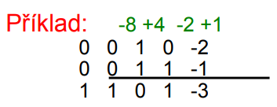

    - predpokladane aplikace - zpracovani signalu (algoritmy existuji pro vsechny aritmeticke oprace)
    - nestal se popularnim
      - nevychazi lepe nez dvojkovy doplnek

- ciselne systemy s ciframi se znamenkem
  - ruzne varianty
    - redundantni ciselne systemy s oborem cifer symetrickym kolem 0
      - rozsah: `xi je z {r-1, r-2, ..., 1, 0, 1, ..., r-1}`
    - redundantni ciselne systemy s nesymetrickym rozlozenim cifer kolem nuly
      - rozsah: `xi je z {A, ..., 1, 0, 1, ..., ,B}` kde `A + B + 1 - r > 0`
    - hodnota n-tice `(xn-1, xn-2, ..., x0)` je v obou pripadech rovna:

      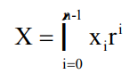
  
  - znamenko pro kazdou cifru
    - reprezentace cifer se znamenkem: mnozina cifer `[-A,B]` namisto `[0,r-1]`
    - priklad: reprezentace zaklad 4 s ciframi `[-1,2]` namisto `[0,3]`

      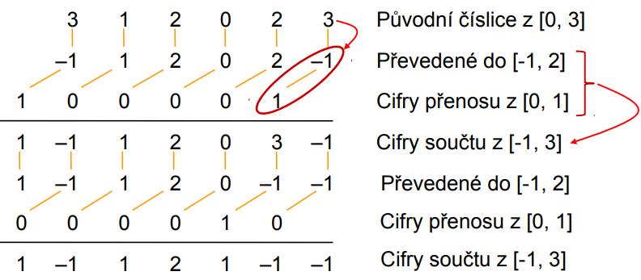

      - musime scitat prenosy a pokud name vyjde nekde cislo ktere neni v rozsahu `[-1,2]` musime proces opakovat...

    - priklad konverze ze systemu se zakladem 4 do redundantniho SYMETRICKEHO systemu `[-2, 2]`

      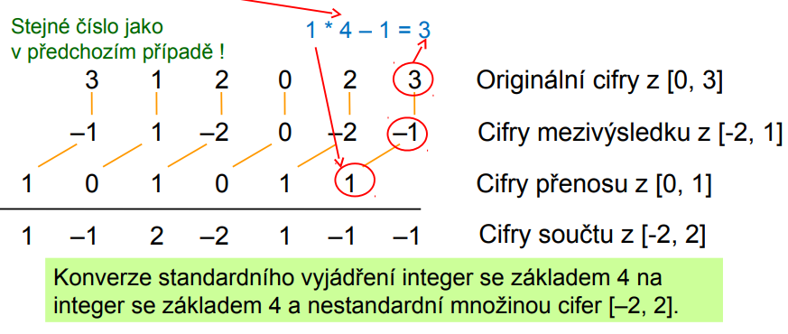

      - v tomto pripade prenos neprochazi dale => konverze je "carry-free"

- ciselne systemy s redundanci
  - zvazte vyhody a nevyhody redundantniho vyjadreni cisel
    - redundance eliminuje dlouhe prenosove retezce
    - redundance muze mit mnoho forem
    - koverze mezi redundantni a neredundantni reprezentaci?
    - ma se redundantni vyjadreni pouzit i pro konecnou formu vysledku?

- problemy s prenosem
  - moznosti jak se vyporadat s dlouho prenosovou cestou
    - omezit delku prenosu na maly pocet bitu
    - detekovat ukonceni prenosu (viz scitacky)
    - zrychleni prenosu (Carry Look Ahead)
    - idealni je uplne vyloucit prenosy

    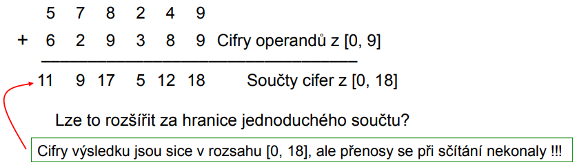

  - scitani cisel s redundanci

    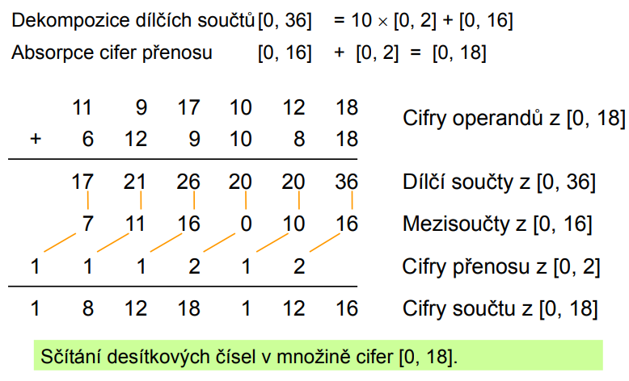

  - scitani bez prenosu

    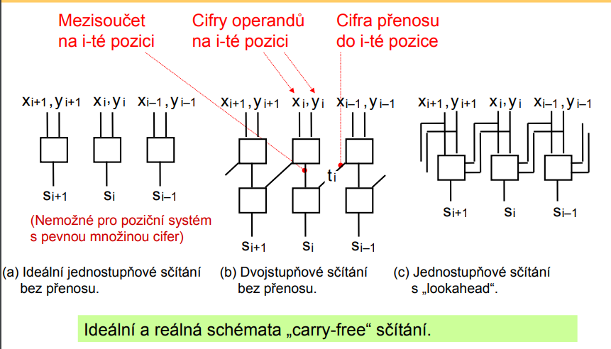

  - index redundance

    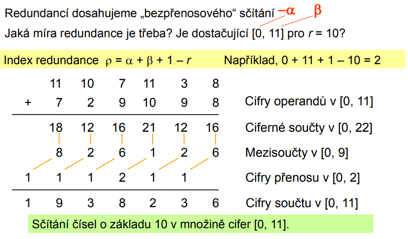
