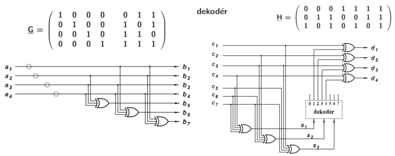

- kody a kodovani
  - kanal
    - bez pameti = nezavisle chyby
    - s pameti = shluky chyb
  - kod
    - symetricky (stejna ppst chyb tam a zpet), nesymetricky, jenosmerny
    - systematicky (oddelena
    informacni a kontrolni cast), nesystematicky
    - blokovy
      - (n,k) -> n = celkovy pocet bitu, k = informacni cast, n-k = zabezpeceni (redundance)
    - detekcni (umoznuje detekci chyby; ne ji opravovat!)
    - opravny (umoznuje opravit chybu)
  - hamminova vzdalenost -> minimalni pocet zmen bitu mezi dvemi zpravami

- jednouche kody
  - opakovaci kod (n,1) - informace je obsazena n-krat ze sebou (hammingova vzdalenost = n)
  - kokravy kod (nk, k) - informace je po k bitech za sebou (hammingova vzdalenost = n)
    - napr `1010` -> `(111'000'111'000)(111'000'111'000)` -> kazdy bit je 3x zduplikovan, zprava je poslana 2x
  - parita
    - licha - `p = a0 XOR a1 XOR .... XOR ak`
    - suda - `p = a0 XOR ar1 XOR .... XOR ak XOR 1`
    - hammingova vzdalenost = 2 => detekce jednoduche chyby bez moznosti opravy
      - neumi detekovat sude chyby (zmenu 2 bitu)

    

    

    - pricna a podelna parita
      - hammingova vzdalenost = 4 -> dekce az 3 chyb a moznost opravy jedne

        

    - tez pouzivani bez podelnepricne parity (`p5` - pak hammingova vzdalenost = 3)

- kontrolni soucet (checksum)
  - checkum jako soucet nebo checksum jako libovolny druh zabezpeceni?
  - sumy bytu -> snadna HW is SW implementace
  - nevyhody
    - neni schopny detekovat chybu v poradi (komutativita)
    - pridanim nul nezmenime vysledek (nesensitivni na 0)

- fletcher checksum
  - zvetsuje delku zabezpecovaci casti
  - detekuje chybu v poradi
  - pro detekci pouziva 2 byty a scita v modulo 255
  - algoritmus (vstupem je `sum1` a `sum2`)

    - ```
      sum1 = (sum1 + data[indx]) % 255;
      sum2 = (sum2 + sum1) % 255;
      ```

- Hamminguv kod
  - patri do blokovych linerarnich cyklickych kodu
  - plati ze pro kazde `r > 2` existuje kod delky `2^r-1` se zpravou delky `2^r-1-r`, `r` = redundance
  - `b = a*G`
    - `b` - zprava vcetne zabezpeceni
    - `a` - zprava/informace
    - `G` - generujici matice
    - `G*H = 0` (H = kontrolni matice)
    - `b*H = a*G*H = 0`
  - jeli v prenosu chyba pak `c=b+e` kde `e` je chybovy vektor
    - `s = c*H = b*H + e*H = + e*H = e*H`
  - priklad `(7,4)`
    - `b=(a1,a2,a3,a4, p1,p2,p3)`
    - hammingova vzdalenost = 3 (detekce dvou, oprava max 1 chyby)

    

  - kodova vzdalenost vsech kodu je 3
  - existuji take kody (3,1), (7,4), (15,11), (31,26)
    - `(2^r-1, 2^r-1-r)`
    - ale i take napr (12,8), (21,16), ...
  - hamminguv kod lze rozsirit o paritu cimz ziskame ham. vzdalenost 4 (= rozsireny hamminguv kod)

- ECC pameti (Error Code Correction ruznych typu pameti)
  - ECC -> nespecifikovany
  - EDC = error detection code
  - typicky se pouziva pro DRAM a NAND flash
    - SRAM - statricke kombinacni obvody (TTL)
    - DRAM - implementace pomoci kondenzatoru -> musi se zapis periodicky obnovovat
    - hamminguv kod - skalovatelny pristup
      - bitove pozice jejich cislo je rovne mocnine 2 tj 1,2,4,8,16,... se pouzivaji jako paritni bity
      - zbytek bitu = informacni slovo (3,5,6,7,9,10,...)
      - kazdy paritni bit se pocita z nekterych bitu informacniho slova
      - pozice bitu urcuje jake bity jsou jsou v informacnim slove zjistovany a jake preskakovany
        - pro pozici `p3` (pozice 4) jsou prvni 3 bity preskoceny, 4 se zkontroluji, 4 preskoci, 4 zkontroluji, atd.

      

      

      - kdyz kontrolni bit nevyjde oznacime si dany paritni bit jako `1`, pokud ok tak `0` -> binarni cislo udava pozici bitu ktery je spatne (`101` -> bit d5 je spatne (6. pozice pokud pocitame od 0))

    - napr pro DRAM 64 bit se pouziva 8b zabezpeeni
    - pro flash block 2048 (512B) se pouzivaji EEC 24b (2b detekce, 1b korekce)

    

- CRC kody = cyclic redundancy check
  - patri do tridy cyklickych polynomialnich kodu
  - typicke parametry
    - detekce vsech jednobitovych a dvoubitovych chyb (mali polynom vice nez tri cleny)
    - detekce vsech lichych chyb (mali polynom cleny X+1)
    - detekce vsech burst chyb delky `< r` (redundance)
  - obvykle jen detekce cyb (ne oprava - ta je slozita)
  - velmi rychla HW implementace
    - ke kodovani dekodovani pouzivame posuvne register (stejny obvod pro vysilani i prijem)

    

  - SW implementace je pomalejsi, mozno pouzit lookup tabulky (postup po vice bitech)
  - implementace jeste zavisy na startovni hodnote CRC (nemusi byt 0), na poradi vstupnich bitu, ci na pripadne negaci/xoroani vysledku
