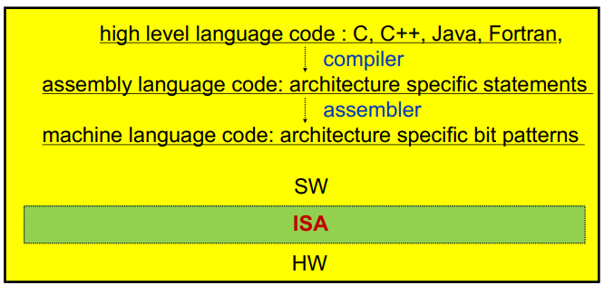
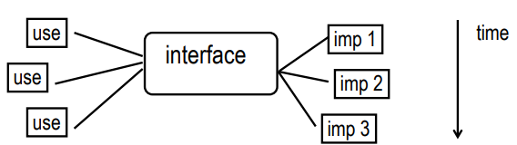
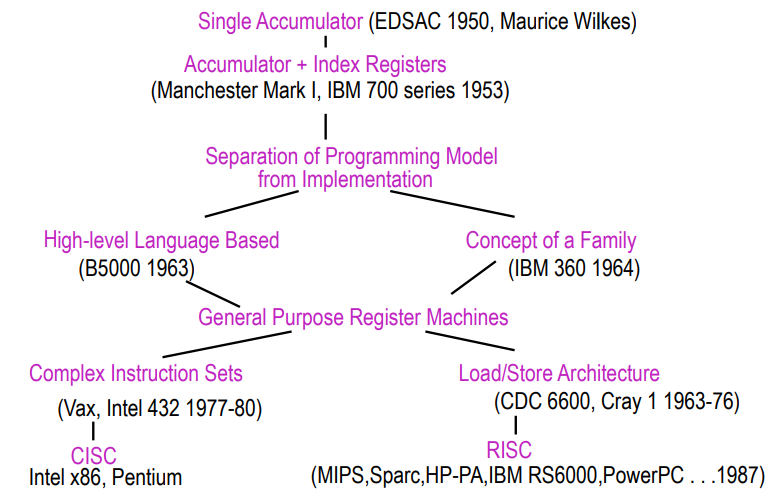
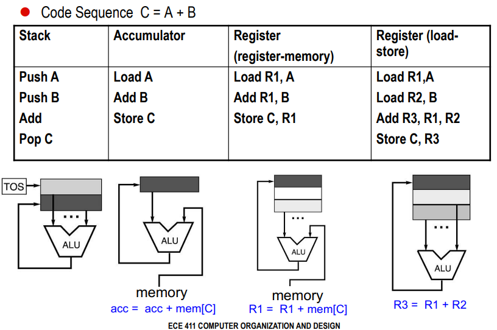
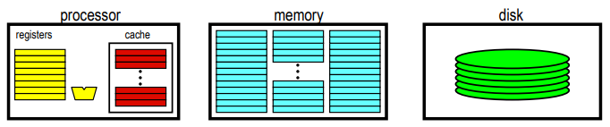
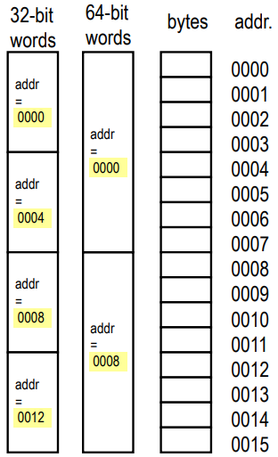
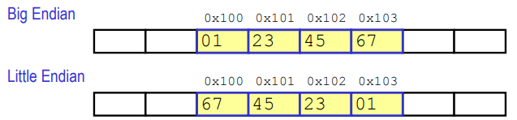
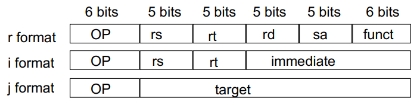

- ISA = rozhrani mezi SW a HW
  - poskytuje mechanismus ktrym SW rika HW co delat

    

    - dobre rozhrani
      - vydrzi nekolik generaci implementace
      - obecne (pouziti vicero zpusoby)
      - poskytuje vhodne (ulehcujici) prostredky vyssim vrstvam
      - umoznuje efektivni implementaci nizsim vrstvam

        

- problemy (otazky) pri navrhu instrukci sady
  - kde jsou ulozene operandy (zasobnik, pamet, registry, akumulator)?
  - kolik vyzadujeme operandu (0, 1, 2, 3)?
  - jak jsou operandy definovany (immediate, register, neprimo)?
  - jake typy operandu podporujeme (float, int, vector)?
  - jake instrukce podporujeme (add, sub, compare, move)?

- evoluce instrukcnich sad

    

- delka instrukci
  - promenna (x86 - delky instrukci se lisi 1-17 B)
    - vyzaduji vicero kroku (obtizne fetch, decode, ...)
    - mensi velikosti vyslednych binarek
  - pevna (MISP, vetsina RISC architektur, typicky 4B)
    - jednoduche fetch a decode
    - zjednodusuje pipelining a paralelismus
    - vetsi velikost vyslednych binarek (vyzadujeme vicero instrukci k dosazeni jedne funkcionality; x86 nebo VAX na to maji napr jen jednu instrukci)

- ARM Case Study
  - fixni delky instrukci (32 bitu)
  - pridana thumb instrukci sada
    - subset kompletni instrukcni sady
    - jedna instrukce = 16 bitu
    - moznost vyuziti poze prvnich 8 registru (ne 16 protoze mame polovicni velikosti)

- problem poctu registru
  - vetsina pocitacu ma male mnozstvi registru
    - pro data ktea se budou v blizke dobe vyuzivat
    - typicka instrukce vyuziva 2 nebo 3 registry
  - vyhody MALEHO poctu registru
    - vyzaduje mensi pocet bitu v instrukci na adresaci (ktery register checme pouzit)
    - mene HW
    - rychlejsi pristup (kratke kabely)
    - rychlejsi context switch
  - vyhody VELKEHO poctu registru
    - je potreba mene load/store instrukci
    - jednodusi na vykonani paralenich operaci
      - preusporadani registru => moznost paralelizace

- kde jsou ulozene operandy kdyz je ALU potrebuje?
  - stack machine
    - `push` nacte 1 register na vrchol zasobniku; `pop` dela opak
    - operace vezme 2 operandy z vrcholu a vysledek ulozi zase na vrcho zasobniku
  - accumator machine
    - pouze 1 register = accumator (`ACC <- ACC + MEM`)
  - register-memory machine
    - aritmeticke operace mohou vyuzit data v registerech nebo primo v pameti
  - load-store machine (aka register-register machine)
    - aritmeticke operace vyuzivaji pouze registry (viz ARM)

  

- vice o register pro obecne pouziti (General Purpose Registers)
  - pro skoro vetsina dnesnich architektur pouziva GPR?
    - registry jsou mnohem rychlejsi nez pamet (i nez cache)
      - hodnoty registru jsou dostupne hned
      - kdyz pamet neni dostupna, CPU musi pockat ("stall")
    - registry jsou vhodne pro ukladani promenych
      - prekladc priradi urcite promenne primo registrum

    

- zasobnikova architektura
  - vyhody
    - male naroky na HW
    - jednoduche pro psani jednoducheho prekladace
  - nevyhody
    - zasobnik = bottleneck
    - maly nebo zadny paralelismus nebo pipelining
    - ne vzdy chceme pristupovat pouze k datum na vrcholu zasobniku => jsou potreba pomocne funkce jako SWAP

- akumulatorova architektura
  - vyhody
    - male naroky na HW (stejne jako zasobnikova rchitektura)
    - jednoduche pro navrh a pochopeni
  - nevyhody
    - accumulator = bottleneck
    - velky memory traffic

- memory-memory architektura
  - instrukcni sada
    - 3 operandy `add A, B, C`
    - 2 operandy `aa A, B` (vysledek je ulozen do 1. operandu)
  - vyhody
    - vyzaduje mensi pocet instrukci (hlave jestli mame 3 operandy)
    - jednoduche na psani prekladace (hlavne jestli mame 3 operandy)
  - nevyhody
    - velmi vysoky memory traffic (hlavne pokud mame 3 operandy)
    - prommeny pocet CPU cyklu pro kazdou instrukci
    - pokud mame 2 operandy => potreba vice pametovych presunu

- register-memory architektura
  - x86, VAX
  - vyhody
    - k urcitym datum se muze pristupovat bez nutnosti toho aby se nejdriv nacetly do registru
    - jednoduche dekodovani instrukcni sady
  - nevyhody
    - operandy nejsou ekvivalentni
      - slaba ortogonalita (= vsechny typy instrukci mohou pouzivat vsechny adresni mody)
    - promenny pocet CPU cyklu
  
- load-store architektura
  - ARM, MISP
  - vyhody
    - jedoduche, fixni delky instrukci
    - stejny pocet CPU cyklu na vykonani jedne instrukce
    - jednoduchy pipelining a paralelizace
  - nevyhody
    - vetsi pocet instrukci
    - vyzaduje dobry sofistikovany prekladac

- vyhody a nevyhody pouzivani registru
  - vyhody
    - rychleji nez cache nebo hlavni pamet
    - deterministicky (zadne cache misses)
    - kratke identifikatory (0-n) => vyzaduje mene bitu v kodovani instrukci
    - redukce memory trafficu
  - nevyhody
    - musime je ukladat pri kontext switchi nebo pri volani funkce
    - nemuzeme je adresovat `&r0`
    - fixni delka (strigy nebo struktury musime ulozit jinak)
    - prekladac je musi spravovat (pri prekladu sledovat jake registry jsou jeste dostupne)
    - omezeny pocet

- kazda ISA navrzena po roce 1980 pouzivat load-store ISA (napr RISC) pro zjednoduseni navrhu CPU

- word-oriented organizace pameti
  - pamet je bytove adresovatelna a poskytuje pristup k bytum (8 bits), half wordu (16 bits), wordum (32 bits) a double wordum (64 bits)

    

- poradi bytu
  - jak jsou byty ve vice-bytovem slove ulozeny v pameti?
  - konvence
    - big endian (LSB ma nejvyssi adresu)
    - small endian (LSB ma nejnizsi adresu)
  - priklad: `0x01234567` na adrese `0x100`

    

- typy adresnich modu
  1) Register direct `add r0, r1` (`r0 += r1`)
  2) Immediate `add r0, #15` (`r0 += 15`)
  3) Displacement (offset) `add r0, r1(100)` (`r0 += mem[r1 + 100]`)
  4) Register indirect `add r0, (r1)` (`r0 += mem[r1]`)
  5) Indexed `add r0, (r1 + r2)` (`r0 += mem[r1 + r2]`)
  6) Direct `add r0, (1000)` (`r0 += mem[1000]`)
  7) Memory indirect `add r0, @(r3)` (`r0 += mem[mem[r3]]`)
  8) Autoincrement `add r0, (r1)+` (`r0 += m[r1]`; `r1++`)
  9) Autodecrement `add r0, (r1)-` (`r0 += mem[r1]`; `r1--`)
  10) Scaled `add r0, 100(r1)[r2]` (`r0 += mem[100 + r1 + r2 * sizeof(word)]`)

- typy operaci
  - aritmeticko logicke (add, sub, div, ...)
  - data transfer (load-store, ...)
  - control (jump, call, ...)
  - system (os call)
  - floating point (addf, subf, ...)
  - string (compare, move, ...)
  - graphics (compress, decompress, ...)

- analyzou frekvence vyskytu jednotlivych instrukci muzeme zjistit jake typy instrukce by stalo za to optimalizovat
  - x86: load-store (22%), call (11%)

- formaty instrukci
  - CPU musi byt schopny rychle je dekodovat
    - obsahuji registry, opcode, modifikacni bity, ...
  - pokud mame vicero instrukcnich formatu
    - komplikovane dekodovani
    - musime pouzit tzv instrukcni bity pro specifikovani formatu
    - na druhou stranu muzeme implementovat vicero typu instrukci (stromova struktura rozdeleni)
    - priklad MISP

      

      - co kdyz mame 64-bitove registry?
      - co kdyz mame 20-bit immediate?

- podmineny skok
  - jak zakodovat cilovou adresu kdyz je to 32-bitova (coz je delka samotne instrukce)
  - studie ukazuji ze drtiva vetsina skoku se odehrava v kratke vzdalenosti od aktualniho `PC` => relativni adresovani +- od adresy aktualne provadene instrukce
    - pozn: x86 long jump
