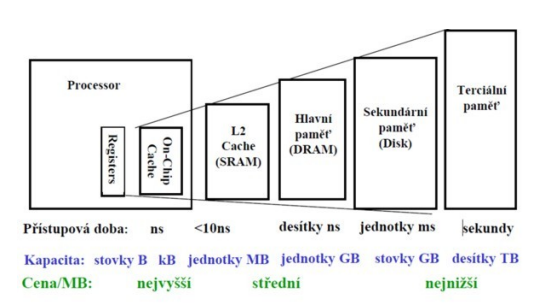

- ISA = rozhrani mezi SW a HW
  - poskytuje mechanismus ktrym SW rika HW co delat

    

    - dobre rozhrani
      - vydrzi nekolik generaci implementace
      - obecne (pouziti vicero zpusoby)
      - poskytuje vhodne (ulehcujici) prostredky vyssim vrstvam
      - umoznuje efektivni implementaci nizsim vrstvam

        

- problemy (otazky) pri navrhu instrukci sady
  - kde jsou ulozene operandy (zasobnik, pamet, registry, akumulator)?
  - kolik vyzadujeme operandu (0, 1, 2, 3)?
  - jak jsou operandy definovany (immediate, register, neprimo)?
  - jake typy operandu podporujeme (float, int, vector)?
  - jake instrukce podporujeme (add, sub, compare, move)?

- evoluce instrukcnich sad

    

- delka instrukci
  - promenna (x86 - delky instrukci se lisi 1-17 B)
    - vyzaduji vicero kroku (obtizne fetch, decode, ...)
    - mensi velikosti vyslednych binarek
  - pevna (MISP, vetsina RISC architektur, typicky 4B)
    - jednoduche fetch a decode
    - zjednodusuje pipelining a paralelismus
    - vetsi velikost vyslednych binarek (vyzadujeme vicero instrukci k dosazeni jedne funkcionality; x86 nebo VAX na to maji napr jen jednu instrukci)

- ARM Case Study
  - fixni delky instrukci (32 bitu)
  - pridana thumb instrukci sada
    - subset kompletni instrukcni sady
    - jedna instrukce = 16 bitu
    - moznost vyuziti poze prvnich 8 registru (ne 16 protoze mame polovicni velikosti)

- problem poctu registru
  - vetsina pocitacu ma male mnozstvi registru
    - pro data ktea se budou v blizke dobe vyuzivat
    - typicka instrukce vyuziva 2 nebo 3 registry
  - vyhody MALEHO poctu registru
    - vyzaduje mensi pocet bitu v instrukci na adresaci (ktery register checme pouzit)
    - mene HW
    - rychlejsi pristup (kratke kabely)
    - rychlejsi context switch
  - vyhody VELKEHO poctu registru
    - je potreba mene load/store instrukci
    - jednodusi na vykonani paralenich operaci
      - preusporadani registru => moznost paralelizace

- kde jsou ulozene operandy kdyz je ALU potrebuje?
  - stack machine
    - `push` nacte 1 register na vrchol zasobniku; `pop` dela opak
    - operace vezme 2 operandy z vrcholu a vysledek ulozi zase na vrcho zasobniku
  - accumator machine
    - pouze 1 register = accumator (`ACC <- ACC + MEM`)
  - register-memory machine
    - aritmeticke operace mohou vyuzit data v registerech nebo primo v pameti
  - load-store machine (aka register-register machine)
    - aritmeticke operace vyuzivaji pouze registry (viz ARM)

  

- vice o register pro obecne pouziti (General Purpose Registers)
  - pro skoro vetsina dnesnich architektur pouziva GPR?
    - registry jsou mnohem rychlejsi nez pamet (i nez cache)
      - hodnoty registru jsou dostupne hned
      - kdyz pamet neni dostupna, CPU musi pockat ("stall")
    - registry jsou vhodne pro ukladani promenych
      - prekladc priradi urcite promenne primo registrum

    

- zasobnikova architektura
  - vyhody
    - male naroky na HW
    - jednoduche pro psani jednoducheho prekladace
  - nevyhody
    - zasobnik = bottleneck
    - maly nebo zadny paralelismus nebo pipelining
    - ne vzdy chceme pristupovat pouze k datum na vrcholu zasobniku => jsou potreba pomocne funkce jako SWAP

- akumulatorova architektura
  - vyhody
    - male naroky na HW (stejne jako zasobnikova rchitektura)
    - jednoduche pro navrh a pochopeni
  - nevyhody
    - accumulator = bottleneck
    - velky memory traffic

- memory-memory architektura
  - instrukcni sada
    - 3 operandy `add A, B, C`
    - 2 operandy `aa A, B` (vysledek je ulozen do 1. operandu)
  - vyhody
    - vyzaduje mensi pocet instrukci (hlave jestli mame 3 operandy)
    - jednoduche na psani prekladace (hlavne jestli mame 3 operandy)
  - nevyhody
    - velmi vysoky memory traffic (hlavne pokud mame 3 operandy)
    - prommeny pocet CPU cyklu pro kazdou instrukci
    - pokud mame 2 operandy => potreba vice pametovych presunu

- register-memory architektura
  - x86, VAX
  - vyhody
    - k urcitym datum se muze pristupovat bez nutnosti toho aby se nejdriv nacetly do registru
    - jednoduche dekodovani instrukcni sady
  - nevyhody
    - operandy nejsou ekvivalentni
      - slaba ortogonalita (= vsechny typy instrukci mohou pouzivat vsechny adresni mody)
    - promenny pocet CPU cyklu
  
- load-store architektura
  - ARM, MISP
  - vyhody
    - jedoduche, fixni delky instrukci
    - stejny pocet CPU cyklu na vykonani jedne instrukce
    - jednoduchy pipelining a paralelizace
  - nevyhody
    - vetsi pocet instrukci
    - vyzaduje dobry sofistikovany prekladac

- vyhody a nevyhody pouzivani registru
  - vyhody
    - rychleji nez cache nebo hlavni pamet
    - deterministicky (zadne cache misses)
    - kratke identifikatory (0-n) => vyzaduje mene bitu v kodovani instrukci
    - redukce memory trafficu
  - nevyhody
    - musime je ukladat pri kontext switchi nebo pri volani funkce
    - nemuzeme je adresovat `&r0`
    - fixni delka (strigy nebo struktury musime ulozit jinak)
    - prekladac je musi spravovat (pri prekladu sledovat jake registry jsou jeste dostupne)
    - omezeny pocet

- kazda ISA navrzena po roce 1980 pouzivat load-store ISA (napr RISC) pro zjednoduseni navrhu CPU

- word-oriented organizace pameti
  - pamet je bytove adresovatelna a poskytuje pristup k bytum (8 bits), half wordu (16 bits), wordum (32 bits) a double wordum (64 bits)

    

- poradi bytu
  - jak jsou byty ve vice-bytovem slove ulozeny v pameti?
  - konvence
    - big endian (LSB ma nejvyssi adresu)
    - small endian (LSB ma nejnizsi adresu)
  - priklad: `0x01234567` na adrese `0x100`

    

- typy adresnich modu
  1) Register direct `add r0, r1` (`r0 += r1`)
  2) Immediate `add r0, #15` (`r0 += 15`)
  3) Displacement (offset) `add r0, r1(100)` (`r0 += mem[r1 + 100]`)
  4) Register indirect `add r0, (r1)` (`r0 += mem[r1]`)
  5) Indexed `add r0, (r1 + r2)` (`r0 += mem[r1 + r2]`)
  6) Direct `add r0, (1000)` (`r0 += mem[1000]`)
  7) Memory indirect `add r0, @(r3)` (`r0 += mem[mem[r3]]`)
  8) Autoincrement `add r0, (r1)+` (`r0 += m[r1]`; `r1++`)
  9) Autodecrement `add r0, (r1)-` (`r0 += mem[r1]`; `r1--`)
  10) Scaled `add r0, 100(r1)[r2]` (`r0 += mem[100 + r1 + r2 * sizeof(word)]`)
  - vsechno to je jedna instrukc typu `add` => adresni rezimi nam udelaji mnoho dalsich variaci te same instrukce!
  - navis jeste dalsi vyjimky pokud adresujeme pres program counter

    

    

    

    

    

    

  - dulezite adresni rezimy (statisticke vyuziti instrukci)
    - displacement (offset) ma jedno z nejvetsich zastoupeni
    - Immediate
    - Register Indirect
  
  - komplexni adresni rezimy a velky pocet formatu vyzaduji slozite rizeni
  - obtizne resitelne v systemech s hlubokym pipelinningem

- typy operaci
  - aritmeticko logicke (add, sub, div, ...)
  - data transfer (load-store, ...)
  - control (jump, call, ...)
  - system (os call)
  - floating point (addf, subf, ...)
  - string (compare, move, ...)
  - graphics (compress, decompress, ...)

- analyzou frekvence vyskytu jednotlivych instrukci muzeme zjistit jake typy instrukce by stalo za to optimalizovat
  - x86: load-store (22%), call (11%)

- formaty instrukci
  - CPU musi byt schopny rychle je dekodovat
    - obsahuji registry, opcode, modifikacni bity, ...
  - pokud mame vicero instrukcnich formatu
    - komplikovane dekodovani
    - musime pouzit tzv instrukcni bity pro specifikovani formatu
    - na druhou stranu muzeme implementovat vicero typu instrukci (stromova struktura rozdeleni)
    - priklad MISP

      

      - co kdyz mame 64-bitove registry?
      - co kdyz mame 20-bit immediate?

- podmineny skok
  - jak zakodovat cilovou adresu kdyz je to 32-bitova (coz je delka samotne instrukce)
  - studie ukazuji ze drtiva vetsina skoku se odehrava v kratke vzdalenosti od aktualniho `PC` => relativni adresovani +- od adresy aktualne provadene instrukce
    - pozn: x86 long jump

- dekodovani instrukci (VAX)
  - `opcode` specifikuje pocet oprandu a datove typy
  - pote co byl `opcode` urcen je kazdy operad reprezentovan polozkou `operand specifier` ktery urcuje adresni rezim operandu a prvniho parametru
  - VAX ma promennou delku instrukci (CISC)

- adresovani a ochrana x86

  

- Paralelni systemy
  - operace jsou provadeny paralelne ("vedle sebe")
  - nektere pojmy
    - grid computing - distribuovane vypocty na mnoha (ruznych) pocitacich
    - cluster server system - sit obecnych pocitacu za ucely paralelnich vypoctu
    - massively paralell processor ssytem - archhitektura superpocitacu
    - symetric multiprocessing system - sit propojenych identickych CPU (`2^n`)
    - multi-core processor - procesorovy cip obsahujici vice (ruznych) jader
      - CPU, AI korpocesor, ...

  - flynova taxonometrie
    - SISD = single instruction, single data stream (jednoprocesorovy system)
    - SIMD = single instruction, multiple data stream (jedna instrukce spustena nad vicero daty - typicky GPU)
    - MISD = multiple instruction, single data (fault tolerant systemy)
    - MIMD = multiple instruction, multiple data (vice vypocetnich jednotek zpracovava vice datovych proudu => patri sem vetsina paralelnich systemu)

- pamet paralelnich systemu
  - distribuovana (kazdy CPU ma vlastni pametovy prostor)
  - sdilena (shared; kazdy CPU adresuje tentyz prostor -> jedoducha komunikace mezi procesy prostrednictvim sdilene pameti; bottleneck?)
  - SMP (= symetricky multiprocesorovy system) se sdilenou pameti
    - s narustajicim poctu CPU se z pameti stava uzke misto

  - NUMA (nehomogeni pristup do pameti)
    - je prioritizovano pouziti blizsi (lokalni) pameti cimz se eliminuje uzke misto
    - k omezeni pristupu do pameti se implementuje cache a specialni HW zarucujici jeji koherenci

  

  - viceprocesorovych vypocetnich systemu pak vede na kombinaci kdy SMP je multi-core procesor s pameti a NUMA pak propojeni jednotlivych procesoru

  

- adresni prostor
  - logicky
    - adresni prostor se kterym muze pracovat dany CPU
    - 16-bitova CPU bus => 2^16 (64kB) je velikost adresniho prostoru
    - pro 32-bitu => 2^32 (4GB)
  - fyzicky
    - skutecny adresni prostor (kde je co namapovane)
    - primy pristup do pameti nebo IO zarizeni (periferie)

  

- segmentace
  - segment = virtualni adresni prostor ruzne velikost
  - rozdeleni na segmenty respektuje log. strukturu programu/dat/OS
    - typicky segment kodovy
    - segment statickych dat
    - segment zasobniku
    - systemovy segment atd
  - kazdy segment muze mit ruzna pristupova prava (RWX)
  - vyhody
    - ochrana pristupu procesu (prava)
    - velikost segmentu je uzpusobena dane potrebe
    - zmena umisteni segmentu lze provest jen zmenou sementu (offset je zachovan)
  - nevyhody
    - obecne problemy s alokaci segmentu pri zmenach velikosti a mozna fragmentace
    - rezije pri pristupu do pameti (prevod adres)
  - algoritmy pridelovani volneho bloku
    - first fit, last fit, best fit, ...

- strankovani
  - adresni prostor je rozdelen na ramce o stejne velikost (1 ramec odpovida jedne strance)
  - prevod delan pres tabulku stranek
  - preklad delan HW pomoci MMU (rychlost)

  
  
  - vyhody
    - omezeni fragmentace pameti
    - moznost pristupovych prav
    - moznost swapovani (lze pouzit i pro segmentaci)
  - nevyhody
    - nedokonale vyuziti pameti (velikosti stranek: 4kB, 1M, atd => ovlivnuje rychlost prekladu)
    - rezije prekladu adres (zanorene strankovani)
  - algoritmy vyberu stranek: LRU, Round Robin, atd, ... (vyuziti bitu zapisu a pristupu na x86)

- segmentace + strankovani
  - kombinace vyse uvedenych metod
  - ponechava vyhody segmentace a diky strankovani resi problem s fragmentaci a umoznuje mit v pameti jen pouzivane casti
  - ale navic rezije prekladu?

  

- RAM
  - SRAM
    - S (= staticka)
    - pro uchovani bitu je pouzit klopny obvod => prostorove narocne => vyssi cena
    - cteni je nedestruktivni (narozdil od DRAM)
  - DRAM
    - pro uchovani jednoho bitu je pouzit kondenzator velmi nizke kapacity
    - ctenim se kondenzator vybije
    - kvuli samotmenu vybijeni je nutno informaci v pameti pravidelne obnovodat => D (= dynamicke)
      - => muze dojit k poskozeni ulozeneho bitu => nutnost ECC
    - cteni z DRAM je relativne pomale
    - pouziva se v dnesnich stolnich PC a noteboocich
    - levnejsi
  - SDRAM = synchronni DRAM (vsechny signaly jsou synchronizovane s hodinami)
  - DDR = SDRAM se synchronizaci na obe hrany hodin (double data rate)

- sbernice
  - datova
    - sirka dat: 8, 16, 32 bitu, ...
  - adresni
    - velikost pameti (16 bitu => 655536 adres)
  - ridici
    - cinnost pameti (typicky se muze lisit)
    - CS (chipselect), /CS (negace chipselectu)
    - OE (output enable - povoleni vystupu na datovou sbernici)
    - WE (write enable - rizeni zapisu do pameti)

- dekodovani adres
  - fyzicky prostor je typicky mensi nez logicky
  - napr fyzicka pamet 8 bitu => `0x00 - 0xFF`
  - CPU ma 10 bitovou adresni sbernici `A0-A9` = 1kB
  - moznosti zapojeni:

    

- cache
  - hirearchie pametoveho systemu
    - idealni pamet: co nejrychlejsi, nejlevnejsi, nejvetsi, drzi informace i po vypnuti
    - nelze docilit spleni vsech podminek => pametovy system se sklada z ruznych druhu pameti

    

  - pri pristupu do pameti se casto projevuje
    - casova lokalita
      - data ktera byla prave ulozena budou pravdepodobne brzo zas pouzita (algoritmy, cykly, promenne, ...)
    - prostorova lokalita
      - bylali pouzit nejaka polozka bude nejspis pouiza i polozka v jeji okolni lokaci (pole, lasledujici instrukce, zasobnik, ...)
    - puvodne byly pameti rychlejsi nez rychlost CPU (-> dnes je tomu naopak)

- cache pameti (vyrovnavaci pameti)
  - pokud neco zapiseme do cache musime to take nekdy propsat do hlavni pameti
    - primy zapis
      - hned po zmene v cache okazmcite zmenu propagujeme dale az do hlavni pameti
      - pomale
    - zapis s mezipameti
      - specialni mezipamet pro zapis omezene velikosti
    - zpetny zapis
      - zapisuju v okamziku kdy menim data v cache
    - zpetny zapis zmeneneho
      - zapisuju v okamziku kdy prepisuju data v cache ktera jsou jiz zapsana do hlavni pameti => pouziti dirty flagu
  - velikost bloku cache
    - pokud maly => moho bloku (kazdy se svoji logikou)
    - pokud velky => castejsi vymena (vetsi ppst vypadku)
    - casto rozdelena do bloku o urcite velikosti ktere nazteme z/do DRAM jednim ctenim/zapisem
  - hit rate
    - ppst uspechu ze dane dato je v cache, prakticky 95%-99% (teoreticky << 1% = nahodny pristup)
    - v pripade miss je treba hledat dale v hirearchii
    - => zpusob zapisu programu/algoritmu muze ovlivnit rychlost jeho vykonavani (napr 2D - pristup po radkach)
  - pro zamezeni konfliktu se oddeluje datova a instrukcni cache

- informace ulozene v cache
  - vlastni data odpovidajici velikosti jednoho bloku
  - adresa ke ktere data nalezi
  - dirty bit (priznak zmeny)
  - informace o pouziti polozky
- pokud potrebuji do cache nahrat novou polozku musim nejakou odstranit (replacement):
  - RR (nahodny vyber/replacement)
  - FIFO (nejdrive vlozenou)
  - LFU (least frequently used)
  - MFU (most frequently used)
  - LDU (last recently used = nejdele nepouzivana)
- jsou-li za sebou dve cache (L1, L2) => je vyhodne aby pouzivali odlsne algoritmy

- plne asociativni cache
  - idealni asociativni pamet, kazda polozka ma vlastni porovnavaci mechanismus => narocne
  - napr adresa 32 bitu, 1024 polozek v cache, data velikost 4B
    - kazdy radek cache obsahuje:
      - 30 bitu adresa (32-2, 2b = velikost dat)
      - 32 bitu data
      - 1b priznak platnosti
      - 1b dirty bit
      - +dasi bity pro nahrazovaci algoritmus
    - porovnavaci funkce je 32 bitova a je 1024x (lookup polozky)

- cache s primym mapovanim
  - spodni cast adresy je primo indexem do cache => v cache nemohou byt dve adresy ktere maji tento index stejny
  - napr adresa 32 bitu, 1024 polozek v cache, data velikosti 4B
    - kazdy radek cache obsahuje:
      - 20 bitu adresa (32b - 2b - 10b); 2b = velikost dat, 10b=velikost indexu
      - 1b priznak platnosti
      - 1b dirty bit
      - +dalsi bity pro nahrazovaci algoritmus
  - porovnavaci funkce je 20b a  je pouze 1x

  

- N-cestna cache
  - spodni cast adresy je indexem do cache, ale cache je vicestna => obsahuje N bloku s danym indexem

- napr adresa 32 bitu, 4 cestna cache o celkem 1024 polozkach (celkem), data velikosti 4B
  - kazdy radek cache obsahuje:
    - 22 bitu adresa (32b - 2b - 8b), 2b = velikost dat, 8b = velikost indexu; 10b-2b za ctyrcestnost
    - 32 bitu data
    - 1b priznak platnosti
    - 1b dirty bit
    - +dalsi bity pro nahrazovaci algoritmus
  - porovnavaci fce je 22 bitova a je zde 4x protoze cache je ctyrcestna

  
