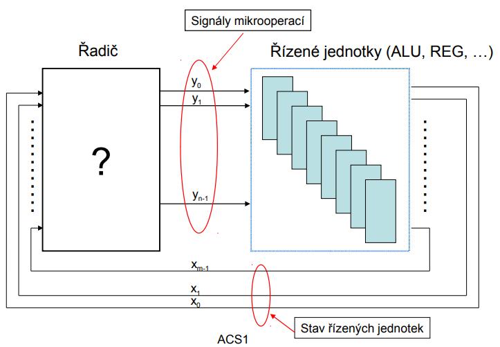
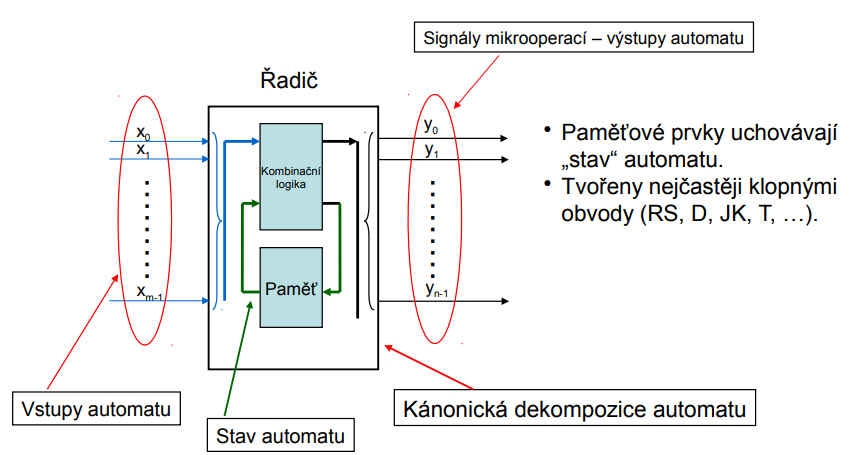
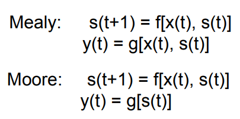
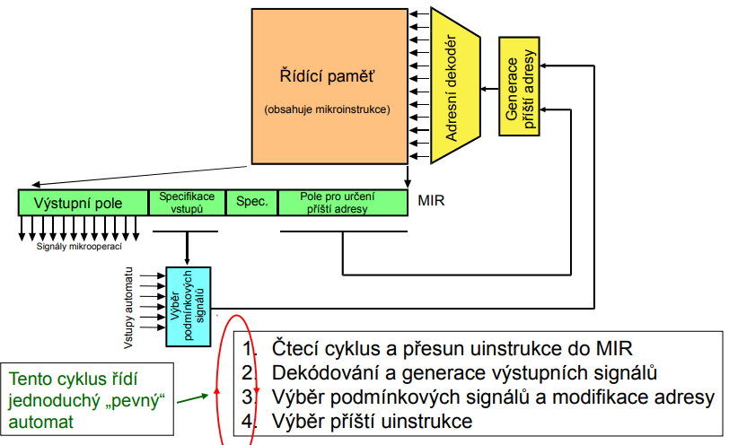
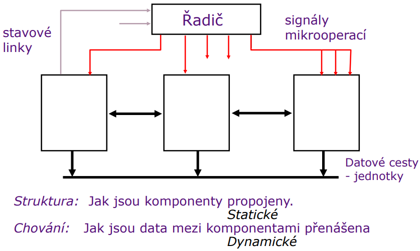
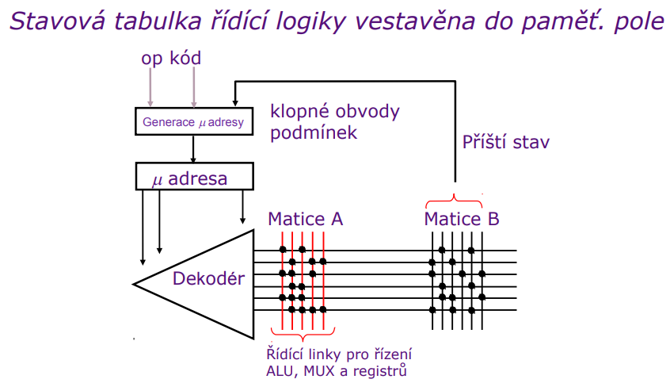
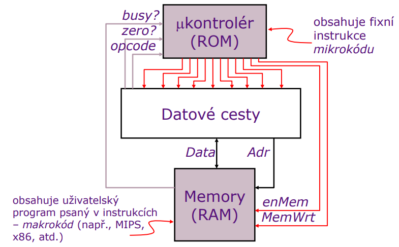

- mikroarchitektura
  - ukolem mikroarchitektury je implementace ISA
  - jedna ISA muze mit vetsi mnozstvi implementaci ktere se navzajem lisi
  - tato vrstva pocitacoveho systemu lezi nad urovni digitalni logiky

- ridici jednotka (radic)

  

  - "pevny automat" (prime HW rizeni)
    - Mooruv automat vs mealyho automat
  - mikroprogramovy automat (Wilkeys-Stringer) -> jedna se o nadstavbu pevnych automatu (CISC architektury)

  

  - podle toho kdy dochazi ke zmene stavu automatu rozlisujeme:
    - automaty synchronni
      - okamzik zmeny vystupu je urcen hranou hodinoveho signalu (oscilator)
      - vstupni signaly urcuji charakter zmeny
    - automaty asynchronni
      - okamzik zmeny vystupu a stavu odvozoval on zmen vstupnich signalu
      - typicke pouziti asynchonnich klopnych obvodu (RS, ...)

  - Mealyho a Mooruv automat se od sebe lisi jen zpusobem generovani vystupnich signalu

    

    - Vystup Moorova automatu je dan pozue jeho aktualnim stavem (ne vstupy => ty meni jeho vnitrni stav)
  - pevne automaty se vyznacuji velmi rychlou reakci na podnety a jsou vhodne pro implementaci jednodussich a stredne slozitych algoritmu rizeni
  - mikroprogramove automaty jsou domenou poitacu tridy CISC

- struktura Wilkesova automatu

  

  - koncept byl znam uz dlouho ale jeho implementaci branila mala rychlost pameti pro ulozeni mikroprogramu

- mikroprogramovani
  - duvody proc se zabirat mikroprogramovym rizenim:
    - ukazat jak stavet velmi male CPU s komplexni ISA
    - pomoci porozumet jak stroje CISC vznikly (stale pouzivano u napr x86, PowerPC, ...)
    - pochopeni duvodu proc se preslo na RISC architektury

- mapovani ISA do mikroarchitektury
  - ISA je casto navrzena pro urcity styl mikroarchitektury napr:
    - CISC => mikroprogramove rizeni
    - RISC => HW rizeni, pipelining
    - JVM => SW interpretace

- slozitost firmware
  - pristup pri vytvareni mikroprogramu se lisi od klasickeho vytvareni programu
    - navrhari firmware musi respektovate mikroskopickou slozitost a zaroven se musi snazit vytvaret strojove nezavisly model => protichudne pozadavky
  - specifika mikroarchitektury primo urcuji slozist firmware
    - charakteristiky casovani
    - paralelismus
    - specialni vlastnosti registru a funkcnich jednotek atd
  - snahou je umoznit implementaci mikroprogramove urovne pomoci programovacich jazyku vyssi urovne

  

  

  

  - zakladni pojmy:
    - mikrooperace = elementarni dale jiz nedelitelna operace (inkrementace citace, nulovani registru, zapis dat do registru, ...)
    - mikroinstrukce = udava ktere mikrooperace se maji behem mikroinstrukcniho cyklu provest
    - mikroprogram = posloupnost mikroinstrukci
    - firmware = "mikroprogramove vybaveni" procesoru

  - vystupy mikroprogramoveho automatu
    - casovani mikroprogramoveho automatu hraje podstratnou roli ve funkci celeho CPU
    - z hlediska prace jednotlivych funkcnich jednotek CPU lze rozdelit vystupni signaly na 2 velke skupiny
      - vyskyt signalu pouze v ramci jedne mikroinstrukce
      - signaly s trvanim delsim nez jeden mikroinstrukcni takt (napr nastaveni operace ALU, nastaveni multiplexeru, rizeni "pomalejsich" jednotek, ...)
