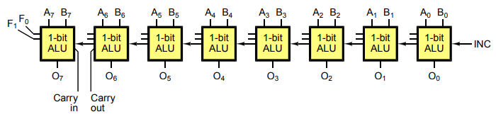

- mikroarchitektura
  - ukolem mikroarchitektury je implementace ISA
  - jedna ISA muze mit vetsi mnozstvi implementaci ktere se navzajem lisi
  - tato vrstva pocitacoveho systemu lezi nad urovni digitalni logiky

- ridici jednotka (radic)

  

  - "pevny automat" (prime HW rizeni)
    - Mooruv automat vs mealyho automat
  - mikroprogramovy automat (Wilkeys-Stringer) -> jedna se o nadstavbu pevnych automatu (CISC architektury)

  

  - podle toho kdy dochazi ke zmene stavu automatu rozlisujeme:
    - automaty synchronni
      - okamzik zmeny vystupu je urcen hranou hodinoveho signalu (oscilator)
      - vstupni signaly urcuji charakter zmeny
    - automaty asynchronni
      - okamzik zmeny vystupu a stavu odvozoval on zmen vstupnich signalu
      - typicke pouziti asynchonnich klopnych obvodu (RS, ...)

  - Mealyho a Mooruv automat se od sebe lisi jen zpusobem generovani vystupnich signalu

    

    - Vystup Moorova automatu je dan pozue jeho aktualnim stavem (ne vstupy => ty meni jeho vnitrni stav)
  - pevne automaty se vyznacuji velmi rychlou reakci na podnety a jsou vhodne pro implementaci jednodussich a stredne slozitych algoritmu rizeni
  - mikroprogramove automaty jsou domenou poitacu tridy CISC

- struktura Wilkesova automatu

  

  - koncept byl znam uz dlouho ale jeho implementaci branila mala rychlost pameti pro ulozeni mikroprogramu

- mikroprogramovani
  - duvody proc se zabirat mikroprogramovym rizenim:
    - ukazat jak stavet velmi male CPU s komplexni ISA
    - pomoci porozumet jak stroje CISC vznikly (stale pouzivano u napr x86, PowerPC, ...)
    - pochopeni duvodu proc se preslo na RISC architektury

- mapovani ISA do mikroarchitektury
  - ISA je casto navrzena pro urcity styl mikroarchitektury napr:
    - CISC => mikroprogramove rizeni
    - RISC => HW rizeni, pipelining
    - JVM => SW interpretace

- slozitost firmware
  - pristup pri vytvareni mikroprogramu se lisi od klasickeho vytvareni programu
    - navrhari firmware musi respektovate mikroskopickou slozitost a zaroven se musi snazit vytvaret strojove nezavisly model => protichudne pozadavky
  - specifika mikroarchitektury primo urcuji slozist firmware
    - charakteristiky casovani
    - paralelismus
    - specialni vlastnosti registru a funkcnich jednotek atd
  - snahou je umoznit implementaci mikroprogramove urovne pomoci programovacich jazyku vyssi urovne

  

  

  

  - zakladni pojmy:
    - mikrooperace = elementarni dale jiz nedelitelna operace (inkrementace citace, nulovani registru, zapis dat do registru, ...)
    - mikroinstrukce = udava ktere mikrooperace se maji behem mikroinstrukcniho cyklu provest
    - mikroprogram = posloupnost mikroinstrukci
    - firmware = "mikroprogramove vybaveni" procesoru

  - vystupy mikroprogramoveho automatu
    - casovani mikroprogramoveho automatu hraje podstratnou roli ve funkci celeho CPU
    - z hlediska prace jednotlivych funkcnich jednotek CPU lze rozdelit vystupni signaly na 2 velke skupiny
      - vyskyt signalu pouze v ramci jedne mikroinstrukce
      - signaly s trvanim delsim nez jeden mikroinstrukcni takt (napr nastaveni operace ALU, nastaveni multiplexeru, rizeni "pomalejsich" jednotek, ...)
  - mikroinstrukcni pole
    - mikroinstrukce obsahuje nekolik poli ktere jsou behem zpracovani vyhodnoceny -> a z toho je odvozena prislusna aktivita
      - operacni kod (typ)
      - vystupni pole (informace o signalech mikrooperaci ktere maji byt behem instrukcniho cyklu aktivni)
      - specifikace vstupu (vstupni podminky signalu -> vetveni)
      - komparacni bit (slouzi pro inverzi podminky)
      - pole pristi adresy (zalezi na volve strategie - muze obsahovat jednu nebo vice)
      - ochranne bity (napr parita)
      - spedialni pole (diagnosticke ucely)

- generace pristi mikroinstrukce
  - vyuzity `mPC` - analozie PC na mikroprogramovane urovni
  - vyber adresy (pristi mikroinstrukce ze dvou nebo i vice adresnich pili dle vybrane podminky)
  - prosta modifikace (obsahu adresniho pole porminkovym signalem (AND, OR) -> velmi rychly mechanismus)

- redukce kapacity ridici pameti
  - rychlost a kapacita pameti jsou protichudne pozadavky!
  - navrh mikroprogramoveho readice -> vyzaduje co nejmensi naroky na velikost pameti
  - moznosti
    - proste sdileni spolecnych sekci mikroprogramu
    - sdileni kodu -> pouziti rutin (funkci) => vyzaduje implementaci HW zasobniku!!
    - vyuziti HW citacu a cyklu (rychlejsi a elegantnejsi implmentaci opakovani nekterych sekci mikroprogramu)
    - redukce sirky mikroinstrukci
      - maly pocet ryznych mikroinstrukci
      - pouziti `mPC` => redukce sirky pole pro pristi adresu
    - nanoprogramovani
      - pri znacne sirce vystupniho pole mikroinstrukce (tj. velky pocet signalu) se v celem programu objevuje jenom pomerne maly pocet odlisnych kombinaci ve vystupnim poli => mnoho kombinaci nema vyznam
      - ridici pamet se sklada ze dvou mensich pameti ve kterych jsou ulozeny
        - pointery
        - vlastni kombinace bity vystupniho pole mikroinstrukci
        - => cteni vystupniho pole mikroinstrukce je dvoustupnove

      

    - dosahovnay pomer redukce byva 2:1 az 5:1
    - pouzito napr u procesoru Motorola MC68000

- priklad mikroarchitektury CPU
  - navrzena ISA bude obshaovat jen instrukce pracujici s typem integer
  - pouzita ALU ma velmi jednoduchou struktury => vypusteny optimalizace/urychleni

    

    

    

  - datove cesty procesory
    - dva zpusoby komunikace s pameti
    - 32 bitu - MAR, MDR (cteni dat)
    - 8 bitu - PC, MBR (cteni instrukci)
    - MAR obsahuje adresy slov
    - PC obsahuje adresy bytu

    

    - MAR = adrese ze ktere cteme/kam zapirujeme
    - MDR = data ktere precteme nebo chceme zapsat
    - B-bus = vystup z registru = vstup do ALU
    - C-bus = vystup z ALU => vstup do registru

  - mapovabi bitu MAR redistru na adresni sbernici
    - posun o 2 bity je nutny => adresujeme slova a ne byty (posledni 2 bity musi byt 0)

    
  
  - format mikroinstrukce MIC-1

    

    - Adr = obsahuje adresu potencialni pristi mikroinstrukce
    - JAM = urcuje zpusob vyberu pristi mikroinstrukce
    - ALU = urcuje funkci ALU a posivne jednotky
    - C = urcuje ktere registry jsou zapisovany z C-busu
    - Mem = funkce mapeti
    - B = zdroj dat pro B bus

  

  - priklad mikroprogramu:

    - ```
      9/ add – secteni dvou cisel na zasobniku
      ========================================

      predpoklady:
      ------------

      - zasobnik roste smerem dolu
      - alespon 2 cisla byla predem vlozena do zasobniku

      nahodne zvoleny obsah zasobniku:
      --------------------------------

      0x08: -2
      0x07: 100
      0x06: 1
      0x05: 5
      0x04: 13 <- SP
      0x03: 11
      0x02: 12
      0x01: -9
      0x00: 0

      mikroprogram:
      -------------

      MAR = SP + 1; rd       ; Do reg MAR vloz dresu ze ktere budeme cist (MAR = SP + 1 = 4 + 1 = 5)
                            ; Precti cislo na dane adrese (nactene cislo je vlozeno do reg MDR)
                            ; MDR = 5

      H = MDR                ; Prekopiruj obsah reg MDR do pomocneho reg H (H = 5)
      MAR = SP; rd           ; Do reg MAR vloz adresu ze ktere budeme cist (MAR = SP = 4)
                            ; Precti cislo na dane adrese (nactene cislo je vlozeno do reg MDR)
                            ; MDR = 13

      MDR = MDR + H          ; Do datoveho reg MDR uloz vysledek souctu MDR + H (13 + 5 = 18)
      MAR = SP = SP + 1; wr  ; Obsah datoveho reg MDR ulozime na adresu SP + 1
                            ; A zaroven aktualizujeme ukazatel na vrchol zasobniku


      vysledny obsah zasobniku:
      -------------------------

      0x08: -2
      0x07: 100
      0x06: 1
      0x05: 18 <- SP
      0x04: 13
      0x03: 11
      0x02: 12
      0x01: -9
      0x00: 0
      ```

  - Instruction Fetch Unit (= IFU)
  - pridanim latch registru na vstup a vstyp ALU muzeme zavest pipelining

  

- horizontalni vs vertikalni mikrokod (neco jako CISC vs RISC?)

  

  - horizontalni mikrokod pouziva siroke instrukce
    - peralelni operece behem jedne mikroinstrukce
    - mene kroku na provedeni jedne MAKROinstruction
    - ridke kodovani => vetsi pocet bitu
  - vertikalni forma mikroinstrukce
    - mikrokod ma uzsi mikroinstrukce
    - typicky operace jednoduche datove cesty na jednu mikroinstrukci
      - vyhrazene mikroinstrukce pro vetveni
    - => vice krokru na provedeni jedne MAKROinstrukce
    - kompaktnejsi => mene bitu
  - nanoprogramovani
  - kombinuje lepsi vlastnosti horizontalniho a vertikalniho mikrokodu

- mikroprogramovani (pocatek 80-tych let)
  - lepsi kompilatory zpusobily, ze slozite instrukce ztratily na dulezitosti
  - vyuziti cetnych mikro-archtiektonicky inovaci, napr pipelingu, cache pameti a bufferu zpusobili, ze vicecyklove provadeni instrukci reg-reg se stalo neatraktivni
  - RISC procesory v nejblizsi budoucnosti
    - vyuziti plochy citu po rychle instrukci cache pro uzivatelky-vyuzitelne vertikalni mikroinstrukci => vyuziti SW rutin (nikoliv HW rutin)
    - vyuziti jednoduchych ISA kvuli podpore HW implementaci s pipelingem
