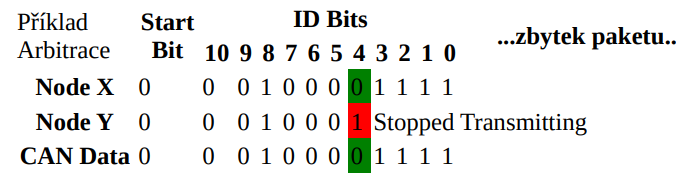

- seriova sbernice
  - vhodne na delsi vztalenosti (cena kabelu)
  - snadnesi manipulovatelnost
    - mene dratu
    - slabsi kabel
    - mensi konektor
  - serial vs paralel
    - paralelni prenasi vice bitu naraz (vice vodicu)
    - u synchronnich paralelnich sbernic je problem synchronizace dat a hodin (vetsinou najednou) (clockskew) => seriovy prenos muze byt rychlejsi
    - u paralelnich sbernic je vetsi problem s preslechy (crosstalk) - vice dratu
      - obvykle mene mista na stineni a vice na ruseni
  - parametry
    - komunikace
      - peer-to-peer (doubodova)
      - multipoint (vycebodova)
      - master/slave
      - multimaster
    - pocet vodicu
    - napetove urovne
      - diferencialni vs nediferencialni prenos
    - pocet pripojitelnych zarizeni
    - komunikacni rychlost, vzdalenost (casto spolu svazane)
    - duplexni/falfduplexni,jednosmerna
    - zpusob prenosu dat (synchronni/asynchroni)
    - linkova vrstva => datove ramce (nikoliv packety)
    - zpusob reseni kolizi, vyberu master, adresaze slave, ...

- RS232
  - seriova ASYNCHRONNI komunikace (rozrhani) vytvorena puvodne pro komunikaci dvou zarizeni do 20m
  - pro vetsi odolnost proti ruseni je informace pro propojovacich vodidich prenasena napetim +-/5-15V
  - prenos informace probiha asynchrone, duplxne, pomodi pevne nastavene prenosove rychlosti (baudrate) a synchronizaci sestupnou hranou start bitu
  - RS 232 pouziva dve napetove urovne
    - logicka 1 (zaporna uroven napeti)
    - logicka 0 (kladna uroven napeti)
  - signaly jsou odolne proti zkratu
  - krome dat (RX/TX) zahrnuje norma i handhakove signaly k rizeni prenostu

    

  - standard udava maximimalni delku vodicu 15m nebo kapacitu 2500pF => pri kvalitnich vodicich muze byt delka az 50 (pri dorzeni normy, realne muze byt jeste vice)
  - priklady typu rychlosti: 1200, 2400, 4800, 9600, 115200
  - prenost probiha asynchronne: 1 startbit, N dat bitu (typicky 8), volitelne parita, 1-2 stop bity

- RS485
  - pouziti predevsim v prumyslovem prostredi
  - dvouvodicovy poloduplexni vicebodovy seriovy spoj
    - norma definuje az 32 zarizeni
    - maximalni vzdalenost az 1200m
    - rychlosti az 10 Mbs na kratke vzdalenosti (do 10m)
  - definovane zakoncovaci odpory (terminator)
    - brani odtazu signalu
    - zarucuje ostrou zmenu hrany
  - stavy jsou definovane rozdilovym napetim mezi vodici ktere jsou typicky oznaceny A a B
    - odolnost proti ruseni (prijimac pocita rozdil ktery by i kdyz bude ruseni porad stejny)
  - obdobne jako u RS232 prenos probiha asynchronne: 1 start bit, N data bitu (typicky 8), volitelne parita, 1-2 stop bity
  - klidovy stav = logicka 1

  

- CAN Bus
  - CAN (Controller Area Netwoek) je sbernice vyvinuta firmou bosch
  - maximalni teoreticka rychlost prenostu je 1Mbs/40m
  - vyuziti napr pro vnitrni komunikacni sit senzoru a ridicich jednotek v automobilu
  - data se odesilaji v ramcich
    - kazdy ramec muze obsahovat 0-8 datovych bytu
    - kazdy ramec obsahuje indikator/ID (11b pro CAN2.A a 29b pro CAN2.B) ktery definuje obsah prenasene zpravy a zaroven i prioritu!
    - nizsi hodnoty can ID = vyssi priorita
    - 2 zarizen zacnou vysilat ale to s nizsim ID dostane sbernici protoze 0 je dominantni logicka uroven ktere dane zarizeni "nepretlaci" => na sbernici se dostane ID s nizsi hodnotou
    - kazda zprava je navic doplnena zabezpecenim CRC
    - jednu zpravu muze prijmout vicero zarizeni
  - logicke urovne jsou reprezentovany rozdilove
    - CAN HI, CAN LOW
  - CAN rozlisuje dominantni (0) a ustupujici bit (1)
    - necinnost je reprezentovana ustupujici urovni
  
  

  

  

- I2C
  - synchronni sbernice typu multimaster vyvinutou firmou philips
  - komunikace pomocou dvou vodicu
    - SCL (synchronous clock)
    - SDA (synchronous data)
  - sbernice je typu open colecter tj logickou 1 zajistuje pull-up rezistor
    - logicka 0 je pak rizene aktivne obvody
  - pri vysilani plati pravidlo ze logicka uroven SDA se muze menit jen pokud je SCL low (neaktivni)
    - toto pravidlo je preruseno ve dvou pripadech: START a STOP
  - struktura ramce:
    - START
    - 7 bitova nebo 10 bitova adresa
    - RW bit (urcuje smer prenaseni dat)
    - ACK
    - data (muze byt adresa registru + hodnota)
      - pri posilani/cteni dalsi hodnoty se adresa automaticky inkrementuje (zalezi na zarizeni)
      - kazdy byte je nasledovan ACK bitem
    - STOP

  

  - pro rizeni komunikaci na I2C se pouziva metoda s detekci kolizi
    - kazda stanice muze vysila jeli predtim sbernice v klidovem stavu
    - behem vysilani musi stanice neustale porovnavat vysilane bity se skutecnou hodnotou SDA => pokud se lisi nastala kolize
    - vzhledem k charakteru sbernice muze k teto situaci dojit pokud urcita stancie vysila uroven H zacimco jina vysila L
      - stanice ktera na lince zjisti L zatimco sama vysila H musi vysilani okamzite ukonci
  - `0b0000000` pouzita jako adresa broadcastu

- SPI (= Serial Peripheral Interface)
  - seriove rozhrani typu master-lave
  - pro komunikaci jsou pouzity 3 vodice (+ spolecna zem)
    - SCK (hodinovy signal)
    - MOSI (master out slave in)
    - MISO (master in slave out)
  - k adresaci se vyuziva chip select (kazde zarizeni ma 1)
    - timto signalem se definuje zacatek a konec komunikace
  - implementace je velmi jednoducha

    

  - typicke zapojeni pro vicero jednotek

    

  - ve specialnim pripade je lze take propojit jednim CS (nutna podpora i na strane slavu)

    

- 1 Wire
  - sbernice navrzena firmou Dallas pro komunikaci zarizeni nizkou datovou rychlosti po jednom vodici (jeste + zem, nekdy i +vcc)
  - zarizeni v sobe obshuji kondenzator pro uchovani napajeni behem komunikace
  - komunikace je typu master slave
  - kazde vyrobene 1-Wire zarizeni ma unikatni 48 bitovy ID
  - komunikace zacina resetovacim pulsem 480us ktery posila master
  - pote co master uvolni sbernice se jakykoliv pritomny slave ukaze pomoci impulsu (podrzi sbernici na 0 po dobu 60us)
  - prenos dat
    - pro vysilani 1, master vysle kratky puls (1-15us)
    - pro vysilani 0, master posle delsi puls (60us)
    - => neco jako morzeovka?
    - cca 30us po startu cte slave sbernici
  - pri cteni vysle master kratky pulse (1-15us)
    - pokud chce slave poslat 1 -> nedela nic
    - pokud chce poslat 0 -> stahne sbernici na 0 po dobu 60 us
  - zakladni sekvence je reset pulse nasledovany 8 bity (prikaz) a potom odesila nebo prijima data ve skupinach o 8 bitech
  - jeli na sbernici vice zarizeni je mozno zjistit jejich adresy
    - prohledavani pomoci prikazu search a detekce kolizi

  

- USB (= Universal Serial Bus)
  - snaha jednotne nahradit ruzne drive existujici standardy (RS232, Gameport, ...)
  - pro bezne druhy periferii (tiskarny, klavesnice, mysi, modemy, ...)
  - ale lze pripojit i dalsi perifiere (kamery, pameti flash, HD, opticke mechaniky, ...)
  - point-to-point spojeni master slave (host-device)
  - vicero zarizeni je mozno pripojit pres HUB (rozbocovac)
    - stromove vetveni az 5 urovni
  - USB je znacne komplexni protokol
    - pracuje na principu packetoveho prenosu kdyz pomoci malych bloku udaji je schopen soucasne resit vice pozadavku prenostu
    - prvni packetem je token packet
      - urcuje typ prenosu
      - smer prenosu
      - adresu zarizeni
  - data jsou prenasena poloduplexne (rozdilovy prenos D+/D-)
  - ID zarizeni je pridelovani dynamicky
  - transfer fat mezi zdrojem a cilem je pres pipe (viz Linux)
    - na tomto principu dokaze USB pracovat s nekolika zarizenimi zaroven
  - aby byl system robustni byly zavedeny dve technologie reseni chyb
    - na bitove urovni je soucasti kazdeho packetu CRC kod
    - na vyssi urovni je pak moznost opakovaneho prenosu dat

  

  - 4 typy prenostu
    - control transfer (typicky konfigurace)
    - bulk transver (hromadny prenos dat; velke objemy dat)
    - interrupt transfer (male prenosty dat; nutna okamzita odezva)
    - izochronni prenost (real time data, dodrzovani casovani)
  - VID/PID (vendor, product ID)
    - identifikace zarizeni -> identifikace ovladace
