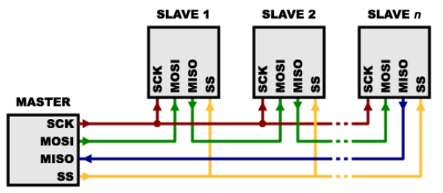

- seriova sbernice
  - vhodne na delsi vztalenosti (cena kabelu)
  - snadnesi manipulovatelnost
    - mene dratu
    - slabsi kabel
    - mensi konektor
  - serial vs paralel
    - paralelni prenasi vice bitu naraz (vice vodicu)
    - u synchronnich paralelnich sbernic je problem synchronizace dat a hodin (vetsinou najednou) (clockskew) => seriovy prenos muze byt rychlejsi
    - u paralelnich sbernic je vetsi problem s preslechy (crosstalk) - vice dratu
      - obvykle mene mista na stineni a vice na ruseni
  - parametry
    - komunikace
      - peer-to-peer (doubodova)
      - multipoint (vycebodova)
      - master/slave
      - multimaster
    - pocet vodicu
    - napetove urovne
      - diferencialni vs nediferencialni prenos
    - pocet pripojitelnych zarizeni
    - komunikacni rychlost, vzdalenost (casto spolu svazane)
    - duplexni/falfduplexni,jednosmerna
    - zpusob prenosu dat (synchronni/asynchroni)
    - linkova vrstva => datove ramce (nikoliv packety)
    - zpusob reseni kolizi, vyberu master, adresaze slave, ...

- RS232
  - seriova ASYNCHRONNI komunikace (rozrhani) vytvorena puvodne pro komunikaci dvou zarizeni do 20m
  - pro vetsi odolnost proti ruseni je informace pro propojovacich vodidich prenasena napetim +-/5-15V
  - prenos informace probiha asynchrone, duplxne, pomodi pevne nastavene prenosove rychlosti (baudrate) a synchronizaci sestupnou hranou start bitu
  - RS 232 pouziva dve napetove urovne
    - logicka 1 (zaporna uroven napeti)
    - logicka 0 (kladna uroven napeti)
  - signaly jsou odolne proti zkratu
  - krome dat (RX/TX) zahrnuje norma i handhakove signaly k rizeni prenostu

    

  - standard udava maximimalni delku vodicu 15m nebo kapacitu 2500pF => pri kvalitnich vodicich muze byt delka az 50 (pri dorzeni normy, realne muze byt jeste vice)
  - priklady typu rychlosti: 1200, 2400, 4800, 9600, 115200
  - prenost probiha asynchronne: 1 startbit, N dat bitu (typicky 8), volitelne parita, 1-2 stop bity

- RS485
  - pouziti predevsim v prumyslovem prostredi
  - dvouvodicovy poloduplexni vicebodovy seriovy spoj
    - norma definuje az 32 zarizeni
    - maximalni vzdalenost az 1200m
    - rychlosti az 10 Mbs na kratke vzdalenosti (do 10m)
  - definovane zakoncovaci odpory (terminator)
    - brani odtazu signalu
    - zarucuje ostrou zmenu hrany
  - stavy jsou definovane rozdilovym napetim mezi vodici ktere jsou typicky oznaceny A a B
    - odolnost proti ruseni (prijimac pocita rozdil ktery by i kdyz bude ruseni porad stejny)
  - obdobne jako u RS232 prenos probiha asynchronne: 1 start bit, N data bitu (typicky 8), volitelne parita, 1-2 stop bity
  - klidovy stav = logicka 1

  

- CAN Bus
  - CAN (Controller Area Netwoek) je sbernice vyvinuta firmou bosch
  - maximalni teoreticka rychlost prenostu je 1Mbs/40m
  - vyuziti napr pro vnitrni komunikacni sit senzoru a ridicich jednotek v automobilu
  - data se odesilaji v ramcich
    - kazdy ramec muze obsahovat 0-8 datovych bytu
    - kazdy ramec obsahuje indikator/ID (11b pro CAN2.A a 29b pro CAN2.B) ktery definuje obsah prenasene zpravy a zaroven i prioritu!
    - nizsi hodnoty can ID = vyssi priorita
    - 2 zarizen zacnou vysilat ale to s nizsim ID dostane sbernici protoze 0 je dominantni logicka uroven ktere dane zarizeni "nepretlaci" => na sbernici se dostane ID s nizsi hodnotou
    - kazda zprava je navic doplnena zabezpecenim CRC
    - jednu zpravu muze prijmout vicero zarizeni
  - logicke urovne jsou reprezentovany rozdilove
    - CAN HI, CAN LOW
  - CAN rozlisuje dominantni (0) a ustupujici bit (1)
    - necinnost je reprezentovana ustupujici urovni
  
  

  

  

- I2C
  - synchronni sbernice typu multimaster vyvinutou firmou philips
  - komunikace pomocou dvou vodicu
    - SCL (synchronous clock)
    - SDA (synchronous data)
  - sbernice je typu open colecter tj logickou 1 zajistuje pull-up rezistor
    - logicka 0 je pak rizene aktivne obvody
  - pri vysilani plati pravidlo ze logicka uroven SDA se muze menit jen pokud je SCL low (neaktivni)
    - toto pravidlo je preruseno ve dvou pripadech: START a STOP
  - struktura ramce:
    - START
    - 7 bitova nebo 10 bitova adresa
    - RW bit (urcuje smer prenaseni dat)
    - ACK
    - data (muze byt adresa registru + hodnota)
      - pri posilani/cteni dalsi hodnoty se adresa automaticky inkrementuje (zalezi na zarizeni)
      - kazdy byte je nasledovan ACK bitem
    - STOP

  

  - pro rizeni komunikaci na I2C se pouziva metoda s detekci kolizi
    - kazda stanice muze vysila jeli predtim sbernice v klidovem stavu
    - behem vysilani musi stanice neustale porovnavat vysilane bity se skutecnou hodnotou SDA => pokud se lisi nastala kolize
    - vzhledem k charakteru sbernice muze k teto situaci dojit pokud urcita stancie vysila uroven H zacimco jina vysila L
      - stanice ktera na lince zjisti L zatimco sama vysila H musi vysilani okamzite ukonci
  - `0b0000000` pouzita jako adresa broadcastu

- SPI (= Serial Peripheral Interface)
  - seriove rozhrani typu master-lave
  - pro komunikaci jsou pouzity 3 vodice (+ spolecna zem)
    - SCK (hodinovy signal)
    - MOSI (master out slave in)
    - MISO (master in slave out)
  - k adresaci se vyuziva chip select (kazde zarizeni ma 1)
    - timto signalem se definuje zacatek a konec komunikace
  - implementace je velmi jednoducha

    

  - typicke zapojeni pro vicero jednotek

    

  - ve specialnim pripade je lze take propojit jednim CS (nutna podpora i na strane slavu)

    

- 1 Wire
  - sbernice navrzena firmou Dallas pro komunikaci zarizeni nizkou datovou rychlosti po jednom vodici (jeste + zem, nekdy i +vcc)
  - zarizeni v sobe obshuji kondenzator pro uchovani napajeni behem komunikace
  - komunikace je typu master slave
  - kazde vyrobene 1-Wire zarizeni ma unikatni 48 bitovy ID
  - komunikace zacina resetovacim pulsem 480us ktery posila master
  - pote co master uvolni sbernice se jakykoliv pritomny slave ukaze pomoci impulsu (podrzi sbernici na 0 po dobu 60us)
  - prenos dat
    - pro vysilani 1, master vysle kratky puls (1-15us)
    - pro vysilani 0, master posle delsi puls (60us)
    - => neco jako morzeovka?
    - cca 30us po startu cte slave sbernici
  - pri cteni vysle master kratky pulse (1-15us)
    - pokud chce slave poslat 1 -> nedela nic
    - pokud chce poslat 0 -> stahne sbernici na 0 po dobu 60 us
  - zakladni sekvence je reset pulse nasledovany 8 bity (prikaz) a potom odesila nebo prijima data ve skupinach o 8 bitech
  - jeli na sbernici vice zarizeni je mozno zjistit jejich adresy
    - prohledavani pomoci prikazu search a detekce kolizi

  

- USB (= Universal Serial Bus)
  - snaha jednotne nahradit ruzne drive existujici standardy (RS232, Gameport, ...)
  - pro bezne druhy periferii (tiskarny, klavesnice, mysi, modemy, ...)
  - ale lze pripojit i dalsi perifiere (kamery, pameti flash, HD, opticke mechaniky, ...)
  - point-to-point spojeni master slave (host-device)
  - vicero zarizeni je mozno pripojit pres HUB (rozbocovac)
    - stromove vetveni az 5 urovni
  - USB je znacne komplexni protokol
    - pracuje na principu packetoveho prenosu kdyz pomoci malych bloku udaji je schopen soucasne resit vice pozadavku prenostu
    - prvni packetem je token packet
      - urcuje typ prenosu
      - smer prenosu
      - adresu zarizeni
  - data jsou prenasena poloduplexne (rozdilovy prenos D+/D-)
  - ID zarizeni je pridelovani dynamicky
  - transfer fat mezi zdrojem a cilem je pres pipe (viz Linux)
    - na tomto principu dokaze USB pracovat s nekolika zarizenimi zaroven
  - aby byl system robustni byly zavedeny dve technologie reseni chyb
    - na bitove urovni je soucasti kazdeho packetu CRC kod
    - na vyssi urovni je pak moznost opakovaneho prenosu dat

  

  - 4 typy prenostu
    - control transfer (typicky konfigurace)
    - bulk transver (hromadny prenos dat; velke objemy dat)
    - interrupt transfer (male prenosty dat; nutna okamzita odezva)
    - izochronni prenost (real time data, dodrzovani casovani)
  - VID/PID (vendor, product ID)
    - identifikace zarizeni -> identifikace ovladace

- sbernice
  - = spojovaci podsystem - "stmeluje" komponenty pocitacoveho systemu
    - zajistuje rizeni a presos dat mezi nimi
  - vysokorychlostni HW interface + logicke protokoly
  - site, kanaly, sbernice (backplane)

- sbernice (backplane)
  - = "prava" systemova sbernice typu backplane obsahuje radu konektoru
  - systemove moduly se zasouvaji do konektoru
  - je definovan logicky protokol aby se zabranilo vzniku elktronickych konfliktu (zkratu)
  - ISA ve sbernicove terminologii = Industry Standard Architecture

  

- starsi implementace PC

  

- noverjsi implementace PC

  

- pocitacovy system s jednou sbernici: backplane bus
  - jednoducha sbernice se pouziva pro:
    - komunikace CPU s pameti
    - komunikace mezi I/O zarizenimi a pameti
  - vyhody: jednoduchost a nizka cena
  - nevyhody: pomale, sbernice se muze stat uzkym mistem systemu

  

- dvousbernicovy system
  - I/O sbernice je pripojena k procesoru popripadne k pametove sbernici pomoci sbernicovych adaptoru
    - Pametova sbernice: CPU urcena hlavne pro komunikace CPU <-> mem
    - I/O sbernice: obsahuje konektory pro I/O zarizeni

  

- system se tremi sbernicemi
  - maly pocet backplane sbernice napojenych na sbernici CPU-mem
    - pro prenos dat mezi CPU a pameti se vyuziva vyhradne pametova sbernice
    - I/O sbernice se pripojuji k backplane sbernici
  - vyhoda: minimalizuje se zatez procesorove sbernice

  

- North/South bridge architektury
  - oddelene souboty pinu pro ruzne funkce
    - pametova sbernice
    - cache pameti
    - sbernice pro pripojeni graficke karty (rychly frame buffer)
    - I/O sbernice jsou pripojeny v backplane sbernici
    - vyhody:
      - sbernice lze provozovat pri ruznych rychlostech
      - mnohem mensi celkove zatizeni!

  

- co definuje sbernici
  - protokol transakci
  - casovani a specifikace signalu
  - svazek vodicu
  - elektricka specifikace
  - fyzicke/mechanicke charakteristiky (konektory)

- synchronni & asynchronni sbernice
  - synchronni sbernice
    - mezi ridicimi linkami zahrnuje i hodiny
    - fixni komunikacni protokol definovany relativne k hodinam
    - vyhoda: male mnozstvi logiky a vysoka rychlost
    - nevyhody
      - kazde zarizeni pracujici na sbernici musi pdporovat stejnou rychlost hodinoveho signalu
      - aby se potlacil vliv casoveho skew, sbernice nesmi byt prilis dlouho, mal-li byt zachovana rychlost

- asynchronni sbernice
  - synchronizaci dat neurcuji hodiny
  - muze obsluhovat sirokou skalu zarizeni
  - delka se muze zvetsovat bez ohledu na skew hodinoveho signalu
  - vyzaduje protokol zahrnujici handshaking
    - priklad 4 fazoveho handshaku

      

- master & slave

  

  - bus master: ma schopnost ridit sbernici, zahajuje transakci
  - bus slave: modul aktivovany zarizenim typu master pri transakci
  - komunikacni protokol sbernice: specifikace posloupnosti udalosti a casovych pozadavku pri prenosu informace
  - asynchronni prenosy: ridici linky (req, ack) zajistuji synchronizaci udalosti
  - synchronni prenosy: posloupnost udalosti odvozovana od spolecnych hodin

- arbitrace (= ziskani pristupu ke sbernici)
  - chaosu muze byt zabraneno navrhem typu master-slave: master ridi sbernici, slave odpovida na pozadavky zapisu nebo cteni
  - hlavni nevyhoda: CPU (master) je zapojen do kazde transakce
  - arbitracni schema "Daisy Chain"

    

- pripojeni I/O k CPU
  - zarizeni je nastaveno pro operaci, ktera se ma provadet
    - cteni nebo zapis
    - velikost prenasenych dat
    - Poloha zarizeni (v systemu)
    - adresa v pameti
  - inicializace zarizeni signalem aby zahajilo operaci
  - po dokonceni operace zarizeni aktivuje interrupt

   

  - I/O mapovany do pametoveho prostoru
    - nektere fyzicke adresy (oblast) jsou vyhrazeny
    - neodpovida jim zadna realna pamet
    - procesor ktery ma do teto oblasti pristup vi ze uvedena oblast slouzi k ukldadani instrukci pro IO prostor
    - cteni dat ze zarizeni
      - polling (pokud vime ze budeme cekat krace); pri delsim cekani je neefektivni
      - interrupt of zarizeni (asynchronni); napr od casovace
    - vyhoda: uzivatelsky program je pozastaven pouze v dobe aktualniho prenosu dat
    - nevyhoda: je vyzadovan specialni H W pro I/O interrupty; ukladani kontextu

- delegovani I/O ridici funkce z CPU do DMA
  - primy pristup do pameti (= DMA)
  - pracuje jako master na sbernici
  - prenasi bloky dat z/do pameti bez prime ucasti CPU
  - notifikace o konci prenosu -> interrupt

- PCI Local Bus
  - = Peripheral Component Interconnect (PCI)
  - definice sbernice musi pokryvat celou radu pozadavku:
    - casovani
    - mechanicke parametry
    - elektricke parametry
    - protokol sbernice

- koncepce PCI
  - velka sirka pasma
    - graficke karty
    - pevne disky
  - rychle CPU
    - ale i obsluha pomalejsich IO
  - sbernice s vazbou na CPU a pametovou sbernici

- zakladni architektura PCI sbernice

  

  - dualni nezavisla sbernice
    - backside bus
    - frontside bus
    - PCI
      - primy pristup k systemove pameti pro pripojena zarizeni
      - pouziva "bridge" k pripojeni k "frontside" sbernice -> a tim k CPU

    

- ruzne urovne sbernic

  

- North/South bridge

  - North bridge pripojuje CPU k RAM, vestavene grafice, PCIe
  - South bridge pripojuje CPU k diskum, USB sbernici, PCI sbernici, sitove karte, (obecne "externim" periferiim)

  

- PCI revize 2.1
  - vlastnosti:
    - PCI je sbernice typu multimaster bus
    - vsechny transakce inicializuje master
    - vsechny transakce smeruji od/k cilovemu zarizeni
    - nezavislost na CPU
    - nizka spotreba
    - rychlost sbernice az 66 MHz
    - sirka sbernice 64 bitu
    - paralelne probihajici prenosy na sbernici
    - arbitrace sbernice na pozadi
    - autokonfigurace
    - plna podpora PCI masteru pres bridge
    - paritny kontrola adresy, dat, commandu
    - tri adresni prostory
    - transparentnost z hlediska SW

- uvod do operaci sbernice PCI
  - klicove pojmy:
    - initiator (obdoba mastera)
      - vlastni sbernici a zahajuje prenost car
      - kazdy initiator musi mit zaroven target
    - target (obdoba slave)
      - cil prenosu dat cteni/zapis
    - agent
      - libovolny initiator/target na PCI sbernici
    - funkce
      - trochu divny vyzanem, znamena spise port popr. kanal
  - vsechny akce jsou synchronni vzhledem k PCI hodinam
    - rozsah hodin 0 MHz az 33.33 MHz => vsechna zarizeni na PCI sbernici ho musi podporovat
    - aktualni frekvence se muze dynamicky menit

- prenosy na sbernici
  - burst rezim - sklada se z jedine adresni faze a dvou nebo vice datovych dazi
  - bus master prochazi procesem prideleni pouze jednou
  - behem adresni faze se predava startovaci adresa a typ transakce
  - vsechna zarizeni na sbernici si zaznamenaji adresu a typ transakce
    - cilove zarizeni pak nakopiruje adresu do adresniho citace a samo provaci pak jeho inkrementaci
  - burst rezim neni pro zarizeni povinny (pokud master zahaji prenos a zarizeni burst nepodporuje => dojde k ukonceni prenosu)
  - rozlisuji se zarizeni s jednou funkci a multifunkcni zarizeni
    - kazda funkce obsahuje vlastni individualne adresovatelny konfiguracni prostor => obsahuje konfiguracni registry
  - v procesu konfigurace se softwarove detekuje pritomnost "funkci" na sbernici a lze tak nastavit bezkonfliktni provos vsech zarizeni

- uvod do operaci sbernice PCI
  - adresni faze
    - ve stejnou dobu iniciator identifikuje ciloe zarizeni a typ transakce
    - iniciator aktivuje signal FRAME#
    - kazde PCI cilove zarizeni zachycuje adresu do registru typu latch a dekoduje ji
    - adresni face trva jednu periodu hodin
    - soucasne s adresou vydava iniciator i type transakce (command)
    - pritomnost platne adresy je doprovazena signalem FRAME#
      - na zaklade techto signalu muze cilove zarizeni urcit zda se bude ucastnit transakce nebo ne
      - vybrane zarizeni odpovida signalem DEVSEL#

- trvani transakce
  - aktivace signalu FRAME# na pocatku adresni fazy
  - signal zustane aktivni do konce datove faze

- datova faze
  - pocet datovych bytu ktere se prenesou behem jedne datove faze je urcen poctem "Command/Byte Enable" signalu aktivovanych iniciatorem
  - jsou pouzity signaly #IRDY a TRDY (= ini iniciator ready, target ready)
  - kazda datova faze trva alespon jeden takt
  - neni predavana delka prenosu ale pripravenost prijmout dalsi polozku
    - plus indikace toho jestli se jedna o posledni polozku
    - posledni datova faze je provazena IRDY# = 1 a FRAME# = 0
  - ukonceni transakce a navrat sbernice do cekaciho stavu
    - uvolnenim signalu FRAME# a aktivaci signalu IRDY#
    - po ukonceni posledniho datoveho prenosu vraci iniciator sbernici PCI do cekaciho stavu (idle state) deaktivaci signalu IRDY#

- signaly PCI
  - hodiny & reset
    - CLK
      - PCI vstup hodin
      - vsechny signaly jsou vzorkovane na nabezne hrane hodin
    - RST#
      - asynchronni reset
  - rizeni transakci
    - signaly iniciatoru
      - FRAME# - I/O
        - oznamuje zacatek/konec transakce
        - IRDY# - I/O
          - "I-Ready"
          - aktivaci iniciator sdeluje ze je schopen vysilat/prijimat data
    - signaly ciloveho zarizeni
      - TRDY# - I/O
        - "T-Ready"
        - Jestlize "target" aktivuje tento signal, sdeluje iniciatoru ze je schopen vysilat/prijimat data
      - STOP# - I/O
        - Oznameni ze target potrebuje ukoncit transakci
      - DEVSEL# - I/O
        - device select
        - cast distribuovaneho dekodovani adresy na PCI
          - kazdy target odpovida na dekodovani adresy ktera jse spojena s kazdou transakci
          - jestlize target rozpozna svoji adresu, aktivuje DEVSEL# aby sdelil iniciatorovi ze se zucastni transakce
    - konfiguracni signaly
      - IDSEL - I
        - "ID-Sel"
        - individualni vyberovy signal zarizeni pro konfiguraci (neco jako chip select?)
        - dovoluje systemovemu hostu konfigurovat agenty jeste pred tim nez jsou znamy jejich PCI adresy na ktere pak musi odpovidat
  - adresni a datove signaly
    - AD[31:0] - I/O
      - 32-bitova adresa/data
      - PCI pouziva little endian
    - C/BE#[3:0] - I/O
      - 4-bitove pole command/byte enable
      - definuje prikazy PCI behem adresni faze
      - Indikuje byte enable behem datovych fazi
    - PAR - I/O
      - paritni bit
      - XOR z AD[31:0], C/BE#[3:0] a PAR musi dat 0 (suda parita)
  - chybove signaly
    - PERR# - I/O
      - parity error
      - agent deaktivuje svuj PERR# behem konfigurace PCI
    - SERR# - I/O
      - indikace vazne systemove chyby (napr chyba parity v adrese)
      - muze vyvolat NMI (nemaskovany interrupt) popr reset (u nekterych systemu)
  - aritracni signaly
    - typkaji se pouze iniciatoru!!
    - REQ# - O
      - aktivovan iniciatorem - zadost o sbernici
      - dvoubodovy spoj s arbitrem - kazdy iniciator ma svoji REQ# linku - I
    - GNT# - I
      - aktivovana systemovym arbitrem - potvrzeni prideleni sbernice iniciatoru
      - taktez dvoubodovy spoj

    

- Arbitrace PCI
  - vazana na pristupy
    - master musi projit arbitraci pro kazdy pristup
  - centralni arbitracni schema
    - kazdy master ma svuj signal zadosti i odpovedi
      - request & grant
  - arbitrace je skryta
    - probiha behem predchazejiciho cyklu sbernice

- parkovani sbernice
  - parkovani dovoluje arbitru vyrat agenta aktivaci jeho GNT# signalu
  - pokud zadny jiny agent nezada o sbernici muze si ji puvodni agent ponechat
  - arbiter urcuje jakym zpusobem je proveden vyber
    - fixni, naposledy pouzity, ..., nebo zadny

- zakladni operace sbernice PCI
  - pojmy
    - Doubleword (DWORD): 32 bitu
    - Quadword (QWORD): 64 bitu
    - Burst transakce: kazda transakce obsahujici vice nez jednu datovou fazi
    - Idle state (neaktivni sbernice)
      - vstupuje se do nej deaktivaci FRAME# a IRDY#

- prenosove rezimy (normal vs burt mode)

  

  

  - CPU vystavy adresy a data a PCI bridge jej "prekonvertuje" a prenese jako burst mode?

- priklad zakladni operace zapisu
  - ctyri dvojslova jsou zapsana iniciatorem do ciloveho zarizeni (target)

  

  - operace zapisu
    1) Adresni faze
    - aktivace FRAME#
    - nastaveni linek C/BE a AD[31:0]
    2) Linky pro handshake
    - target nastavuje TRDY (= target ready)
    - iniciator nastavuje IRDY (= iniciator ready)
    3) Datovy prenos
    - nastaveni linek BE, ktere indikuji velikost prenasenych dat

  

  - pozn: parelelismus PCI je v tom ze pro kazdy signal ma jeden vodic

- dekodovani adres u target zarizeni
  - PCI pouziva distribuovane dekovani adresy
    - zacatek transakce na PCI sbernici
    - kazdy potencialni "target" na sbernici dekoduje PCI adresu aby urcil zda patri do jeho vyhrazeneho adresniho prostoru
      - jednomu cilovemu zarizeni muze byt prirazen vetsi adresni prostor nez jinemu a musi tedy reagovat na vice adres
    - cilove zarizeni ktere zahrnuje PCI odresu oznamuje ucast na transakci aktivaci signalu DEVSEL#

    

  - dekodovani na strane cile
    - dekodovani adresy muze mit rozdilnou rychlost
    - jestlize transakce zustane bez odezvy (nikdo neaktivuje DEVSEL#), nastava "Master Abort"

    

- priklad operace cteni
  - ctverice - dvojslov je ctena v rezimu burst z cile do iniciatoru

  

  

- dalsi pojmy ohledne PCI sbernice
  - zmenovy cyklus (turnaround cycle): mrtvy cyklus sbernice zabranujici konfliktum
  - cekajici stav (wait state)
    - cyklus ve kterem je mozne prenaset data ale zadna data penesena nejsou
    - target deaktivuje TRDY# (oznameni NEpripravenosti)
    - iniciator deaktivuje IRDY# (oznameni NEpripravenosti)
  - ukonceni ze strany targetu
    - targete aktivuje signal STOP# => ukonceni aktualni transakce

- cteni "cile" - dulezite
  - cekajici stavy mohou byt vkladany dynamicky iniciatorem nebo cilem deaktivaci signalu TRDY# nebo IRDY#
  - kterykoli z obou agentu muze signalizovat konec transakce
    - cilove zarizeni signalizuje ukonceni transakce aktivaci STOP# signalu
    - iniciator zase deaktivaci FRAME#
  - agent s jednim cekacim stavem vklada cekaci stav na pocatku kazde datove faze
    - typicky pokud je agent implementovan starsimi technologiemi
  - nutnost vlozit cekaci stav typicky nastava kdyz jeden z agentu poskytuje data
    - bud zapis iniciatorem
    - nebo cteni ze zarizeni typu "target"

- typy ukonceni transakce "cilovym" agentem
  - target retry - nejsem pripraven zkus to pozdeji
  - target diconnect with data - nemohu dalsi sousto...OK, jen jedno ale
  - target disconnect without data - nemohu dalsi sousto...doopravy!
  - target abort - vazne varovani
