- prehled pipeliningu
  - CPI (= clocks/cycles per instruction)
  - CPI pipeline = CPI idelani pipeline + vliv strukturalnich hazardu + vliv datovych hazardu + vliv ridicich hazardu
  - CPI idelani pipeline
    - mereny maximalni vykon, ktereho je dana implementace v idelanim pripade schopna
  - strukturalni hazardy: omezeni HW (HW neni schopen soucasneho vykonavani dane kombinace instrukci)
  - datove hazard: instrukce zavisi na vysledku predchozi instrukce ktera je stale v pipeline
  - ridici hazardy: zpusobene zpozdenim mezi nactenim instrukce a rozhodnutim o zmene instrukcniho toku (vetveni & skoky)

- ILP = instruction level paralelism
  - prekryvani instrukci za ucelem zvyseni vykonu
  - dva pristupy
    1) zavisi na HW a vyuziva paralelismus dynamicky
    2) spociva v SW technologiich ktere vyhledavani moznosti paralelismu staticky v dobe prekladu
  - ZB (= zakladni blok programu)
    - je relativne maly
    - = sekvence prikazu bez vetveni (krome vetveni na vstupu a na vystupu)
    - stredni dynamicka frekvence vetveni je 15% az 25%
      - => mezi dvema podminenymi skoky se vykona 4 az 7 instrukci
      - plus instrukce v ZB se zdaji byt zavisle jedna na druhe
    - => pro vyznamne zvyseni vykonu musime vyuzit ILP pres vice zakladnich bloku
    - nejjednoduseji: paralelismus na urovni smycek pro vyuziti paralelismu mezi iteracemi

        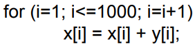

- paralelismus urovne smycek
  - "rozbalovani" smycek
    1) dynamicky predikci vetveni
    2) staticky - rozbaleni smyccky prekladacem
  - jiny pripad jsou vektory (viz dale)
  - urceni zavislosti instrukci je kriticke pro paralelismus smycek
  - 2 instrukce jsou but
    - paralelni (mohu je provest soucastne bez toho aby se navzajem ovlivnili)
    - zavisle (musi se vykonat v danem poradi)

- zavislosti dat a hazardy
  - instrukce `I` je datove zavisla (prava zavislost) na instrukci `J`

  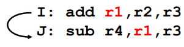

  - instrukce se nemohou vykonavat soucasni ani se uplne prekryt
  - jestlize datova zavislost zpusobila hazard v pipeline, nazva se Read After Write (RAW) hazard
  - dulezitost datovych zavislosti:
    - indikuji moznost vyskytu hazardu
    - urcuji poradi vykonavani instrukci
    - udavaji horni hranici mozneho paralelismu
  - cil pro HW/SW: vyuzit paralelismus pri zachovani poradi instrukci jen tam kde to prinese zisk

- zavislost jmen #1: Anti-dependence
  - pokud 2 instrukce pouzivaji stejny register (nebo misto v pameti) ale neni mezi nimi zadny tok dat

  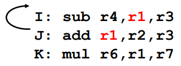

  - zpusobi-li anti-dependence hazard v pipeline, nazyva se Write After Read (WAR) hazard
  - reseni: pozuziju jiny (volny) registr (`J: add r5, ...`) resp prohodim poradi

- zavislost jmen #2: vystupni zavislost
  - instrukce `J` zapise oprand predtim nez zapis provede instrukce `I`

  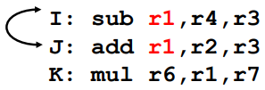

  - prameni z opetovneho pouziti stejneho jmena
  - zpusobi-li vystupni zavilost hazard v pipeline, nazyva se pak Write After Write (WAW)
  - resenim aby se instrukce mohli provest paralelne: zmena jmena (pouziteho registru)
    - reseni na urovni prekladace nebo HW

- zavislosti rizeni vypoctu
  - kazda instrukce je zavisla (control dependent) na urcitem souboru instrukci vetveni (napr `if` statemant)
  - obecne se tyto zavislosti musi zachovat aby byla zajistena posloupnost programu

  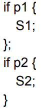

  - `S1` je control-dependant na `p1`
  - `S2` je control-dependant na `p2` (ale nikoliv na `p1`)

- ignorovani ridicich zavislosti
  - neni je nutne zachovat:
    - chceme-li provest instrukce ktere by nemely byt provedeny -> muzeme to dopustit pokud korektnost programu zustane zachovana (instrukce nemaji vedlejsi efekt)
  - naproti tomu dve vlastnosti jsou z hlediska korektniho provedeni programu kriticke
    - chovani vyjimek
    - tok dat

  - chovani vyjimek
    - zachovani osetreni vyjimek
      - => libovolne zmeny v poradi vykonavani instrukci nesmi ovlivnit jak jsou vyjimky v programu osetreny

    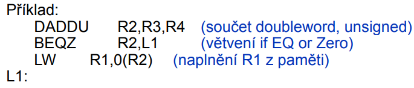

    - muzeme presunout LW pred BEQZ?
      - pokud budeme ifnotovat ridici zavislost tak ano
      - ale LW muze vyhodit vyjimku pri pristupu na nevalidni adresu

  - tok dat
    - = aktualni tok dat mezi instrukcemi ktere produkuji vysledky a temi ktere jej pouzivaji (output - input)
    - vetveni zpusobuje ze je tok dynamicky

    

    - nemuzu! OR (v navesti skip) zavisisi na R1 ktere se pocita az po skoku a ne pred

    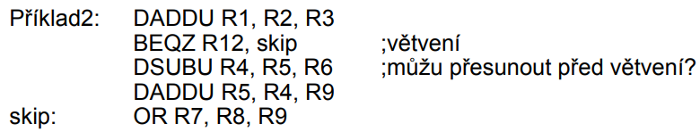

    - muzu za predpokladu ze R4 neni pouzivano za smyckou

- rozbalovani smycek
  - priklad pripocitavani skalaru `s` k vektoru `X`

  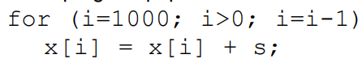

  - kde jsou hazardy?
    - prelozime do kodu MIPS

      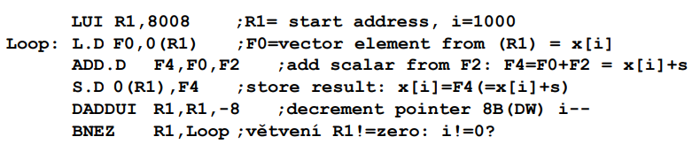

  - smycka vykazujici pozastaveni

    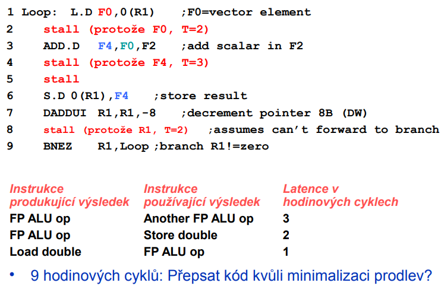

  - upravena smyckla minimalizujici prodlevy

    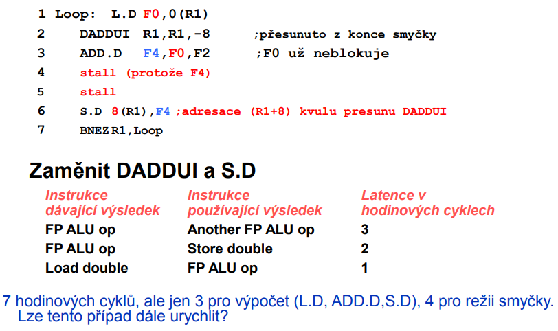

  - ctyrnasovne rozvinuti smycky

    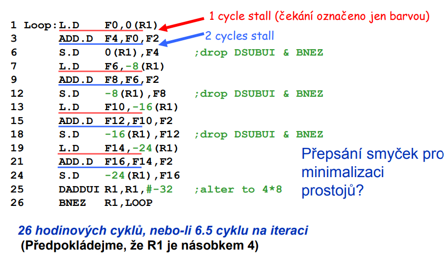

- detaily rozbalovani smycek
  - horny hranice smycky neni obvykle znama pri prekladu
  - predpokladame ze je to `n` a chceme vytvorit `k` kopii tela smyccky
  - misto jednoduche rozvinyte smycky generujeme dvojici po sobe jdoucich smycek:
    - prvni (`n mod k`)
    - rozbelene telo `k` kopii
    - podledni (zase `n mod k`)

- rozbalovani minimalizujici prostoje
  - vyuziti vice registru

    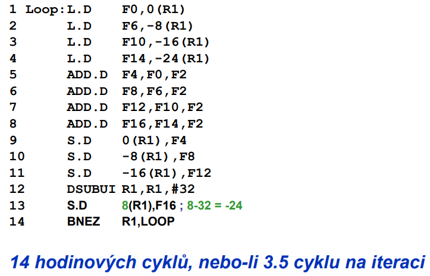

- 5 rozhoduni pri rozbalovani!
  - vyzaduje porozumeni tomu jak jedna instrukce zavisi na druhe a jak mohou byt zmeneny nebo preskupeny za danych vlsatnosti
    1) nalezeni nezavislych casti
    2) pouziti ruznych registru (eliminace omezeni zpusobene pouzitim stejnych registru)
    3) odstraneni zbytecnych instrukci vetveni
    4) operace RW mohou byt v rozbalenych iteracich zameneny pokud jsou nezavisle => vyzaduje analyzu pametovych referenci
    5) respektovani vsech zavislosti abychom dostali stejny vysledek jako u originalniho kodu

- tri limity rozbalovani smycek
  1) snizovani velikosti rezie je na druhe strane komepnzovano kazdym extra rozbalenim
      - Amdahluv zakon (klesajici vynosy s vyssim stupnem rozbaleni)
  2) narust velikosti kodu
      - velke smyckky => omezeni vyuziti cache (rasust miss rate)
  3) potencialni nedostate registru
  - rozbaleni smycek redukuje ruaz na vetveni v pipeline; jinou cestou je predikce vetveni

- predikce skoku
  - staticka vs dynamicka
  - predikce poskytuje informace
    - vlastni predikce (vykona se skok/nevykona se skok)
      - Taken vs Not Taken
    - casto take adresu cile skoku kvuli urychleni
    - nekdy i nekolik instrukci lezicich v cili skoku
      - => zefektivneni nacitani instrukci z hlani pameti ktere pravdepodobne v tomto okamziku jeste nejsou v instrukci cache
  - typicka uspesnost: 90-96%
    - 4-10% spatna predikce
    - typicky 10-25 uspesne predikovanych skoku mezi spatnymi predikcemi
    - 5-125 mezi dvema spatnymi predikcemi
  - cena za spatnou predikci roste:
    - s hloubkou pipeline
    - s "sirkou" stroje (pocet paralelne vkladanych instrukci)
  - predikce => dnes nutna podminka pro dobry vykon
  - proc predikce funguje?
    - algoritmy a zpracovavana data vykazuji regularity
    - posloupnosti instrukci obsahuji redundance - zbytky toho jak programatori/prekladace neprimo "promysleji" problemy
  
- staticka predikce skoku
  - preskupeni kodu kolem instrukci vetveni vyzuje statickou predicky skoku v dobe kompilace
  - nejjednodussi predikcni schema je predpokladat ze se skok provede
    - vetsina skoku:
      - smycky (while, for, ...)
    - stredni cetnost spatne predikce = frekvence neprovedenych skoku = 34% (jedna spatna predikce => ta nakonci napr. `i < 7`)
  - presnejsi mechanismy predikuji na zaklade informaci ziskanych pri minulych bezich programu a modifikuji predikci zalozenou na poslednim behu

- dynamicka predikce skoku
  - je lepsi nez staticka?
    - zda se ze tomu tak je
    - programy obsauji mensi pocet dulezitych vetveni ktere maji dynamicke chovani

- Branch-Prediction Buffer (branch history table)
  - nejjednodussi postup je odhadnout za se skok bude nebo nebude konat
  - pomaha v pipeline tam kde zpozdeni zkoku je vetsi nez cas potrebny urceni mozne cilove hodnoty PC

  - sedm schemat predikce
    1) 1-bitovy prediktor vetveni
    2) 2-bitovy prediktor vetveni
    3) prediktor s korelaci
    4) kombinovany prediktor vetveni (tournament Branch Predictor)
    5) Cache pro cile skoku (Branch Target Buffer = BTB)
    6) integrovana jednotka pro predvyber instrukci
    7) prediktor navratove adresy

  - reseni
    - urcite vysledek skoku co nejdrive jak je mozno
      - predikce podminky skoku & cile skoku
      - predvyber instrukci z mista cile skoku jeste pred jeho vyhodnocenim
      - spekulativni vypocet
        - instrukce z mista cile skoku jsou precteny a zacnou se vykonavat jeste pred vyhodnocenim skokove instrukce
      - jednoduche reseni
        - PC <- PC + 4 (implicitni predvyber dalsi sekvencni instrukce)
      - pri chybnem odhadu se pipeline musi zahodit
      - potrebujeme presnejsi predikci abychom redukovali ztratu vlivem chyboveho odhadu
        - cim hlubsi a sirsi pipelinning => tim vetsi jsou ztraty vznikle chybou predikce
  
  - priklad ztrat pri chybove predikci

    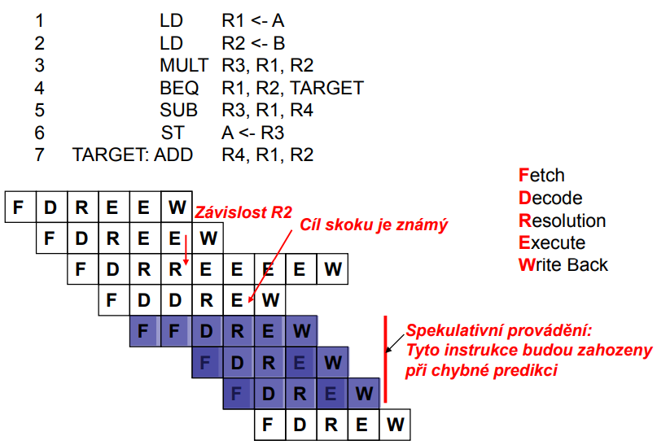

  - ruzne typy automatu
    - `S(i)` - stav v case i
    - `G(S(i)) -> T/F` - predikcni rozhodovaci funkce
    - pozn.: T=taken (skok), N=not taken (neskok)
    - Stav = predikce, hrany/prechody = skutecnost

    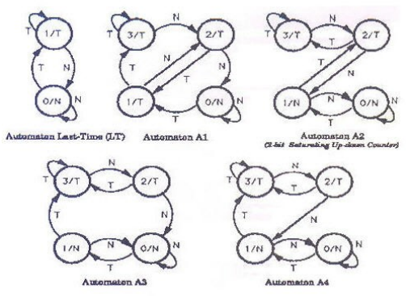

  - priklad:

    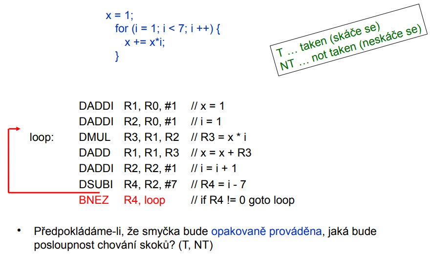

    - jednobitova predikce odpovida: `T, T, T, T, T, NT, T, T, T, T, T, NT, T, T, T, T, T, NT, . . .`
      - modifikace prikladu A):
        - predpokladame 1-bitovy prediktor vetveni inicializovany na NT
        - smycku budeme provadet 100x
        - jaky je podil spatnych odpovedi?
          - jedna smycka: `NT T T T T NT | NT`
          - 100 * (4 dobre a dve spatne)
          - => `(100 * 2) / (100 * 6) = 1/3 = 0.333 = 33,33%`
          - => nezavisi na poctu behu smyccky (vykrati se)

        - modifikace prikladu B)
          - predpokladejme 2-bitovy prediktor vetveni inicializovany na NT
          - smyccku budeme provadet 100x
          - jaky je podil spatnych odpovedi?
            - predikce se meni dojdeli ke spatne predikci 2x po sobe
            - `NT NT T T T NT | T T T T T NT | T T T T T NT | ...`
            - po prve 3 spravne odpovedi a 3 spatne
            - po druhe az ste 4 spravne a 1 spatna odpoved
            - => `(3 + (1 * 99)) / (6 * 100) = 0.17 => 17%`

- predikce vetveni s korelaci
  - dvoubitovy prediktor pouziva pouze historii toho skoku ktery prave predikuje
  - jednoducha myslenka: vzit do uvahy i istatni skoky => protoze chovani skoku muze byt korelovani (zavisle)
  - priklad:

    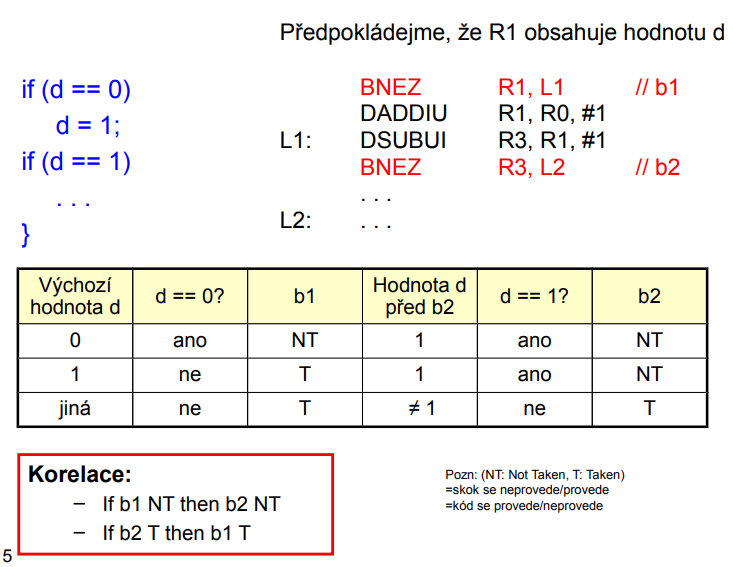

    - budeme zkoumat jak by n-bitovy prediktor zpracoval tuto posloupnost
    - existuje cela rada moznych provedeni nezavisejicich na tom jakou hodnotu nabude `d` a kdy => ucinime zjednoduseni
      - necht se posloupnost opakuje vicenasobne
      - necht hodnota de alternuje mezi 0 a 2
      - vsechno ostatni vetveni budeme ignorovat
        - posloupnost hodnot: 2, 0, 2, 0, 2, 0, ...
        - => dostaneme nasledujici tabulku skoku

          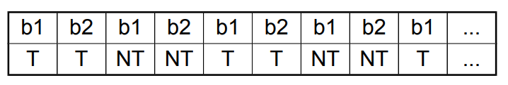

        - predpokladejme 1-bitovy prediktor
        - kazde vetveni ma svuj prediktor (b1 i b2)
          - kazdy znich ma posloupnost `T, NT, T, NT, T, NT, ...`
        - pro 1-bitovy prediktor je kazde vetveni predikovano spatne
        - co kdyz pouzijeme n-bitovy prediktor?

          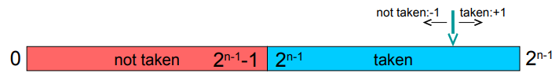

          - at je prediktor inidializovat jakkoli `< 2^(n-1)-1` nebo `> 2^(n-1)` steje je polovina vetveni predikovana spatne
          - => n-bitovy prediktor nepreacuje prave nejlepe

- predikce vetveni s koleraci (pokracovani)
  - duvodem proc je predikce slaba je to ze skoky jsou korelovane
  - zakladni myslenka: kazdy skok bude mit dva bity
    - jeden bit je pouzit kdyz posledni provedeny skok NEBYL proveden
    - jeden bit je pouzit kdyz posledni provedeny skok BYL proveden
  - notace:
    - aktualni stav prediktoru X/Y
      - X: pouzit kdyz posledni skok NEBYl proveden
      - Y: pouzit kdyz posledni skok BYL proveden
    - priklad: T/TN
      - pokud posledni skok nebyl proven => kladna predikce T
      - pokud posledni skok byl proveden => zaporna predikce NT
