- predchazeni datovym hazardum dynamickym plnovanim
  - vyhody dynamickeho planovani: HW meni poradi instrukci se zachovanim toku dat a chovanim pri vyjimkach
  - osetruje pripady kdy neni mozno zavislosti urcit v dobe prekladu
    - to dovoluje procesoru tolerovat nepredikovatelna zpozdeni jako napriklad vypadek cache tak ze provadi jine instrukce dokud cache vypadek nezpracuje
  - zaroven umoznuje efektivni beh programu prelozeneho pro jednu pipeline strukturu na jine
  - zjednodusuje prekladac
  - HW spekulativni techniky - prinaseji podstatne vykonove zlepseni, jsouli zalozene na dynamickem planovani

- HW schemate: Instrukcni paralelismus
  - zakladni myslenka: provadet nezavisle instrukce za mistem pozastaveni

  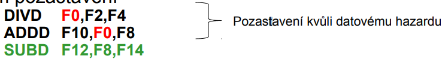

  - umoznuje "out-of-order" provadeni a dovoluje "out-of-order" dokonceni (zde napr `SUBD F12, F8, F14`)
    - v dynamicky planovane pipeline strukture vsechny instrukce prochazeji do vkladaciho stupne (issue stage) v puvodnim poradi
  - rozlisujeme kdy se instrukce zacne vykonavat a kdy se dokonci
    - mezi temito dvema casy se instrukce provadi
  - pozn.: dynamicke provadeni zpusobuje hazardy WAR a WAW a osetreni vyjimek je slozitejsi

- Scoreboarding
  
  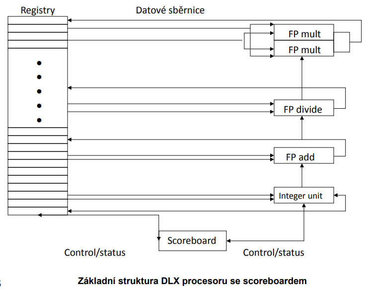

  - faze zpracovani instrukci (instruction execution cycle)
      1) Nacteni (IF = isntruction fetch) - nacteni instrukce s pameti + zvyseni PC
      2) Dekodovani (ID = instruction decode) - dekodovani instrukce; nacteni hodnot a parametru
      3) Provedeni (EX = execute) - provedeni operace nad daty
      4) Pristup do pameti (MEM = memory access) - jen pro load/store instrukce
      5) Zapis vysledku (WB = write back) - zapis vysledku do registru

  - 4 stupne rizeni scoreboardu
    1) dekodovani instrukci & kontrola strukturalnich hazardu (ID1)
        - jeli funkcni jednotka pro zpracovani instrukce volna a zadna jina aktivni instrukce nema stejny cilovy regist (WAW) doda scoreboard instrukci do funkce jednoty a aktualizuje jeji interni datovou strukturu
        - existuje-li strukturni nebo WAW hazard => vlozeni instrukce je pozastaveno a zadne dalsi instrukce nejsou vkladany dokud nejsou hazardy odstraneny
        - algoritmus
          - zajisti vkladani "In-Order"
          - umoznuje provedeni vetsiho poctu operaci behem jednoho cyklu
          - kontroluje zda cilovy registr je jiz rezerovan pro zapis (WAW)
          - kontroluje zda je volni vstup funkci jednotky (mozny strukturni hazard)
    2) cteni operandu: ceka dodud nezmizi datove hazardy, potom precte operandy (ID2) - prvy funkci stupen pipeline
        - zdrjovy operand je k dispozici jestlize zadna drive vlozena instrukce se jej nechystat zapsat ani do nej prave nezapisuje zadna funkci jednotka
        - jakmile jsou zdrojove operandy k dispozici, scoreboard prikaze funkci jednotce provest cteni operandu z registru a spusti provadeni
        - scoreboard vyhodnoti dynamicky v tomto kroku RAW hazardy a instrukce mohou byt poslany do provadeci jednotky bez dodrzeni poradi (out of order)
        - algoritmus
          - cekani na operandy dokud nejsou k dispozici, stav registru vysledku (RAW)
          - ukladani operandu do cache je povoleno
          - Forwarding z jineho stupne WB (write-back faze) je povolen
    3) Execution: operace s operandy (EX)
        - funkci jednotka zacne po obdrzeni operandu provaded operaci
        - kdyz je vysledek hotov, oznami scoreboardu ze operaci dokoncila
    4) Write result: dokonceni provadeci faze (WB)
        - jakmile scoreboard zjisti ze je funkci jednotka dokoncila operaci, scoreboard otestuje vyskyt WAR hazardu
        - neexistuji-li, zapise vysledky jinak pozastavi instrukci
        - algoritmus
          - opozdi zapis dokud vsechna pole `Rj` a `Rk` tohoto registru nejsou oznacena jako "cached" nebo "read"
            - jsou-li operandy v cache, jsou odpovedi (ziskane operandy) "orwardovany" dal
            - v opacnem pripade se zapisem ceka dokud nejsou vsechny operandy precteny
          - forwarduje odpovedi jednotkam cekajicim na tento zapis jejich operandu
  
  - tri casti scoreboardu
    1) stav instrukce
        - indikuje ve kterem ze ctyr kroku zpracovani se instrukce nachazi
    2) stav funkcni jednotky
        - indikuje stav funkcni jednoty (FU); 9 poli pro kazdou funkcni jednotku
          - Busy - indikuje zda je jednotka v cinnosti ci nikoliv
          - Op - operace ktera se ma v jednotce vykonat (napr +/-)
          - Fi - cilovy registr
          - Fj, Fk - cisla zdrojovych registru
          - Qj, Qk - funkcni jednotky generujici zdrojove registry Fj, Fk
          - Rj, Rk - flagy indikujci ze Fj a Fk jsou pripraveny a dosud nebyly precteny (alternativne: byly precteny a ulozeny do cache)
    3) stav registru vysledku
        - indikuje ktera funkci jednotka bude zapisovat kazdy registr, pokud existuje
        - zustava prazdny pokud zadna probihajici instrukce nebude provadet zapis do toho registru
  
- Scoreboard priklad

    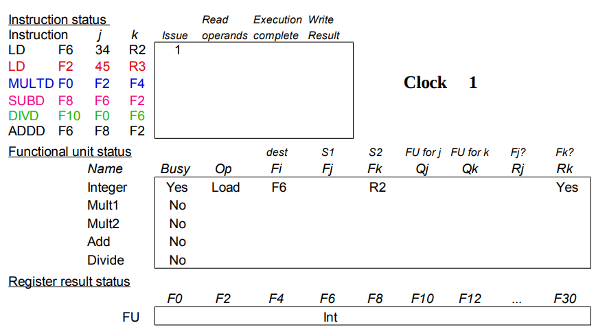

  - R2 nebyl dosud precten (a umisten do cache) az do cyklu 2

    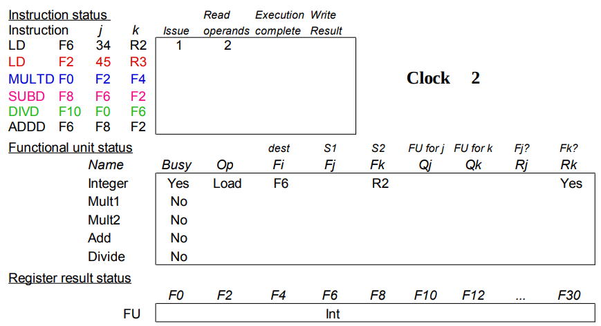

  - druhe LD je blokovane strukturnim hazardem (jen jedna jednotka pro nacitani)

    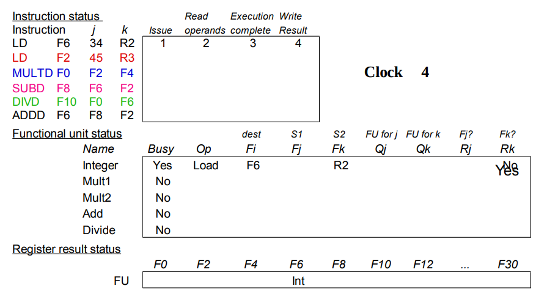

  - dokonceni prvni instrukce (LD) -> funkci jednotka je volna

    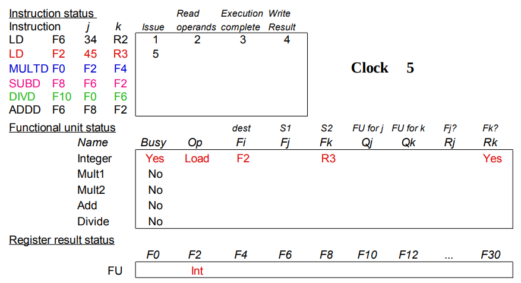

    - muzeme zacit zpracovavat druhou instrukci LD

    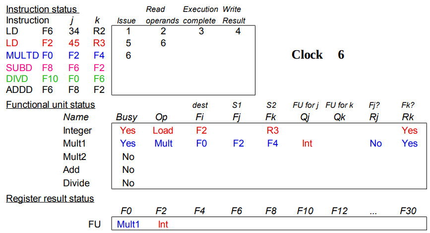

    - rovnou muzeme zacit zpracovavat instrukci MULTD ale ta se zablokuje kvuli RAW hazardy z predchozi instrukce kde se zapisuje F2 (cilovy registr)

    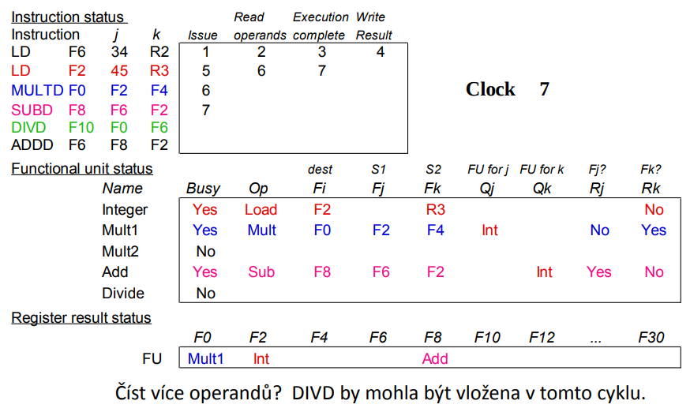

    - MULTD prosla fazi dekodovani ale je stale blokovana kvuli F2 -> muzeme ale zacit dekodovat dalsi instrukci (SUBD)

    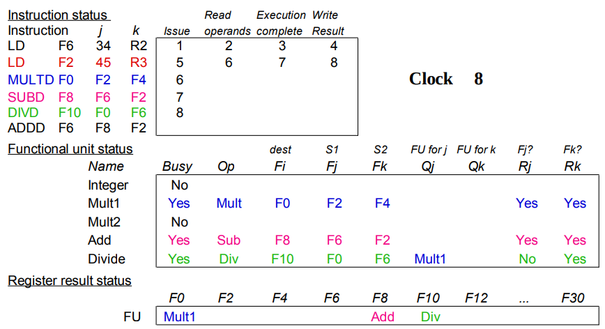

    - fetch instrukce SUBD byl dokoncen => muzeme zacit fetchovat instrukci DIVD a zaroven se konecne dokonci WB 2. instrukce LD ktera blokuje MULTD a SUBD

    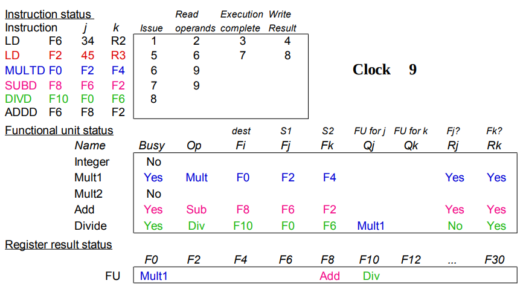

    - instrukce MULTD a SUBD mohou konecne nacist operandy
    - ADDD nemuzeme zacit dekodovat protoze je blokovana funkci jednotka operaci SUBD (v tomto pripade FU = ALU)
    - pozn.: kazda FU muze byt zabrana na jiny pocet instrukcnich cyklu (nasobeni trva dele)
  
  - v tomto duchu se pokracuje dokud nejsou vsechny instrukce dokonceny

- scoreboarding souhrn
  - omezeni scoreboardu u CDC 6600
    - zadny forwarding HW (=> operandy jsou jen v registrech)
    - malu pocet funkcnich jednotek FU (strukturni hazardy)
  - klicova myslenka: nechame provest instrukce lezici za pozastavenou instrukci
    - dekodovani => vlozeni instrukci a cteni operandu
    - umoznuje provaded operaci out-of-order => out-of-order dokonceni
  - soucasna vylepseni
    - vsechny operandy se umistuji do cache jakmile jsou k dispozici
    - forwarding
    - pipelining funkcnich jednotek
    - pracuje nejlepse s velkym mnozstvim registru
    - ukoncovani v poradi
    - preciznejsi vyjimky
    - mikroprogramovani
  - tomasulo metoda
    - rezervacni stanice vs forwarding a caching
    - "docasne" registry jsou vyuzivany jako velke mnozstvi virtualnich registru

- HW schemate pro ILP
  - klicova myslenka: dovolit zpracovani instrukci za pozastavenou instrukci
    - dekodovani => vlozeni instrukci a cteni operandu
    - dovoluje out-of-order-execution => out-of-order dokonceni (mimo poradi)
  - proc v HW v dobe vypoctu? (stataticka vs dynamicka analyza)
    - funguje kdyz zavislost neni znama v dobe prekladu
    - zjednodusuje prekladace
    - dovoluje dobre zpracovani kodu urceneho pro jiny stroj (optimalizovaneho pro jiny stroj)
  - out-of-order provadeni deli ID stupen
    - vkladani - dekodovani instrukci, kontrola vzniku strukturnich hazardu
    - cteni operandu - cekani dokud neodedzni datove hazardy

- Tomasulo algoritmus
  - cil: vysoky vykon bez vyuziti specialnich prekladacu
  - rozdil mezi Tomasulo algoritmem & technikou scoreboard
    - rizeni & buffery (nazyva "rezervacni stanice") jsou distribuovany uvnitr funkcnich jednotek oproti centralizovanemu usporadani u scoreboardingu
    - registry v instrukcich jsou nahrazeny pointery na buffery rezervacni stanice
    - HW prejmenovani registru aby se zabranilo WAR a WAW hazardum
    - spolecna datova sbernice (CDB) vysila vysledky funkcnim jednotkam (broadcast)
    - s operacemi load a store je zachazeno jako s funkcnimi jednotkami
  - navrzen pro IBM jeste pred tim nez se objevily cache pameti => dlouha latence pameti

  - 3 stupne  Tomasulova algoritmu
      1) vkladani: Presun instrukce z fronty FP operaci
          - jeli rezervacni stanice volne, vlozi instrukci a vysle operandy (prejmenuje registry)
      2) provedeni: operace provadena s operandy (EX)
          - jsouli operandy pripraveny, pak provedeni
          - v opacnem pripade je sledovana spolecna sbernice zda neprisel vysledek
      3) zapis vysledku: dokonceni provadeci face (WB)
          - zapis po spolecne sbernici vsem cekajicim jednotkam; oznaci rezervacni stanici jako pripravenou

    - common data bus (= CDB): data + zdroj (prichazi po sbernici)

    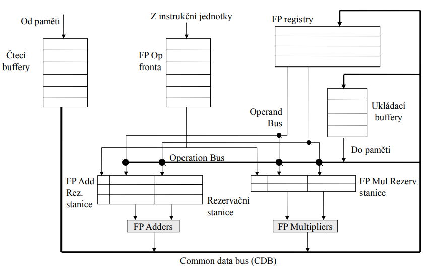
  
  - komponenty rezervacni stanice
    - Op - operace k provedeni v jednotce (napr +/-)
    - Qj, Qk - rezervacni stanice produkujici zdrojove registry
    - Vj, Vk - hodnoty zdrojovych operandu
    - Rj, Rk - flagy indikujici zda Vj a Vk jsou "ready"
    - Busy - indikujici ze rezervacni stancie a FU je "busy"
  
  - stavovy registr vysledku
    - indikuje ktera funkcni jednotka bude zapisovat kazdy regist, pokud nejaky existuje
    - prazdy pokud zadne zpracovavane instrukce (pending) nebudou psat do tohoto registru

- Tomasulo priklad

  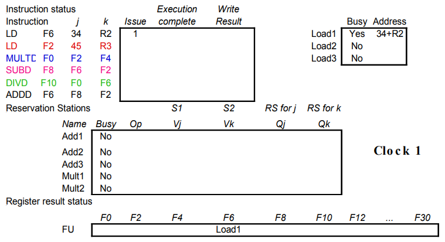

  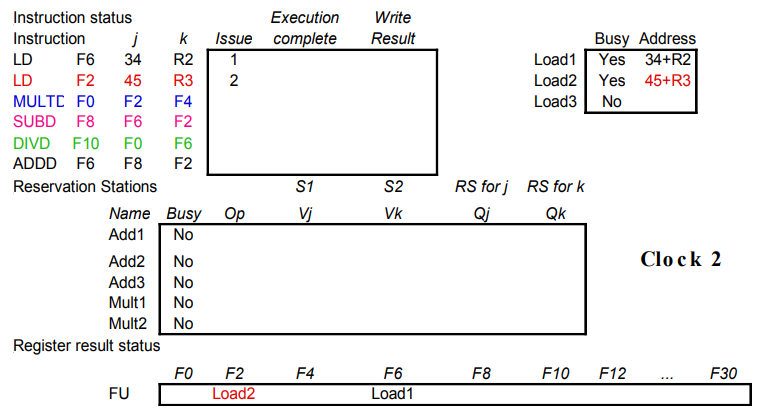

  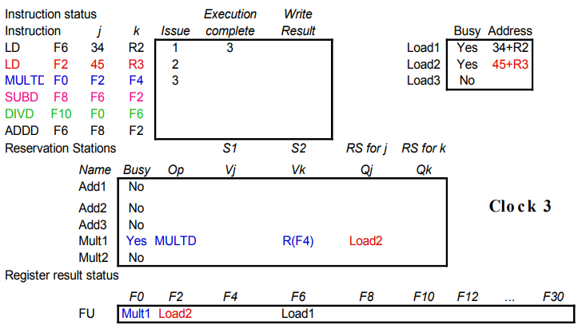

  - jmena registru jsou "prejmenovana" v rezervacnich stanicich
  - dokonceni load1 - kdo ceka na load1?

  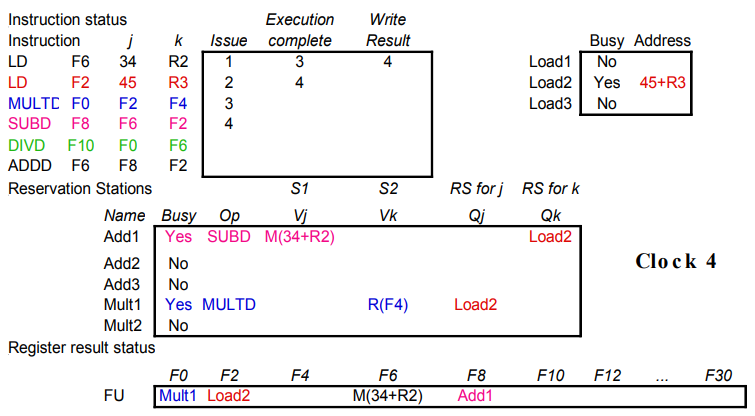

  - dokonceni load2 - kdo ceka na load2?

  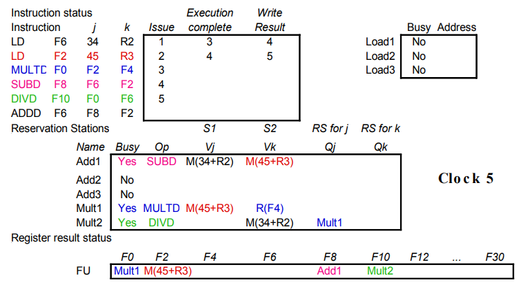

- Tomasulo souhrn
  - rezervacni staniceL: prejmenovava do vetsiho souboru registru + docasne pamatuje zdrojove operandy (buffering)
    - registry prestavaji byt uzkym mistem
    - zabranuje WAR a WAW hazardum ktery se vyskytovaly u scoreboardingu
    - dovoluje rozvijeni smycek (loop unroalling) v HW
  - neomezuje se jen na zakladni blok
    - integer jednotka pracuje dal az za skoky
  - prispevek
    - dynamicke planovani
    - prejmenovani registru
    - load/store zjednoduseni

- Tomasulo se spekulaci
  - *Issue*
    - prazdna rezervacni stanice a prazdny ROB slot
    - operandy jsou zaslany do rezervacni stanice z registroveho souboru a nebo z ROB (reorder buffer)
    - tento stupen se oznacuje dispatch
  - *Execute*
    - monitoruje operandy v CDB, hlida RAW hazardy
    - jsou-li obe operandy k dispozici => provede operaci
  - *Write Result*
    - Je-li hotovy je vysledek zapsan do CDB prostrednictvym ROB a do kazde dalsi cekajici rezervacni stanicei
  - *Commit* - 3 pripady
    1) Normalni commit: zapis registru "in order" Commit
    2) Store: aktualizace pameti
    3) Nekorektni vetveni: zahodi ROB obsah rezervacni stanice restartuje vypocet na korektni hodnote PC

- Nevyhody Tomasulova mechanismu
  - slozitost
  - mnoho rychlych asociativnich pameti (CDB)
  - vykon omezeny sbernici CDB (= common data bus)
    - kazdy CBD musi prochazet k vetsimu poctu funkcnich jednotek => velke kapacity, velka hustota propojeni
    - pocet FU ktere mohou dokoncit operaci v jednom cyklu je omezen na jednu
      - nasobne CBD => vice FU logiky pro paralelni asociativni pameti
  - neprecizni interrupty/vyjimky!!

  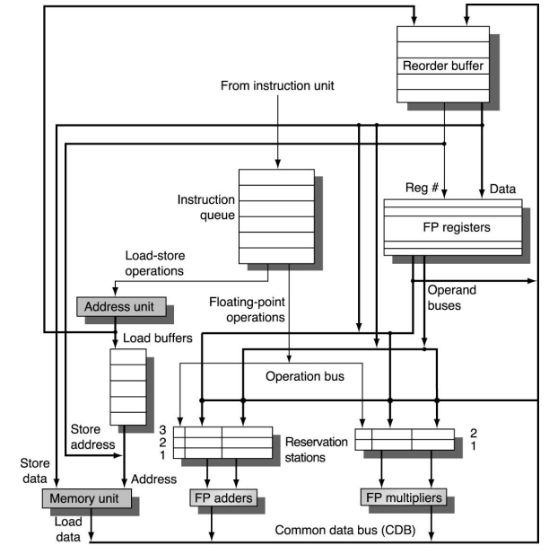

- Rozdily mezi Tomasulovym algoritmem a Scoreboardingem
  - Tomasuluv algoritmus
    - rizeni & buffery ("rezervacni stanice") jsou distribuovany mezi funkcni jednotky
    - registry v instrukcich nahrazeny pointery na buffery rezervacnich stanic
    - HW prejmenovani registru kvuli zamezeni WAR a WAW hazardum
    - common data bus (CDB) vysila vysledky funkcnim jednotkam
    - s load/store je zachazeno jako s funkcnimi jednotkami (FU)
    - 3 stupne: issue, execution, write back

  - Scoreboarding
    - rizeni a buffery jsou centralizovane
    - pouziva aktualni registry
    - nevklada pokud nastava strukturni nebo WAW hazard
    - cekani na WAR hazardy
    - 4 stupne: issue, read operands, execution, write back
