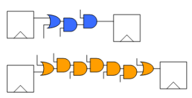

- HW - kde se ztraci energie?
  - parazitni kapacity (interni hradla, spoje ale i externi vodice)
  - spinani tranzistoru
  - zaverny proud diaodami - vyrazne se take meni s teplotou (vyssi teplota, vyssi svod)
  - zahrivani odporu (prevod na teplo?)

    

- IC (= integrated circuit) - low power design
  - velikost hradla: ruzve velikosti ovlivnuji kapacity/spotrebu
  - pin swapping: u multivstupnych hradel se do vstupu s nejnizsi kapacitou privede signal s nejcastejsimi zmenami
  - low power vs high speed
    - nizsi rychlost obvodu - moznost snizit napajeni (protoze ztraty jsou umerne `U^2`)
  - multi-VDD design
    - dve cesty do stejneho bodu - modra kratsi a tedy zbytecne rychlejsi => adept na snizeni rychlost (=> snizeni VDD)
    - realne problematicnejsi (routovani ruznych VDD)
    - obvykle voli navrhar na urovni logickych funkcnich bloku

    

  - power-gating
    - odepinani napajeni funkcnim blokum ktere jsou aktualne nepotrebne
    - je nutno zvazit ze obvykle je behem sleepu nutno uchovat nejake informace
      - zaroven take uchovani a obnoveni informaci nejakou dobu trva

    

  - dynamicka zmena napajen a frekvence
    - zatez nemusi byt v case konstantni (typicky napr graficke karty - rozptyl az nekolika radu)
    - snizeni frekvence - redukce okamzite spotreby ale celkova energie se nemeni (jen redukce peak power => obsah plochy je stejny viz obrazek)
    - snizeni frekvence a napajeni -> redukce celkove energie

    

- architektura, algoritmy - low power design
  - optimalizace na spotrebu
    - uziti jineho algoritmu -> napr seriova scitacka vs RCA
    - strukturalni zmeny, zmeny v kodovani, oddeleni jednotlivych casti
    - vychazime ze staticke analyzy obvodu (staticka, dynamicka) simulace
  - strukturalni zmeny
    - pomale (mene, pomalu se preklapejici) logiky dame na zacatek
    - na konec dame logiky ktere se casteji (frekventovaneji) preklapi

        

  - priklad:
    - `((A & B) & C)` vs `(B & C) & A`
    - pokud bude napr A casto preklapejici => lepsi je ho dat az do druhe urovne

  - oddeleni kapacitnich spoju
    - hazardy v logice typicky zpusobi vice nez jednu zmenu nez se vystup ustali => oddelit vystup kombinacni logiky do ustaleni

    

  - pipeline
    - oddeleni casti
    - vypocet zmeny provadi jen cast a zbytek setri energii

  - clock gating = odepinani hodin z nepotrebnych klopnych obvodu

    

  - stavove automaty - kodovani stavu
    - je lepsi navrhnout kodovani kde se napr preklapi jen jeden bit (napr gray code)
    - do uvah je take dobre brat ppsti prechodu mezi stavy a podle toho navrhnout logiku

- SW/HW (mikrokontrolery, procesory)
  - sleep rezimy
    - HALT = odpojeni hodin
    - SNOOZE = odpojeni hodin a napajeni funkcnich bloku; pametovy cleny jsou zapnute
    - SHUTDOWN = odpojeni hodin vcetne napajeni funkcnich i mapetovych clenu; cache jsou napajeny
    - HIBERNATE = odpojeni hodin i napajeni
  - zdroje hodin
    - krystal/interni oscilator
  - Low power SW
    - interrupt drive, DMA
    - rychle s velkym odberem vs pomalu v malym odberem
  - operacni systemy
    - power management
    - energy scheduling

- zdroje energie
  - staticke parametry: kapacita, napeti, proud
    - primarni clanky, aktumulatory, kondenzatory
  - dynamicke parametry: pocet cyklu (zivotnost), spicky ve postrebe, rteplota

- pozn: ochrana proti prepolovani
  - dioda neni vhodna => ubytek na diode a ten je jeste funkci teploty a proudu
  - => mechanicka ochrana (uzivatel nemuze zapojit opacne) nebo FET diodou
