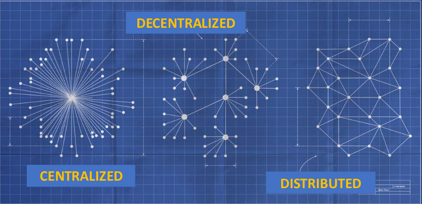
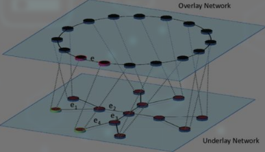
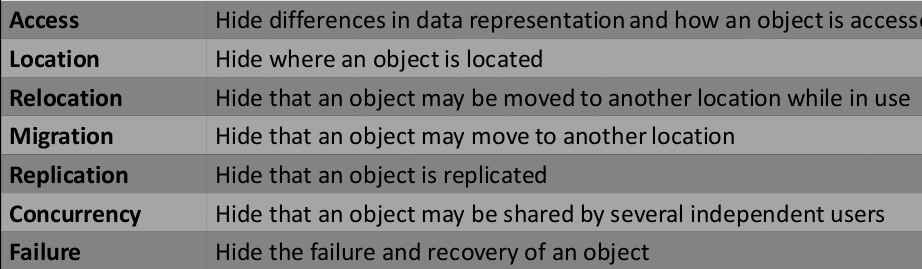
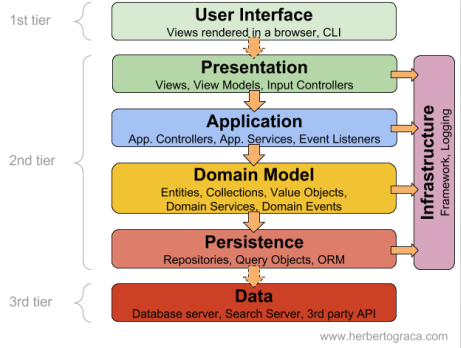
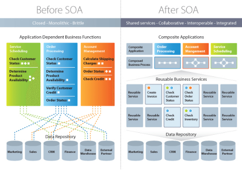
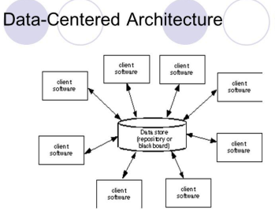
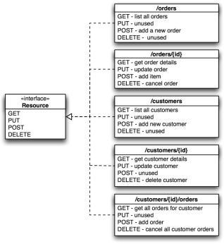
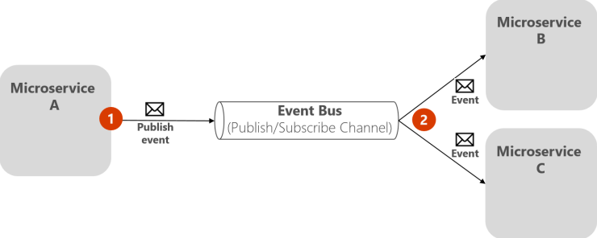
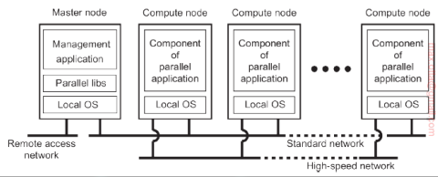
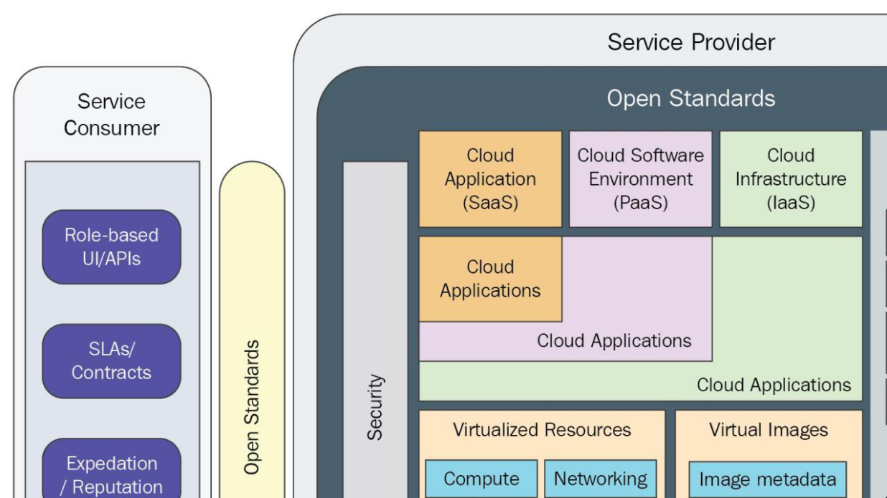

- puvod: potreby sdileni zdroju (resource sharing)

- proc distribuovane systemy?
    - spolehlivost: redundance, replikace
    - load balancing: paralelni aplikace / zpracovani dat
    - skalovani: paralelni aplikace / zpracovani dat

- distribuovany system = kolekce autonomne pracujicich elementu ktere se jevi uzivateli jako jednotny uceleny system nebo aplikace

    

- overlay network
    - viz virtualni topologie v PPR
    
    

    - to jak spolu uzly komunikuji nemusi odpovidat 1:1 fyzicke topologii (to je ideal)
    - napr. model farmer-worker
    - idealne mit uzly ktere spolu komunikuji casto ve stejne geograficke lokaci

- charakteristiky distribuvanych systemu
    - concurrency (paralelismus): kolekce autonomne pracujicich elementu
    - neexistuje nic jako globalni hodiny
    - nezavislost poruch
        - jednotlivych uzlu
        - nebo take komunikacnich linek
    - nespolehlivost komunikace
        - latence (posilani zprav se nedeje instantne)
        - nespolehlivost
            - ztrata nebo duplikaci zprav
            - poradi zprav ("neco jako" TCP vs UDP)
            - korupce zprav (resit pomoci CRC, paritou, hash, ...)
    
- cile distribuovanych systemu
    - podpora sdileni zdroju
        - sdileni dokumentu a multimedii (napr Google Doc)
        - skupinova spoluprace (napr whiteboard, meet call, sledovani filmu online s prateli)
    - transparentnost toho ze je system distribuovany
        - iluze toho ze se jedna o jediny system ci aplikaci (viz napr Netflix)
        - typy transparentnosti:

            

        - stupen transparentnosti
            - snaha o uplnou transparentnost distribuce muze byt az moc
            - zcela zakryt latenci a chyby v pocitacovych sitich je nemozne (viz CAP teorem)

    - otevrenost
        - otevreny distribuovany system je v podstate takovy system ktery nabizi komponenty ktere muzou byt snadno pouzity v jinych systemech (nebo je lze primo do nich integrovat)
        - casto take samotny DS vyuziva komponent ktere pochazeji odjinud
            - slozeni ruznych sluzeb (Service Composition)
            - microservices
        - otevrenosti se dosahne:
            - s pouzitim zname (bezne) reprezentace dat
                - JSON
                - ASN.1, BER, DER
            - pomoci API
                - IDL, REST, OpenAPI

    - skalovatelnost
        - co (jake domeny) by se mely skalovat
            - velikost: CPU, uloziste, transfer rates
            - geograficke: "zony dostupnosti" (viz Netflix v UK a Cr)
            - administrativni: sprava a monitoring

- spatne predpoklady (o DS)
    - sit je spolehliva
    - sit je bezpecna
    - sit je homogenni (obsahuje stejna zarizeni / uzle)
    - topologie se nemeni (viz dynamicke zmeny v topologii)
    - nulova latence
    - nekonecna sirka pasma
    - cena prenosu = 0
    - existuje pouze jeden administrator

- architektury DS
    - vrstvene architektury

        

    - object-based a service-oriented architektury

        

    - data-centered architektury

        

    - resource-based architektury

        

    - public-subscribe architektury

        

- evoluce distribuovanych systemu
    - multicore architektura
        - 80\. leta
        - concurrency, rizeni vice procesoru
        - narust distribuovanych systemu
    - architektura client-server
        - 80., 90. leta
        - narust internetu a otevrenych systemu (open systems)
    - cluster computing
        - popularni hlavne v 90. letech
        - levne a vykonne PC
        - vysokorychlostni site

            

    - grid computing
        - pozdni 90. leta
        - vypocetni vykon jako zdroj
        - narozdil od cluster computing heterogenni a volne sprazene komunikace (preposilani zprav)
        - napr MPI, SETI@Home (Does it ring a bell? :D)

    - cloud computing   
        - 2006 - Amazon Web Services (EC2)
        - virtualizace zdroju (vypocetnich jednoteck)
        - vlastni sprava na vyzadani
        - vsudypritomny pristup k siti
        - transparetni sdileni zdroju dle umisteni
        - rapidni elasticnost
        - merena sluzba s platbou za pouziti (cena cena za jeden request?)

            

    - jednoduchost pristupu k vypocetnim zdrojum spolu s pouzitim automatizovanych nastroju (napr Ansible?) vedla k evoluci masivne distribuovanych systemu (stovky az tisice uzlu)
        - Netflix, Amazon, Facebook
        - otevreni novych vyzev jako samosprava systemu
    
    - autonomni vypocty
        - masivne distribuovane systemu jsou prilis velike na to aby byly spravovany (kontrolovany) clovekem
            - suboptimalni vyuzivani zdroju
            - opakujici se selhavani
            - neadekvatni obrana proti utokum
        - navic trendy ukazuji ze DS budou v budoucnu stale vice komplexni => samosprava (self-management) je nevyhnutelny
        - hlavni funkcni oblasti pro autonomni vypocty (Autonomic Computing)
            - Self-configuration
                - manualni konfifurace komponent pro adaptaci do ruznych prostredi
            - Self-healing
                - automaticka detekce, diagnoza a oprava chyb (vypadku)
            - Self-optimization
                - automaticke sledovani a adaptace zdroju za ucelem zajisteni optimalni funkcionality s ohledem na definovane pozadavky
            - Self-Protection
                - predpokladani, identifikovani a ochrana proti nahodnym utokum
        - self-learning systems -> Machine Learning