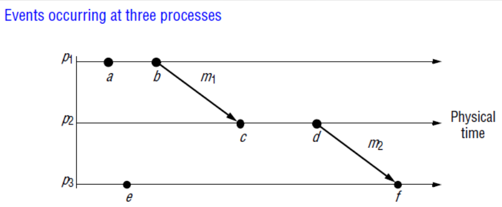

- proc distribuovane algoritmy?
    - zajisteni spolehlivosti v nespolehlivych prostredich
        - atomicky broadcast, distribuovane transakce
    - adaptace na zmeny prostredi
        - elekce, dynamicke routovaci protokoly
    - rizeni paralelnich procesu
        - vzajemne vylouceni, distribuovane rozhodovani (napr pri migraci procesu na jiny uzel viz PPR)

- standardni problemy v distribuovanych systemech
    - selection problem
    - problem elekce 
    - sprava skupiny
    - usporadani udalosti
    - atomicky broadcast
    - souhlas vice procesu pred vykonanim nejake akce
    - vzajemne vylouceni
    - atomicky commit
    - replikace
    - start (napr inicializace vypoctu)
    - terminace (napr ukonci vypoctu, agregace vysledku, ...)
    - deadlock
    - chyby (vypadky uzlu atpd.)

- selection problem
    - identicke procesy / uzly
    - jak automatizovane pridelit ruzne role uzlum stejneho typu?
    - poruseni (rozbiti) symetrie
        - umoznuje zahajit organizovani entit systemu
        - na urovni overlay network
            - napr. leader election
        - pouziti unikatniho ID 
            - sitovy iterface MAC adresa - spodni vrstva
            - nahoda - jak generovat nahodna cisla?

- Leader election
    - mnoho distribuovanych algoritmu vyzacuje jeden proces jako koordinatora (iniciatora)
    - nazalezi na tom jaky proces to je
    - predpoklad: kazdy proces ma unikatni ID
    - existuje nekolik zpusobu jak vybrat koordinatora
        - zahajeni voleb
            - detekce poruch (selhani)
        - ring-based election algoritmus
        - bully algoritmus
        - volby (elekce) v rozsahlych systemech

- ring-based algoritmus
    
    

    - zapojeni do kruhu (ringu) je pouze logicke -> jak ho sestavit?
    - zacatek
        - posli ID procesu sousedu po smeru hodinovych rucicek
    - elekce
        - porovnej a posli dal vetsi ID (`forward[max(ID_1, ID_2)]`)
    - konec
        - proces prijme zpatky sve vlastni ID
        - posle notifikacni zpravu ze byl zvolen jako leader

    

    - co kdyz dojde k preruseni kruhove topologie?
    - predpoklad je ze procesy (uzle) napadaji?

- bully algoritmus
    - podporuje selhavani uzlu (procesu)
    - pouziva timeout k detekci vypadku uzlu
    - nevyzaduje zadnou specialni overlay topologii (narozdil jak tomu je u ring-based algoritmu)
    - procesy maji ID - `k`
    - Time-Out - `T`
    - `P(k)` posle `election` zpravu vsem `P(i > k)`
    - kdyz nikdo neodpovi v ramci `T`, `P(k)` se stava leadrem (vyhrava elekci)
    - pokud nektery z `P(i > k)` odpovi, prima kontrolu a proces `P(k)` se uz o nic dalsiho nestara
        - proces ktery odpovedel opakuje ten samy postup

    

- elekce v rozsahlych systemech
    - az dotedka jsme uvazovali pouze male DS (algoritmy vznikle v 70., 80. letech)
    - v dnesni dobe jsou ale masivne distribuovane systemy
    - vytvareni hirearchickych overlay siti
    - elekce vice nez jednoho leadera

- Super peer slection

    

    - normalni nody by meli mit malou latenci pri pristupu k super peers
    - super peers by mely byt rovnomerne rozdistribuovany napric celou overlay siti
    - male by existovat predem definovana cast (proporce) super peeru vzhledem k celkovemu poctu uzlu v overleay siti
    - kazdy super peer by nemel slouzit ("spravovat") vice nez fixni pocet normalnich uzlu
    - mozne reseni problemu:
        - pouziti hierarchickych ID jedotlivych procesu
        - "super peer mask" = `11110000`
        - super pear: `ID & 11110000` 
        - modulo N-1; N-ty node se stane super peerem

- sprava skupiny
    - komunikace skupiny, multicast
    - kdo jsou clenove?
        - dynamicky se menici skupiny
    - Enter / Leave danou skupinu
    - vyzadovano spolehlivymi multicasty

- Usporadani udalosti (event ordering)
    - predpoklad: globalni cas / hodiny
    - synchronizace hodin
        - zkresleni lokalnich hodin (napr maly posun, nepresnost)
        - preposilani zprav
        - latence (zpozdeni) v siti
        - jaka je maximalni presnost hodin ktere lze dosahnout?
    - Cristian’s algorithm
        - fyzicka synchronizace hodin
        - Time server s hodinami s velikou presnosti
        - klienti posilaji pozadavky za ucelem zmereni RTT (round-trip time)
        - `T(client) = T(server) + RTT / 2`
        - prenost zalezi na promenne latenci v siti
    - logicky cas (Lamport)
        - hlavni myslenka: na usporadani udalosti nepotrebujeme znat absolutni cas
        - `happend-before` relace => kauzalni usporadani (pricina -> nasledek = kauzalni)
        - implementace
            - skalarni, vektor, matice
        - lokalni udalosti
        - comunikacni udalosti
        - tranzitivita

        

- atomicky broadcast
    - take znamy jako Total Order Broadcast
    - vsechny spravne pracujici uzle prijmou stejnou zpravu ve stejnym poradi
    - "atomicky" znamena:
        - but: dokonci se koreknce na vsech uzlech (ucastnicich)
        - nebo: abot na vsech ucastnicich (bez vedlejcich nasledku)
    - ekvivaltni k distribuovanemu souhlasu (spoluprace vice uzlu)
    - implementace
        - Chandra-Toueg algorithm
        - ZAB (Zookeeper Atomic Broadcast protocol)
    - aplikace:
        - replikace data
        - zakladni stavebni blok mnoha distribuovanych aplikaci

- distribuovany souhlas (agreement)
    - jde o ucinovani rozhodnuti v nespolehlivem prostredi
    - az do ted jsem uvazovali pouze nespolehlivou sit
    - co kdyz ale budou poruchove procesy (posilani nevalidnich zprav)
        - viz napr prepnuti bitu (alpha castice); komunikace jako takova funguje
    - viz byzansky problem (PPR)

- atomicky commit
    - distribuovane "all-or-nothing" operace
    - distribuovane transakce
    - doufazovy / trifazovy commit

- vzajemne vylouceni
    - operace update nad sdilenymi zdroji (daty)
    - chceme se vyhnout korupci dat
    - muze vest k dead locku

- replikace dat
    - prezentovani jako posledni problem protoze:
        - je nad vsemi jiz zminenymi problemu (spoleha na jejich spravnou funkci)
    - proc replikace?
        - chceme dosahnout spolehlivosti a dostupnosti
    - vyzaduje
        - spravu skupiny (minimalni pocet spravne pracujicich nodu)
        - elekce leadera (mastr replika)
        - atomicky broadcast (synchronizace)
            - pro zajisteni konzistence dane repliky potrebujeme:
                - kauzalni usporadani
                - "all-or-nothing" updates