- distributed system model
    - point-to-point komunikace (overlay) sit
    - neorientovany graf 

        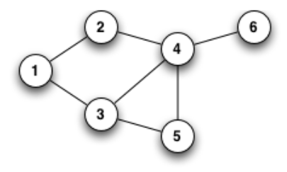

    - distribuovany program
        - slozeny z mnoziny asynchronich procesu
        - procesy nesdileji glabalni pamet a komunikuji vyhradne posilanim zprav (viz MPI)
        - procesy nesdileji globalni hodiny ktere jsou jim instantne pristipny
        - exekuce procesu a preposilani zprav se deje pralelne
        - prepokladame ze kazdy proces bezi na jinem CPU
        - zpozdeni pri posilani zprav je konecne a nepredikovatelne
    
    - distribuovana exekuce
        - exekuce procesu se sklada ze sekvenci exekuce jednotlivych akci
        - akce jsou atomicke; modelovany jako 3 hlavni typy
            - interni udalosti
                - meni stav procesu ve kterem se udalost vyskytla
            - udalosti odesilani zprav
                - meni stav procesu ktery zpravu odeslal a kanalu po kterem byla zprava poslana
            - udalosti prijimani zprav
                - meni stav procesu ktery zpravu prijmul a kanalu po kterem byla zprava prijata
        - udalosti v danem procesu jsou linearni usporadana podle toho jak se vyskytly
        - konvence a notace
            - mnozina `n` asynchronich procesu `(p1, p2, ..., pi, ... pn)`
            - `e_{i}^x` = x-ta udalost v procesu `pi`
            - pro zpravu `m` -> `send(m)`, `receive(m)` = odeslani a prijmuti zpravy
            - `Cij` = kanal mezi procey `pi` a `pj`
            - `mij` = zprava poslana procesm `pi` procesu `pj`

        - evoluce (vyvoj) distribuovane exekuce je znazornena space-time diagramem

        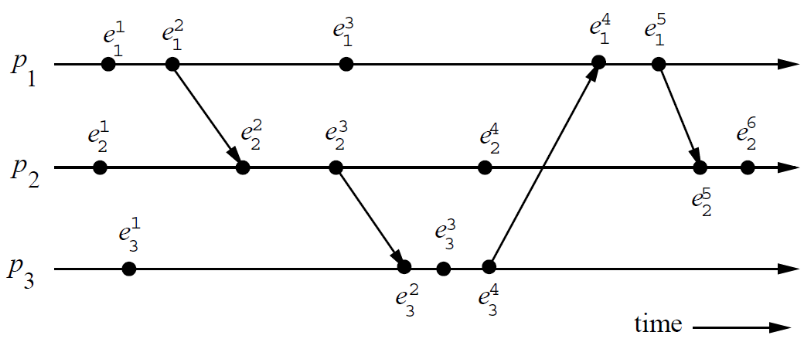

- distribuovane algoritmy
    - pozadavky
        - zivotnost: nenastane deadlock ani vyhladoveni (daneho procesu)
        - konvergence: algoritmus skonci v konecnem case
        - fairness: (vuci procesum) pri alokaci zdroju
        - safety: dana podminka vzdy plati (mutex)
    
    - mereni vykonu
        - slozitost (komplexita) algoritmu
            - vypocetni (casova) slozitost
                - pro kazdy uzel - neni stejna pro asymetricke algoritmy
                - mnostvi vypocetniho casu - `O(n)`, `O(n*long(n))`, ...
            - pametova slozitost
                - pro kazdy uzel - neni stejna pro asymetricke algoritmy
                - mnoztvi pameti vyuzite danym procesem
            - slozitost (komplexita) komunikace
                - celkova; pocet/velikost zprav
                - mnoztvi komunikace mezi uzly potrebne k dokonceni algoritmu
    
    - topologie
        - centralizovanam decentralizovana, token ring, distribuovana

        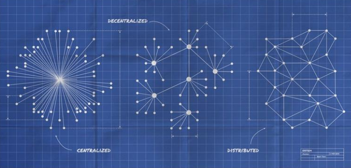

        - centralizovana topologie
            - 1 koordinator
            - N chrannenych zdroju
            - single point of failure & bottleneck
            - elekce koordinatora
            - asymetricke algoritmy

            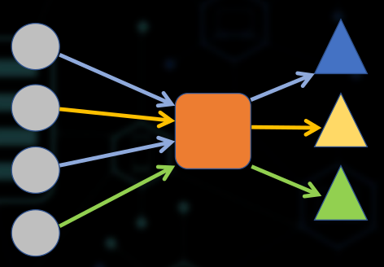

        - decentralizovana topologie
            - N koordinatoru
            - N channenych zdroju
            - koordinator pro kazdy zdroj
            - elekce koordinatora

            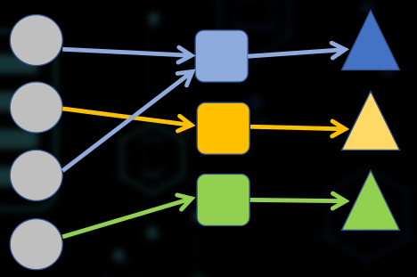

        - token ring
            - logicky kruh
            - jeden token at any given time
            - regenerovani tokenu
            - naruseni tokenu
            - permanentne kolujici token kdyz IDLE

            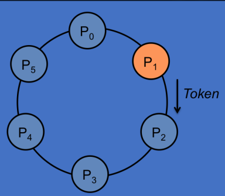

            - prakticke pouziti:
                - na geostacionarnim orbitu - prstenec (ring)
            - podobne token ringu:
                - load balancing
                - DNS Round-Robin
        
        - distribuovana topologie
            - vsechny uzly / procesy si jsou rovny
            - zadny nema specialni roli
            - symetricke algoritmy

    - priklad vzajemneho vylouceni (Mutual Exclusion)
        - centralizovany

            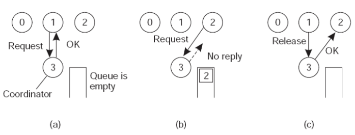

        - decentralizovany
            - stejne jako u centralizovaneho ALE jeden koordinator pro kazdy zdroj
            - charakteristiky vykonosti
                - vypocetni slozitost = `O(1)`
                - pametova slozitost = `O(n)` - fronta, kterou si drzi koordinator
                - komunikacni slozitost = `O(3)` - 3 klientske uzly

        - distribuovane (Lamport)

            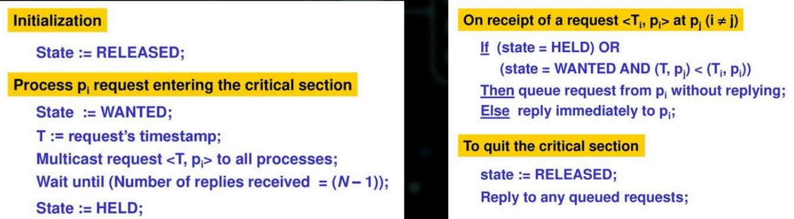

            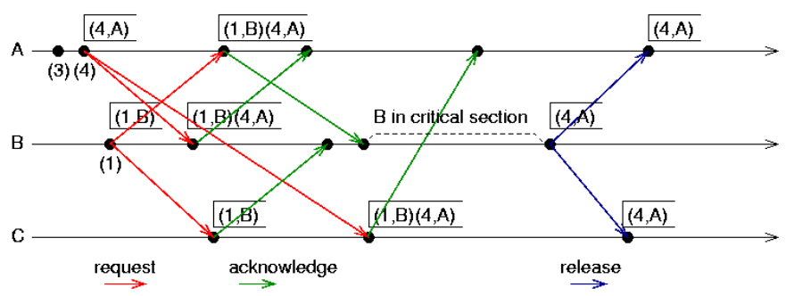

            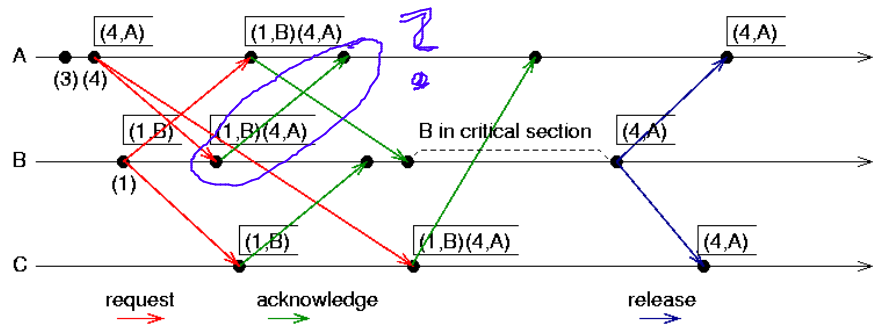

            - charakteristiky vykonosti
                - vypocetni slozitost 
                    - zavisi na implementaci prioritni fronty u jednotlivych nodu
                    - operace ktere se v systemu vyskytuji
                        - posli zpravu - 1
                        - prijmi zpravi = 1
                        - vloz zpravu do fronty (priority queue) = 1
                        - pull_highest (dle priority) = N -> neexistuje lepsi implementace pracujici v case `O(n*log(n))`?
                - pametova slozitost = `O(2n)` - maximalni velikost prioritni fronty
                    - `{ time_stamp, process_ID }`
                - komunikacni slozitost = `O(3*(n-1))`
            
            - velka komunikacni slozitost -> jak ji zredukovat?
                - posilame zbytecne zpravy i tem uzlum ktere o pristup ke zdroji vubec nemaji zajem
                - Maekawa
                    - hlavni myslenka: ne vsechny procesy musi byt zucastnene
                    - mensi skupiny procesu

                        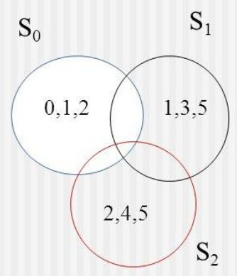

                        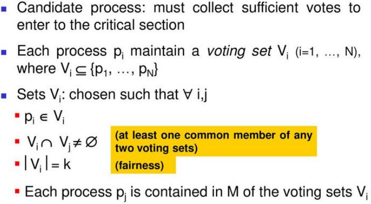
    
    - Graph-oriented vs Diffusion
        - priklad: distribuovana detekce deadlocku
        - grafove orientovane
            - vytvoreni
                - orientovany graf
                - resource allocation graf
                - wait-for-graf

            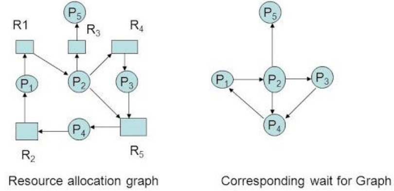

            - moznosti implementace
                - monitor (but jeden dedikovany proces nebo vsechny procesy)
            - resource intensive
                - CPU, pamet
            - Communication network model
                - muze byt spatny (nepresny) kvuli paralelismu a komunikacnimu zpozdeni
        - Diffusion based
            - zadna potreba vytvorit model
            - "pronasledovani hran"
                - proces posle token ve "wait-for" smeru (na koho ceka az zdroj uvolni)
                - kazdy uzel udela to same
                    - token muze byt prenasoben pokud proces ceka na vice zdroju
                - pokud token dojde znova k tomu samemu procesu => cyklus (deadlock)
            - vypocetni slozitost - CPU
            - komunikacni slozitost - pocet zprav & velikost
            - pametove narocne