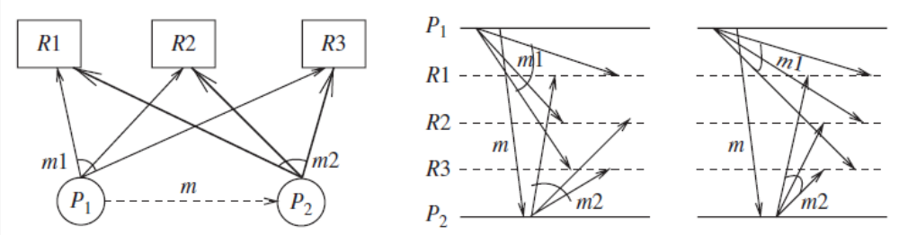
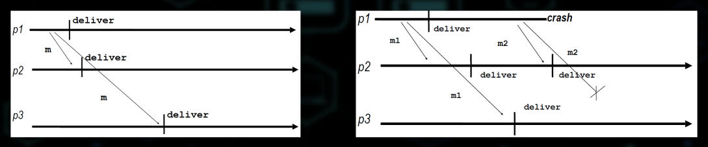
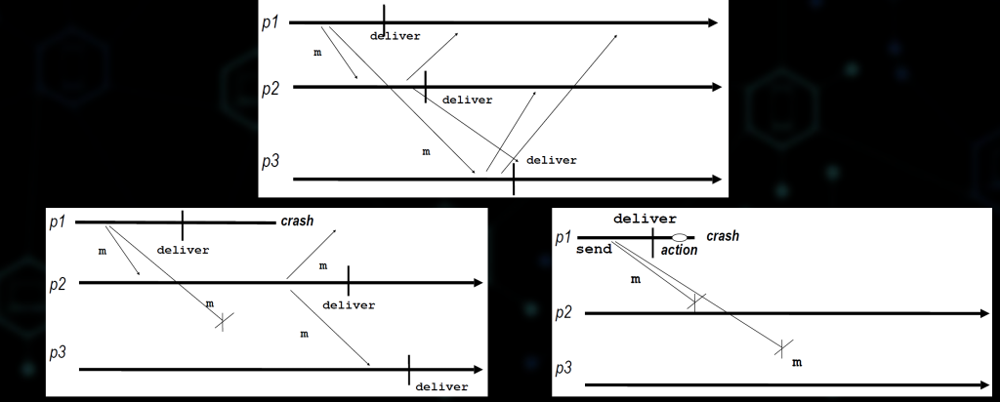
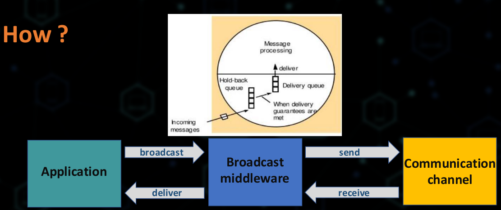
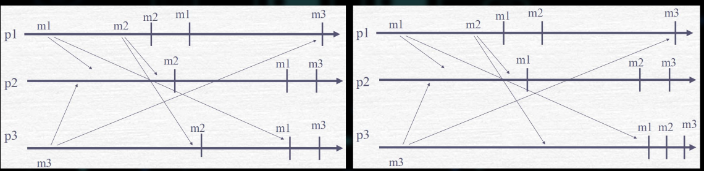
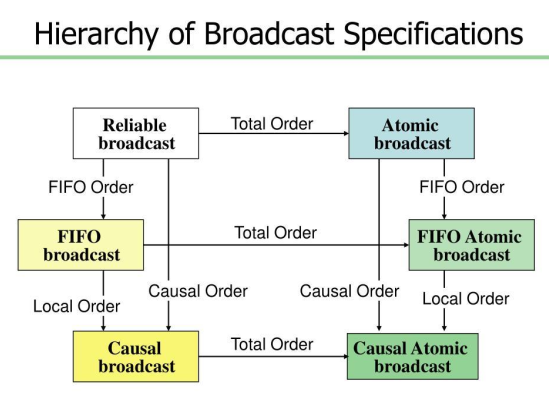
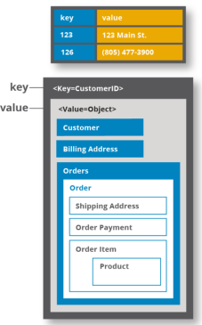
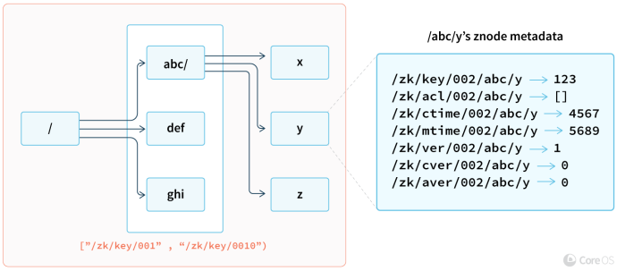

- spolehliva komunice ve skupine
    - proc?
        - vsechny nody ve skupine / clusteru prijmou stejnou informaci (fault tolerant, replikace sluzby nebo dat)
        - vsechny nody mohou vyzadova prijeti zprav ve stejnem poradi
            - zachovani konzistence dane repliky
        - poslani zpravy cele skupine znamena:
            - vsichni nebo nikdo neprijme zpravu
            - v jakem poradi se bude zprava prijimat? Kdo ji prijme prvni atd?
            - co kdyz se nejaky process pripoji / odpoji od skupiny

        - update tri objektu (replik) je preoveden dvema procesy

            

        - problemy:
            - process selze / spadne
            - nespolehliva sit
                - zprava je ztracena / corrupted
                - zprava je zdiplikovana
                - Neexistuje zadne FIFO usporadani -> nahodne poradi zprav

    - jak?
        - zacneme s best-effort a prechazime ke spolehlivemu vysilani (broadcast)

            
    
    - vysilaci (broadcast) a prijimaci (deliver) primitiva
        - kterykoli proces ve skupine muze vysilat
        - zadne duplikovani zprav (zadna zprava neni dorucena vice nez jednou)
        - zadne vytvareni zprav (zadna zprava neni dorucena drive nez je odeslana)

    - Best-effort broadcast (vysilani)
        - pokud `pi` a `pj` pracuji spravne, potom kazda zprava vyslana procesem `pi` bude nakonec dorucena procesu `pj`

        

    - Reliable broadcast
        - shoda na tom co je to spolohlivost
        - pokud jeden spravne pracujici proces vysle zpravu `m` potom ji kazdy spravne pracujici proces nakonec prijme
        - pokud `pi` a `pj` pracuji spravne, potom kazda zprava vyslana procesem `pi` bude nakonec dorucena procesu `pj`
        - jednoduchy algoritmus:
            - `p` posle `m` vsem ostatnim procesum vcetne jemu samotnemu
            - kazdy proces ktery obdrzi zpravu `m` poprve ji posle vsem ostatnim procesum, krom toho ktery mu ji poslal (sender)

            

        - fault tolerance?
            - kolik moznych chyb (vypadku) jsme schopni tolerovat?
        - komunikacni slozitost
            - kolik zprav je potreba k vysladni jednoho broadcastu?

    - Uniform Reliable broadcast
        - shoda (agreement)
        - pokud spravne pracujici (nebo ne) proces doruci zpravu `m`, pote kazdy spravne pracujici proces doruci zpravu `m`
        - algoritmus?
            - nemuzeme zabranit vypadnum jednotlivych procesu
            - nicmene muzeme zajistit za kazdy prijme zpravu jeste prednim nez vubec pomysli na dorucovani 
            - procesy potrebuji ACK od kazdeho procesu pred tim nez zpravu doruci
            - neni mozne implementovat v asynchronich systemech
                - ACKs jsou protreba, co kdyz je ACK ztracen?
            - je potreba detektor chyby
    
    - usporadany broadcast (vysilani)
        - konkurencni (paralelni) aktivity potrebuji byt vnimane vsemi procesy ve stejnem poradi
            - oparace nad sdilenymi zdroji / datovymi struktury
            - zachovani poradi operaci (nekumulativni)
            - kauzalni zavislosti (vztahy)
        - FIFO - zpravu od stejneho procesu jsou doruceny v in order broadcastu
        - Causual Order (kauzalni usporadani) - zpravy broadcast jsou roduceny az po zpravach ktere je kauzalni ovlivnuji
        - Total order - procesy dorucuji zpravy ve stejnem poradi

        

        - FIFO
            - pokud proces odesle zpravu `m1` pred zpravou `m2`, potom zadny spravne pracujici proces nedoruci `m2` pred `m1`

        - Causal Order
            - udalost `a` kauzalne predchazi udalosti `b`
                - `a -> b`
            - proces vykonal oboje `a` i `b` a to v tomto poradi - local order
            - `a = broadcast(m)`, `b = delivery(m)`  - causal order
            - existuje udalost `c` takova ze `a -> c` a `c -> b` - tranzitivita

        - Total order
            - pokud proces odesle (broadcast) zpravu `m1` pred zpravou `m2` potom zadny spravne pracujici proces nedoruci zpravu `m2` pred zpravou `m1`
            - pri pouziti Total order, procesy musi dorucit vsechny zpravy podle stejneho usporadi (usporadani je ted celkove - total)
            - nemusi respektovat kauzalitu (nebo dokonce i FIFO usporadani); ale muze byt vytvoren tak aby je respektoval

            

            

- aplikace spolehlive komunikace ve skupine
    - distribuovany souhlas
        - fundamentalni problem; chceme dosahnout spolehlivosti za pritomnosti nekolika selhavajicich procesu (uzlu)
        - vyzaduje shodu vetsiny procesu
        - klasickym prikladem je napriklad shoda commitu v databazovych systemech
            - procesy se rozhoduji jestli udelat commit nebo abort
        - mnoha forem koordinace vyzacuje aby si procesy vymenovaly informace aby se spolu shodly a domluvily se na spolecnem vysledku (pred provedenim samotne akce)
        - zakladni aplikace
            - distribuovany key-value store
            - zakladni kamen vetsiny modernich distribuovanych aplikaci
            - opakujici se ukoly 
                - flat structure

                    

                    - Apache Ignite: distribuovana databaze
                    - Hazelcast: in-memory data grid

                - hiearchicka struktura

                    

                    - Apache Zookeeper

            - generalizace ukolu
                - distribuovana sluzba
                - proc? dostupnost, fault tolerance, spolehlivost
                - vyresit a implementovat distribuovanou shodu jednou a pote ji jen aplikovat na jakoukoliv datovou strukturu (napad / prani)
                - distribuovana shoda nad ADT
                    - Abstract Data Type
                    - Data / State + Operace => stavovy automat
                    - replikace stavoveho automatu
                        - mnozina stavu, vstupu a vustupu
                        - prechodova funkce (`stav x input -> stav`)
                        - vystupni funkce (`stav x input -> vystup`)
                        - odliseny stav nazyvany start
                    - implementace fault-tolerant sluzby v podobe stavoveho automatu
                        - kopie stavoveho automatu bezi na vicero nezavislych serverech
                        - prijimaji pozadavku od klienta je interpretovano jako vstupu do stavoveho automatu
                        - vybrani poradi (usporadani) vstupu
                        - exekuce (zpracovani) vstupu ve vybranem poradi na kazdem serveru
                        - opoved uzivateli - vystup ze stavoveho automatu
                        - sledovani rozdilu ve stavu nebo vystupu jednotlivych replik

        - PAXOS
            - skupina protokolu pro reseni distribuovane shody v siti nespolehlivych nebo selhavajicich procesoru
            - velmi komplexi
            - tezke na pochopeni => tezke na implementaci

        - RAFT
            - algoritmus distribuovane shody
            - navrzeny na jedoduche pochopeni
            - ekvivalent k PAXOS z pohledu vykonu a toho ze je fault-tolerant
            - rozdil je v tom ze je rozdelen do pomerne nezavislych podproblemu
            - dekompozice RAFTu
                - leader election
                    - vyber jednoho uzlu = master
                    - detekce poruch, volba noveho mastra
                - replikace logu (normalni operace)
                    - leader prijima prikazy od klientu
                    - pridava je do sveho logu
                    - master replikuje log na ostatni servery
                    - prepise nekonzistentnost
                - bezpecnost
                    - udrzuje logy v konzistentnim stavu
                    - pouze servery (nody) ktere maji up-to-date logy se mohou stat leadery
                - normal operation
                    - klient posila prikazy leaderu
                    - leader prida prikazy do sveho logu
                    - leader posle Append Entries RPCs (remote procedure call) vsem followerum
                    - pote co je novy zaznam (operace) commitnuta
                        - leader provedou prikaz ve svem stavovem automatu a vrati vysledek klientovi
                        - leader notifikuje followers o tom ze provedl commit (posle to jako Append Entrier RPCs)
                        - Followers provedou prikaz ve svem lokalnim stavovem automatu
                    - neaktivni / pomaly follower?
                        - leader opakuje odesilani Append Entries RPCs dokud neuspeje
                    - optimalni vykon v beznych pripadech
                        - jeden uspesny RPC odeslany jakemukoliv z hlavnich serveru

                - vizualizace
                    - https://raft.github.io/
                    - http://thesecretlivesofdata.com/raft/