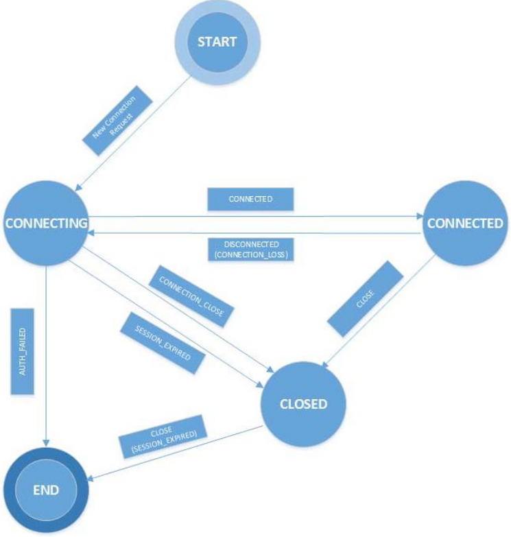

- Apache Zookeeper
    - se Zookeeper muzou vyvojari implementovat bezne distribuovane koordinacni ulohy:
        - sprava konfiguraci
        - naming services (DNS?)
        - distribuovana sychnronizace (zamky a bariery)
        - sprava clenstvi v clusteru (detekto toho ze se node pridal do skupiny nebo ji opustil)
    - puvodne vyvyjno v Yahoo
    - pozivano
        - Netflix
        - Twitter
        - Facebook
        - Apache Kafka (Linkedin)
    - v podstate se jedna o sluzbu pro distribuovane systemy
    - poskytuje key-value uloziste, ktere je pouzito jako poskytovani distribuovane konfiguracni sluzby
    - synchronizacni sluzby
    - naming registry pro rozsahle DS
    
    - data model
        - Zokeeper dovoluje distribuovanym procesum spolupracovat mezi sebou zkrze sdileny hirearchicky namespace (data registers)
            - vypada podobne jako UNIX file system
        - data registers = znodes v Zookeeperu s maximalni velikosti dat 1MB
        - lomitko "/" oddeluje cesty
        - cesty musi byt absolutni
            - unicode znaky
            - neni dovoleno pouzivat jako nazev "Zookeeper", "." a relativni cesty

            
    
        - persistentni znodes
            - existuji dokud nejsou vymazany (API call)
        - pomijive znodes
            - smazane Zookeeperem kdyz klient ztrati session
            - nemuzou mit zadne potomky
        - sekvencni znodes
            - kazdy persistentni a pojivy znode muze byt sekvencni
            - 10 cifer (sekvencni cislo), padding 0
                - napr. `/path/to/znode0000000001`

    - Zookeeper API

        

    - Zookeepr Watches
        - klint dostava notifikace kdyz se na uzlu / skupine uzlu neco zmeni
        - API: predani "notification handler" spolu s cestou k danemu uzlu
            - `getChildren(‘/app/mycluster’, change_handler)`

        

    - ZooKeeper Architecture
        
        

    - ZooKeeper ACLs
        - Access Control Lists - ACLs
        - spojene s kazdym nodem
        - prava

        

        - built-in ACL schemata

        

    - ZooKeeper vnitrni fungovani
        - Read requests: jsou zpracovany lokalne v ZooKeeper serveru ke kteremu je klient aktualne pripojeny
        - Write requests: jsou proposlany leaderovi a musi se provest souhlas vetsiny predtim nez je generovana odpoved

        

        - klient session je udrzovana (kontrolovana) pomoci "heartbeat"
        - tento heartbeat je posilan automaticky z klienta pomoci knihovny
        - prepojeni na jiny ZooKeeper server je vetsinou udelano na pozadi automaticky (pomoci knihovny)
        - jakmile se klient pripoji na jiny server ze stejne skupiny, existujici session a pomijive znody vytvorene danym klientem zustavaji validni
        - pro jednu session udrzovanou mezi klientem a server ZooKeeper zarucuje usporadani (vetsinou FIFO zprav)
        - pri probihajicim pokusu o pripojeni na jiny ZooKeeper server, aplikace prijme notifika o disconnections a connections od/k dane sluzbe
            - watch notifikace nejsou klientu posilany behem teto faze
            - nicmene vsechny cekajici notifika udalosti jsou odeslane jakimile se klient ke sluzbe znovu pripoji
        - behem opetovneho pripojovani se take neprovadeji zadne klientske akce (operace selzou) -> nutne zpracovat (objasnit si) zcenare ztraty pripojeni pri vyvoji aplikaci se ZooKeeperem
        - ZooKeeper poskytuje mnozinu zaruk z hlediska datoveho modelu a watch infrastruktury ktera je nad nim postavena
            - umoznuje rychle a skalovatelne vytvareni jinych distribuovanych koordinacnich primitiv
        - ZooKeeper garantuje
            - Sekvencni konzistency (Sequential consistency)
                - zaruceni ze zmeny ktere klient udela jsou aplikovany ve FIFO usporadani
            - atomicita
                - updaty bud uspeji nebo selzou (neexistuje zadny castecny)
                - ZAB (ZooKeeper Atomic Broadcast)
            - single system image
                - klient vidi porad stejny view ZooKeepera sluzby bez ohledu na to k jakemu serveru ve skupine (clusteru) je prave pripojen
            - spolehlivost
                - updaty jsou zachovany jakmile jsou provedeny
                - dokud tedy nejsou prepsany jinym klientem
            - aktualnost
                - klient ma zaruceno ze je system up-to-date vramci urciteho casoveho useku aka eventual consistency
    
    - ZooKeeper Ensemble
        - klastr uzlu (stroju) 
        - quorum mode = minimalni # nodu ktery musi fungovat tak aby cely system fungoval
            - druhy mode je standalone mode = jedina entita co pracuje nezavisle od zbytku DS
        - ZooKeeper bezi v replikovanym modu

    - ZooKeeper Quorum
        - Majority rule: `QN = (N + 1) / 2`
        - `QN` = minimalni pocet uzlu v quorum
        - `N` = celkovy pocet serveru (melo by to byt liche cislo)
        - priklad: pokud mame 5 serveru -> QN = 3

    - ZooKeeper Leader Election
        - elekce (faze 1)
            - LOOKING
            - LEADING / FOLLOWING
        - pokud selze posledni uzel co vytvari vetsinu
            - celkove selhani systemu (quorum)
            - uzavreni portu (kam se klienti pripojuji)
            - WAITING mode

    - ZooKeeper Atomic Broadcast
        - ZAB (faze 2)
        - podobny jako dvoufazovy commit protokol

        

        

    - pripojeni s autentikacnimi udaji
        - `KazooClient(hosts=HOSTS, auth_data=[("digest", "user:pass")])`

    - ZooKeeper v praxi
        - vytvareni beznych distribuovanych uloh
            - bariera / double bariera
            - fronta
            - lock
            - leader election
            - sprava skupiny
            - dvoufazovy commit
            - service directory

    - ZooKeeper aplikace

        