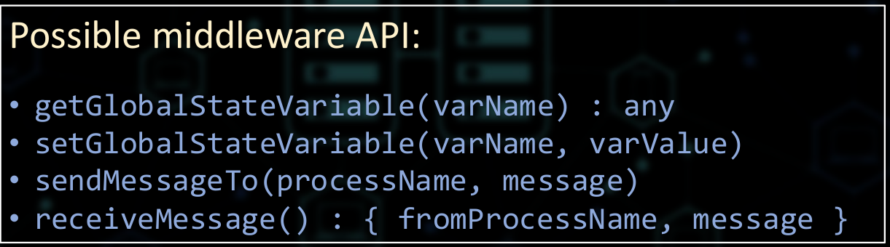

- Debuggovani distribuovanych systemu
    - Monitoring = health check
    - Observability = debugging
    - fyzicky vs logicky cas

        

    - total vs castecne (kauzalni) usporadani
    - logicka casova razitka
    - implementace logickeho casu
        
        

        - viz PPR
            - dovoluje castecne usporadani udalosti
            1) pred vykonani udalost (napr odeslani, doruceni zpravy nebo nejaka interni udalost); `pi` inkrementuje `ci <- ci + 1`
            2) kdyz proces `pi` posle zpravu `m` procesu `pj`, posle ji spolu s casovym razitkem (timestamp) `ts(m) = ci`
            3) Pote co je zprava `m` prijata procesem `pj`, proces (middleware) `pj` upravi svuj lokalni cas jako `cj <- max(cj, ts(m))`, az pote je zprava dorucena dane aplikaci

        - globalni stav distribuovane aplikace 
            - globalni promenne
            - zpravy ktere jsou prave preposilany

        - co je povazovano za udalost?
            - odesilani zpravy
            - doruceni zpravy
            - zmena hodnoty globalni promenne

            

    - vektorove hodiny
        
        - detekce poruseni kauzality udalosti v distribuovanem systemu

        

        - pozorovani (observing) globalnich stavu, ne globalniho casu

        

        - zistkani snapchotu globalniho stavu
            - Chandy & Lamport snapshot algoritmus

                

                

                - vsimneme si ze stavy `S30` a `S21` nemuzou byt kauzalne usporadany -> jsou neporovnatelne
                - mohly se vykonat v libovolnem poradi
                - zpusobuje expanzi mrizky globalnich stavu
                - muzeme vypocitat timestamp spolecne (pricinne) predchozi udalosti / stavu:
                    - mejme `Sa(i=3,j=0)` a `Sb(i=2,j=1)`
                    - `S_prev(min(Sa(i), Sb(i)), min(Sa(j), Sb(j)))`
                    - `S_prev=(2,0)`
                    - zkusme to same pro `S31 a S23`

    - stabilni predikce
        - deadlock
        - terminace
        - => mohou byt jednoduse detekovane vzorkovanim stavu distribuovaneho systemu
            - musime definovat vzorkovaci frekvenci
            - musime definovat distribuovany stav
    - nestabilny predikce
        - skupina replik nema mastra
            - muze byt pouze docasny stav
            - samplovani neni aplikovatelne (muze se zmenit mezi posobejdoucimi vzorky -> neda se detekovat)
    - Possibly(ɸ)
        - vyhodnoti se jako `true` pouze pro nektere cesty v mrizce globalnich stavu
    - Definitely(ɸ)
        - vyhodnoti se jako `true` pro vsehny cesty v mrizce globalnich stavu

        
    
    - Heisenbug: bug ktery zmizi nebo se zmeni jeho chovani kdyz nim nekdo zacne zabyvat

    - Possibly((y-x=2))
        - Posle debug zpravu procesu `p1` po `E21`
        - casovani se zmeni - `P1` je vice zaneprazdnen -> `E22` nastane pred `E31`
        - tim patem jde cesta exekuce pokazde pres `E22`
        - bug zmizi `y-x = 4-4 = 0` 

    - Nestabilni predikce by nemela byt tak tezka!
        - vysvetleni hlavni myslenky
            - co takhle pouzit vektorova casova razitka a pridat je k udalostem a zpravam?
            - pokazde kdyz se vektor timestampu procesu `pi` zmeni, posle svuj recorded stav (snapshot) monitorovacimu procesu
            - monitorovaci proces pouzije vektor timestampu pro k usporadani udalosti a vytvoreni mrizky globalnich stavu
            - pote je monitorovaci procs schopny vyhodnotit predikaty nad globalnimy stavy (poze pruchodem orientovaneho grafu)
        - ale v praxi
            - pocet procesu je casto > 2
            - kombinatoricka exploze v prostoru globalnich stavu
            - pocet procesu se muze meni (skalovani)

            
    
    - existuje hodne debugovacich nastroju
        - napr wireshark
        - deugger v IDE
        - debug logy z weboveho serveru

    - existuje hodne monitorovacich nastroju
        - health-check systemy

    - architektury jsou mnohdy velice komplexni

        

    - problemy pri debuggovani a monitorovani
        - redundance (napr repliky databaze)
        - automaticke skalovani
        - => debuggovani se stava neresitelnym problemem
        - reseni
            - soustredit se na to co je opravdu dulezite
            - vlakna
            - trackovani user sessions a udalosti

                
            
            - v distrubuovanych systemech se jiz na dale nezajimame o zdravi / spravnost celeho systemu jakozto o health / spravnost jednotlivych udalosti
                - to pres jake servery dana udalost jde je defakto jedno

    - sledovani udalosti co dela uzivatel

        

    - agregace logu a jejich analyza

        

    - 4 pilire observability (debuggovani)
        - monitoring
        - alertovani / vizualizace
        - trasovaci infrastruktura
            - event tracers
            - heat maps
        - agreagace a analyza logu

    - pouziti strojoveho uceny pro autodetekci
        - chyb a podezrelych akci