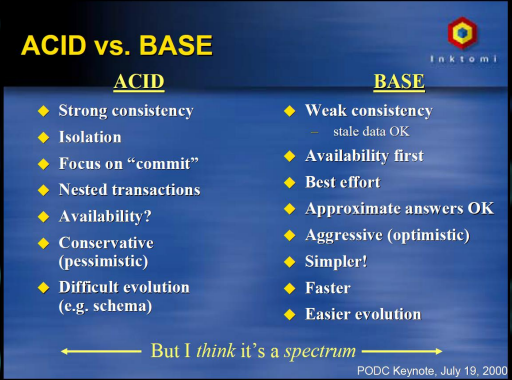
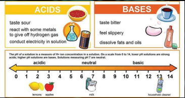
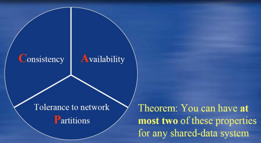
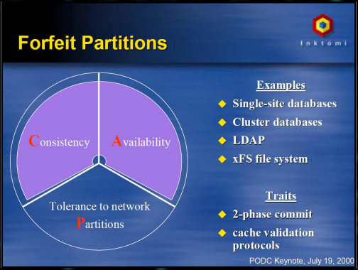
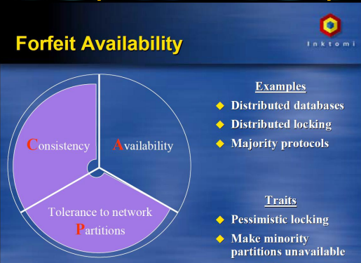
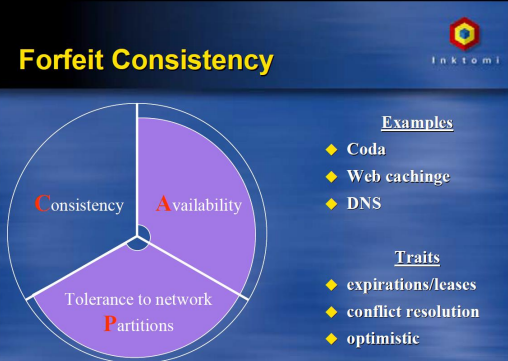
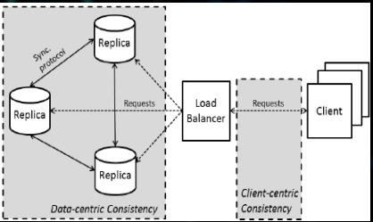
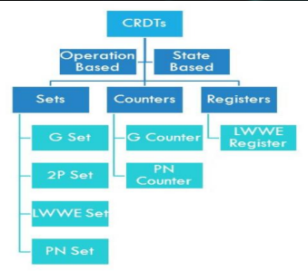

Konzistence v distribuovaných systémech I.
- ACID - dbají administrátoři db
  - Atomicita (Atomicity) - všechny operace proběhnou nebo žádná
  - Konzistence (Consistency) - vše OK před i po operaci
  - Izolace (Isolation) - souběžné operace se neovlivní
  - Odolnost (Durability) - fault tolerant
- BASE - dbají lidé kteří vyvýjí DS
  - Basically Available
    - Systém většinu času pracuje
  - Soft-State
    - úložiště nemusí být konzistentní se zápisem
    - repliky musí být vzájemně konzistentní po celou dobu
  - Eventual Consistency
    - Úložiště vykazují konzistenci v určitém pozdějším okamžiku (lazily at read time)
- ACID vs BASE

    
  
- Dvě spektra
  - ACID - databázový systém striktní/pesimistický
  - BASE - distribuovaný systém soft/optimistický

    
  
- CAP teorém (Eric Brewer 1998)
  - v DS designu se musí vybrat max 2 ze 3 záruk
  - zaručení 3 je nemožné
  - prokázáno jako teorém 2002 Gilbert & Lynch

    
  
    
    
    
    
    
  
- Konzistentní modely
  - smlouva mezi procesy a úložištěm
  - říká že pokud procesy souhlasí s dodržováním určitých pravidel, pak úložiště slíbí že bude fungovat správně
  - proces který provádí operaci čtení datové položky, obvykle očekává že operace vrátí hodnotu, která ukazuje na výsledky poslední operace zápisu na tato data
- Problémy
  - Synchronizace replik
  - Tolerance chyb/překážek (fault/partition tolerance)
  - čím přísnější model konzistence tím více komunikace/synchronizace => tím pomalejší systém
- Řešení
  - Kompromisy - "chci to všechno" vs "Jsem s tím OK"
  - Odkládání problémy / být optimista - "To se většinou nestává"
  - Zaměření na skutečně relevantní věci - "Našim společný cílem je.."
- Konzistetní modely
  - Data centrický (soustředěný)
    - perspektiva úložiště dat
  - Klient centrický (orientace na klienta)
    - pohled klienta

    
  
- Data centric konzistentní modely
  - striktní model konzistence
    - nejsilnějí konzistentní model
    - Vyžaduje trvalou globální synchronizaci
    - Provádí se pomocí absolutního globálního času
    - Repliky musí být synchronizovány globálně a neustále
    - Do jisté míry nemožné
    - je velmi nákladný
    - systém nemusí být vždy globálně synchronizován
  - Sekvenční model konzistence
    - L. Lamport (1979)
    - jednoduší varianta striktního modelu
    - Zaměření na operace zápisu
    - Všechny procesy musí vidět zápisy ve stejném pořadí
    - Čas je logický, nikoli globální
  - Model linearizovatelnosti
  - Model kauzální konzistence
    - 1990
    - zaměření jen na související zápisy
    - Vztah příčina - důsledek
    - Všechny procesy vidí tyto související operace ve stejném pořadí
  - Model konzistence FIFO
  - slabý model konzistence (S)
  - Konzistence uvolnění (S)
  - Lazy release konzistence (S)
  - Konzistence vstupů (S)
  - (S) synchronizace vstupuje do hry
- Client centric konzistetní modely
  - Eventuálně konzistentní
    - Klienti nevidí všechny změny okamžitě
    - Po operacích zápisu vidí všechny procesy stejná data v daném Δt
    - DNS, Amazon Dynamo DB
  - Monotónně konzistentně čtení
  - Monotónně konzistence zápisu
  - Konzistence čtení a zápisu
  - Konzistence zápisu po čtení
- Bezkonfliktní replikované datové typy (CRDT)
  - Microsoft Research 2011 (Cambridge UK)
  - myšlenka: Návrh datových typů zabraňující nekonzistenci pomocí jejich charakteru/podstaty
  - poskytuje způsob jak vždy sloužit souběžné modifikace v libovolném pořadí
  - podobný přístup jako funkční programování
  - Funkční programování je proces vytváření softwaru skládáním čistých funkcí, vyhýbá se sdílenému stavu, proměnlivým datům a vedlejším efektům
  - lze využít v distribuovaných výpočtech ke sdílení dat mezi uzly
  - datová struktura se specifickými vlastnostmi
  - každý uzel soukromou kopii CRTD (repliku), kterou lokálně modifikuje bez mutnosti okamžité synchronizace
  - pokud jsou dvě repliky propojeny mohou se synchronizovat automaticky na pozadí
  - Za tímto účelem jsou CRDT navrženy tak, aby nikdy nemohlo dojít ke konfliktu mezi souběžnými aktualizacemi.
  - G-Set (Grow-Only Set)
    - množina do které lze pouze přidávat ale nikdy odebírat
    - nejjednodušší CRDT
    - synchronizace dvou G-Set se provádí sjednocením obou množin
  - G-Counter (Increment-Only Counter)
    - celočíselný čítač který lze jen inkrementovat
    - metody jen pro inkrementaci a získání současné hodnoty
  - PN-counter
    - celočíselný čítač
    - může se dekrementovat a inkrementovat
    - při synchronizaci honota konverguje směrem k součtu všech inkrementů mínus součet všech dekrementů
  - LWW-Register (Last-Writer-Wins Register)
    - uchovává jeden objekt
    - metody get a set (čtení a zápis)
    - poslední volání set-call nahradí předchozí volání
    - trackuje čas pomocí VectorClock
    - pokud nastanou dvě aktualizace současně v odpojených replikách, bude mít přednost ta z úložiště s menším Id
  - MV-Register (Multi-Value)
    - další implementace registru
    - strategie last-writer-wins - tak se vyhne ztrátě dat
    - pokud se hodnota MV-Registeru změní současně, zachová všechny hodnoty
    - proto je výsledkem metody get()-metoda kolekce
  - OR-Set (Observed-Remove Set)
    - přibližuje se očekávanému chování množiny
    - myšlenka: z repliky lze odstranit pouze prvky, jejichž operace add je viditelná pro repliku
    - tedy pokud je např. prvek přidán do jedné repliky a zároveň odstraněn z druhé, nesynchronizované repliky, je stále obsažen v OR-Set protože operace add nebyla viditelná pro druhou repliku
  - RGA - Replicated Growable Array
    - podobný List
    - prvky mají pořadí a lze přidávat a odebírat prvky na určitých pozicích
  - Přehled

    
  