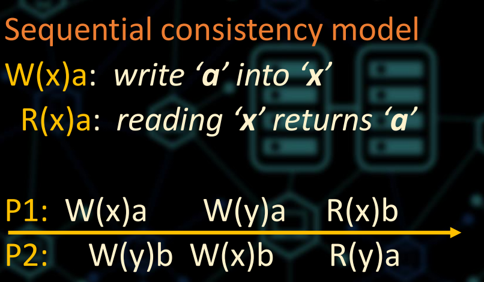
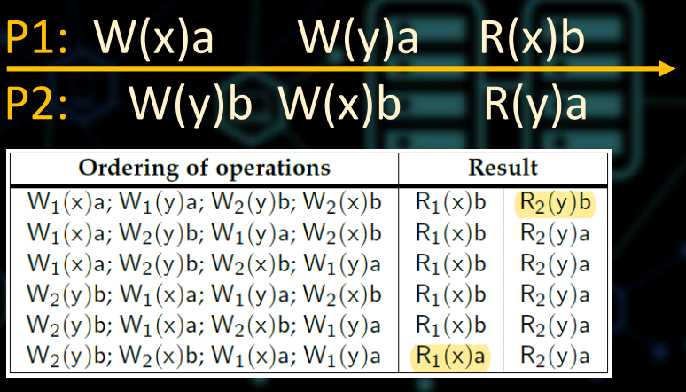
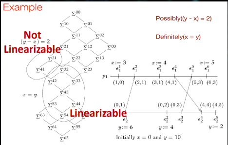
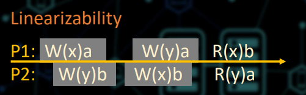
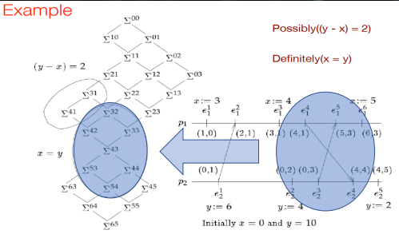
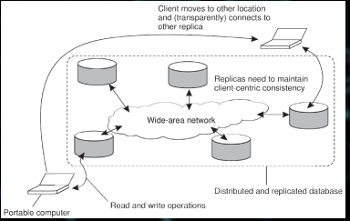

- Konzistelce v distribuovaných systémech II.
  - Sekvenční konzistentní model
     
    
    
    
  
  - není kompoziční
  - datové položky se udržují v konzistentní posloupnosti
  - ale jejich složení/kompozice jako množiny není konzistentní
  - jak jsou pojmy kompoziční a nekompoziční souvisí s distribuovaným laděním?
  - podívejte se na nestabilní predikáty:
    - Pravděpodobně(ɸ) (possibly)
      - Vyhodnotí se jako true pouze na některých cestách v mřížce globálních stavů
    - Definitivně(ɸ) (definetely)
      - Vyhodnotí se jako true na všech možných cestách v mřížce globálních stavů

      
  
  - Linearizovatelnost (Linearizability)
    - lze tím vyřešit problém nekompoziční konzistence
    - každá operace by se měla jevit jako účinná okamžitě po nějakém čase mezi začátkem a dokončením

      
  
    - Zastíněná oblast označuje čas, kdy se operace se provádí
    - zahrnuje propagaci do ostatních datových úložišť
    - propagace zápisu do jiných úložišť zahrnuje komunikaci mezi procesy
    - komunikace mezi procesy způsobuje kolaps mřížky globálních stavů

      

  - Kauzální model konzistence
    - 1990
    - zaměření jen na související zápisy
    - Vztah příčina - důsledek
    - Všechny procesy vidí tyto související operace ve stejném pořadí
  - Klientsky centrické konzistentní modely

      
  
    - monotónně čtecí konzistence
      - pokud proces přečte hodnotu datové položky x, každé následující čtení x vrátí stejnou hodnotu nebo nejnovější hodnotu
      - jakmile proces uvidí hodnotu x -> nikdy neuvidí starší verzi x
      - ve všech datových úložištích (replikách)
    - monotónně zapisovací konzistence
      - operace write procedená procesem nad datovou položkou x je dokončena před každou následující operací write na x stejným procesem
      - write na kopii položky x se provede jen pokud tato kopie byla aktualizována pomocí předchozích operací zápisu stejným procesem, které mohli proběhnout na jiných kopiích položky x.
      - pokud je potřeba musí nový zápis počkat na dokončení starých operací
    - konzistence čtení a zápisu
      - Vliv operace zápisu provedené procesem na x se projeví vždyc v následujícícm procesu čtení na x stejným procesem
      - jinými slovy operace zápisu je vždy dokončena před další operací čtení, bez ohledu na to kde se operace čtení provádí 
    - zápis navazující čtení konzistence
      - operace zápisu procesu nad datovou položkou x po předchozí operaci čtení x je zaručeno že proběhne na stejnou nebo novější hodnotu x, která byla přečtena
      - př. uživatel přečte článek A, pak reaguje odesláním odpovědi B. Díky požadavku write-follow reads konzistenci bude B zapsáno do libovolné kopie newsgroup až poté co A bude zapsáno
