- Co je to transakce?
    - koncept
        - kdy sjednavani dohody se dve nebo vic stran po urcitou dobu domlouva pred tim nez ucini definitivni rozhodnuti
        - dohoda se stava zavaznou na zaklade urciteho aktu
            - handshake

    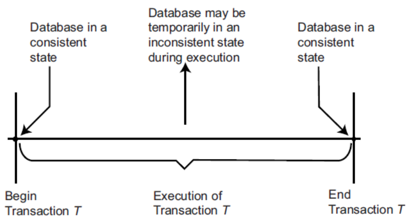

    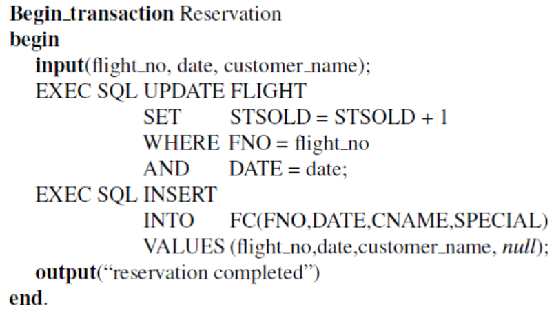

    - vlastnosti transakce
        - **A**tomicity
        - **C**onsitency
        - **I**solation
        - **D**durability

    - typy transakci
        - flat, nested, workflows
        - flat transakce

            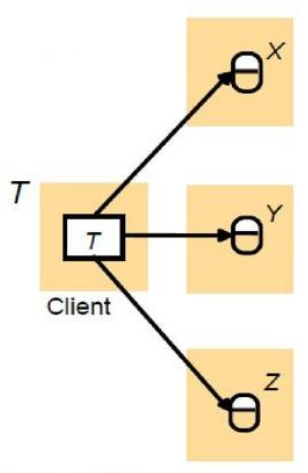

        - nested transakce
            - primarne se jedna o databazove transakce
            - transakce vytvorena v ramci jine transakce
            
            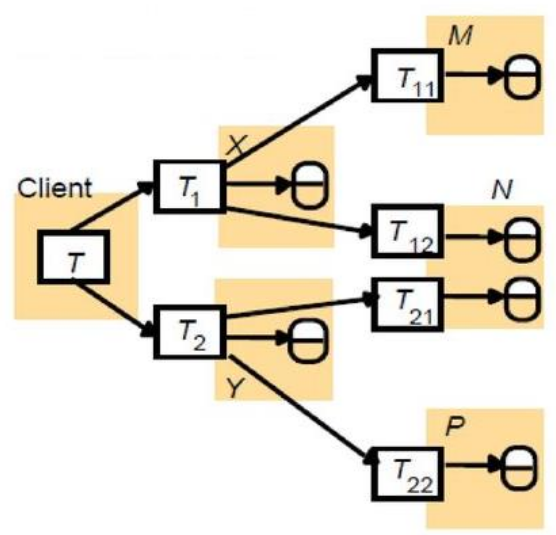

        - workflows
            - serie kroku pro rizeni tasku ci procesu
            - obdobne jako nested transakce ale lisi se jejich primarnim ucelem a tim jak jsou implementovane

            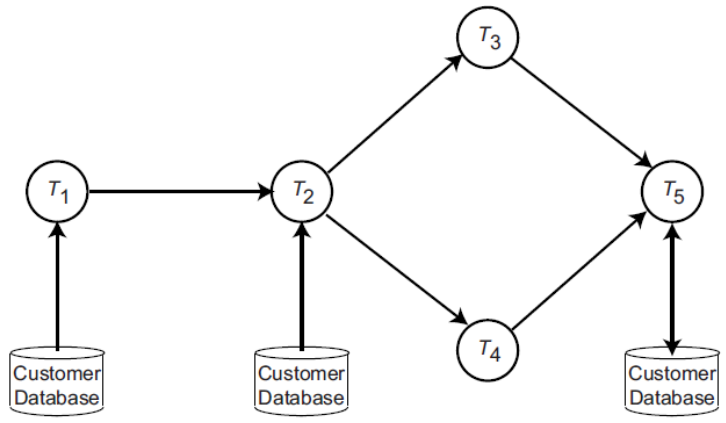

    - transakci model
        - API
            - begin: zapocni transakci (zacatek)
            - read: cteci operace
            - write: zapisova operace
            - end: konec transakce
            - commit: zajisti trvale ucinky transakce
            - abort: rollback do predchoziho konzistentniho stavu
        - architektura

            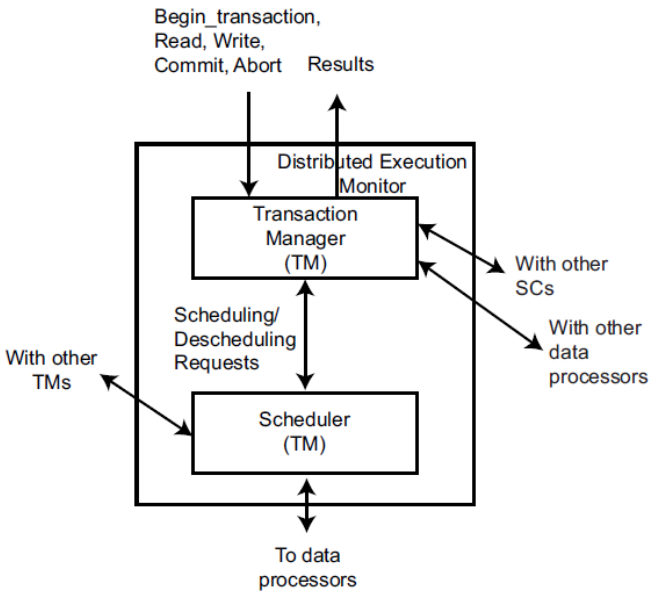

    - The X/Open XA standard
        - specifikace zverejnena v roce 1991 X/Open
        - jedna o zpracovani distribuovanych transakcich (DTP = distributed transaction processing)
        - 1995 byla aktualizovana
        - X/Open DPT Model

            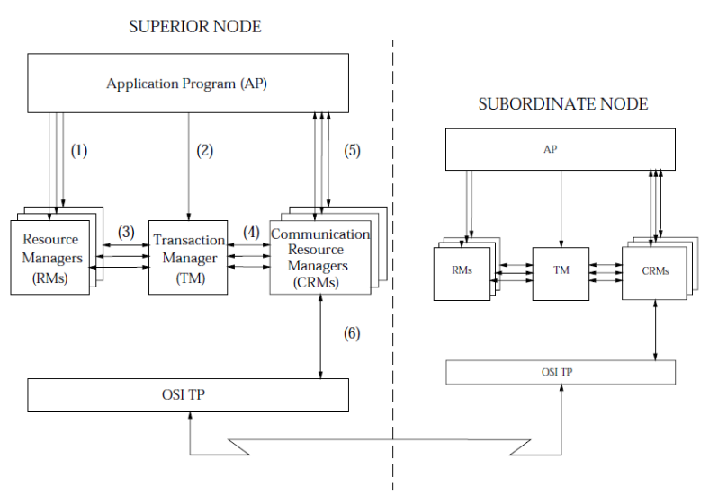

            - AP = Aplikacni Program
                - definuje hranice transakce a urcuje akce ktere ji tvori
            - RM = Resource Manager
                - databaze nebo souborovy system, ktery poskytuje pristup ke zdrojum (datum)
            - TM = Transaction Manager
                - prirazuje identifikatory jednotlivym transakcim
                - monutoruje jejich progres
                - prejima zodpovednost za dokonceni transakce a za rizeni zotaveni z chyb
            - CRM = Communication Resource Manager
                - ridi komunikaci mezi distribuovanymi aplikacemi v ramci domen TM nebo nezi nimi
    
    - Concurrency Control
        - cilem: serializovatelnost
        - pouzity mechanismus: klasifikace
        - Control Mechanisms Classification
            - nejbeznejsim kriteriem klasifikace je synchronizacni primitivum
        - pro serializovatelnost?
            - je to nejrozsirenejsi kriterium spravnosti pro algoritmy soubezneho rizeni
        - dve hlavni tridy algorimu
            - pouziti vzajemneho vylouceni pri pristupu ke sdilenym datum (zamykani)
            - snaha udporadat vykonani transakci dle dane mnoziny pravidel (protokolu)
        - algoritmy s dve ruznymy uhly pohledu
            - persimisticky: hodne transakci bude v konfliktnich
            - optimisticky: jen par transakci bude konfliktnich
        - faze pesimisticke exekuce transakce

            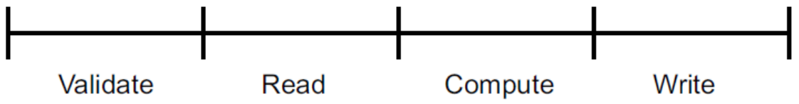

            - abort (konflikt) muze zpusobit zbytecne zamitnuti transakci

        - faze optimisticke exekuce transakce
            
            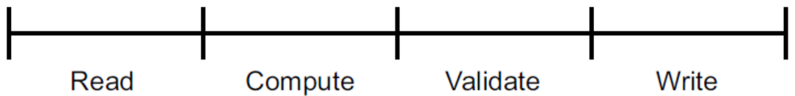

            - muze nastat abort (konflikt)

- distribuovane transakce

    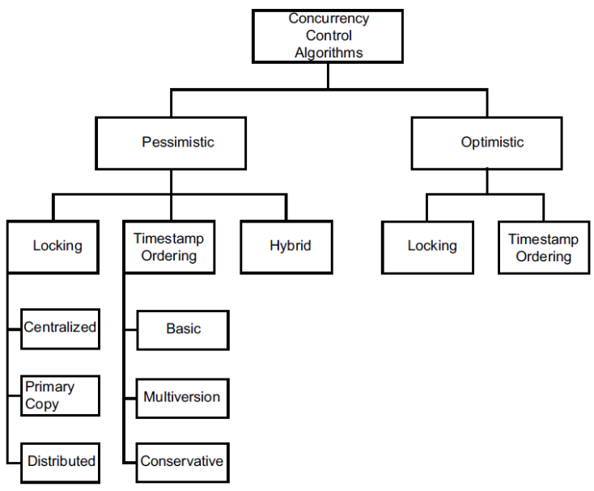

- Locking based algorithms
    - lock mody
    - read lock
    - write lock
    - kompatibilita lock modu
        
        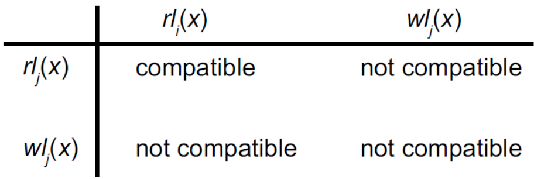

    - ostatni procesy musi pockat na uvoleni zamku
    - pokud proces zamkne zdroj, mel by ho uvolnit co nejrychleji => vyhoda
    - ALE dovoluje dalsim transakcim si vzajmne do sebe zasahovat => ztraci se atomicita a izolace
    - dvoufazove zamikani
        - jednoduse rika ze zadna transakce by nemela pozadat o uzamceni po tom co uvolni jeden ze svych zamku
        - alternativne: transakce by nemela uvolnit zamek dokud neni jiste ze nepozada o dalsi zamykani (dalsi zamek)
        - dve faze: Growing (nahoru), Shrinking (dolu)
        - dvoufazove zamykani

            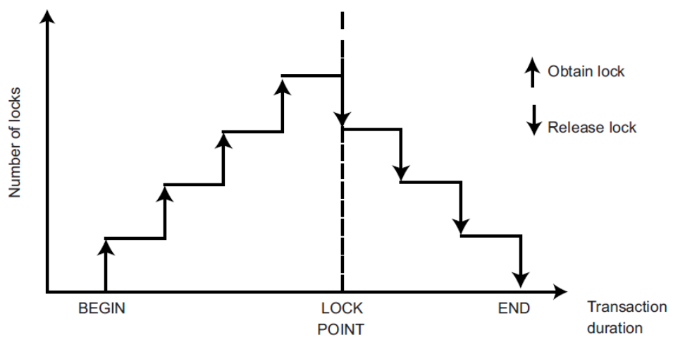

        - striktni dvoufazove zamykani

            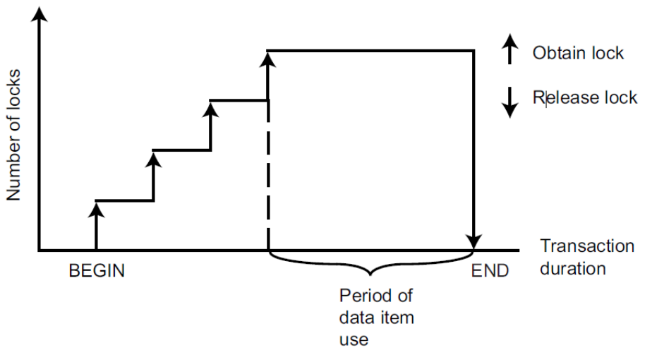

- Timestamp-Based Cocurrency Control
    - narozil od locking-based algoritmu se timestamp-based algoritmy nesnazi udrzet serializovatelnost pomoci vzajemneho vylouceni
    - namisto toho zvoli poradi serializace a podle neho transakci vykonaji
    - pro stanoveni tohoto poradi, TM (transaction manager) priradi kazde transakci `Ti` timestamp `ts(Ti)` pri jeji inicializaci
    - vlastnosti timestampu
        - unikatnost
        - monotolnost (postpne se zvysuje)
    - timestamp ordering rule
        - dejme tomu ze mame dve konfliktni operace `Oij` a `Okl` patrici trasakci `Ti` a `Tk`
        - `Oij` se vykone pred `Okl` poze pokud `ts(Ti) < ts(Tk)`
        - v tomto pripade je `Ti` je "starsi" transakce a `Tk` je "mladsi" transakce

- Zpracovani distribuovanych transakci (Java Case Study)
    - X/Open DTP Model – Java EE
        - Transaction Control Service Specification
        - JTA - Java Transaction API

        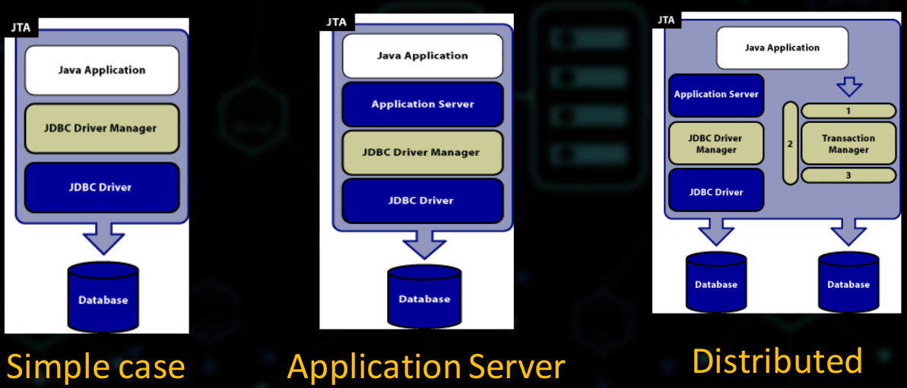

        - `UserTransaction` - interface
        - `TransactionManager` - interface
        - `XAResource` - interface
        - `javax.transaction.UserTransaction`
            - poskytuje schopnost aplikaci ridit ohranceni (zacatek a konec) transakci programove
            - `begin()` medota zacina novou globalni transakci a spojuje ji s volajicim vlanem
        - `javax.transaction.TransactionManager`
            - Umoznuje aplikacimu serveru ridit zacatek a konec transakce jemenem aplikaci ktera je spravovana
        - `javax.transaction.xa.XaResource`
            - Javovske mapovani prumysloveho standardu XA rozhrani zalozenem na X/Open CAE specifikaci
        - TM (transaction manager) je primarni komponenta infrastruktury distribuovanych transakci
        - Nicmene, JDBC driver a komponenty aplikacniho serveru by mely mit nasledujici charakteristiky
            - driver by mel implementovat JDBC verzi 2.0 nebo vyssi  (vcetne volitelneho balicku rozhrani `XADataSource` a `XAConnection`)
            - take by mel implementovat `JTA XAResource`
            - aplikaci server by mel poskytnout `DataSource` tridu ktera je implementovana tak aby interagovala s infrastrukturou distribuovanych transakci a modelem pro connection polling (lepsi vykonost)

        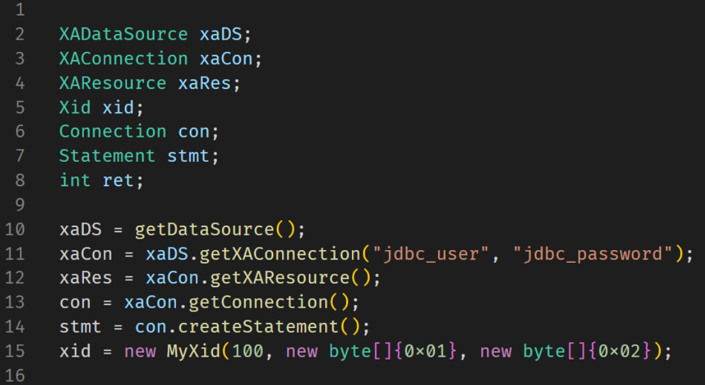

        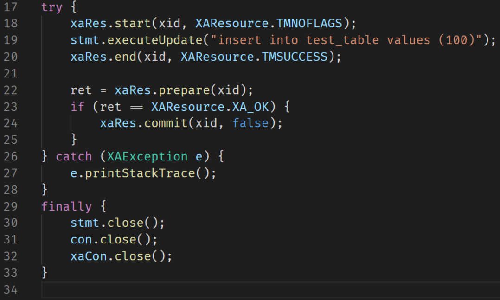