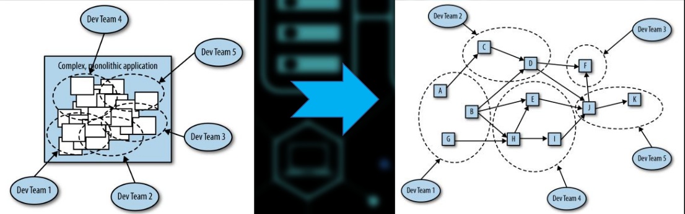

- navrhove vzory
    - jednotky (elementy) znovupouzitelneho Object-Oriented softwaru
    - sablona / vzor jak resit beznne (zname) problemy
    - da se pouzit v mnoha situacich
    - povazovano za "best practice"

    

    - sidecar

        

        - rozsireni funkcionality legacy aplikaci
        - priklad pouziti

            

    - ambasador
        
        

        - "Communication officer", service broker
        - priklad pouziti

            

    - adapter
        
        

        - adaptuje ruzna rozhrani

    - dekorator

        - pridata / rozsiruje chovani ci funkcionalitu
        - wrapper

        

    - Circuit Breaker
        - stale rozsirenejsi, hlavne mezi architekturama microservices
        - zamezeni kaskadoveho selhani sluzby
        - myslenka je takova ze monitorujeme aplikacni services a komunikaci (traffic) mezi nima tak abychom predesli selhani a kdyz uz k nemu dojde tak abychom minimalizovali jeho dopad na celou aplikaci

        

        

    - Replicated stateless services
        
        

        - resource pool
        - horizontalni skalovani

            
    
    - Session Tracked Services
        - nejsou uplne bezstavove

        

        - session afinity
            - request od uzivatele je presmerovan pokazde na stejnou instanci dane sluzby
        - tracking na aplikaci urovni
            - cookies (zavadeni stavovosti do beztavoveho protokolu napr HTTP)

    - cachovaci vrstva 
        - kdyz je volani bezstavove sluzby stale nakladne
        - pro jediny uzel je to pouze proxy

        

    - shared services
        - vertikalni fragmentace (sharding)

        

        - napr elasticsearch

            

        - strategie fragmentovani 
            - na zaklade geograficke proximity - data blize k mistu kde se zpracovavaji
            - uniformni distribuce (hashing) - load balancing
            - na zaklade casu/stari
                - nejnovejsi data nejblize k uzivateli
                - starsi data blize k k mistum kde se archivuji
            - Hilbert's curve
                - 2D -> 1D
                - spojita fraktalni krivka vyplnujici prostor
                - zachovava lokalitu dat

                

                

            - fragmentace 2D prostorovych dat
                - Google S2 library

                

        - hot sharding systems

            
    
    - mikroservices
        
        

        - distribuce zodpovednosti
            - "Do one thing, do it well"
        
        - klasicky J2EE  aplikacni monolit:

            
        
        - dekompozice systemu do diskretnich izolovanych subsystemu ktere mezi sebou komunikuje pred dobre definovane rozhrani (API)
        - izolace je prerekvizita pro odolnost a elasticitu a vyzacuje vymezenoiu asynchronni komunikaci mezi servisama, tak aby byly uddelitelne
            - case: dovoluje concurrency (paralelismu)
            - prostoru: dovoluje geograficky hybat jednotlivyma servisama
        - pri implementaci microservices je nuta eliminovat sdileny stav -> minimalizace koordinace
        - jednoduche principy:
            - izolovat vsechny veci
                - sandboxing (Docker)
                - izolace chyb
                - v Amazonu pouzivaji "two-pizza rule"
                    - pocet clenu v tymu neni vetsi nez co by se dalo nakrmit dvemy pizzy (obed)
                    - development team scalability

                          

            - jednat autonomne (samostatne)
                - izolovanost je predpoklad pro autonomnost
                - delat rozhodnuti nezavisle
                - spolupracovat s ostatnimi za ucelem vyreseni problemu
                - autonomni service muze pouze zarucit (definovat) vlastni chovani vystavenim odpovidajiciho protokolu / API

            - "Do one thing, do it well"
                - filizofie Unixu (uchytila se i po nekolika letech)
                - jeden ze zakladnich principu rika ze by vyvojari meli psat male programy ktere maji jedinny ucel a jsou dobre definovane a daji se dobre zaintegrovat do dalsich programu / aplikaci

            - exkluzivne vlastni svuj stav

                  

                  

            - vyuziti asynchronich zprav
                - komunikace mezi mikroservices potrebuje byt zalozena na asynchronim preposilanim zprav
                - logika uvnitr kazde mikroservice je vykonana synchrone
                - bez asynchronni komunikace neni moze mikroservices oddelit (izolovat v case a prostoru)

            - zustan mobilni ale adresovatelny
                - adresy musi byt stabilni ve smyslu ze se daji pouzit k adresovani mikroserice neomezene bez ohledu na to kde se aktualni nachazi
                - adresa musi byt virtualni ve smyslu ze nereprezentuje jen jdnu sluzbu ale vetsinou mnozinu bezicich instanci ktere definuji danou sluzbu
        
        - poces spravy API se sklada z:
            - navrhu, verzovani, nasazovani, rizeni, dokumentovani a analyzy

              
        
    - Event Sourcing
        - muzeme se dotazat stavu aplikace abychom zjistili stav systemu
        - case take nechceme jen zjistit v jakem stavu jsme ale jak jsem se tam i dostali
        - zajistuje to ze vsechny zmeny stavu aplikace jsou ulozeny jako sekvence udalosti
        - nad timto logem muzeme sestavit query za ucelem zjisteni stavu v minulosti

          

    - CQRS = Command Query Responsibility Segregation
        - problem
            - REST API se stane komplexni
            - DTO (data tranfer object) z vysledku dotazu a DTO aktualizaci se velmi lisi
        - reseni
            - operace cteni dat jsou oddelene od operaci zapisu
            - casto se take delaji na ruznych rozhranich

          

          

    - Functions and Event-Driven Processing
        - design even-driven aplikaci
            - zpracovavani pouze jednoho requestu
            - odpoved na specifickou udalost
            - napriklad User Authentication
        - FaaS = Function as a Service
            - tak znamo jako serveless computing
            - proc "serveless"?
            - protoze se vyvojari nemusi starat o servery (they don't have to care)
            - benefit predevsim pro vyvojare
            - dramaticky zjednodusuje vdalenost od kodu k bezici service
            - zadny artefakt co by se musel vytvorit nebo pushnout (krome samotneho zdrojoveho kodu)
            - AWS (Amazon Web Services) "lambda funkce"
            - Microsoft Azure Functions