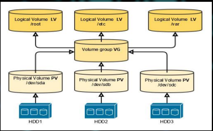

- Distrubuované souboré systémy
  - Typy:
    - NFS – The Network File System
    - AFS – The Andrew File System
    - Coda – The Coda Distributed File System
  - cíle:
    - sdílení zdrojů
    - transparentnost lokace
  - charakteristiky
    - jsou zodpovědné za organizaci, úkládání, vyhledávání pojmenování, sdílení, a ochranu souborů
    - poskytují rozhraní charakterizující abstrakci souborů (programátoři nemají starost o detailech alokace a rozvržení úložiště)
    - soubory uloženy na discích nebo jiných pamětových médiích
    - soubory obsahují data a atributy
    - data se skládají z posloupnosti datových položek (obvykle 8bitových bajtů), přístupné operacím pro čtení a zápis libovolné části
    - atributy jako jeden záznam (délka souboru, časové značky, typ souboru, vlastních, ACL (Access control list) - přístupový práva)
  - Unix FS operace
    - filedes = open(name, mode)
      - otevře soubor s daným názvem
    - filedes = creat(name, mode)
      - vytvoří nový soubor s jménem
      - vrací referenci na vytvořený soubor
      - mode - read, write, both
    - count = read(filedes, buffer, n)
      - přenese n bajtů ze souboru reference filedes do pole buffer
      - vrací počet přenesených bajtů a posune ukazatel o tento počet
    - count = write(filedes, buffer, n)
      - přenese n bajtů do souboru reference filedes z pole buffer
      - vrací počet přenesených bajtů a posune ukazatel o tento počet
    - pos = lseek(filedes, offset, whence)
      - posune pointer na offset relativne nebo absolutne podle whence
    - status = unlink(name)
      - odstraní jméno name z adresářové struktury, pokud pro tento soubor není další jméno bude smazán
    - status = link(name1, name2)
      - přidá nové jméno name2 pro soubor name1
    - status = stat(name, buffer)
      - vloží atributy souboru do bufferu
    - status = close(filedes)
      - zavře otevřený soubor filedes

     
  
  - Distribuovaný souborový systém umožňuje programům ukládat vzdálené soubory a přistupovat k nim přesně tak, jak to dělají lokálně, což umožňuje uživatelům přistupovat k souborům z z libovolného počítače v síti.
  - požadavky:
    - mnoho úskalí pří návrhu distribuovaných služeb na počátku vývoje techto systémů
    - zpočátku nabízeli tranparentnost přístupu a umístění/lokace
    - v dalších fázích vývoje byly požadavky na výkon, škálovatelnost, řízení souběhu, odolnost proti chybám, bezepčnost
    - Typy požadavků:
      - Transparentnost
      - Souběžné aktualizace souborů
      - Replikace souborů
      - Heterogenita hardwaru a operačního systému
      - Odolnost proti chybám
      - Konzistence
      - Bezpečnost
      - Efektivita
    - Transparentnost
      - Transparentnost přístupu
        - klienské programy by neměli vědět o distribuovanosti souborů
        - sada operací je přístupná pro soubory lokální i vzdálené
        - programy pracujícíc s lokálními soubory mohou pracovat i se vzdálenými bez modifikací
      - Transparentnost lokace/umístění
        - Klient. programy vidí jednotný prostor pro názvy souborů
        - soubory nebo skupiny souborů mohou být přemístěny a programy klienta to nezjistí a vidí stejný prostor
      - Transparentnost mobility
        - při přesunu souborů není potřeba měnit klient. programy ani systomové administrační tabulky v klientských uzlech
        - soubory nebo svazky souborů jsou přesouvány správci souborů nebo automaticky
      - Transparentnost výkonu
        - klient. programy by měli nadále fungovat pokud zatížení služby je v určitém rozmezí
      - Transparentnost škálování
        - služba může být rozšířena postupně, aby se vypořádala s větším zatížením a velikostí sítě
    - Konkureční aktualizace souboru
      - změna souboru provedena klientem by neměla narušit činnost dalších klientů, kterí přistupují ke stejnému souboru nebo jej měni
      - potřebná ale nákladná
      - doporučené nebo povinné zamykání na úrovní záznamů nebo souborů
    - Replikace souboru
      - podpora replikace
      - může existovat několik kopií svého obsahu v různých umístěních/lokacích
      - dvě výhody:
        - servery sdílejí zátěž s poskytováním služby klientů, kteří přistupují ke stejné sadě souborů (zvyšuje škálovatelnost, odolnost proti chybám)
    - Heterogenita HW a OS
      - rozhraní služby je definována, tak aby klient a server mohl být implementován pro různé OS a počítače
      - důležitý aspekt otevřenosti
    - Odolnost proti chybám
      - nezbytné aby služba fungovala při selhání klienta a serveru
      - servery bezstavové
      - server po selhání -> restartovat a službu obnovit
    - Konzistence
      - běžné OS (např. Unix) nabízejí onecopy update semantic
      - když je soubor replikován nebo nacachechován na různých místech dochází ke zpoždění při šíření změn do ostatních míst kde se nacházíá kopie a to vede k odchylce od sémantiky jedné kopie (one-copy semantics)
    - Bezpečnost
      - FS poskytují mechanismy řízení přístupu založené na ACL
      - v DS je třeba ověřovat požadavky klientů pomocí digitálního podpisu a šifrovaných tajných dat
    - Efektivita
      - distribuovaná služna by měla nabízet alespoň stejnou sílu a obecnost jako nabízejí konvenční FS a měla by dosahovat srovnatelné úrovně výkonu
    - Architektury:
      
       
      
       
      
       
      
       
    
    - NFS protokol
      - poskytuje sadu RPCs pro vzdálené operace nad soubory
        - Vyhledávání souboru v adresáři
        - Čtení adresářové položky
        - Manipulace s odkazy a adresáři
        - Přístup k atributům souborů
        - Čtení a zápis souborů
      - tyto procedury lze vyvolat pouze handlem souboru připojeného na vzdáleně připojeného adresáře
      - vynechání operací open a close je záměrné
      - NFS servery jsou bezstavové
        - neuchovávají info o klientech
      - požadavky musí obsahovat sadu argumentů, včerně ID souboru, absolutního offsetu pro příslušné operace
      - výsledný návrh je robustní
      - pro obnovení serveru po selhání není potřeba žádná zvláštní opatření
      - operace se soubory musí být idempotentní (stejná operace provedena víckrát má stejný učinek jako by byla provedena jen jednou)
        - pro dosažení idempotence má každá požadavek NFS pořadové číslo pro určení zda je požadavek duplikován nebo zda nějaký nevhybí

         
        
        
      
    - NFS - Network file system 
      - neškáluje se dobře
      - manuální mount NFS volume:
        - sudo mkdir /var/backups
        - sudo mount -t nfs 10.10.0.10:/backups /var/backups
      - automatický mount přidáním volumen do /etc/fstab
        - # <file system> <dir> <type> <options> <dump> <pass> 10.10.0.10:/backups /var/backups nfs defaults 0 0
    - AFS - The Andrew File System
      - NFS se neškáluje dobře
      - také založeno na RPC
      - škálování přes caching u klientů
      - schopný obsluhovat tisíce klientů
      - ukládání celých souborů do cache u klientů
      - slabá konzistence
      - operace nad localními (cached) soubory
      - server slibuje callback pokud někdo změní soubor (cache coherence)
      - AFS se liší od NFS konstrukcí a implementací a AFS je škálovatelnost hlavní a nejdůležitější cíl návrhu
      - AFS navržen tak aby dobře fungoval s větším aktivních uživatelů než ostatní distribuované souborové systémy
      - klíčová strategie pro dosažení škálovatelnosti je caching celých souborů v uživatelských uzlech
      - dvě neobvyklé charakteristiky návrhu:
        - Whole-file serving
          - AFS servery přenášejí celý obsah adresářů a souborů do klientských počítačů 
        - Whole-file caching
          - jakmile je kopie nebo část přenesena do klientského PC je uložena do cache na lokálním disku
          - tato cache obsahuje několik stovek souborů, které byly na PC naposledy použity
          - tato cache je trvalá a přežije restart klientského PC
          - lokální kopie souborů jsou použity k uspokojení otevřených požadavků klientů přednostně před vzdálenými kopiemi
      - Archtektura
      
      
  
      - Cells
      
      

      - AFS a multiplatformní systémy
        - Server:
          - /afs/zcu.cz/software/amd64_u1604/bin/mailclient Linux / Ubuntu 16.04
          - /afs/zcu.cz/software/amd64_win64/bin/mailclient MS Windows
        - Client
          - /afs/zcu.cz/software/@sys/bin/mailclient
          -klient nahrazuje @sys placeholder s ID platformy 
      - Binární distribuce aplikací
      - Adresáře napříč platformami
      - Komponenty AFS:
        - BOS (Basic Overseer)
          - monituruje všechny AFS procesy bežící na AFS serveru 
        - PtServer
          - ochranný server (autorizace)
          - AFS používá Kerberos pro autentikaci
        - VlServer 
          - Volume location server
        - VolServer
          - volume server
        - FileServer
          - file server
        - Salvager 
          - zotavení po havárii (automatický fsck)

      
    
    - The Coda File System
      - distribuovaný souborový systém vyvíjený jako výzkumný projekt na Carnegie Mellon University od roku 1987 jako potomek systému AFS-2
      - potomek systému AFS s cílem řešit několik požadavků které AFS nesplňuje
        - zejména požadavek na vysokou dostupnost navzdory odpojenému provozu
      - Funkce:
        - Odpojený provoz pro mobilní počítače
        - Vysoký výkon díky trvalému ukládání do mezipaměti na straně klienta
        - Replikace serveru
        - Bezpečnostní model pro ověřování, šifrování a řízení přístupu
        - Nepřetržitý provoz při částečných výpadcích sítě v server síti
        - Přizpůsobení šířky pásma sítě
        - Dobrá škálovatelnost
        - Dobře definovaná sémantika sdílení i při výpadku sítě
        - Volně dostupné pod licencí GPL
      - sada serverů držící repliky volume souborů se nazývá VSG (volume storage group)
      - při otevření souboru v VSG se může přistupovat k podmnožině VSG která je známá jako AVSG (available VSG)
      - členství v AVSG se mění jak jsou servery přístupné nebo nedostupné v důsledku selhání sítě nebo serveru
      - Operace odpojení
        - operace efektivního odpojení závisí na přitopmosti souborů v cache klientského PC
        - pro dosažení musí uživatel spolupracovat se systémem Coda aby vytvořili seznam souborů které by měli být uloženy v cache
        - k dispozici nastroj, který zaznamenává historický seznam souborů použitých když byl připojen a slouží jako základ předpovědi k odpojení
        - Kopie souborů umístěné v mezipaměti klientských počítačů jsou považovány za užitečné pouze do té doby, dokud je možné pravidelně ověřovat jejich aktuálnost oproti kopiím umístěným na serverech
        - při odpojeném provozu dochází k revalidaci a při ukončení odpojeného provozu, tak soubory v cache jsou integrovány se soubory na serverech
        - nejhorší případ zahrnuje manuální zásah k vyřešení konfliktů
      - Strategie replikace
        - optimistická
        - modifikace souborů při rozdělení sítě nebo odpojenému provozu
        - každá verze souboru má připojen vektor verze Coda (CVV)
        - CVV je vektorové razítko s jedním prvkem pro každý server v VSG
        - každý prvek CVV je odhad počtu modifikací provedenych na verzi souboru která se uložena na daném serveru
        - účel CVV je poskytnout info o historii aktualizací každé repliky serveru pro zjištění potenciálních konfliktů a předání k ručnímu zásahu aby bylo možné staré repliky automaticky aktualizovat
        - Řešení konfliktů
          - pokud CVV je na jednom z míst větší nebo rovem všem korespondujících CVV na dalším místě nedochází ke konfliktu
          - starší repliky (menší časové značky) obsahují aktualizace v novější replice a mohou s ní být aktualizovány
          - pokud pro dva CVV neplatí v1 >= v2 ani v2 >=v1 pak dochází ke konfliktu
            - každá replika reflektuje aslepoň jednu aktualizaci, kterou druhá nereflektuje
          - CODA neřeší obecně konflikty automaticky
          - soubor je označen jako 'nefunkční' a vlastník je o konfliktu informován