- distribuovane uloziste
    - data lakes
        - = centralni repozitar ktery nam dovoluje ulozit vsechny nase strukturovana i nestrukturovana data v jakemkoli meritku
        - muzeme zde ulozit vsechna data "tak jak je mame" bez toho abychom je strukturovali
        - analyza dat pomoci dashboardu
        - big data
        - real-time analyza
        - strojove uceni (machine learning)
        - Data Warehouse vs Data Lake

            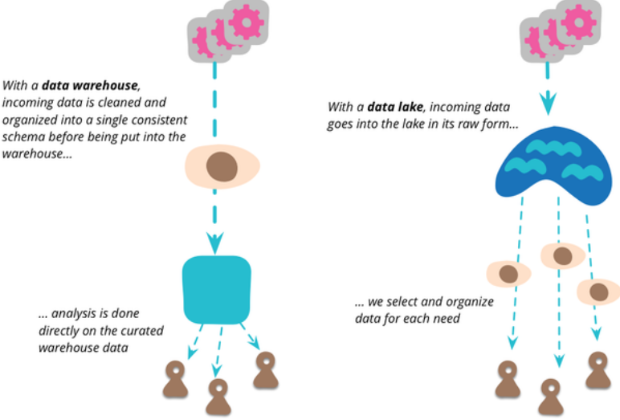

        - Date Lake kontext

            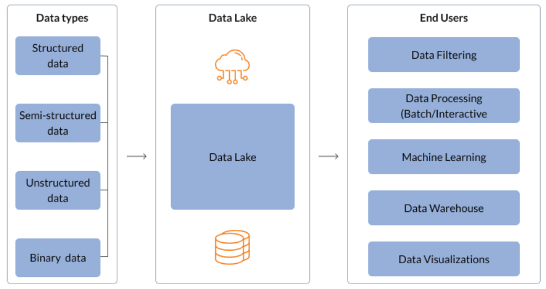
        
        - umoznuji nam importovat libovolne mnozstvi dat ktere mohou prichazet real-time
        - data jsou shromazdena z vicero zdroju a jsou prestehovana do data lake ve svem originalnim formatu
        - tento proces nam dovoluje libovolne skalovat data bez toho aniz bychom ztraceli cas definovanim struktur, schemat a transformaci

        - Data Lake architektura

            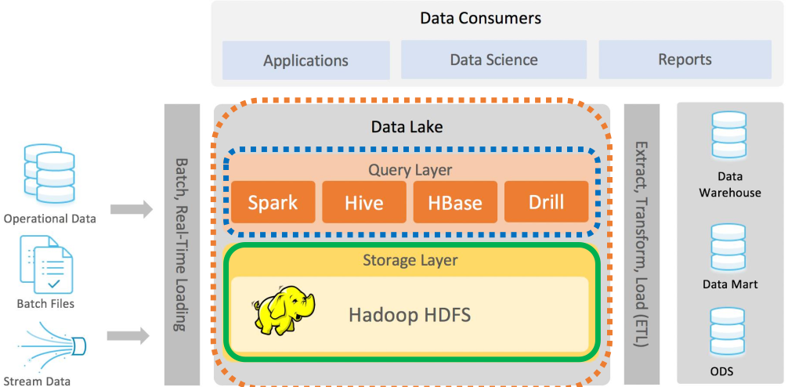

            - storage layer
                - distribuovany souborovy system
                - redundance
                - replikace
                - fault-tolerance
                    - priklad: 
                        - MTBF CPU = 1 rok
                        - 365 CPUs => 1 den
                        - 8760 CPUs => 1 hodina (kazdou hodinu jedno selze jeden procesor)
                    - krome CPU muze take selhat HDD
    
    - Distribuovane uloziste GFS
        - = Google File System
        - distribuovany souborovy system
        - nabizi podobnou abstrakci ale je specializovany pro velmi specificke pozadavky ktere Google pozaduje ve smyslu ukladani a pristupu k velkemu mnozstvi dat
        - cile navrhu
            - fault tolerance
            - oplimalizace pro bezne vzory (patterns) pouzivani v ramci Google - high-performance cteni a appendovani (pridavani) velkych objemu dat
        - operace jsou podobne POSIX ale ne uplne
            - create - vytvori novou instanci souboru
            - delete - smaze existujici instance souboru
            - open - otevre pojmenovany soubor a vrati handle
            - close - zavre soubor (s predanim handle)
            - read - cte data ze souboru (identifikace pomoci handle)
            - write - zapise data do souboru
            - dalsi operace (navic):
                - snapshot - poskytuje efektivni mechanismus pro vytvareni kopii souboru/slozek ve stromove strukture
                - record append - poskytuje bezne vzory pristupu (zmineno drive); paralelni pristup z vicero klientu (zapis dat)
        - architektura

            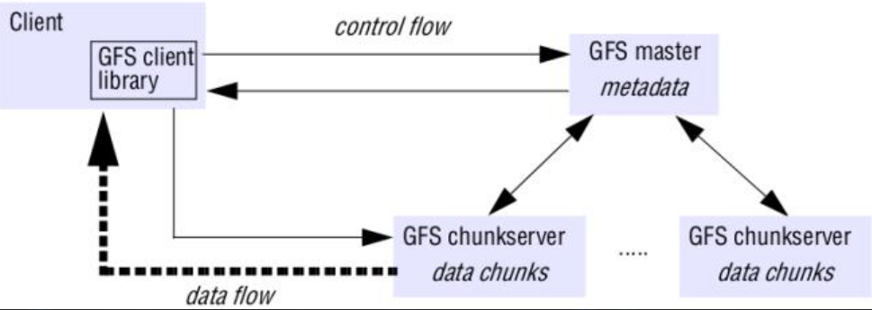

    - HDFS = Hadoop Distributed File System
        - soucast vetsiho ekosystemu
        - Apache Hadoop projekt:
            - Hadoop common - bezne utility ktere podporuji dalsi Hadoop moduly
            - HDFS - distrubuovany file system; poskytuje high-throughput pristup k aplikacnim datum
            - Hadoop YARN: framework pro planovani ukolu (job scheduling) a cluster resource management
            - Hadoop MapReduce: A YARN-based system pro parellni zpracovani velkych datasetu

            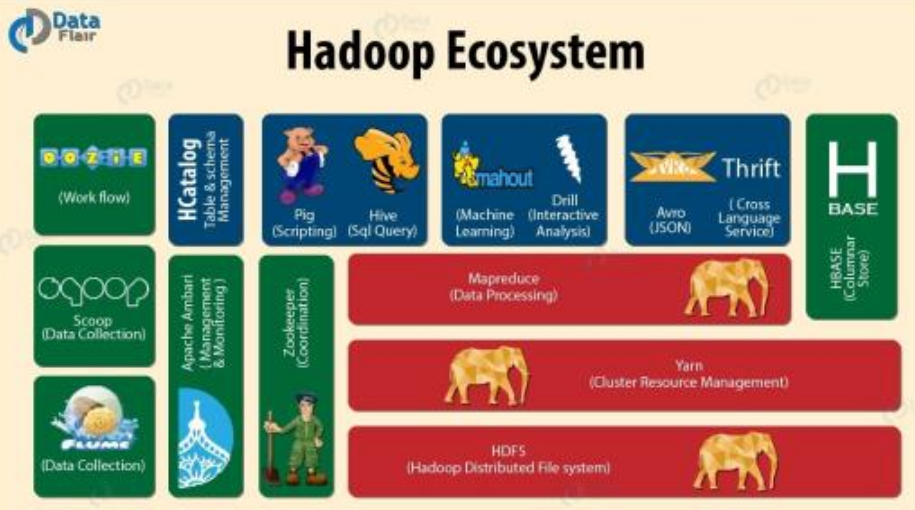

        - navrzen na beh v clusteru komoditniho HW
        - fault-tolerant, skalovatelny FS (horizontalne)
        - puvodni ucel bylo poskytnuje velkych souboru s vysokym vykonem zamerenem na cteni a zapis - podobne jako GoogleFS
        - esencialni vlastnosti
            - fault-tolerance
            - streaming data access (streamovani dat)
            - skalovatelnost
            - simplicity
            - vysoka dostupnost
        - architektura

            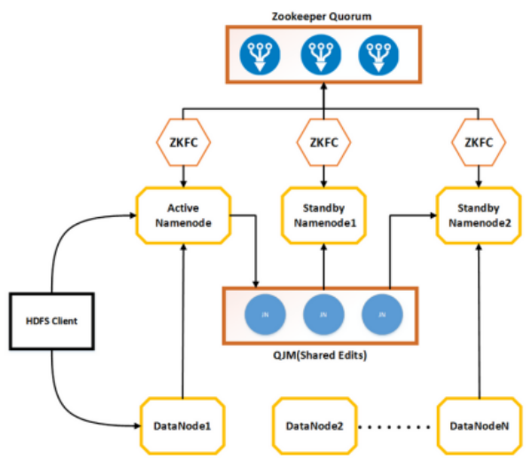

            - soubory jsou ulozeny na data nodech v data blocich 

                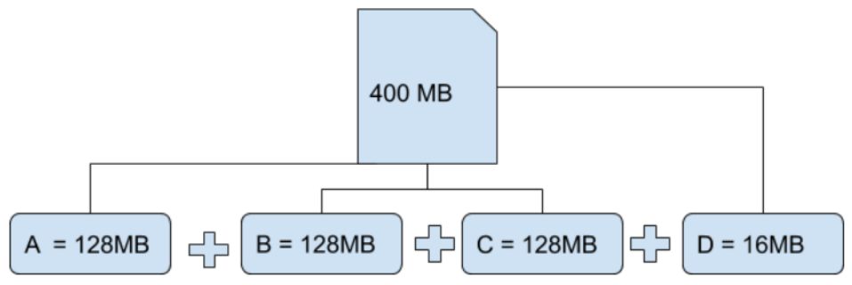

            - vychozi faktor replikace = 3

                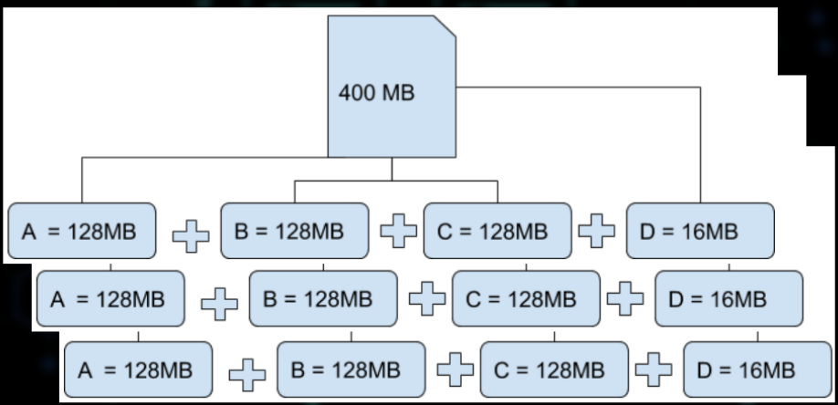

- distribuovana cache
    - distribuovana nebo rozdelena cache je klastrovana fault-tolerant cache ktera ma linearni skalovatelnost
    - data jsou rozdelena mezi vsechny pocitace v danem clusteru
    - aby se zajistila fault-tolerance, rozdelene cache mohou byt nakonfigurovane tak aby kazdy kousek dat byl ulozen na jednom nebo vice unikatnich pocitacu v danem clusteru
    - nekolik klicovych vetsi ktere se musi vzit v potaz
        - rozdeleni (partitioning)
        - load-balancing
        - location transparency
        - failover
    1) rozdeleni (partitioning)
        - data v distribuovane cachi jsou rozdelena napric vsema serverama tak ze dva servery jsou zodpovedne za stejny kus dat v dane cachi.
        - Velikost cahce vcetne vykonu spojeneho se spravou muze rust linerane s velikosti clusteru
        - take to znamena ze oparace s pojene s cahce mohou vyzadovat na nejvys jeden server ("single hop")
    2) load balancing
        - tim jak jsou data rozdelena rovnomerne napric serverama, zodpovednost za spravu dat je automaticky load-balanced (rozdelena) napric celym clusterem
    3) location transparency
        - navzdory tomu ze jsou data rozmistena po celem clusteru se k datum pristupuje pres jedine API
        - vyvojar se nemusi starat o topologii dane cahce
        - API a jeho chovani je stejne pro lokalni cache, replikovanou cache nebo i distribuovanou cache
    4) failover
        - vsechny coherence sluzby (vcetne distribuovane cahce) poskytuji failover a failback bez ztraty dat
        - distribuovana cache dovoluje konfiguraci zaloh
            - pokud je pocet zaloh > 0, kazdy uzel muze selhat bez ztraty dat
    
    - cache coherence
        - uniformalita sdileneho zdroje dat ktera je nakonec ulozena ve vicero lokalnich cachi

            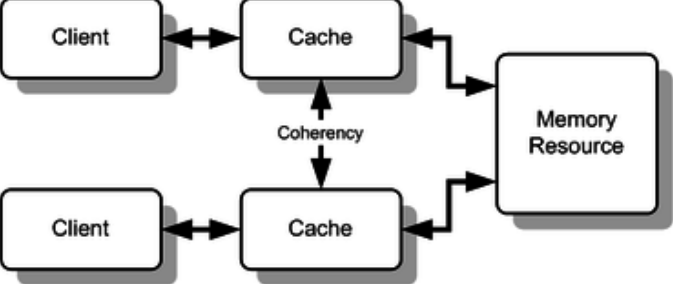

    - Hazelcast - In-Memory Data Grid (IMDG)
        - Hazelcast IMDG uklada vechno do RAM
        - navrzen tak aby umoznoval rychle operace cteni / update
        - peer-to-peer, neni zadny single point  of failure v IMDG clusteru
            - kazdy clen (uzel) v clusteru je nakonfigurovany aby fungoval stejne
        - vsechny uzle ukladaji stejne mnozstvi dat a dela stejne mnozstvi operaci (processing)
        - skalovatelnost
            - kdyz se pozadavky na velikost pameti a vypocet zvysi, novy clenove mohou byt dynamicky zapojeny do Hazelcast IMDG clusteru za ucelem naskalovani elasticity
        - odolnost proti selhani
            - data jsou odolna proti selhani clena (nodu)
            - zalohy jsou distribuovane napric clusterem
            - Hazecast udrzuje zalohy vsech zaznamu dat na vice clenech (nodech)
            - kdyz node selze, data jsou obnovena ze zalohy
                - cluster pokaruje v cinnosti
        - dalsi features
            - clonove clusteru o sobe neustale vi
                - narozdil od toho jak tomu je v tradicnich key-valu cache resenich
            - poskytuje out-of-the-box distribuovane datove struktury
        
        - Hazelcast - Aplication Context

            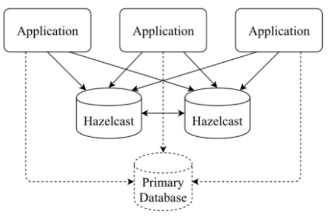

        - Hazelcast Data Partitioning
            - zaznamy dat na kazdem Hazelcast member nodu jsou ulozeny v segmentech pameti nazyvanych Partitions
            - Partitions jsou distribuovany rovnometne mezi vsechny cleny clusteru
            - Hazelcast take vytvari zalozy techto partitions
            - defaultne Hazelcast vytvori sidnu kopii / repliku pro kazdou partition
                - data se nakonfigurovat ze bude vice replik
                - jedna z techto replik se nazyva "primarni" a o statni "zalohy"
                - "partition owner" - clen ktery drzi primarni repliku
                - pri cteni / zapisu se kmunikuje prave s timto nodem (clenem clusteru)
            - defaultne Hazelcast nabizi 271 partitions
                - pri spusteni clusteru s jednom uzlem si ten jeden uzel drzi vsech 271 partitions
                - pri pridani dalsich clenu se partitions rozdistribuji rovnomerne mezi vsechny nody

            - Zacelcast Data Partitioning

                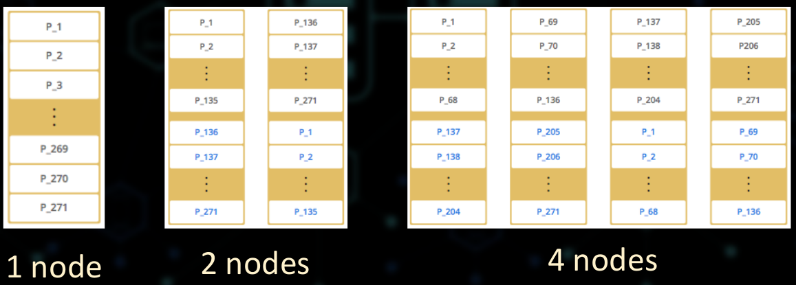

                - Hazelcast distribuuje zaznamy dat do jednotlivych partitions s pouzitim hashovaciho algoritmu
                - je dan object key nebo object name:
                    - key nebo name je serialozvano (prevedeno do pole bytu)
                    - toto pole je nasledne zaheshovano
                    - `Partition ID = MOD (hash result, partition count)`

            - Hazelcast distribuovane objekty
                - Hazelcast ma dva typy distribuovanych objektu dle jejich partitioning strageii
                    - datove struktury kde kazda partition uklada cast instance -> **Partitioned data structurss**
                        - Map
                        - MultiMap
                        - Cache - implementuje JCache API
                        - Event Journal
                    - datove struktury kde jedina partition uklada celou instance -> **None-Partitioned data structures**
                        - Queue
                        - Set
                        - List
                        - Ringbuffer
                        - Topic
        
        - Hazelcast & CAP
            - viz 7. prednaska
            - Hazelcast je "AP" produkt ale take "CP" subsystem

                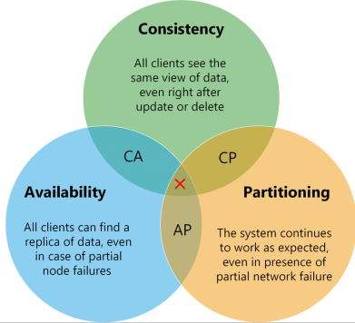

            - Hazelcast AP
                - kdyz dojde k rozdeleni site kde uzly zustanou pripojene v ruznym skupinam klientu
                    - Hazecast uprednostune "A" kdyz je "P" (potkacuje "C")
                - efekt z pohledu klienta je takovy ze klienti ktery jsou pripojene ke stejne partions vidi konzistentni data, ale klienti kteri jsou propojeni k jine partions nemusi videt ta sama data 
            
            - Hazelcast CP
                - postytuje CP subsystem vedle existujich AP struktur
                - subsystem implementuje Hazelcast's concurrency APIs nad Raftem (algoritmus distribuovane shody)
                - CP subsystem date structures
                    - FencedLocked
                    - IAtomcLong
                    - ISemaphore

    - Redis - In-memory data structure
        - Redis = **Re**mote **Di**ctuinary **S**erver
        - pouziva se jako distribuovana, in-memory key-valu databaze
        - distribuovana cache
        - distribuovany message broker
        - Redis poskytuje ruzne typy obstraktnich datovych struktur

            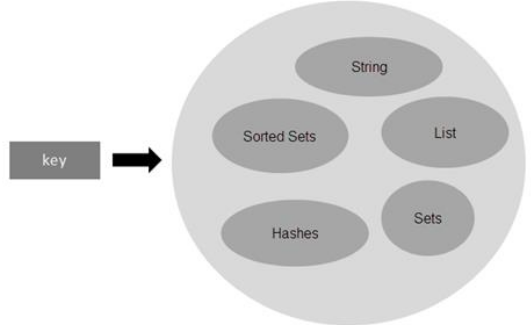

- Distributed Hash Tables (DHT)
    - = decentralizovane uloziste ktere vyhledava data na zaklade key-value paru
    - kazdy uzel v distribuovane hashovaci tabulce je zodpovedny za mnozinu klicu a s nimi spojenymi hodnoty
    - klic je unikatni pro data se kterymi je spojeny
        - vytvoren tak ze se prozene hashovaci funkci
    - values (hodnoty) mohou byt ulozeny v libovolne forme
    - jsou decentralizovane (system nema zadneho koordinatora)
    - obecne jsou fault-tolerant
        - data jsou replikocana napric vicero nodama
    - mohou byt skalovatelne pro velke objemy dat

    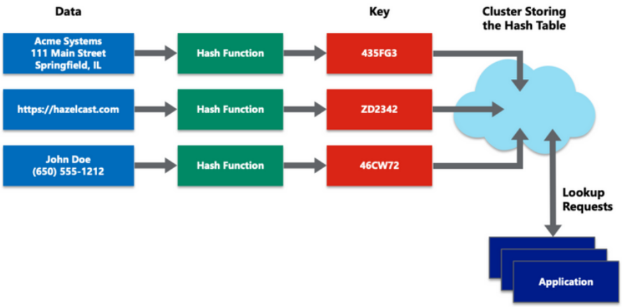

    - konzistentni hashovani
        - co to je a proc to potrebujeme?
        - kdyz je hash tabulka rozdistribuovana pred nekolik serveru, jak zjistime na kterem serveru data lezi?
            - reseni: priradime rozsah hash hodnot kazdemu serveru
            - problem: jak se to bude skaluje?
                - kdyz pradme novy server musime prirazeni provest znovu pro vsechny server (key redistribution)
                - reseni: consistent hashing
        - specialni technika hashovani takova ze kdyz se zmeni velikost hashovaci tabulky pouze `k / n` klicu v prumeru se musi promapovat (`k` = pocet klicu; `n` = pocet slotu)
            - v tradicnich tabulkach: pokud se zmeni pocet slotu => temer vsechny klice se zmeni a musi byt premapovany

        - skalovatelnost

            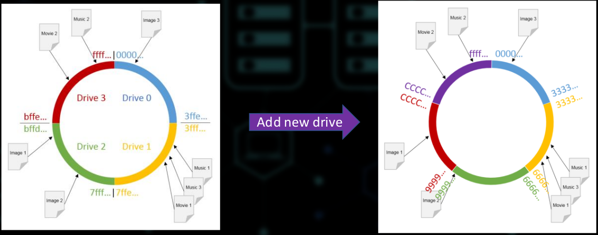

- Big Data processing
    - paradigma code-to-data
        - zajistuje to ze se sit neucpe
    - distribuovane zpracovani dat predpoklada ze jsou data jiz ulozena distribuovana napric systemem
    - pri zpracovani dat si nody pouze vymenuji vysledky zpracovani (agregace)
        - vypocet probiha lokalni na kazdem uzlu 
    - exekuje programu je imunni vuci selhani PC site nebo uzlu
        - pokud node selze, jeho prace je prirazena jinemu uzlu

        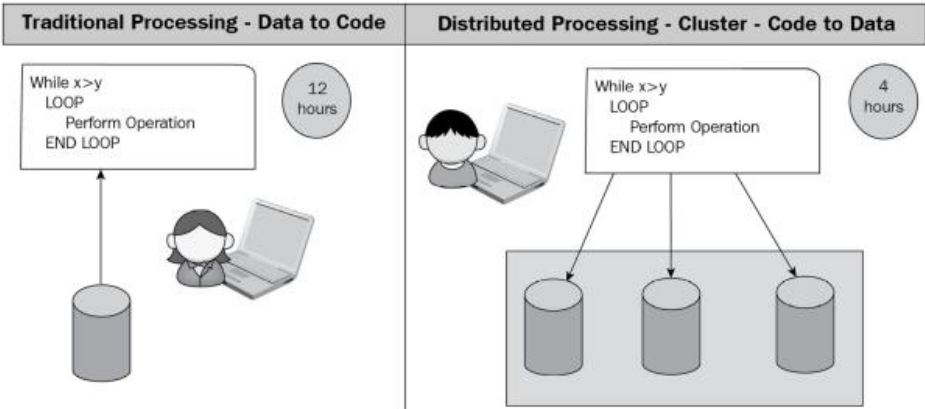

    - distributed processing je implementovano s pouzitim znamych frameworku (Hadoop, Spark, Flink, ...)