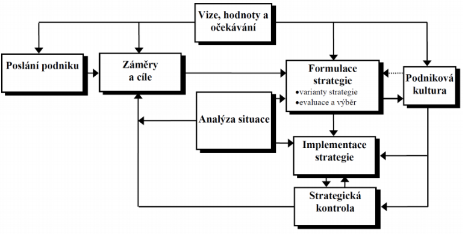
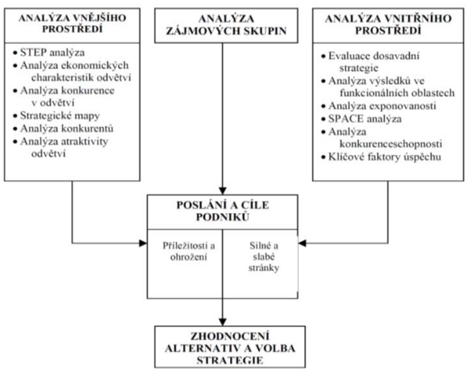
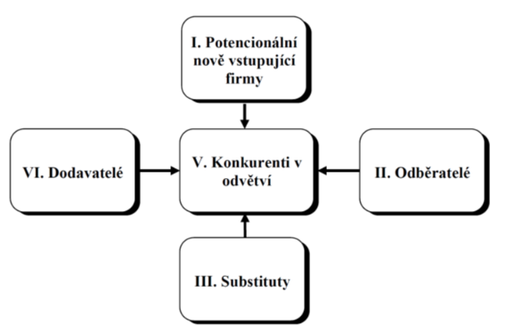
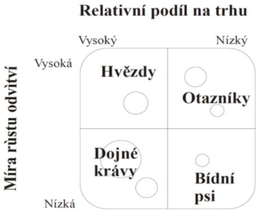
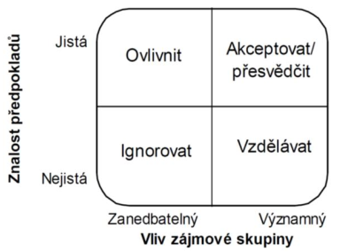
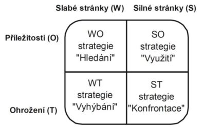

- podnik
    - = ekonomicko-pravni subject
    - = zakladni jednotka ekonomiky zalozena na vyrobe produktu/poskytovani sluzeb
    - = usporadany soubor zdroju pomoci nihz podnikatel/vlastnik zhodnoceuje vlozene prostredky

    - cile
        - primarni cil: zhodnoceni prostredku vlozenych vlastniky (=> zisk)
        - odvozeny cil: maximalizace hodnoty podniku
        - dilci cile: ovlivnene zajmovymi skupinami

- strategicke rizeni
    - strategie = dlouhodoby pohled/smer vyvoje podniku (koncept/abstrakce sdilena vsemi zainteresovanymi stranami)
    - strategicke rizeni = vrcholove rizeni rozvoje podniku jako celku v delsim casovem horizontu
        - proces kde se urcuji dlouhodobe cile a zamery
        - zamereni se na rozsahy jednotlive cinnosti podniku
        - hlavni smysl: vsichni zamestnanci vi jake jsou spolecne cile a chovaji se tak aby se naplnily

    - integrovany model procesu strategickeho rizeni

        

    - poslani podniku
        - = "kdo jsme, co delame a kam smerujeme"
        - = vyjadreni zakladniho smyslu a ucelu existence podniku (proc byla firma zalozena?)
        - otazky ktere mohou byt pouzity pro formulaci poslani podniku:
            - kdo jsou zakaznici?
            - jake jsou nase vyrobky/sluzby?
            - na jakem trhu soutezime?
            - jake jsou nase zakladni hodnoty?
        - v obecne rovine je to vize a mise podniku
            - vize = cim by mel podnik byt (zameruje se na budoucnost)
                - napr: Tesla chce aby se lidi v budoucnu prepravovali vyhradne elektromobily 
            - mise = zpusob jak se firma snazi naplnovat to, ceho chce dosahnout - jak se dostat do idealniho stavu (viz vize)
    
    - zamery & cile
        - konkretizace vize (stanovim si urcite cile ktere mi dohromady tvori misi za ucelem naplneni vize)
        - cile
            - ceho chce podnik dosahnout (v kratkodobem i dlouhodobem horizontu)
            - operativni vymezeni zameru
            - musi byt v souladu se zamerenim podniku
            - SMART cile
                - **S**pecific (specificky)
                - **M**easurable (meritelny)
                - **A**ttainable (dosazitelny)
                - **R**ealistic (realisticky)
                - **T**imely (casove vymezitelny)
                - napriklad: "do 4 let se naucim spalenky na uroven B1"
                    - specificky: naucit se spalensky
                    - meritelny: uroven B1
                    - dosazitelny: za 4 roky se to da, asi?
                    - realisticky: je to realisticky cil - muzu si zapsat kruzy spanelstiny
                    - casove vymezeny: do 4 let
        - zamery
            - zahrnuji financni i nefinancni zajmy ruznych zajmovych skupin
            - umoznuji a podporuji zduvodnene kompromisy napr u protichudnych cilu
            - napriklad snizovani nakladu + zachovani dobrych vztahu se zamestanci
        - jednotlive zamery mi davaji dohromady cile? Cile mi pak davaji dohromady misi, coz je zpusob naplneni vize?

- hledani podnikove strategie
    
    

    - musim analyzovat jak vnejsi prostredu (STEP, Porterova analyza) tak i vnitrni (SWOT, analyza jednotlivych funkcionalich oblasti), plus jeste musim analyzovat zajmove skupiny
    - z toho musim udelat nejake zhodnoceni ruznych rizik a prilezitosti, tak abych mohl vhodne regulovat (upravit strategii rizeni podniku)

    - analyza vnejsiho prostredu
        - Porterova analyza peti sil
            - vychazi ze systematickeho popisu vlivu pusobicich na jednotlive podniky na trhu

            

            - model je postaven na nasledujicich peti faktorech
                1. rivalita mezi konkurenty (stred diagramu)
                2. vyjednavaci sila dodavatelu
                    - schopnost ovlivnit cenu a dodavane mnozstvi (napr omezeni dodavky plynu)
                3. vyjednavaci sila odberatelu
                    - schopnost ovlivnit cenu a poptavane mnozstvi (napr vse koupi jedna firma protoze si to muze financne dovolit)
                4. ohrozeni ze strany novych konkurentu
                    - napr OpenAI vs Google
                    - Amazonizace: do urcitych odvetvi vstoupi Amazon a postupne ho cele ovladne a vytlaci ostatni firmy
                5. ohrozeni ze strany novych substitutu
                    - produkt jineho typu ktery ale uspokojuje stejnou potrebu
                    - napriklad kun -> auto nebo Android -> Apple

        - STEP analyza
            - zkouma ruznorode faktory ktere mohou ovlivnt danou organizaci z jejiho bezprostredniho okoli
            - to jake faktory firmu nejvice ovlivnuji vzdy zalezi na tom co fima dela, na jakem trhu se pohybuje atd.
            - **S**ocialni (spolecenske) faktory
                - zpusob zivota lidi vcetna zivotnich hodnot
                - napriklad uroven vzdelani, pristupy k praci (Amerika vs Cina)
            - **T**echnologicke faktory
                - souviseji s vyvojem vyrobnich prostredku ci materialu, procesu a know-how
                - napriklad objevy/vynalezy, zmeny technologii, vladni vydaje na vedu a vyzkum (viz ChatGPT)
            - **E**konomicke faktory
                - pusobeni a vliv ekonomiky
                - inflace, tren a vyvoje HDP (pouziva se k vyjadreni vykonnosti ekonomiky), nezamestnanost, uroky, atd.
            - **P**oliticke
                - napr: stabilita vlady, regulace zahranicniho obchodu, dane, ochrana zivotniho prostredi, atd.

            - vyhodnoceni faktoru je zalozeni na zodpovezeni nasledujicich otazek
                - a) ktere z vnejsich faktoru maji vliv na podnik?
                - b) jake jsou mozne ucinky techto faktoru?
                - c) ktere z nich jsou v blizke budoucnosti nejdulezitejsi?
            - da se pouzit napr i pri expandaci firmy do jine zeme (nevime jake) -> udelame si statistiku jednotlivych faktoru (data se daji najit online); priradime vahu jednotlivym faktorum => vazenym prumerem vybereme nejlepsi zemi pro expandaci.

    - analyza vnitrniho prostredi
        - Analyza vysledku v jednotlivych funkcionalnich oblastech
            - zakladni metoda
            - oblasti
                - vyroba (napr naklady a prodejni cena vyrobku, efektivita postupu)
                - finance (trendy trzeb, zisk)
                - marketing
                - uroven rizeni a lidske zdroje (kvalifikace pracovniku; fluktuace = jak moc se ve firme stridaji zamestnanci)
                - vyzkum a vyvoj (R&D) - cile a atmosfera podniku ve vztahu k vyzkumu, navratnost investic

        - Bostonska matice
            - jedna se o tzv portolio metodu
            - podstatou je hodnoceni jednotlivych produktu ve dvou dimenzich
                1. relativni podil na trhu - pomer trzeb firmy a nejvetsiho konkurenta
                2. mira rustu v danem odvetvi - zvysujici se trzvy za jednotlive produkty

            

            - dojne kravy = nepotrebuji vysoke investice, jsou zakladem ziskovosti
            - hvezdy = silne v porovnani s konkurenci, ale casto potrebuji velke investice aby si udrzely pozici vuci konkurentum, maji potencial ze se z nich stanou dojne kravy
            - otazniky = je treba je nadejne podporovat aby se s nich staly hvezdy (reklama, dilci inovace), vetsinou se jedna o pocatecni bod pro zacinajici podniky
            - bidni psi = produkty jiz bez potencialu => utlumit vyrobu, stahnout z trhu (viz Yahoo vyhledavac?)

            - bezny cyklus
                - produkt zacne jako otaznik, pak se z stanou hezdou, po nejake dobe odvetvi prestane rust -> stane se dojnou kravu a na konci cyklu se z nej stane bidny pes

    - analyza zajmovych skupin
        - aby se stala strategie uspesnou je nutne zajistit aby nebyla v rozporu se zajmy rozhodujicich zajmovych skupin
        - cilem je:
            - identifikovat relevantni zajmove skupiny
            - identifikovat a otestovat predpoklady o zajmovych skupinach
                - 2 typy zakladnich predpokladu -> podporujici a omezujici strategii
        - kontexty analyzy vlivu zajmovych skupin
            - kulturni kontext
                - porozumeni hodnotam, ktere spolecnost uznava
                - nazory, hodnoty a meneni lidi uvnitr podniku
                - vlivy na podnik lze rozlisit na 
                    - hodnoty spolecnosti (ruzne napr v Japonsku a USA)
                    - organizovane skupiny (odbody, cirkev, politicke strany, atd.)
            - politicky kontext
                - posuzujeme jak ruzna ocekavani jednotlivcu nebo skupin mohou ovlivnit ucel podniku (bezny je konflikt ve vztahu k aspektum podnikove strategie)
                - priklady konfliktu zajmu
                    - rust rodinneho podniku muze vest ke ztrate kontroly, bude-li nutno najmout profesionalni manazery
                    - vsup na masove trhy muze vest ke snizeni kvality produkce
            - eticky kontext
                - tyka se vlivu podniku na chovani jednotlivcu a na hodnoty sdilene spolecnosti
        - zajmove skupiny: majitele, management, zamestanci, dovatele, odberatele, mistni komunita, atd.
        - vysledek analyzy zajmovych skupin

        

    - SWOT analyza
        - podstatou je identifikovat silne a slabe stranky uvnitr organizace a poznat klicove prilezitosti a hrozby ktere na organizaci pusobi zvenci
        - interni
            - tykaji se nasi firmy, nasich znalosti, naseho pristupu a naseho produktu
            - Strengths - adekvatni financni zdroje, dobra povest, lepsi reklamni kampan (nez jine firmy)
            - Weaknesses - nejasny strategicky zamer, nedokonala distribucni sit, nevyuzite kapacity, vysoke naklady
        - externi
            - tykaji se vnejsiho prostredu, pozice na trhu, konkruance, atd.
            - opportunities - vstup na novy trh, rozsirit nabidku vyrobku, rychly rust
            - threats - konkurence s nizsimi naklady, pomaly rust trhu, menici se potreby zakazniku
        - vysledkem je vymezeni pozice na trhu!!

            

        - SO (strategie vyuziti)
            - vyuziti silnych stranek ke zhodnoceni prilezitosti objevujici se na vnejcim prostredi
            - idealni stav (v realu prakticky nedosazitelny)
        - WO (stregie hledani)
            - strategie zamereny na odstraneni slabych stranek vyuzitim prilezitosti, ktere podnik ma...
            - napriklad nabor novych kvalifikovanych sil (zamestnancu)
        - ST (strategie konfrontace)
            - tyto strategie jsou vyuzity pokud ma podnik dostatecne zdroje (vyhody) na primou konfrontaci s konkurenci
        - WT (strategie vyhybani)
            - patri mezi obranne strategie
            - zamerene na odstraneni slabych stranek a na vyhnuti se nebezpeci z venci
            - napriklad omezeni vydaju nebo vyhlaseni bankrotu

    - obecne nam tyto metody pomohou si polozit ty spravne otazky a z toho by pak mela vykristalizovat volba strategie rizeni podniku

- volba strategie
    - samotna volba vysledne strategie je procesem ktery se sklada z nasledujicich korku:
        1. generovani alternativnich strategii (napr pomoci brainstrormigu = technika skupinove kreativity na generovani co nejvice napadu na dane tema)
            - zrejme/jasne alternativy
                - pouze rozvijeni/drobna uprava soucasne strategie (novy produkt, novy reklamni program ktery zmeni image vyrobku)
                - kreativni alternativy
                    - novy pristup k reseni problemu (opusteni dosavadnich stereotipu)
        2. porovnani a hodnoceni strategickych alternativ
            - kriteria
                - prijatelnost (plni ocekavani pro relevantni zajmove skupiny?)
                - vhodnost (je vhodna pro podminky prostredi a kterem se podnik nachazi?)
                - realizovatelnost (da se strategie realizovat z dostupnych zdroju?)
                - poskytnuti vyhody (poskytuje nam strategie nejakou konkurencni vyhodu?)
        3. vyber alternativy jako budouci strategie
            - napriklad pomoci skupinoveho hlasovani