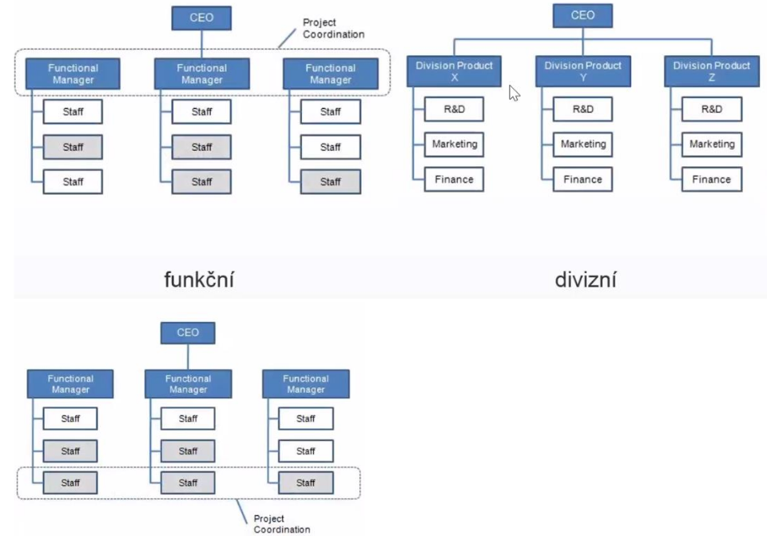
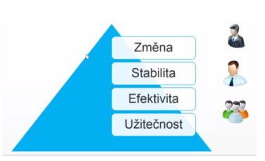
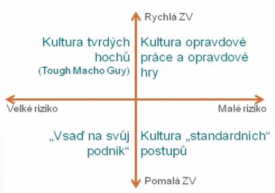

- organizacni struktura firmy
    - "firma je kdyz vezmete hromady lidi a penez a date je do jednoho domecku"
    - zakladni modely

    

    - funkcni
        - oddeleni podle toho co delaji
        - napriklad vyroba, zakaznicka podpora, marketing, finance, HR, R&D, atd.
    - divizni
        - "zvetseni" funkcniho
        - vzniknout jakesi firmy ve firmach (divize) ktere jsou do urcite miry autonomni
        - vedeni resi spise strategicke cile a neresi operacni (dilci) zalezitosti
    - maticova (evoluce funkci)
        - nekdy je potreba delat projekty napric funkcni organizacni strukturou (napr projekt ve kterem je zapojeno jak marketingove tak financni oddeleni)
        - projektove / produktove vrstvy
            - produktova vrstva: cilem je vytvoreni co nejlepsiho produktu s co nejvetsim mnozstvim funkcionality
            - projektova vrstva: cilem je dokoncit projekt v cas, neprekrocit rozpocet a dodrzit normy a standardy
            - skupina zamestnancu se presouva mezi zakaznikami atd.
            - problem - clovek muze mit vice nez 1 sefa
            - velmi casta u velkych korporatu

- teorie vitality
    - pojednava o tom jake vlastnosti by mel podnik splnovat, tak aby se udrzel na trhu
    - kazda firma musi byt uzitecna (musi delat neco co lide opravdu potrebuji)
    - zaroven to ta firma musi delat efektivne aby mela nejaky zisk a mohla napr platit zamestance
    - musi si zajistit stability napriklad tim ze bude mit vice nez jednoho odberatele ("vice noh businessu")
    - zaroven musi byt schopna reagovat na zmeny (vyhlasky, nove trendy v technologiich atd)

        

- firemni kultura
    - rika jak se lide chovaji vuci sobe, jake sdili hodnoty a jake pouzivaji metody
    - priklady dalsich aspektu ktere spadaji do firemni kultury
        - individualita vs tymova prace
        - jak se organizace zajima o lidi
        - ochota riskovat
        - reseni konfliktu
    - deleni podle miry zpetne vazby a ochoty podstupovat riziko

        

        - kultura opravdove prace - je dana nejaka cesta/vize, ktere se veri a po ktere se jde
        - kultura "standardnich" postupu - jako ve statni sprave (nikdo na sve triko nic nevezme)
        - deleni podle klimatu
            - Etika - spravi lide, zamestnance to bavi, chteji byt dobri
            - byrokraticke organizace selhavaji v krizich (napr. ministerstvo zdravotnictvi behem covidu)
        - leadership
            - boss: direktivni rizeni, poslusnost, prikazy
            - leader: vedeni prikladem, koucovani, inicivita, inspirace zamestnancu

- firemni hirearchie a rozhodovani
    - procesy rozhodovani
        - majority rule (hlasovani)
        - consensus (presvedcovani, shoda nad jednim nazorem) -> nutnost dlouhych meetingu
        - hirearchicky (chain of command)
        - kazdy zpusob ma sve vyhody napriklad v rychlosti rozhodovani
    - firemni hirearchie
        - top management
        - middle management
        - operations
    - vlastnicka struktura
        - na vsechny vyse uvedene veci ma vliv vlastnicka struktura
        - fyzicka osoba
        - s.r.o (jednatele)
        - a.s. (spravni dozorci rada)

    - role:
        - CEO (Chief Excecutive Officer) - reditel
            - na vrcholu ekosystemu
            - dohlizi na vykonny tym
            - obvykle je pouze jeden CEO ve firme
        - CFO (Chief Financial Officer) - financni reditel
            - odpovedny za financni rizika spolecnosti
            - dohlizi zda tym dela chytra financni rozhodnotu
        - CIO (Chief Information Officer)
            - odpovedny za rizeni provozu a vyvoje v oblasti informatiky v ramci firmy
            - sladuje cile organizace a zajistuje jejich podporu informacnimi a komunikacnimi technologiemi
            - provadeni nakladnych analyz ICT a rizeni bezpecnosti a rizik v oblasti IT
        - COO (Chief Operating Officer)
            - analyza dat, segmentace zakazniku
            - mereni efektivity produkce
            - komunikacni strategie
        - CMO (Chief Marketing Officer)
            - obstarani a zachovani zakazniku
            - pruzkum trhu a sprava znacky
            - reklama
        - CTO (Chief Technology Officer)
            - koordinace technickych zalezitosti vyroby, vyzkumu a vyvoje
            - realizuje technologickou strategii
        - politicke role
            - generalni reditel (xicht firmy)
            - vice prezident pro xxx
                - ma na starost danou oblast
                - spise analyza, resi smerovani businessu, poradni sbor pro exekutivu
        - dalsi terminy
            - decision maker (D.M.)
            - influencer: ten kdo neco chce (neni to D.M. ale snazi se ho ovlivnit)
            - LOB (line of business) manager: manazer v nejakem useku; snazi se naplnit nejaky plan
                - LOB je obecny pojem ktery popisuje produkty/sluzby nabizene odnikem
                - napriklad spolecnost vyrabi pevne disky => LOB muze byt "datove uloziste"
            - process owner: ten kdo je zodpovedny za dany proces
    - rizeni
        - strategicke: viz strategie rizeni podniku - nejvyssi management; dlouhodobe
        - takticke: middle (day-to-day) management; strednedobe
        - operativni: kratkodobe