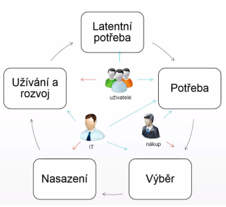
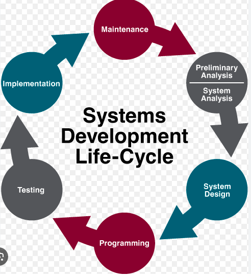

- zacne to latentni (skrytou) potrebou uzivatelu mit nejakou funkcionalitu
- z toho vykrystalizuje pojmenovana potreba
- pri vyberu se hledi na to jaky prinos bude mit konkretni reseni pro uzivatele (IT resi architekturu a integraci, technicke reseni, bezpecnost, atd)
- management resi cenu
- IT to pote nasadi
- po nejake dobe -> inovacni cyklus ci trvale odebrani systemu

- planovani IS
    - identifikace potreb
    - vnitrni vlivy (strategie firmy, fuze - muze vest ke sjednoceni vicero systemu)
    - vnejsi vlivy - legislativa (napr zavedeni EET - nutne reagovat)
    - planovani financi a zdroju (napr kde se system nasadi atd)
    - koordinace projektu - ve firme toho muze bezet spoustu a je potreba to nejak koordinovat
    - zpusob porizeni - krabicove reseni vs reseni na miru?

- analyza IS
    - detailni analyza potreb, funkci, parametru - muze byt casto obtizne
    - ustanoveni realizacniho tymu, pracovni skupiny - u velkych zmen (velkych systemu) na analyze pracuje cely tym
    - identifikace omezeni - napriklad finance, cas, lide, atd.

- vyber reseni a dodavatele (nakup)
    1. poptavka
    2. vyberove rizeni

- dodavka, implementace IS
    - implementace - dny az roky
    - soucinnost
    - customizace
    - integrace se stavajicimi systemy
    - migrace dat
    - QA (= quality assurance testing), testovani
    - UAT (= uzivatelske akceptacni testy)
    - zaskoleni lidi
    - predani

- postimplementacni podpora
    - doladeni systemu (tydny az mesice)
    - L1 podpora - uzivatelska (helpdesk)
    - L2 podpora - systemova (admin)
    - L3 podpora - aplikacni (vyvojar) - zmena kodu

- provoz a podpora
    - radove roky
    - implementace dilcich zmen
    - aktualizace, patchovani bezpecnostnich chyb a bugu
    - monitoring (vykon, spolehlivost)
    - helpdesk, servicedesk, ITIL
        - helpdesk = zameren na bug-fix
        - servicedesk = zameren  i na RQI a request for new services
    - reportovani chyb
    - sledovani nakladu (cena za energii a provoz)

- ukonceni, migrace
    - doziti
    - zamrazeni investic
    - priprava akvizice noveho systemu
    - casto opomijena faze zivotniho cyklu IS (musi byt brana v potaz uz pri navrhu aby bylo na konci jednoduche vyradit system z provozu)

