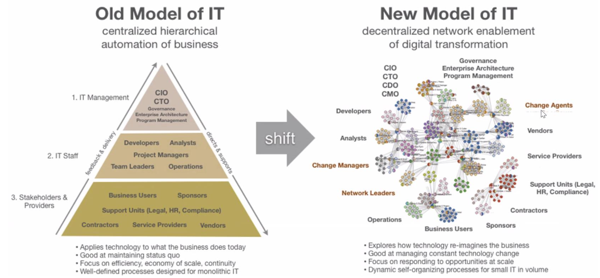
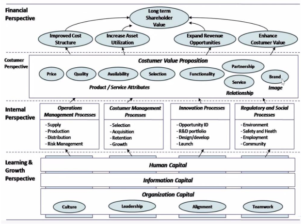
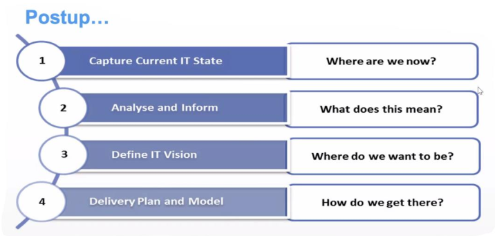
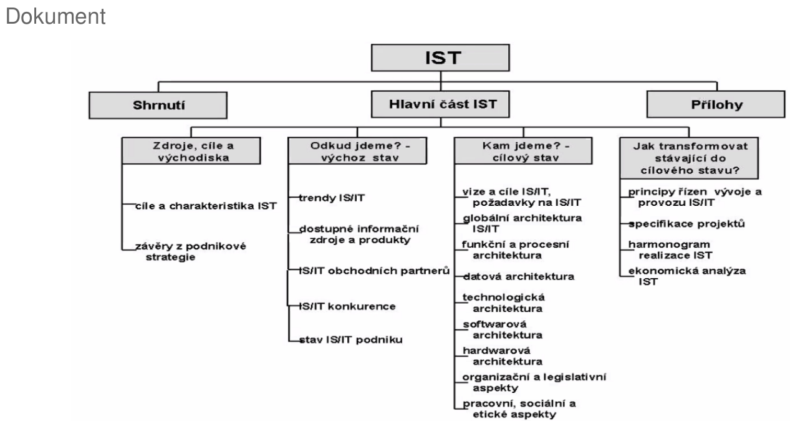
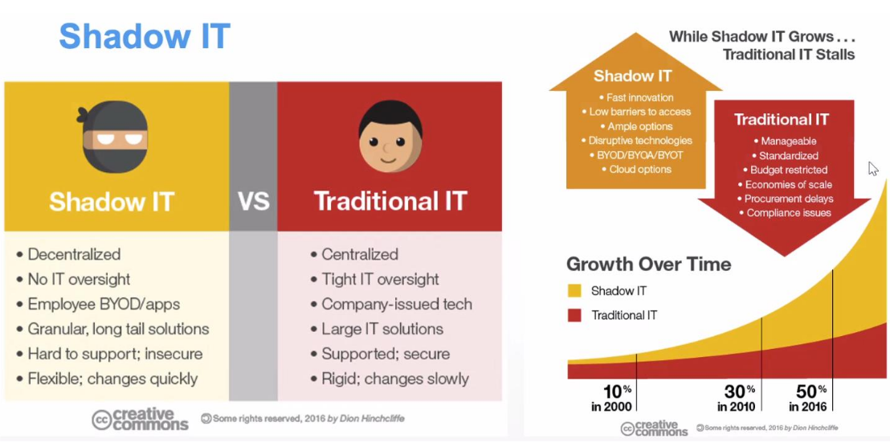

- jak uchopit IT? jak jej ridit a jak jej rozvijet?
- ITS = Information Technology Strategy
    - dlouhodoby plan ktery vychazi z business strategie (globalni strategie podniku)
    - mela by byt dostatecne flexibilni aby se dokazala prizpusobovat menicim se podminkam a cilum
        - obecne IT se silene rychle rozviji
    - cile:
        - zvysovat vykonost podniku
        - podporovat dosazeni strategickych cilu
        - ziskat pro podnik konkurencni vyhodu
    - jedna se o kontinulani proces ktery musi byt neustale vyvijen a udrzovan; zaroven se porat musi dodrzovat integrina na nekolika urovnich (podle MDIS)
        - integrace vizi
            - sjednoceni pohledu vrcholoveho vedeni na vyznam IT
        - integrace podniku s okolim
            - podpora procesu ktere presahuji hranice podniku (vztahy s prarnety, menici se trh, ...)
        - integrace internich podnikovych procesu
            - zefektivneni - cas, zdroje
        - tehcnologicka integrace (HW - site, SW)
        - metodicka integrace
            - tvorba jednotne metodiky vyvoje, provozu a udrzby IS
    
- co je strategie?
    - vize - proc to delame
    - strategice - co delame
    - taktika - jak to delame
    - (+ operativni rizeni)

- stary a novy model IT
    
    

    - stary model
        - nahore je nejaky CIO/CTO ktery rika jak to bude
        - rizeni je shora a dole je zpetna vazba
        - centralni rizeni muze byt efektivni (pokud funguje)
            - obvykle ale nefunguje ve slozitem a rychle se menicim prostredi
    - => decentralizace (novy model)
        - kazde oddeleni provadi svoje rizeni a svoje optimalizace
        - pri decentrlaizaci je strategie o to dulezitejsi a musi ji chapat vice lidi

- Business strategie
    - IT strategie by mel byt podrizena business strategii.
    - Business strategie proto ale musi byt dospela a IT musi vybirat nejlepsi mozne nastroje
    - zapis napr pomoci strategicke mapy:

    

- Zapis strategie IT
    
    

    1. zachyceni soucasneho stavu IT - "Kde jsme"
    2. Anaylza - "Co to pro nas znamena? Je to dobre nebo spatne?"
    3. Definice IT vize - "Kde chceme byt?" (realisticky cil; SMART cil?)
    4. Jak toho dosahneme (nastaveni pravidel, procesu, projekty, ...)

    

- role IT v podniku (ruzne pohledy)
    - "motor/strojovna"
        - auto bez motoru nejede, dulezita komponenta - toto asi neni moc dobry pristup,lepsi je kdyz se na IT divame jako na takovy enabler co nam usnadnuje a zefektivnuje veci a procesy
    - poskytovatel sluzeb
        - IT poskytuje firme sluzby
    - soucast businessu
        - rozpusteni IT do jednotlivych LOB - neni samostatne IT oddeleni ale kazda jednotka ma sve IT (jako maticova struktura organizace firmy) => lide z IT jsou blize businessu
    - "kazdy sve IT"
        - bez centralniho rizeni, hrozi shadow IT

- shadow IT
    - lidi/oddeleni pouzivaji co potrebuji bez ohledu na IT dane firmy
    - pripadne IT ve firme kde neni rizeno IT
    - pokuseni dostupnych SaaS aplikaci (Software as a service = platime si preplatne => sluzba)
    - par zamestancu zacne pouzivat Google Drive
    - uchopeni
        - hrozba: unik dat, ztrata znalosti (napr. kdyz zamestnanec odejde)
        - discovery
        - IT-manage
            - prevzit na tim kontrolu
            - zajisteni veci jako je sprava, zalohovani, security, atd.

    