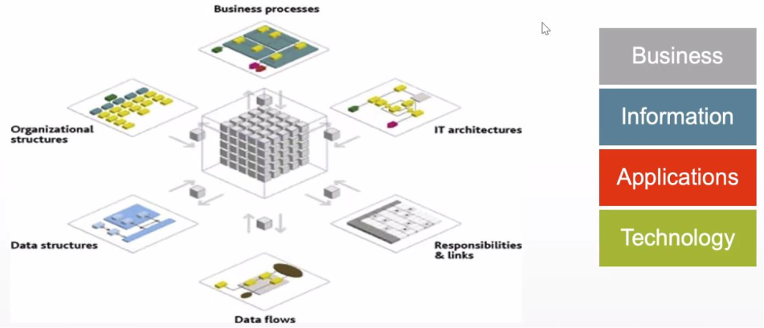
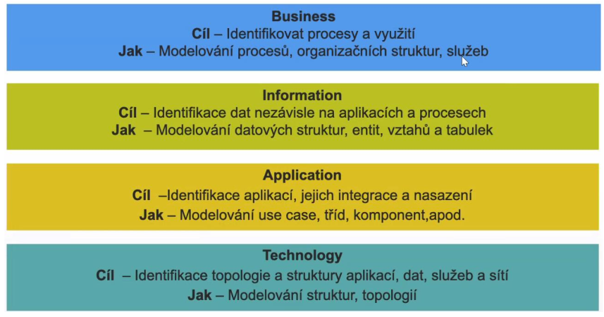
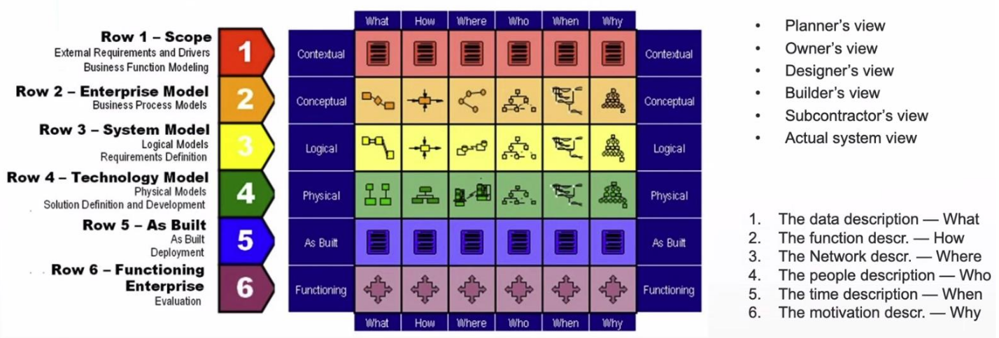
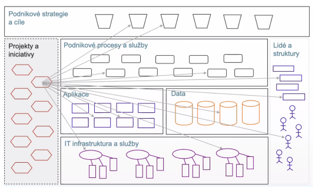

- paralela: stavime dum (architektura, to co vetsinou delame my) vs stavime mesto (enterprise architektura)
- muzeme postavit pekny dum, ale kdyz chybi utilities, doprava, obchody...tak to neni uplne ono
- proto se musi rict tady bude ulice tady bude parkoviste protoze tohle se pak v ramci jednotlivych stavebnich bloku uz neresi, povazuje se to za dane
- EA je jako urbanisticka koncepce
- jednotlive systemy a aplikace mohou byt dobre/uzitecne/mit dobre funkce a parametry ale jde o to jak je pouzivat dohromady -> jak efektivne pouzivat data z jednoho systemu v druhem a jak je spravovat
- EA rekne: takhle budeme delat autentizaci (treba LDAP), databaze, takhle zalohovani a pote bude snaha se drzet zvolene platformy
    - zavedeni nove platformy znamena ze budeme muset najmout lidi kteri to budou schopni spravovat
- EA se dela hlavne ve vetsich firmach
- EA neni IT disciplina
    - je na pomezi IT businessu a managementu
    - spis je to takovy zavazek mezi IT a businessem

- zakladni struktura
    - EA umoznuje IT ve firme rozdelit na nejake kusy, se kterymi pote muzeme lepe pracovat (metoda rozdel a panul)
    - tyto kusy mohou byt standardizovane

    

    - vetsinou se podnikove IT da rozdelit na 4 zakladni vrstvy

    

    1. business
        - identifikace a modelovani business procesu
        - organizacni struktura spolecnosti
        - silne se prolina s tradicnim managementem (je pristupny i osobam mimo IT)
    2. information
        - vytvari se datovy model spolecnosti zahrnujici definici nejdulezitejsich informacnich entit
    3. aplikacni
        - aplikacni portfolio (aplikace pouzivane ve spolecnosti) jejich integrace a nasazeni
    4. technicka
        - technicka stranka IT
        - site, HW

- frameworky
    - zachman
        - jeden z prvnich frameworku ktery se zabyval komplexnim popisem cele organizace jako celku
        - diva se na organizaci z ruznych pohledu
            - 6 urovni popisu (prespektivy)
                - scope - rozsah (planner)
                - business model - business procesy a tak (owner)
                - system logic - design (designed)
                - technology model - programovaci jazyk, IO zarizeni, ... (builder)
                - As build (pohled subcontraktora)
                - funkci (actual system)
            
            - 6 pohledu na organizaci (kazda perpektiva odpovida na "stejne otazky")
                - data
                - funkce
                - umisteni
                - lide
                - cas
                - motivace

        

        - 6x6=36 bunek
            - = ruzne pohledy na to jak ty systemy namalovat nebo popsat. trochu podoba s UML ale vice pohledu
            - nektere veci v UML nenamalujeme
                - napr kde mame servery, jak vypadaji procesy, kudy tecou data, aplikace, atd.

    - dalsi frameworky
        - TOGAF
        - FEA (EA pro federalni vladu USA)

- vztahy a vazby v IT

    

    - prirazeni konkretnich entit ke strategii - dobre zejmena u velkych solecnosti, kde je tezke udrzovat prehled