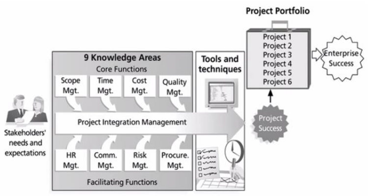
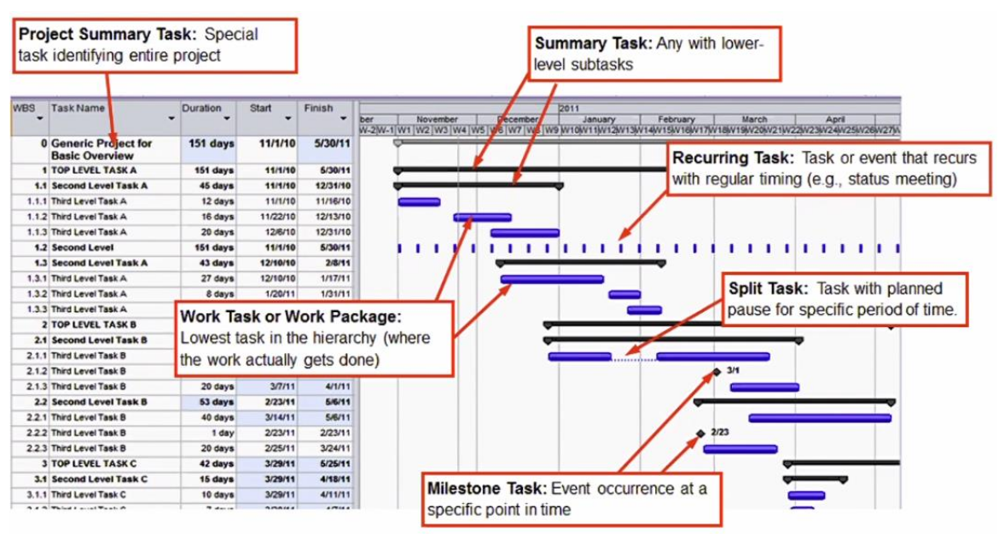
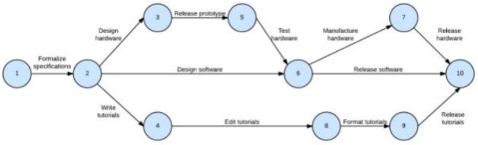
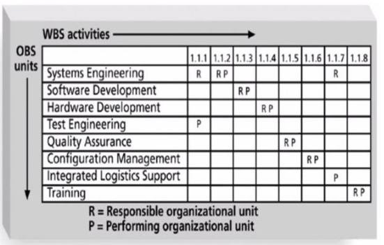
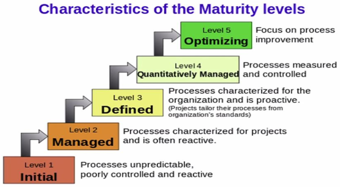

- PMBOK = souhrn znalosti o tom jak delat projekty
    - project management body of knowledge
    - mezinarodne uznavany standard rizeni projektu
    - zakladem jsou rozpoznatelne znalostni oblasti
        - sada pojmu, poznatku, procesu, technik, ktere tvori oblast projektoveho rizeni

    

- PMBOK definuje 9 oblasti rizeni projektu
    1. rozeni rozsahu projektu
        - co se ma/nema udelat a jak se to ma udelat
        - prostrednictvim pozadavku
        - MoSCoW
             - M = must have
             - S = should have
             - C = could have
             - W = won't have
        - priorita (1-3 urovne)
        - typy
            - funkci
            - mimo funkcni (skalovatelnost, pouzity typ DB, ...)
            - pozadavky na zmeny (pridani, modifikace, odstraneni, ...)
        - WBS = Work Breakdown Structure
            - defailni rozklad pracovnich ukolu do hirearchie
            - 1-6 urovni
            - polozky v prvni urovni se navyvaji Work packages
        - zmenove rizeni
            - proces jak menit za pochodu pozadavky a tedy rozsah projektu
    2. rizeni casu projektu
        - proces zahrnuje 
            - definovani aktivit - co je treba vykonak k dosazeni cile
                - aktivita (task / ukol / cinnost) je nejaka atomicka jednotka prace
                - ma nejake odhadovane trvani, potrebne zdroje (to ve WBS nebyva)
            - sestaveni planu - na zaklade nezavislosti aktivit, zdroju a trvani
            - rizeni planu - dohled a rizeni zmen v projektovem planu
        - usporadani aktivit tak aby to daval smysl - PDM diagramy, PERT diagramy, gant diagramy, kriticka cesta, ...
        - Precedence Diagram Method (PDM)
            - aktivity jsou reprezentovany boxy, sipky znaci zavislosti mezi nimi
            - umoznuje vypocet kriticke cesty
        - Ganttuv diagram (oblibenejsi)
            - pri vetsim poctu aktivit je prehlednejsi nez PDM

            

        - PERT (Program Evaluation and Review Technique)
            - kruhy spojene sipkami
            - pouziva se k rizeni slozitych akci majici nahodnou povahu
                - doba trvani akce se chape jako nahodna velicina
            - je to zobecneni kriticke cesty
                - nejkratsi doba projektu ktera je realna => kdykoliv prodlouzim task ktery je na kriticke ceste dojde k prodlouzeni celeho projektu

            
    
    3. rizeni nakladu projektu
        - naklad je zdroj ktery vydavame (obetujeme) za ucelem doszeni nejakeho vysledku nebo ziskani neceho na oplatku
        - obvykle v peneznich jednotkach (muze byt i cas)
        - zajistuje ze je projekt dokoncen v ramci rozpoctu
        - zpracovava rozpocet projektu vychazejiciho z podrobneho rozpisu praci, odhadu, nakladu na zdroje a to v celem zivotnim cyklu projektu
        - slovnik
            - prime - lze je snadno spojit s projektem, aktivitami pri jeho realizaci
            - neprime - neprimo spojene s projektem ale souvisi s jeho realizaci
            - sunk cost - naklady za zruseni celeho projetu - pokud bychom se rozhodli projekt zrusit a uz v nem nepokracovat
        
    4. rizeni lidskych zdroju projektu
        - cilem je ziskani co nejvetsiho uzitku od zapojenych lidi
        - proces zahrnuje
            - planovani - jake role a dovednosti budou potreba (DB specialista, konzultant, tester, ...)
            - nabor - ziskani vhodnych lidi uvnitr nebo vne organizace
            - rozvoj dovednosti - individualnich a skupinovych
            - rizeni projektoveho tymu - sledovani vyvoje a motivace clenu, zpetna vazba, reseni konfliktu, koordinace zmen
    
    5. rizeni kvality projektu
        - kvalita = souhrn prvku, ktere prispivaji k dosazeni pozadavku nebo ocekavanych potreb (napr splnuji normu)
        - proces zahrnuje
            - planovani kvality
                - identifikace relevantnich parametru produktu/sluzby a jak jich dosahnout (funkcnost, spolehlivost, udrzovatelnost)
            - zajisteni kvality (QA = quality assurance)
                - zahrnuje aktivity ktere souviseji s dosazenim a urdzenim nastavene urovne kvality (napr ruzne typy testovani)
            - rizeni kvality
                - monitorovani specifickych vystupu projektu a hledani cest, jak celkovou kvalitu zlepsit

    6. rizeni rizik projektu
        - identifikace rizik a jejich ppst + analyza (ohodnoceni) jejich dopadu
        - mitigace
            - ignorovat
            - prijmout
            - protiopatreni
            - delegovat (viz studie proveditelnosti)

    7. rizeni komunikace projektu
        - definice komunikacnich toku mezi vsemi zucastnenymi stranami
        - funguje na zaklade organizacnich struktur
        - u vetsich projektu se dela RAM (= responsibility Assignment Matrix)

        

        - tymy x aktivity z WBS, kdo je zodpovedny a kdo pracuje/implementuje

    8. rizeni obstaravani projektu
        - procesy potrebne k nakupu ci ziskani produktu, sluzeb nebo vysledku potrebnych od subdodavatelu
        - procesy
            - priprava a uzavirani smluv
            - vyberove rizeni a vyjednani smluvnich podminek
            - administrace smluv vcetne monitoringu a dokumentace zpusobu zajisteni dodavky, reseni zmenovych pozadavku

    9. rizeni integrace
        - rizeni 1-8 dohromady
        - metodiky a techniky spojene s planovanim a realizaci projektu se zamerenim na provazanost jednotlivych procesu
        - dobry PM
            - musi koordinovat vsechny vsechny znalostni oblasti napric celym zivotnim cyklem projektu
            - musi videt big picture

- modely vyspelosti projektoveho rizeni
    - CMMI (= Capability Maturity Model Integration)
        - model kvality organizace prace urceny pro vyvojove tymy
        - model ma 5 urovni zralosti a prostrednictvim auditu se hodnoti na jake urovni kvalita tymu je

        

        - initial - Ad-hoc procesy (neprediktovane reaktivni)
        - managed - projekty jsou planovane, monitorovane
        - defined - proaktivni, pouziti standarnich postupu
        - quantitatively managed - sbiraji se namerena staticka data a na jejich zaklade se rozhoduje
        - optimizing - stabilni a flexibilni, zamereni na vylepseni