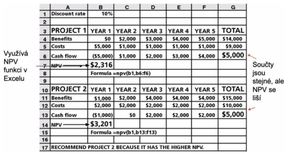
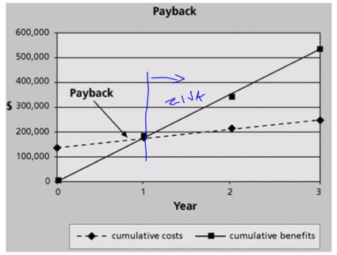
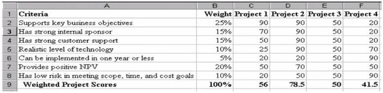

- PPM - project portfolio management
- kdyz ma firma projektu vic, je potreba to trochu standardizovat (stejny styl rizeni, procesy, nastroje, ...) aby bylo mozne napriklad presouvat lidi tam kde je to ptrave potreba, dalo se na to dohlizet, snizily se naklady, atd.
- rizeni paralelne probihajicich projektu ktere sdili stejnou zakladnu zdroju

- hlavni ukoly
    - dosahnuti uspokojiveho plneny prubeznych cilu u vsechn probihajicich projektu
    - optimalizace vyuziti zdroju
    - prioritizovat projekty
    - sjednotit rizeni, procey, nastroje

- projektove metriky
    - cas
    - cena
    - rozsah - pocet naplanovanych / dokoncenych ukolu
    - slozitost - pocet funcionalit

- projektova kancelar (PMO - Project Management Office)
    - skupina lidi nebo samostatne oddeleni v ramci organizace kde jsou udrzovany a definovany standardy projektoveho rizeni
    - dohlizi na probihajici projekty a uchovava vystupy ukoncenych projektu pro budouci uziti (analyza)

- projektova kancelar (PMO) vs Enterprise architektur (EA)
    - projektova kancelar resit dodavku projektu, ne jestli "ma smysl"

- jak vybirat projekty
    - podle toho co prinesou a jestli naplnuji vizi firmy
    - Net Present Value (NPV) - cista soucasna hodnota
        - lze pouzit jako kriterium
        - i kdyz prinout dva projekty stejny vysledny zisk, NPV bude lepsi u projektu, ktery je ziskovy drive
        - metoda nebere v uvahu budouci zisk nebo ztratu za uvazovanym okamzikem (greedy algoritmus?)

        

- Return on investment (ROI)
    - vztazene k nejake dobe (napr. 3 roky)
    - vyjadruje se v %
    - cim vetsim, tim lepsi -> lepe se zuroci nase naklady
    - `ROI = (benefits - costs) / costs`

- payback analysis
    - payback = navratnost
    - doba za kterou se vrati ciste naklady v cistych prijmech
    - chceme co nejmensi (napr. 1-2 roky)

    

- weighted scoring model (WSM)
    - projek ohodnotime vice kriterii
    - kazdemu priradime vahu (soucet musi byt 1)
    - vynasobime a secteme (cim vyssi hodnota tim lepsi)

    