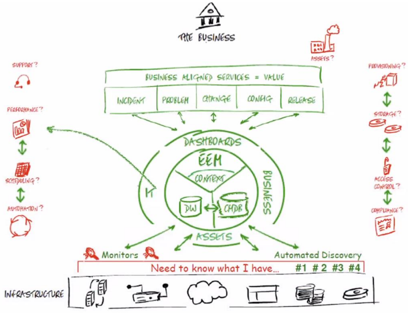
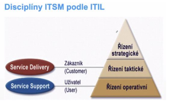
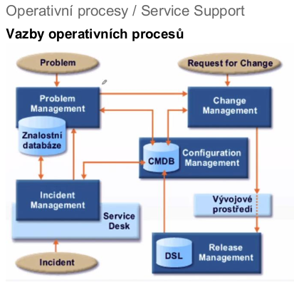
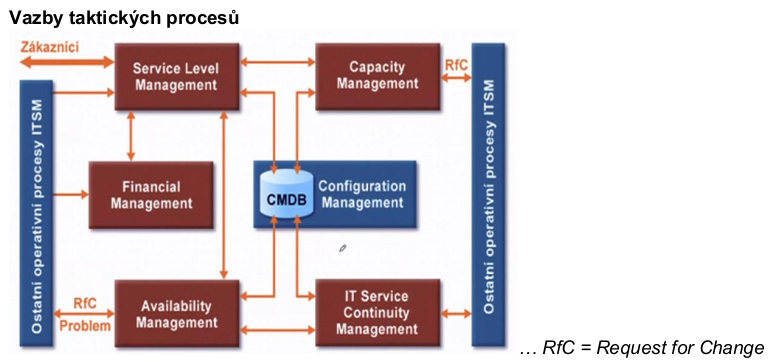

- ITSM (IT Service Management)
    - dive se na IT jako na sluzby
    - IT sluzba je sluzba poskytovana zakaznikovi (internimu / externimu) za vyuziti informacnich technologii (interni zakaznik = sluzbu a produkt vyrabi, nabizi, dela na ni reklamu)
    - IT sluzby mohou mit ruznou povahu
        - business process service (sourht cinnosti, ktery ma nejake vstupy a vytvari vystup ktery ma pro zakaznika hodnotu)
        - application service
        - infrastructure service

     

    - mame nejakou infrastrukturu, jejiz soucasti jsou IT assets (servery, uloziste, ...)
        - monitorovani
    - nad tim mame databaze
        - CMDB - configuracni management DB - jak jsou prvni (assets)
    - nad tim nejaky IT nebo business context - dashboardy atd pomoci kterych muzeme zkoumat performance, security, atd.

- ITIL (information Technology Infrastructure Library)
    - ITIL je rozsahly a procesne orientovany framework pro ITSM
    - zalozeny na best-practices z oblasti ITSM
    - v soucasnosti de-facto mezinarodnim standardem pro oblast ITSM
    - duvody zavedeni ITIL v podniku
        - chceme IT uchopit spravne aby fungovalo levne a spravne
        - standardizace IT
    - ITIL resi
        - vydefinovani procesu potrebnych pro zajisteni ITSM
        - zasady pro implementaci procesu
    - ITIL NEresi
        - konkretni podobu organizacni struktury
        - projektovou metodiku implementace ITSM
    - ITIL v2 (existuje uz asi v5)
        - ma 8 knih (kazda popisuje nejakou cast ITILu)
        - Service Support & Service Delivery
            - jadro ITIL
            - jsou o  rizeni, dodavce a podpore IT sluzeb
            - obsahuje popis 10 zakladnich procesu ITSM a funkce Service Desku
        - ICT Infrastructure management
            - popisuje vsechny aspekty rizeni ICT infrastruktury (identifikace pozadavku, instalace, udrzba, ...)
        - Application management
            - zahrnuje vsechny procesy zivotniho cyklu aplikace (studie proveditelnosti, vyvoj, testovani, ...)
        - Security Management
            - proces planovani a rizeni bezpecnosti informaci a IT sluzeb
        - Business perspective
            - urceno zejmena vedoucim pracovnikum obchdnich a provoznich useku, aby porozumeli "best practices" pro ITSM
        - Planning to Implement Service Management
            - urcena predevsim clenum implementacnich tymu - zabyva se problematikou implementace a zlepsovani procesu ITSM v podnikovem prostredi
        - Software Asset Management
            - procesy rizeni, kontroly a ochany SW majetku (velmi uzce spojeny s Configuration Management a Release Management)

- ITIL procesy

     

     

    - incidenty jsou nejaka selhani / spatne veci, ktere uzivatele davaji do service desku
    - ten se snazime v ramci incident managementu co nejrychleji vyresit
        - vyuziva se pritom znalostni DB (napr jak se restartuji servery)
        - kdyz se incidenty prilis opakuje, tak se z nich stane problem - problem management se pak snazi zabranit tomu aby vznikly dalsi incidenty
            - tak ze se vytvori nejaky pozadavek na zmenu a zada jej do change managementu
    - vsechny managementy jsou napojeny na CMDB (configuration management database), kde jsou ulozeny konfigurace celeho IT
        - nemusi to byt jen relacni DB, ale treba Wiki page, ...
        - napojeni na DSL (definitive software library) kde jsou vsechny instalacky a binarky ze vsech releasu
    - z pohledu ITIL je vyvojove prostredi jen black box - neresi ho podrobneji

- service desk
    - "single point of contact" pro adresovani pozadavku uzivatelu (rozhrani pro uzivatele)
    - zajistuje obnovu standardni dodavky sluzby s minimalnim dopadem na zakazniky
        - plni roli 1. urovne podpory
        - koordinuje 2. a 3. uroven podpory

- configuration management
    - podpora ostatnich procesu poskytovanim informaci o konfiguracnich polozkach infrastruktury a o jejich dokumentaci
    - sprava CMDB (konfiguracni DB) - info o vsech konfiguracnich polozkach ICT infrastruktury a vztazich mezi nimi

- incident management
    - obnovit normalni provoz sluzby (co nejrychleji s minimalizaci dusledku vypadku sluzby na provoz)
    - zajistovat aby sluzby byly dodavany v kvalite dle SLA (= Service-level agreement)
    - snaha o co nejrychlejsi reseni - neresi PROC (to resi Problem Management)
    - incident = neplanovane presuseni IT sluzby nebo snizeni jeji kvality ci dostupnosti

- Problem management
    - analyzuje incidenty, snazi se nalezt pricinu a iniciuje kroky vedouci k naprave (zabranuje opakovani incidentu)
    - stara se o znalostni DB (informace o predchozich incidentech a jejich reseni)
        - informace v ni ulozene zpristupnuje specialistum podpory procesu IM a pracovnikum SD
    - zajistuje svoji cinnosti stabilitu infrastruktury
    - problem = pricina jednoho nebo vice incidentu

- Change management
    - zajistuje hladkou a nakladove efektivni implementaci schvalenych zmen
    - vstup z problem managementu nebo "rozhrani" Change Request
    - odpovida za
        - rizeni odehu Change requestu
        - schvalovani a planovani zmen
        - koordinaci implementace zmen
    - zajistuje svoji cinnosti flexibilitu infrastrukutry

- Release management
    - zajistuje nasazeni novych verzi HW, SW do produkcniho prostredi
    - spravuje DSL (definitive software library) - uloziste autorizovanych verzi SW a dokumentaci (licence, release notes, binarky, ...)
    - RM a CM tvori hranici mezi produkcnim a vyvojovym prostredim

- takticke procesy / service delivery
    - jsou o uroven vys
    - definuji vztah se zakaznikem
    
     

    - SLM (= service level management) definuje sluzbu vuci zakaznikovi - kolik, co, jak, v jake kvalite
    - financial management - IT musi mit nejaky rozpocet; ridi kolik nas ty sluzby stoji - aby se vedelo kolik penez je potreba na provoz IT a taky jak nacenit sluzby at uz jsou zakaznici externi nebo ne
    - SLM je take napojeny na CMDB, kde jsou evidovane i samostatne poskytovane sluzby (service catalog)
    - capacity management - abychom vedeli jak jsme na tom s kapacitou, kdy nam napr dojde misto na disku - aby k tomu nedoslo
        - dalsi priklad: otevreni nove pobocky: CM (capacity management) musi zajistit navyseni kapacity

    - service level management
        - udrzovani a zlepsovani kvality IT sluzeb a vytvaret pozitivni vztah se zakazniky
        - klicovy proces celeho ITSM, protoze tvori spojovaci clanek mezi poskytovatelem a odberatelem IT sluzeb
        - vyjednavani o obsahu a uzavitani
            - Service Level Agreements (SLA) 
                - dohoda o urovni poskytovanych sluzeb
                - popis poskytovane sluzby (rozsah, uroven, kvalita)
            - Operation Level Agreement (OLA)
                - dohoda o urovni provoznich sluzeb
                - dohoda mezi poskytovatelem sluzeb IT a dalsi soucasti teze organizace (zbozi, sluzby, odpovednosti)
            - Underpinning Contracts (UC)
                - dokument pravniho charakteru (SLA a OLA jsou dohody) uzavreny s externim dodavatelem
    
    - capacity management
        - zajisteni optimalni kapacity ICT infrastruktury
        - napr.: otevreme novou pobocku pro 200 lidi -> musime pro ne mit kapacitu v systemech, licence, ...
        - hledani rovnovahy mezi existujici kapacitou a porizeni dodatecne kapacity

    - availability management
        - zajistuje nakladove optimalni dostupknost IT sluzeb
        - stezejsi aktivitou je planovani, mereni a sledovani dostupnosti IT sluzeb
        - dosupnost neda koupit...dostupnost musi byt designovana, implementovana, merena a rizena

    - IT service continuity management
        - zajisteni obnovy funkcnosti ICT infrastruktury po vaznem (rozsahlem) vypadku
        - klicove aktivity
            - zpracovani analyzy obchodnich dopadu globalniho vypadku a minimalizace rizik z nej plynoucich
            - vyvoj a implementace kontingencich planu (tj. planu obnovy klicovych systemu)

    - finantial management
        - sprava rozpoctu IT
        - nakladove efektivni sprava ICT majektu a zdroju pouzivanych pri poskytovani IT sluzeb

- spolehlivost provozu - zkratky
    - HA = high availability
    - BCDC = business continuity data center - zalozni lokalita kde je mozne provizorne provozovat sluzby v pripade vypadku
    - DPR = disaster recovery plan
        - RPO  = recovery point objective
            - jak vzdaleny je bod v minulosti ke kteremu se dokazeme obnovit (treba kdyz delame denni zalohy tak max o 1 den)
        - RTO = recovery time objective
            - za jak dlouho se obnovime po havarii