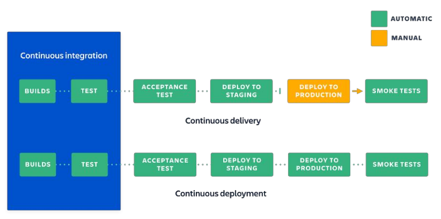

- prpojeni vyvoje SW s jeho provozem a rozvozem
- od velkych monolitickych vydani k prubezne aktualizaci
- business agilita, flexibilita
- Dev = vyvojari, jejihz ukolem je vyvinout produkt a nasledne ho udrzovat
    - kazdou novou verzi predava oddeleni pro podporu rozvozu k nasazeni na produkci
- Ops = zodpovedni za hadke fungovani infrastruktury
    - to zahrnuje predevsim spravu PC siti a serveru
    - casto i poskytovani technicke podpory
- zmenseni mezeri mezi oddelenimi pomoci automatizace - hlavne zavedenim automatizacnich nastroju, spolecnych easy nastroju, se kterymi nasazeni zvladnou i vyvojari

- techniky
    - Continuous integration (CI)
        - kazdy clen tymu integruje svoji cast prace prubezne, obvykle alespon jednou za den
        - kazda integrace je overena automatickym sestavenim po kterem nasleduji automaticke testy
    
    - Continuous delivery (CD)
        - dodani zmen na produkci a to bezpecne a rychle a udrzitelnym zpusobem
        - klicove je vytvoreni spolehliveho automatizovaneho procesu pro nasazeni produktu (nasazeni by nemela byt mimoradna udalost)
    
    - Continuous deployment (CD)
        - jede jeste dale, nez continuous delivery
        - kazda zmena ktera projde vsemi fazemi od sestaveni po testovani je nasazena k zakaznikovi (odpada tedy i posledni manualni krok)
        - odpada tzv "release day"

