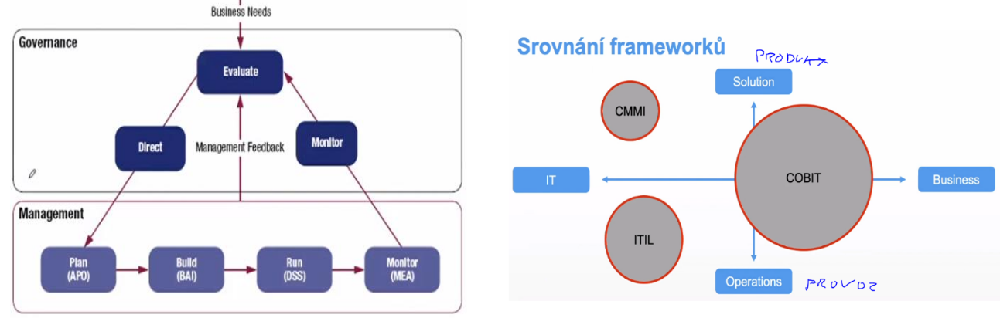
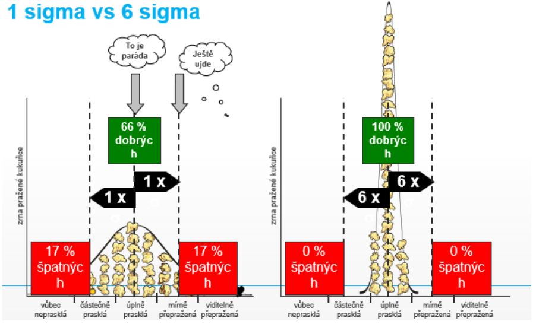

- termin ktery se pouziva pro celkovy pristup k rizeni IT procesu, jehoz cilem je sladit businessovou cast a IT cast organizace
    - je to o strategickem rizeni IT

- governance vs management
    - management
        - soustredeni se na poskytovani sluzeb a produktu IT a na ucinne rizeni a provoz IT
        - odpovednosti stredniho a nizsiho vedeni
        - stara se predevsim o: plany, bez, monitorovani
        - mezinarodne uznavany ramec: ITIL

    - governance
        - snaha definovat strategicke cile IT v souladu s potrbami a zajmy cele organizace
        - odpovednost nejvyssiho vedeni
        - stara se predevsim o: evaluaci potreb businessu, pokyny, monitoring
        - mezinarodne uznavany ramec: COBIT (Control Objectives for Information and related Technology)

- COBIT (Control Objectives for Information and related Technology)
    - je procesne orientovany - snazi se definovat co v tom IT delame - s vazbou na IT zdroje, pozadavky businessu
    - zavadi metriky
    - umoznuje hodnoceni zralosti procesu ("takhle se to dela zakladne; takhle se to dela pokrocile")
    - domeny
        - celkem 4 domeny
            - plan and organize
            - acquire and implement
            - service and support
            - evaluate
        - domeny vyjmenovavaji procesy co vse mame ridit - podobne jako ITIL (ale je jich mnohem vic)
        - ke kazdemu procesu rika jake jsou IT cile, ke kazdemu cili rika jake metriky puzit pro hodnoceni stavu
    - COBIT je rozsahla komplikovana vec, ale ve velkych firmat nic moc jineho nezbyva nez to delat podle neceho takoveho..nejak se ty veci musi ridit a je lepsi to delat standardizovane podle znameho frameworku

    - BSC (Balanced Scorecards)
        - = vyrovnany prhled vysledku
        - management zalozeny na metrikach, ktery se snazi prosazovat strategicke cile
    
    - dimenze planovani (metriky)
        - zakaznik: "jak jsme na tom v ocich zakaznika?"
        - finance - financni uspech pdniku
        - procesy - "ktere procesy je treba zlepsit, abcyhom uspokojili zakazniky a akcionare?"
        - uceni se a rust - spokojenost zamestnancu, jejich vzdelavani a rozvijeni dovednosti

    - cyklus
        - co budu merit
        - volba referencnich hodnot
        - korektivni zasahy

    - rika:
        - jsou tady nejake indikatory ktere muzeme merit a podle nich tu firmu muzeme ridit - a meli bychom je ridit vyrovnane - nemuzeme se zamerit jen na finanancni ukazatel, protoze se napr muze zvysovat nespokojenost zakazniku, ktera se po case objevi...ale zase spokojenost zakazniku samotna nam nic nevydela => proto balancovani

    - Six Sigma
        - sbirka technik a nastroju pro proces improvement
        - kvalita vyrobniho procesu
        - meritelne (statisticke) charakteristiky
        - sigma je interval ppst (1 sigma - hodne zmetku, 6 sigma - 99.99996 kvalitnich)

        