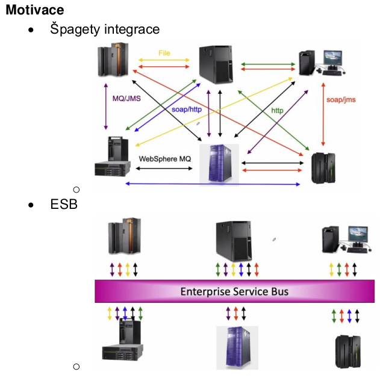
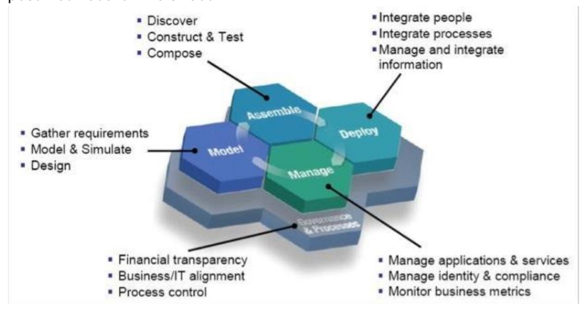

- historicky byla hlavne integrace na datove vrstve, s rozsirovanim pocitacovych siti se zacalo integrovat i na aplikacni vrstve
- proc integrace na aplikacni vrstve?
    - nechceme aby se nekdo hraval v low level datech - radsi API se zpetnou kompatibilitou
    - na datove vrstve je to spis jen davkova integrace, na aplikacni lze snadno dosahnout i jinych forem integrace (rychlejsi)
- vznik rozhrani
    - RPC (remote procedure call), RMI
    - Web Services, REST, SOAP
    - konektory, middleware

- SOA (Service Oriented Architecture)
    - architektura - soubor podstatnych (klicovych) rozhodnuti a zpusob organizace systemu
    - sluzba 0 dobre definovana a vymezena funkcionalita, ktera je zcela zapozdrena a nezavisla na svem okoli
    - principy sluzeb v SOA
        - standardizovany kontrakt sluzeb - presne stanovit, co bude sluzba poskytovat
        - volne spojeni - sluzby jsou na sobe nezavisle (jejich vazby zustavaji co nejtenci)
        - abstrakce - sluzby skryvaji implementacni detaily
        - znovupouzitelnost - sluzba muze byt pouzita i jinde a ne pouze v aktualnim projektu
        - bezstavovost
    
    - SOA
        - architektura z propojenych zluzeb ktere spolu nejak komunikuje
        - vyuziva otevrene standardy aby popsala SW prostredky jako sluzby
        - sluzby jako znovupouzitelne stavebni kameny pro aplikace
    
    - konceptualni model
        - service registry - katalog rozhrani ktere poskytuji provideri
        - service provider - poskytovatel sluzby
        - service requester - klient (vyhledava a pouziva sluzby)

    - implementace SOA
        - navrh business procesu
        - transformovat aplikace na sluzby
        - integrovat sluzby s businessem

- ESB (Enterprise Service Bus)

    

    - ESB je implementaci SOA
    - neco jako HUB v pocitacovych sitich
    - protokolove nezavisly zpusob jak vyvolat sluzbu
    - naklady na jeho zavedeni jsou vetsi ale s rostoucim pocetem services se to vyplati
        - udrzba a rozsirovani bude mnohem snazsi
    - soucasti jsou i nadstavbove vrstvy umoznujici definici a monitoring business procesu
    - ESB sluzby (mediace)
        - transofmrace (napr XML) - konverze jednoho XML dokumentu do jineho podle specifikace
        - smerovani (podle obsahu, staticke, zalozene na pravidlech) - ridi proces zprav ke koncovym bodum jinych sluzeb
        - uzivatelsky definovana mediace - funkce jako zurnal, uzivatelsky definovana validace, ktere doplni zakladni procesni logiku
    - pripojene procesni sluzby (business sluzby)
        - vykonavaji procesni logiku aplikaci
        - mohou navzajem komunikovat
    - implementace: IMB ESB, Oracle ESB, ...

- SOA governance
    - prodmnozina IT governance
    - je potreba dohlizet na SOA sluzby
        - pravidla pro sluzby v ramci organizace
        - jak vznikaji, kdo je pouziva, jak jsou vyuzivane
        - jak usporadat a ridit sluzby aby to nejak fungovalo a nebyl to chaos
        - protoze alternativa je ze sluzba vznikne v ramci nejakeho vyvoje v nejakem oddeleni (pro jejich potrebu), postupne ji zacnou pouzivat dalsi oddeleni ale mohou tam byt problemy - napr to ze oddeleni ktere ji provozuje nic nema z toho ze ji poskytuje a proto se nesnazi ji rozvijet pro potreby ostatnich; pripadne nema rozpocet na provoz i pro ostatni - tohle je potreba resit vice shorat - to je uloha governance
    - sluzby se definuji tak, aby je mohli pouzivat vsechny oddleni - aby splnovaly pozadavky vsech
    - jednotne API a seurity polotiky atd ...
    - aby byla zajistena udrzba, skalovani a financovani
    - IT services vs Business Services vs Business processes
        - IT service je vyuzivana business servisou a ta je v business procesu

- SOA lifecycle
     - posun od kodovani ke skladani

    

- SIMM (= Service Integration Maturity Model)
    - podle toho jak moc dobre mame SOA governance zajistejnou z ruznych pohledu
    - orientovane na services / funkce
    - 7 urovni
