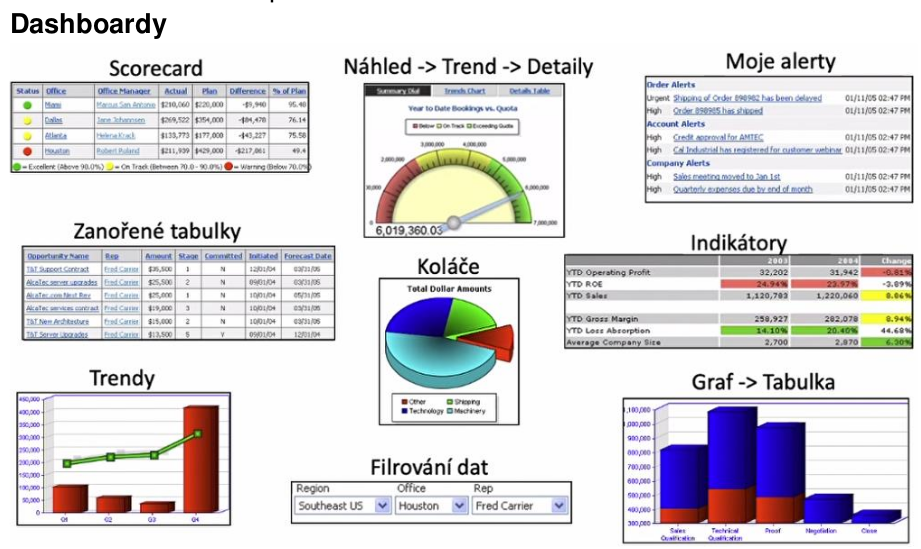

- vetsinou chceme mit data na jednom miste, protoze analyticke selecty se spatne spousteji nad provoznimi databazemi (kterych muze byt vice) a nebo by je zatezovaly a ohrozovaly bezny provoz -> vznik data warehouse za pouziti technologie ETL - data se sjednoti, agreguje (count, sum, average, ...), odstrani se duplicity => prechoupe je do podoby ktera se dobre analyzuje

- business intelligence
    - soubor nastroju, technologii a metod, ktere umoznuji nalezt v datech informace (resp. znalosti)
    - cilem je ziskavat podklady pro kvalitnejsi rozhodovani (decision support)
    - data vs infomace vs znalost!!
        - data = "25"
        - informace = "body za zapocet = 25"
        - znalost = "25 bodu je malo protoze na ziskani zapoctu je nutno mit alespon 30 bodu"

    - oblasti
        - prezentovani dat - reporty, dashboardy
        - analyza dat
        - planovani - zaklade analyzy prezentovanych dat
        - predikce - kdyz budes delat tohle, tak pristi rok dosahnes ...
    
    - performance management
        - mereni
        - duvod - "Proc jsou hodnoty jake jsou?"
        - plan - "Jak to resit?"
    
    - vetsina dat je multidimenzionalnich
        - napriklad cas x oblast (anpr geograficka + cas => 3 dimenze)

    - OLAP (online alaytical processing)
        - technologie ulozeni dat v databazi, ktera umoznuje usporadat velke objemy dat tak, aby byla data pristupna a srozumitelna uzivatelum zabyvajicim se analyzou obchodnich trendu a vysledku (Bussiness I
        - OLAP krychle
            - ortogonalni a nezavisle dimenze
            - casto jsou predpocitane napr. soucty v jednotlivych dimenzich
            - terminologie
                - dimenze - rozmer (napr zakaznik, cas)
                - hirearchie - popisuje vztah nadrazenosti mezi prvky dimenze
                - level - uroven hirearchie (rok, kvartal, mesic, ..)
                - member - hodnota na danem levelu (kveten)
                - fact = ciselne vyjadrene sledovani hodnot v ramci dimenzi
                - napr: dimenze = cas, level = mesic, member = kveten, fact = 15 (neceho)

        - OLAP operace
            - slicing - omezeni jedne nebo vice dimenzi na podmnozinu o jednom prvku
                - napr jen rok 2020
            - dicing - omezeni dimenzi na podmnozinu (velke n dimenzionali kostky udelame mensi m dimenzionalni kostku)
            - drill-down jedna se o navigaci v hierarchii dimenzi smerem k vetsimu detailu
                - napriklad rok -> mesic
            - roll-up jedna se o navigaci v hierarchii dimenzi smerem k mensimu detailu
                - napriklad mesic -> rok
            - pivoting - umoznuje "otacet" datovou krychli tj. menit uhel pohledu na data na urovni prezentace obsahu datoveho skladu 

    

- datovy sklad
    - podnikovy strukturovany repozitar pouzivany pro ziskavani informaci a podporu rozhodovani (desicion making)
    - v datovem skladu jsou ulozena detailni a sumarni data
    - vlastnosti
        - casove nemenny - udaje se zpravidla nemeni, ani neodstranuji, jen predavaji
        - predmetove orientovany - uchovavaji se udaje podle predmetu zajmu, nikoliv podle aplikace, kde byly vytvoreny (predmet - napr zakaznik, dodavatel, ...)
        - integrovany - data pochazeji z nekolika ruznych systemu
        - historicky - data jsou extrahovana z produkcni DB v danem case (vetsinou po tzv uzaverce dne), ne po kazde zmene

- OLTP (Online Transaction Processing)
    - technologie ulozeni dat v DB ktera umoznuje jejich co nejsnazsi a nejbezpecnejsi modifikaci v mohouzivatelskem prostredi - transakce, constraints
    - napriklad rizeni letoveho provozu - nemuzeme tam posilat analyticke dotazy protoze nemuzeme ohrozit kriticky provoz - musime si data vytahnout nekam jinam (pri tom je pripadne upravit)