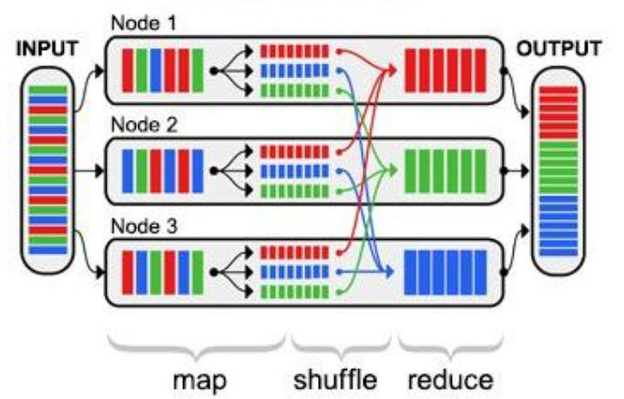

- definice
    - data jejihz velikost je mimo schopnosti spravovat a zpracovavat (zachycovat) bezne pouzivanymi SW nastroji v rozumnem case
    - data NEJSOU centralizovana, vysoce strukturovana
    - napr meteorologie, IoT, prispevky na socialnich sitich, bankovni transakce, burza, ...
    - nelze udelat snadno globalni dotaz, nelze analyzovat vsechna data
    - kazde 3 roky se data zdvojnasobi

    - vlastnosti 4V
        - volume (hodne)
            - hodne dat je mnoho a zpracovani trva prilis dlouho
            - exponencialne roztouci mnozstvi dat
            - twitter, uzaverky obchodovani...
        -  velocity (rychle)
            - data mohou vznikat i kontinualne
            - obrovske mnozstvi dat je potreba analyzovat v kratkem case
            - detekce podvodu, optimalizacni ulohy
        - variety (ruznorode)
            - ruznoroda data maji ruznou strukturu
                - nestrukturovana: video, senzoricka data, text
                - semistrukturovane: XML, JSON
            - rozpoznani pozadovane situace (udalosti) v zivem videostreamu
        - veracity (verohodne)
            - rosouci mnozstvi zdroju dat a problematicka duvera v data
            - fake news
    
    - pouziti
        - obchod - analyza dat o zakaznicich, ...
        - finance - detekce podvodu
        - analyza socialnich siti
    
    - pozadavky na architekturu
        - vysoka skalovatelnost, dostupnost, flexibilita
        - zpracovani strukturovanych a nestrukturovanych dat

- Apache Hadoop
    - Hadoop je komplexni framework obahujici sadu open-source SW urcenych pro zpracovani velkeho mnozstvi nestrukturovanych a distribuovanych dat v radech petabytu
    - podstata spociva v uloze dat na velkem mnozstvi samostatnych PC
    - muze jit o bezny HW a tak je ulozeni techto dat levnejsi nez ukladani na specializovanem HW s vysokou dostupnosti
    - pro ulozeni je potom pouzit distribuovany souborovy system 
        - napriklad HDFS (Haddop Distributed File System) - rozdeluje data na bloky + replikace
    - YARN (Yet Another Resource Negotiator) - resource manager & job scheduling - ridi zpracovani jobu (map reduce) a spravuje zdroje
    - dalsi nastroje v Haddop ekosystemu
        - Apache Hive 
        - Apache Spark

- map reduce
    - programovaci model pro zpracovani mnoziny dat pomoci distribuovaneho zpracovani
    - Hadoop tneto model vyuziva, ale MapReduce je obecna technika zpracovani
    - funkce Map
        - rozdeleni ulohy/dat + lokalni zpracovani
            - napr.: rozdeleni dokumentu mezi stroje a ty spocitaji vyskyt jednotlivych slov v nich
    - funkce shuffle - rozdeluje mezivysledky podle urciteho klice
        - napr: na jeden uzel pujdou pouze vyskyty slov "cat" a na dalsi "dog"
    - funkce reduce
        - spojeni (agregace) vysledku a map faze
            - napr: jeden uzel spocte celkovy vyskyt slov "cat" ve vsech dokumentech (secte mezivysledky z map faze)

- nektere modely muzou byt jeste slozitejsi
- samotny vypocet je tak posunut z velke casti k datum, cimz je znacne redukovana potreba prenosu velkych objemu dat po siti