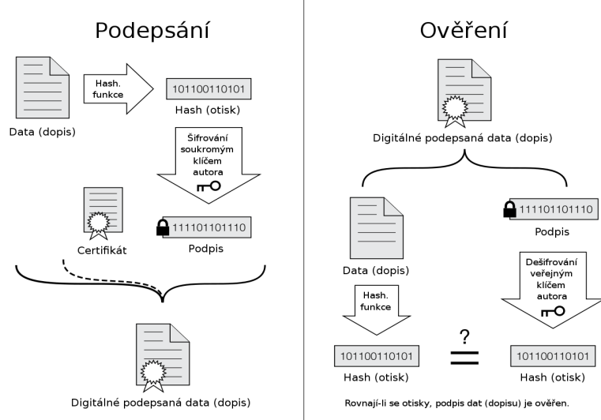

- safety = zajisteni
    - odolnosti proti chybe a vypadku
    - redundance uchovani informaci

- security = zabezpeceni
    - rizeni o omezovani pristupu
    - "keep the bad guys outside"
    - je to proces, ne stav (musi se planovat, sledovat, ridit a vyhodnocovat)
    - bezpecnost musi byt soucasti navrhu systemu (dadatecne pridani je obtizne)
    - bezpecnost stoji hodne penez (a investovane penize nejsou videt), ale jeji naruseni muze state jeste vice (+ reputaci)
    - zpracivla je treba volit kompromis mezi:
        - bezpecnosti
        - pouzitelnosti
        - pohodlim
    - v organizaci ma bezpecnost na starost CSO (Chief Security Officer)

- oblasti podnikove bezpecnosti
    - kryptografie
        - sifrovani
        - symetricka x asymetricka
        - DES, 3DEC, AES, blowfish, Diffie-Helman (RSA)
    - legislativa
        - nektere staty zakazuji export bezpecnostnich technologii
        - nektere staty zakazuji pouzivat konkretni bezpecnostni technologie (napr. silne sifrovani - AES, end-to-end sifrovani)
    - network security - VPN, firewall
    - OS security - izolace procesu a uzivatelu, access control, antivir, ..
    - identity management
    - zabezpecni (web) aplikaci - chyby v kodu, backdoor, ...
    - fyzicka bezpecnost - zabezpeceni servroven, ...
    - bezpecnost dat - neautorizovani prinos, zabezpecni databazi, atd.

- sledovani bezpecnosti
    - proaktivni pristup pomaha indentifikovat rizika (predikce) - jen firewall a monitorovani logu dnes uz nestaci
        - vulnerability scanning - manualni kontrola nastaveni / logu, network a OS scanning
    - monitoring bezpecnosti (IDS, IPS)
        - IDS - Intrusion Detection System
            - pouze monitoring (nemeni sitovy provoz)
        - IPS - Inrusion Prevention Systems
            - zabranuje prenosu packetu (neco jako firewall)
    - penetracni testovani ,...

- dalsi pojmy
    - autentizace - potvrzeni pravosti
    - autorizace - rizeni pristupu
    - IDM (identity management)

- Security Program Maturity
    - vyzralost security procesu
    - reaktivni -> proaktivni -> prediktivni

- EL. podpis

    