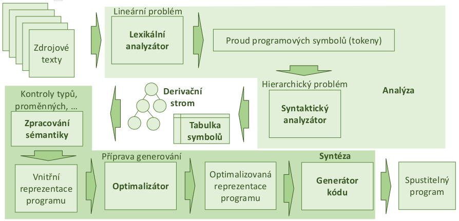
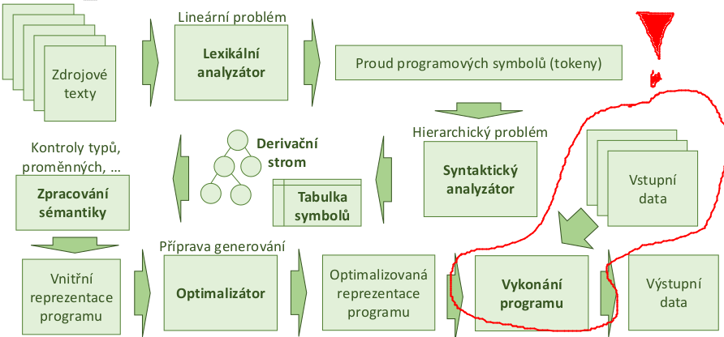
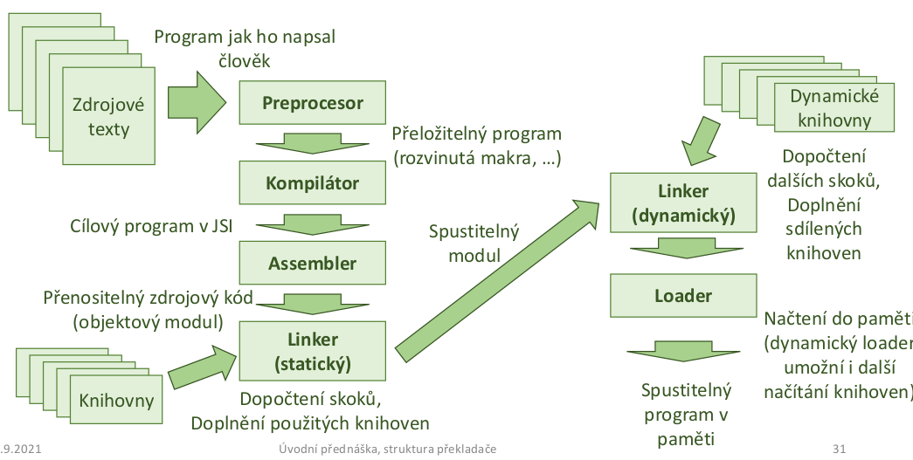
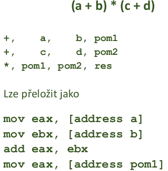
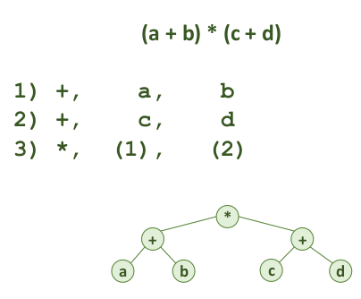
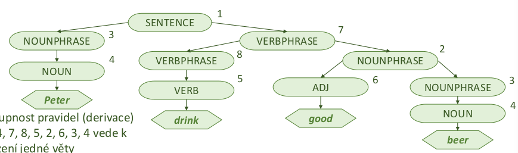
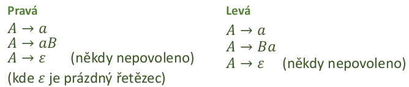
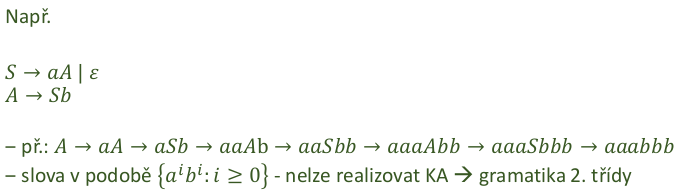
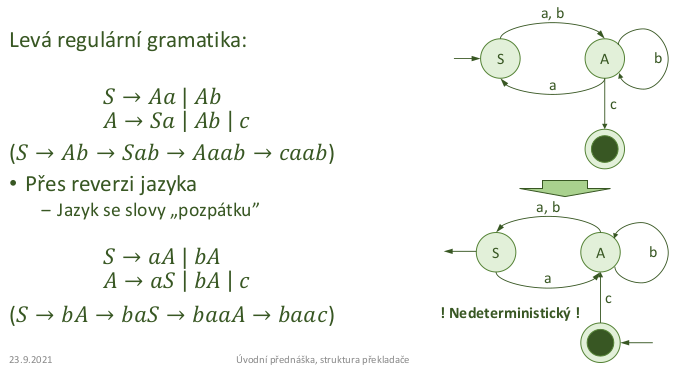
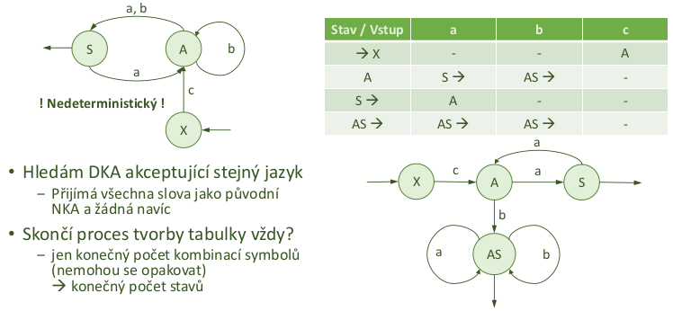

- prekladac = rozhrani mezi programatorem a HW
    - zajistuje i do jiste miry prenositelnost

- psani ve strojovem kodu
    - neprehledne
    - casto slozite na udrzbu kodu
    - chceme mit vice abstrakce
        - vysokourovnove jazyky jsou snaze citelne

- proc se zabyvat prekladaci?
    - lepsi porozumeni toho jak to uvnitr funguje
    - pochopeni dalsich programovacich jazyku (co to vsechno obnasi)

- zakladni typy prekladacu
    - Assembler
        - zpracovava assembly jazyk a generuje strojovy kod
    - Compiler
        - zpracovava vysokourovnovy jazyk 
        - generuje symbolicky kod (pod nim je jeste assembler), strojovy kod nebo uplne jiny jazyk (napr bytecode)
        - muze byt horsi na debuggovani pokud neni kompilovan s debug flagy
    - Interpret
        - zpracovava vysokourovnovy jazyk
        - misto generovani kodu ho rovnou interpretuje
        - casto v interaktivnim rezimu
        - lehci na debuggovani

- dalsi vyuziti prekladacu
    - strukturni editory
        - napovidaji mozne konstrukce
    - staticke analyzatory
        - hledaji chyby, podezrele ci nebezpecne konstrukce bez spusteni programu
        - napr PMD pro Javu
    - reverzni prekladace
        - snazi se odvodit ze strojoveho kodu nebo z JSI (jazyk symbolickych instrukci) program ve vyssim programovacim jazyce
    - silikonove prekladace
        - navrhuji specializovane obvody pro logicke programy
        - napr napiseme logickou funkci a on nam vykresli jake hradla (zapojeni) budeme potrebovat
        - nebo definujeme funkcionalitu obvodu a on nam ho vykresli (navrhne)
    - prikazove interprety
        - pro spravu OS nebo jinych komplexnich programu
        - napr shell
    - dotazovaci interprety
        - rozhrani pro komunikaci s DB nebo znalostnim systemem
        - napr SQL
    - preprocesory
        - upravuji program do podoby vhodne pro dalsi zpracovani - rozvoj maker, inline funkce atd
    - formatovace textu
        - napriklad MS Word
        - provaci sazbu textu na zaklade jeho otagovani
    - analyzatory textu
        - napr grammarly.com 
        - kontrola pravopisu

- zakladni podoba prekladace

    

- zakladni podoba interpretu

    

- cele zpracovani programu

    

- vicevrstvy prekladac
    - umoznuje snaze zpracovavat vice jazyku pro ruzne platformy
    - potrebujeme mit oddeleny frontend, middleend a backend
    - potrebujeme spolecnou vnitrni reprezentaci programu
        - muzeme pote aplikovat stejne typy optimalizaci ackoliv je na "frontendu" jiny programovaci jazyk
    - pro pridavani jazyka staci doplnit preklad do vnitrni reprezentace
    - pro pridani nove platformy (backendu) staci doplnit prislusny generator kodu
        - modularizace

    

- vnitrni jazyky prekladace
    - pozadavky: rychle zpracovatelne, jednoduche, univerzalni
    1) postfixova / prefixova notace
        - snadne zpracovani vyrazu pomoci zasobnikem (kdyz narazime na operator zpracujeme posledni dva operandy)
        - jednoducha zmena priorit (= prehozeni poradi operatoru)
        - nemusi se pouzit pouze pro aritmetiku ale muzeme je pouzit napriklad primo pro instrukce CPU - jde jen o poradi
    2) jazyk ctveric
        - podobne jako instrukce CPU => lze snaze prevest do JIS (jazyka symbolickych instrukci)
        - informace o operaci: 
            - operator
            - operatand 1, operand 2
            - vysledek operace 

        

        - snadne pro zpracovani optimalizatorem (vim kde jsou data)
        - potrebuji mezipamet pro pomocne promenne (mezivysledky)
            - realne pak registry CPU
            - potrebuji mnoho mezivysledku
    
    3) jazyk trojic
        - podobna strukture bez explicitni pameti pro mezivysledek
            - misto docasne promenne reference na dalsi trojici => vytvari stromovou strukturu (AST = abstraktni synktakticky strom)
        - informace o operaci:
            - operator
            - operand1, operand2
        - nemusim resit alokaci docasne promenne (jsou implicitni)
        - obtiznejsi optimalizace - nelze tak snadno menit poradi

        

- gramatiky a jazyky
    - matematicky aparat pro popis formalnich jazyku
    - jazyk popsan jako sada pravidel umoznujici vytvaret promluvy
    - myslenka:
        - jazyk je slozen ze souveti, souveti je slozeno z veta, veta je slozena z podmetu a prisudku, ...
    - terminalni, neterminalni symboly, pravidla
    - derivace = odvozeni konkretni vety pomoci pravidel
    - derivacni strom = jiny pohled na derivaci (jeho redukci AST)

     

- formalni definice gramatiky
    - 𝐺 = (𝑁, Σ, 𝑃, 𝑆)
        - 𝑁 = konecna mnozina neterminalnich symbolu
        - Σ konecna neprazdna mnozina terminalnich symbolu
        - 𝑃 mnozina produkcnich (prepisovych) pravidel
        - 𝑆 ∈ 𝑁 pocatecni symbol
    - 𝐿(𝐺) = jazyk generovany gramatikou
        - mnozina vsech vet ktere lze ziskat (vyderivovat) z pocatecniho symbolu pomoci prepisovacich pravidel
        - chceme aby jazyk byl nekonecny (jinak bychom ho mohli zapsat vyctem a nejaka gramatika by vubec nebyla potreba)
        - ruzne gramatiky mohou generovat stejny jazyk

- klasifikace gramatik
    - 4 zakladni skupiny podle tvary odvozovacich pravidel
    - cim obecnejsi gramatika (slozitejsi struktura) tim slozitejsi analyza
    - symboly:
        - a, b - terminalni symboly
        - A, B - neterminalni symboly
        - 𝛼, 𝛽 - retezce terminalu i neterminalu
        - 𝛾 - neprazdny retezec terminalu i neterminaly

    1) typ 0 - rekurzivne spocetne
        - 𝛼𝐴𝛽 → 𝛾
        - "uplne cokoliv lze prepsat na uplne cokoliv"

    2) typ 1 - kontextove
        - 𝛼𝐴𝛽 → 𝛼𝛾𝛽
        - A se prepise na 𝛾 pouze v kontextu 𝛼 a 𝛽, jinak ne
    
    3) typ 2 - bezkontextove
        - 𝐴 → 𝛼
        - neterminal A se muze prepsat na cokolovi
        - A neni v zadnem kontextu 
    
    4) typ 3 - regularni
        - ma dva typy prepisovacich pravidel:
            - A → a
            - A → aB

- BNF – Backus-Naurova forma
    - metoda zapisu pro bezkontextove gramatiky
    - snaha o efektivni zapis pomoci symbolu na klavesnici
    - existuje rada variant a rozsireni (Yacc, ANTLR, ...), kazdy to zapisuje trochu jinak

- regularni gramatiky
    
    

    - lze primocare chapat jako popis NKA (= nedeterministicky konecny automat)
        - terminalni symboly = vstupy
        - neterminalni symboly = vystupy

    - to jestli regularni gramatika generuje nekonecny jazyk lze poznat pokud obsahuje rekurzi (neco jako S -> A, A -> S)
    - limity regularnich gramatik
        - "neumi pocitat", nepamatuji si jak se do daneho stavu dostaly, berou v uvahu jen aktualni stav + to co prislo na vstupu
        - lze pocitat paritu, delitelnosti, ale pocty ne

- linearni, neregularni jazyk
    - smichame levou a pravou regularni gramatiku

    

- regularni gramatiky a automaty

    

    - pokud mame levou regularni gramatiku, tak pravou dostaneme reverzi jazyka
        - vysledny automat muze byt nedeterministicky
        - nedeterministicky automat (NKA) lze prevest na deterministicky (DKA)

- hledani deterministickeho KA

    