- lexikalni analyza

    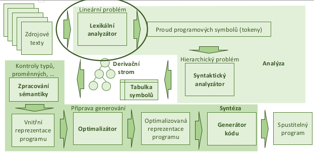

    - cilem je prevest vstupni soubor (zdrojak) na stream tokenu, ktere budou dale pouzite syntaktickim analyzatorem pro vytvoreni AST (= abstraktni syntakticky strom)
    - pomoci ukazovatka (= pointer) prochazime znak po znaku vstupni soubor a hledame klicova slova
    - identifikator je vetsinou to co neni zadne klicove slovo (az jako posledni moznost)
    
    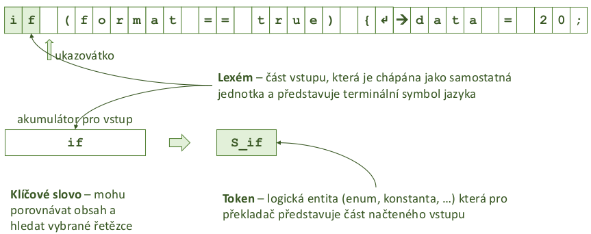

    - nektere lexemy nenesou prilis informaci a neni potreba z nich vyrabet tokeny (napr mezery/prazdne znaky)
    - nektere lexemy (a tokeny) maji jen jeden symbol, napr '('
    - taktika - hledam nejdelsi mozny retezec, ktery se da prijmout
        - nalezeno: format
            - for (cyklus) + mat (identifikator)
            - format (identifikator)
        - nezbytne pro cisla
    - u nekterych tokenu (cislo, identifikator) je treba si i drzet jejich hodnotu
    - lexikalni analyza probehne v O(n), kde n je # znaku vstupniho souboru

- jak volit tokeny
    - vsechna klicova slova - prosty vycet
    - operatory (i viceznakove)
    - identifikatory
    - numericke a logicke konstanty
    - retezcove konstanty
    - oddelovaci symboly (zavorky, uvozovky)
    - bile znaky? ignorovat?
    
- potize s bilymi znaky
    - muze byt obtizne poznak kdy skoncit se ctenim

    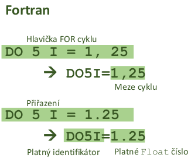

- zakladni regularni vyrazy
    - pro popis jednoduchych struktur
    - vykladavani, overovani spravnosti vstupu
    - symboly e nebo 𝜺 predstavuji prazdny vyraz
    - symbol a predstavuje znak "a" ve vstupu
    - povolene oprace
        - predpokladejme ze Ri je platny regularni vyraz
        - zretezeni (konkatenace): R1R2
        - sjednoceni: R1 + R2
        - (Kleeneho) uzavera - jeli R regularni vyraz pak R* je regularni vyraz popisujici libovolny pocet opakovani textu popsaneho R (vcetne zadneho)
        - priklad: Co bude (0|1)*101(0|1)* ?
            - na zacatku cokoliv, uprostred 101 a na konci cokoliv

- vylepseni regularnich vyrazu (prakticke pouziti)
    - aa* -> a+ (alespon jeden vyskyt)
    - (a|e) -> a? (zadny nebo jeden vyskyt)
    - aaaa -> a{4} (4x opakovani znaku a)
    - a|b|c... -> [a-z] (nekolik znaku z ASCII)
    - b|c|d... ->X-a (vsechno krome a)
    - priklad jednoduche validace e-mailove adresy:
        - [a-z]+(.[a-z]+)*@[a-z]+(.[a-z]+)+
        - radek.novak@gmail.com

- regularni vyrazi a NKA
    - prevod na NKA je snadny
    - nasledke aplikujeme prevod NKA na DKA - pro kazdy NKA existuje ekvivalentni DKA (-> DKA akceptujici stejny jazyk) 

    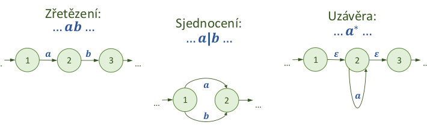

    - priklad [a-z]+(.[a-z]+)*@[a-z]+(.[a-z]+)+

    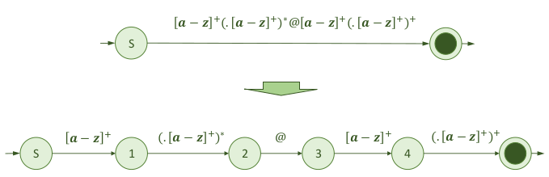
    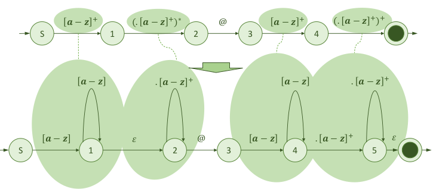
    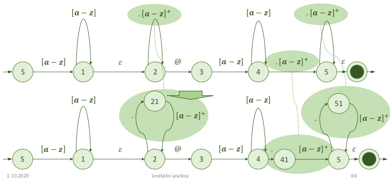
    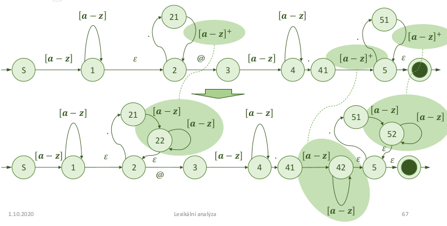
    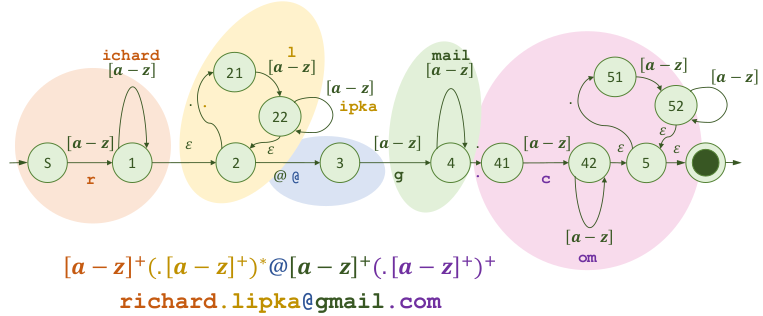

- automaty a lexikalni analyza
    - kazdy token je popsan regularnim vyrazem
        - lexikalni analyzator = spojeni nekolika DKA kde jeden DKA = jeden token
    - potrebuji hledat nejdelsi symbol
        - DKA jsou vyuzivany "paralelne", token priradi ten, ktery bezel nejdele
        - nesmi nstat shoda 2 DKA - 2 stejne lexemy vedou na 2 ruzne tokeny
        - kazda kombinace lexem - token ma svuj koncovy stav
        - nemusi byt efektivni
            - alternative muzu jen hledat klidove slova v tabulce (od nejdelsiho)
        - token muze mit atributy (napr hodnotu)
            - dopoctu z lexemu

    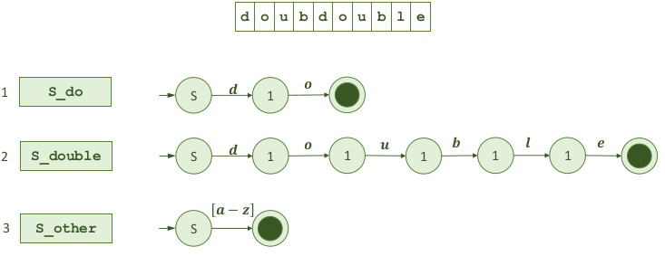

    - co kdyz pridame identifikator?
        - potrebujeme pridat priority (prvni definovany ma prednost)

        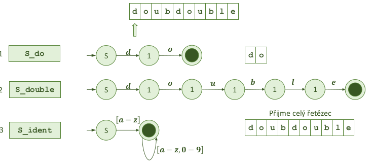

- slouceni automatu
    
    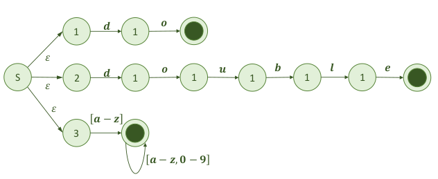

    - = nedeterministicky konecny automat (mame e na zacatku) -> prevedeme na DKA a mame lexer

- shrnuti lexikalni analyzy
    - vsechny tokeny jsou popsany regularnimi vyrazy
        - pro kazdy vyraz existuje vlastni DKA, slouceny do jednoho
        - bezi paralelne (dusledek slouceni)
    - uplatnuje se nejdelsi mozny vstup (automat ktery bezi nejdele)
        - potrebuju si pamatovat kde doslo ke ztotoznenim
    - pokud dojde ke konfliktu, uplatni se prvni definovany (viz double = identifikator?)
    - k tokenu si pamatuji lexem
        - potrebuji pro vyhodnoceni identifikatoru, konstant, ...
    - doplnit pravidlo "ber cokoliv" ktere vypisuje chybu na lexikalni urovni - ne syntaktickou
        - lexikalni chyba = neznamy znak

- potize s vnorovanim
    - KA maji obecne nemaji pamet -> neumi pocitat pocty zanoreni -> tohle resi napr az syntakticka analyza

    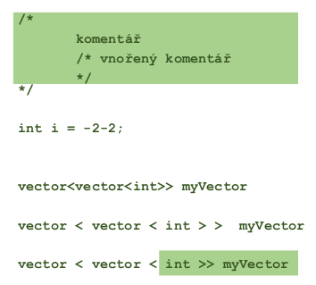

- doplneni symantiky do lexikalni analyzy
    - lexikalni analyzator neni jen DKA
    - DKA je pouze teoreticky, formalni pohled na vec
    - muze delat i nasledujici funkce
        - CTI = bere znaky ze vstupu a meni stav DKA podle potreby
        - SLOZ = sklada znaky do promenne (akumulator TEXT) pro zpracovani lexemu
        - PROHLEDEJ = hleda v tabulce vyhrazenych slov (pokud je potreba)
        - VYPOCTI = vycisluje konstanty do promenne (strukctura HODNOTA)