- syntaktická analyza
  - 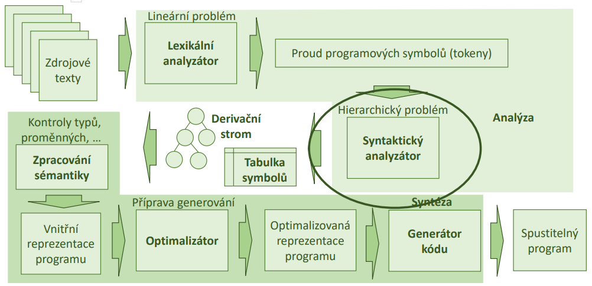
  - gramatika - formální definice
    - G = (𝑁, Σ, 𝑃, 𝑆)
      - N - konečná mn. neterminálů, neobsahuje řetězce generované G
      - Σ - konečná neprázdná množina neobsahující prvky z N
      - P - konečná mn. produkčních pravidel: 𝑁 → (Σ ∪ 𝑁)∗
      - S - počáteční symbol
    - L(G) - jazyk generovaný gramatikou G
      - 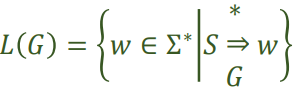
  - základní derivace
    - prává - expanduje pravý neterminál
    - levý - expanduje levý neterminál
  - vetná forma
    - řetězec je větná forma pokud platí
    - 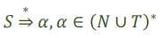
  - Věta/slovo
    - řetězec se označuje jako větná forma, pokud
    - 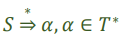
  - Fráze
    - Řetězec 𝜆 = 𝛼𝛽𝛾 je větnou formou, pak je podřetězec 𝛽 frází větné formy 𝜆 vzhledem k neterminánímu
      symbolu 𝐴, pokud platí
    - 
  - Jednoduchá fráze
    - fráze kde 𝐴 ⇒ 𝛽 (tedy existuje pravidlo 𝐴 → 𝛽)
  - L-fráze
    - nejlevější jednoduchá fráze
  - 
  
  - Konstrukce derivačního stromu
    - Shora dolů (Kouknu a vidím)
      - výběr správného pořadí operací k derivovaání
    - zdola nahoru (obtížnější)
      - postupná redukce slova na větné fráze až na počáteční symbol
      - vymezit L-fráze a hledat jejich redukci
    - postupy
      - Backtracking (analýza s návratem)
        - univerzální ale neefektivní
      - Deterministická analýza
        - funguje jen pro některé druhy BKG
          - automatiky (deterministické zásobníkové)
          - volání procedur
  - Víceznačnost gramatiky
    - slovo s je viceznačné pokud existují alespoň 2 různé derivační stromy k odvození
    - nutná podm. jednoznačnosti
      - pro žádný neterminál neexistuje pravo i levorekurzivní pravidlo - nemohu se rozhodnout
    - může (ale nemusí) existovat ekvivalentní jednoznačná gramatika
    - 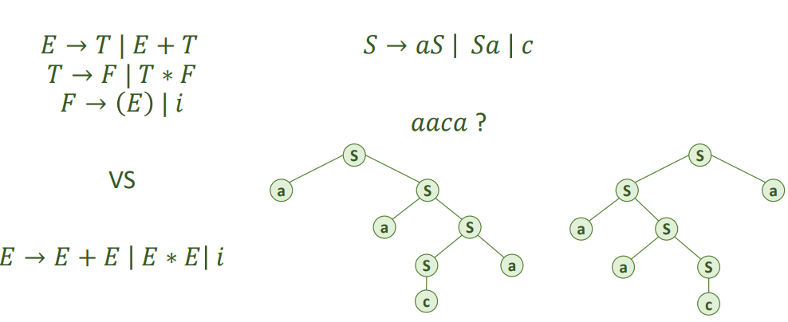
    - je možné zapsat jednoznačně ale garmatika může být složitější
    - gramatika je víceznačná pokud pro rekuzivní neterminál A existují alespoň 2 pravidla
      - jedno rekurzivní zprava, se shodným prefixem symbolu A s druhým pravidlem
      - jedno rekurzivní zleva, se shodným prefixem symbolu A s druhým pravidlem
  - Eliminace nejednoznačnosti
    - seskupování operátorů podle priority
    - nastavení směru rekurze podle asociativity operátorů
    - odstranění obousměrné rekurze doplněním dalších symbolů
    - 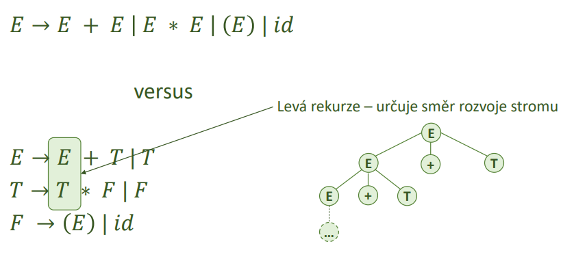
    - 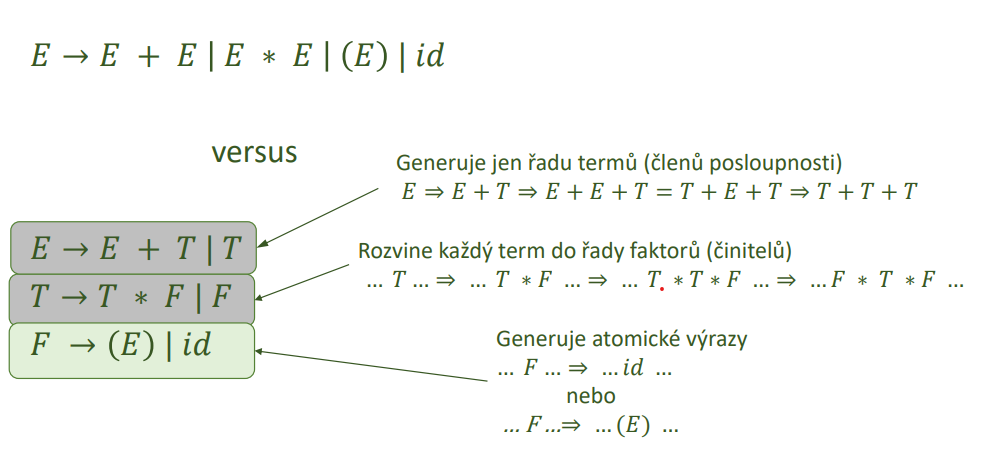
  - Jednoduchá analýza shora dolů
    - připočarý postup
    - čtu zleva doprava po tokenech
    - na základě tokenu použiju pravidlo podle toho čím začíná
    - levé derivace
    - 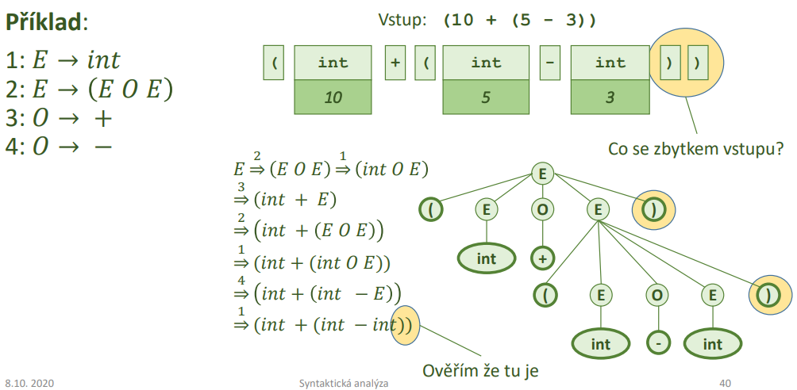
    - automatizované přístupy se zásobníkovým automatem
      - automatické generování gramatik
      - snazší formální postup
  - Rekurzivní sestup
    - snazčí a průhlednější implementace
      - sledování co program dělá a úprava funkcionality
      - automatické generátory (antlr)
      - snadná implementace backtrakingu
      - 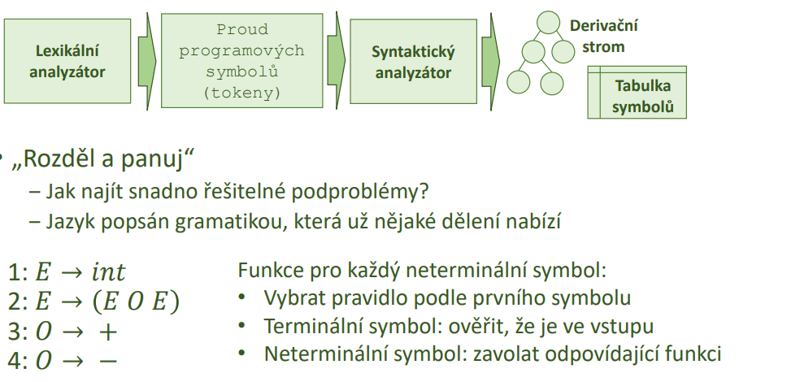
      - 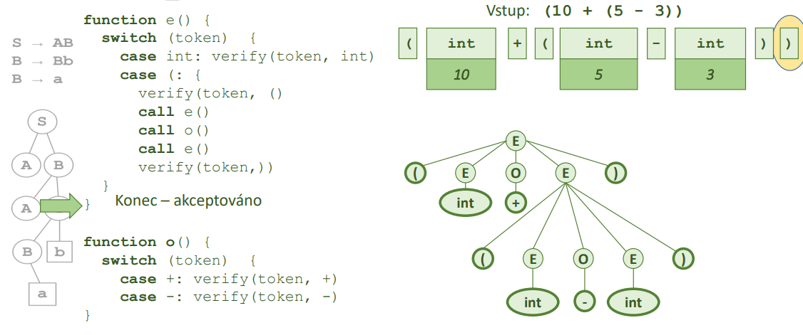
    - problémy:
      - pokud je na vstupu něco jiného 
        - syntaktická chyba
      - pravá strana neobsahuje terminál 
        - analýza do hloubky a zjistit začátky fuknce first()
      - levá rekurze
        - nekonečný cyklus
      - dvě pravé strany stejné začátky
        - vybrat podle něčeho (lookahead)
      - na pravé straně prázdný symbol
        - odstraním ho
    - úpravy
      - ekvivaletní úpravy jako u rovnic (nesmí se změnit jazyk)
        ‒ Odstranění zbytečných symbolů
        ‒ Odstranění prázdných pravidel
        ‒ Odstranění jednoduchých pravidel a cyklů
        ‒ Substituce pro odstranění libovolného pravidla
        ‒ Odstranění levé rekurze
    - Funkce First()
      - čím může začínat řetězec
      - vstup: libovolný řetězec
      - výstup: množina terminálů kterými může řetězec začínat
      - 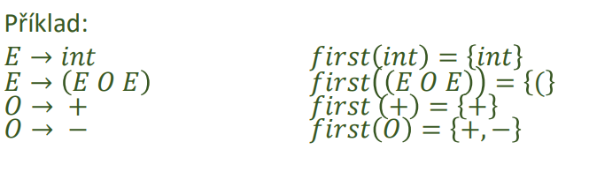
      - 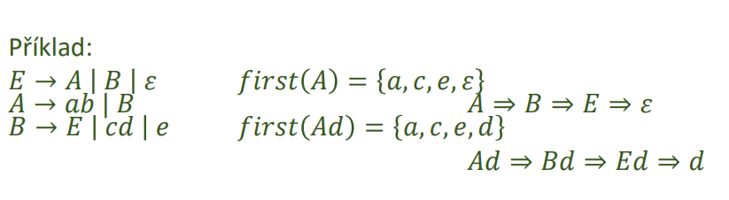
    - Funkce Follow()
      - zjistí co může následovat za daným řetězcem
      - nepř co když přijde prazdný symbol
      - vstup: symbol
      - výstup: množina terminálů které mohou následovat
      - 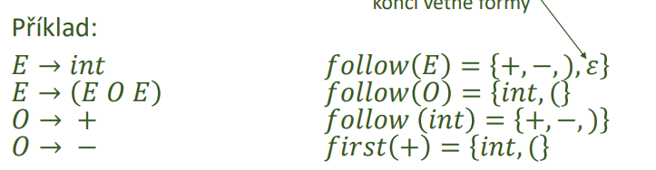
  - Hledání zbytečných symbolů
    - symboly které se nepodíli na genorování žádného slova
    - nedosažitelný symboly
    - indikují probléím v návrhu
    - postup
      - Označíme všechny 𝑥 ∈ T
      - Označíme všechny 𝑋 ∈ 𝑁, pro něž existuje pravidlo 𝑋 → 𝛼, kde 𝛼 obsahuje jen označené symboly
      - opakuji dokud můžu označovat
      - neoznačené symboly jsou zbytečné
      - příklad hlednání zbytečných symbolů
      - 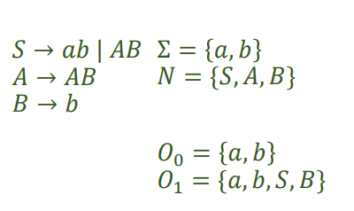
      - příklad hlednání nedostupných symbolů
      - 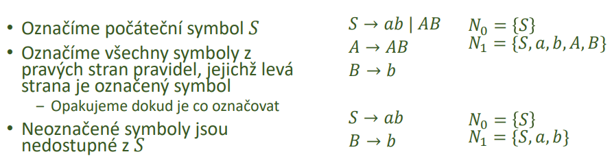
  - Odstranění E pravidel
    - při rekurzivním sestupu nevím kdy pravou stranu puožít
    - postup:
    - 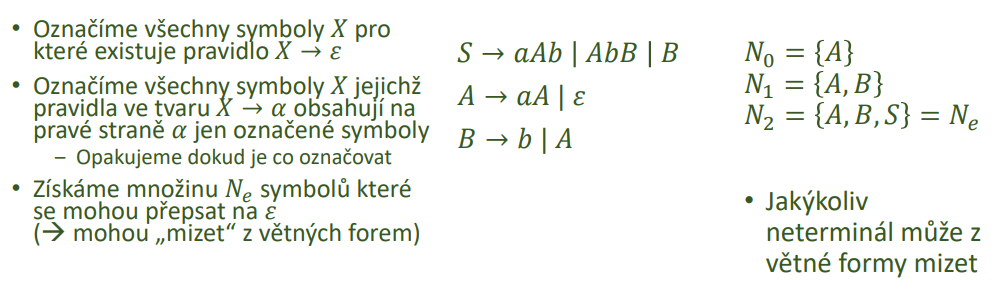
    - 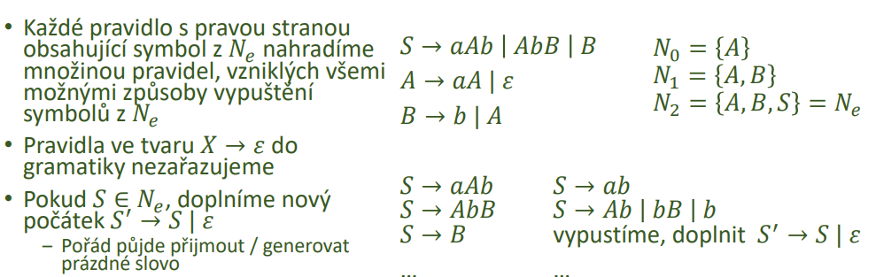
  - Odstranění jednoduchých pravidel
    - přepsání jednoho terminálu na druhý (A -> B)
    - lehčí orientace
    - odstraěnní prostou substitucí
    - 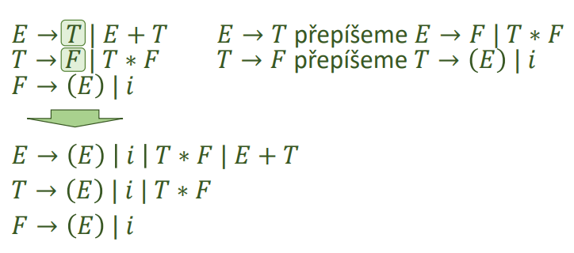
  - Odstranění cyklů
    - existence cyklu implikuje jednoduchá pravidla
      - jejich odstranění by mělo odstranit cykly
    - s cykly roste složitost a nepřidávají novou informaci a těžko se ukončují
    - postup:
      - gramatika musí generovat po odstranění stejný jazyk
      - 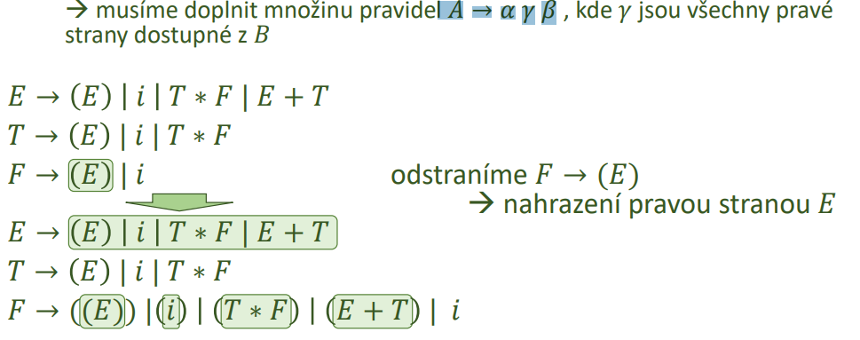
  - Odstranění levé rekurze
    - popis levorekurzivního pravidla
      - 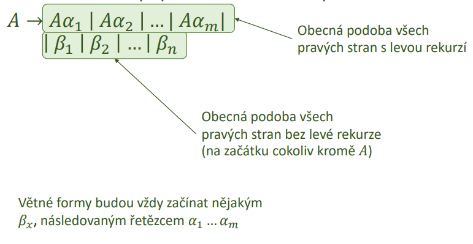
    - odstranění bez e pravidel
      - 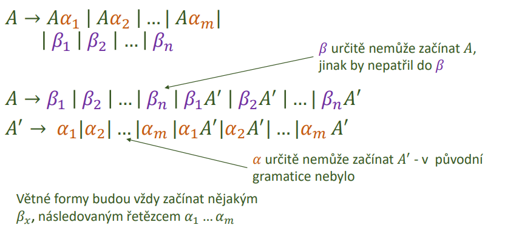
    - odstranění s e pravidly
      - 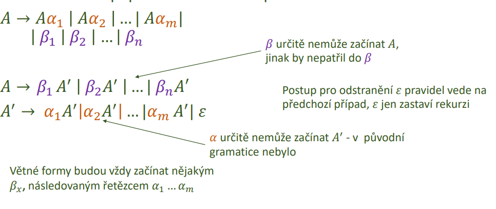
    - srovnání
      - 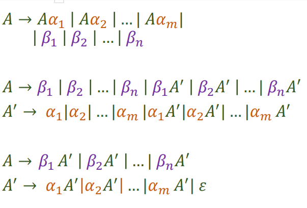
  - Nepřímá levá rekurze a vicenásobná levá rekurze
    - 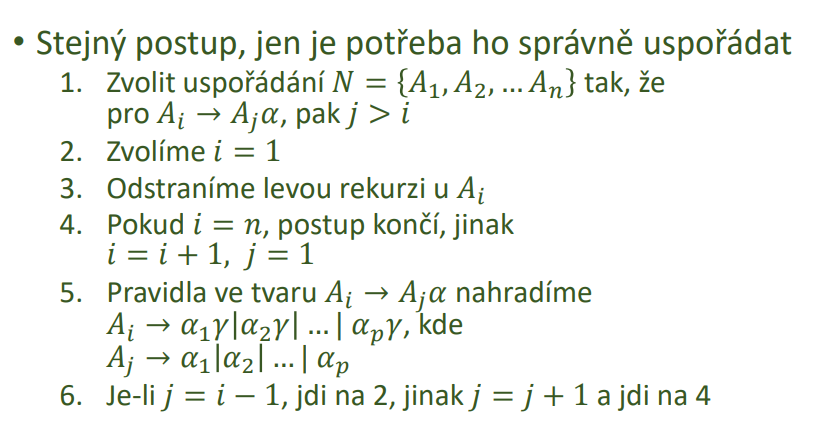
  - Zásobníkový automat
    - podobně jako KA
    - jednocestný (nevrací se)
    - nedeterministický
    - akceptační (ano/ne)
    - nekonečná paměť (zásobník)
    - 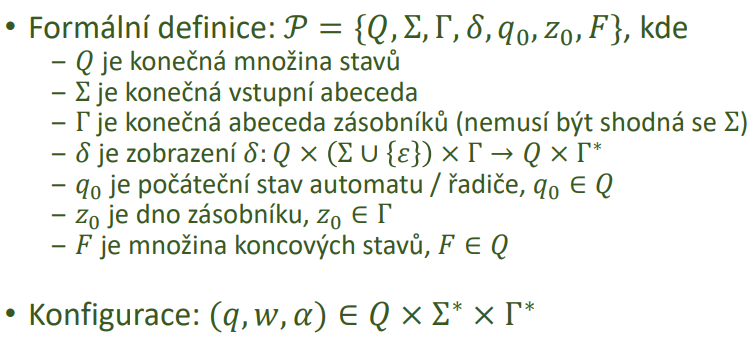
  - Automat pro analýzu shora dolů
    - odvozuje slovo z kořene jazyka
    - vstupní abeceda - terminální symboly jazyka
    - abeceda zásobníku - teminály i neterminály jazyka
    - v zásobníku začně s kořenem
    - operace
      - expanze - nahradí neterminál na vrcholu některou pravou stranou
      - Srovnání – porovná (a odstraní) symbol ze vstupu a z vrcholu zásobníku
    - Akceptace – prázdný vstup i zásobník (= jen jeden pracovní stav)
    - 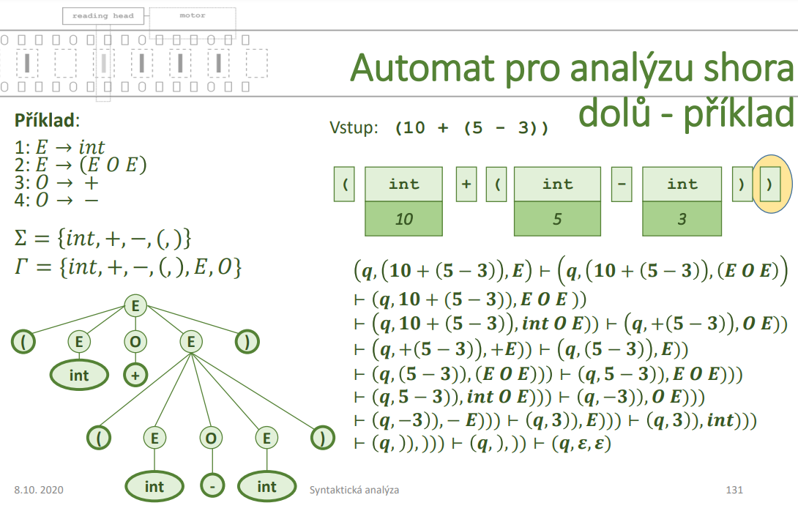
  - Automat pro analýzu zdola nahoru
    - hledá od slova cestu ke kořeni jazyka
      - Vstupní abeceda – terminální symboly jazyka
      - Abeceda zásobníku – terminální i neterminální symboly jazyka a další podle potřeby
      - Začne s prázdným zásobníkem a přesouvá do něj vstup
      - Operace
        - Přesun (shift) – přesune symbol ze vstupu na vrchol zásobníku
        - Redukce (reduce) – nahradí pravou stranu v zásobníku odpovídající levou stranou
      - Akceptace – prázdný vstup, kořen jazyka v zásobníku
      - Implementován v yacc
    - 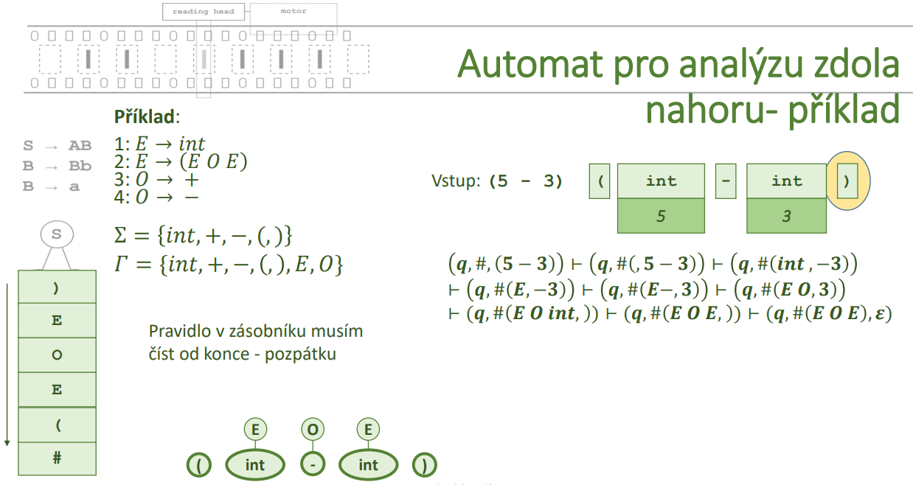
    - 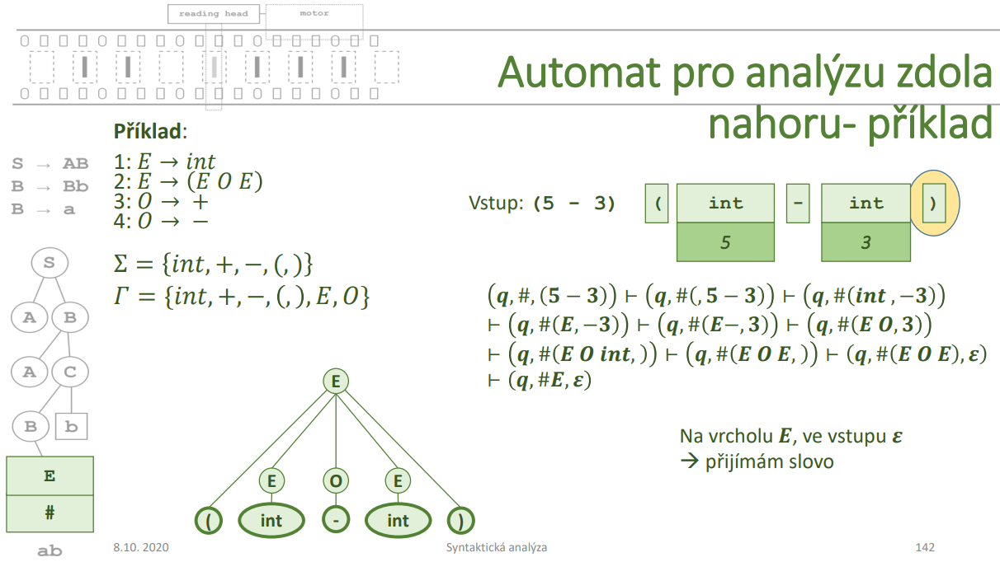
