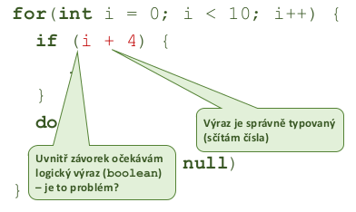

- semanticka analyza

    

- co chybi zkrontrolovat
    - vime ze program je lexikalne  spravne zapsany (v textu nejsou nesmysle znaky)
    - vime ze program je syntakticky spravne zapsany (spravny tvar ridicich struktur, deklaraci podprogramu atd.)
    - musime overit ze program ma smysl (overeni vlastnosti ktere neni mozne zkontrolovat v predchozich dvou krocich)
        - promenne jsou definovane pred pouzitim
        - typy ve vyrazech jsou kompatibilni
        - podprogramy jsou volany s  odpovidajicimi parametry
        - smysluplne inicializace promennych
        - funkce vraci to co maji

    

- zakladni vlastnosti
    - odmitnu co nejvice nespravnych programu
        - kontrola null?
        - kontrola meze poli?
        - kontrola konecnost cyklu?
    - prijmu co nejvice platnych programu
        - nebude dochazet k falesnym poplachum
        - co vsechno jeste povolim?
            - viz volani neexistujicich funkci v PHP
        - pokud mozno vsechno delam rychle

- dalsi prakticke vlastnosti
    - shromazdeni uzitecnych informaci o programu
        - nalezeni promennych (trid, metod, funkci, struktur, ...), urceni jejich identifikatoru a typu
        - urceni rozsahu viditelnosti (scope)
        - vytvoreni vnitrni reprezentace hirearchie dedicnosti

- implementace
    - atributovane gramatiky
        - rozsirim gramatiku o semanticke vlastnosti spojene s kazdym pravidlem
            - -> gramatika je primo spojena se semantikou
        - vyuzivane v yacc/bison implementacich
    - rekurzivni prochazeni AST
        - sestavim abstraktni syntakticky strom (AST)
        - semanticka analyza provadena pri jeho prochazeni
            - -> gramatika a semantika jsou oddelene
            - implementovano v ANTLR

- atributovana gramatika
    - bezkontextova (nebo) jina gramatika doplnena o atributy
    - syntetizovane atributy = spoctene z atribudu potomku v derivacnim stromu
        - `x = y + z;`
        - `y + z` je int => `x` je tim padem take int
    - zdedene - ziskane z atribudu roduce nebo "sourozencu" v derivacnim stromu
        - `String a = "HEY";`
        - `"HEY"` je string => a musi byt take string
    - formalne:
        - 𝐺 = (𝑁, Σ, 𝑃, 𝑆)
        - 𝐴.𝑎 je syntetizovaný atribut (atribut prepisovaciho pravidla)

    

- derivacni strom vs AST
    - derivacni strom (parse tree)
        - reprezentace vstupu ziskana parserem (syntaktickym analyzatorem)
            - zachycuje vsechny vlastnosti derivace -> obsahuje radu "nepodstatnych uzlu"
    - abstraktni syntakticky strom (AST)
        - zachycuje jen "dulezite veci" potrebne pro spravne vykonani programu
        - lze ziskat zjednodusenim derivacniho stromu

    

- vyhodnoceni atributu
    - lze provadet mimo behem lexikalni a syntakticke analyzy
        - muzeme vytvorit jednopruchodovy prekladac (neni nezbytne, ale oblibene)
        - kombinace lex a yacc
        - rychlejsi kompaktnejsi, horsi optimalizace
    - lze provest dodatecne po vytvoreni AST (jeho prochazenim)
        - muzeme provest dalsi manipulace s AST nebo prekladac snaze rozdelit na samostatne casti
        - implementace ANTLR
        - lze aplikovat optimalizace tim jak je vyhodnoceni vicepruchodove
    - obecne
        - pri ceste "dolu" od korene k listum vypocet dedicnych atributu
        - pri ceste "nahoru" od listu ke koreni vypocet syntetizovanych atributu
    - podobne pri pouziti rekurzivniho sestupu i zasobnikoveho automatu

- rozsireni rekurzivniho sestupu
    - umoznuje provest jednopruchodovou analyzu
    - lexikalni analyzator preda krome trokenu i jeho atributy
        - hodnota cisla
        - jmeno identifikatoru
    - syntakticky analyzator navic musi zjistit
        - predani dedicnych atributu na vstup podprogramu rekurzivniho sestupu
        - predani syntetizovanych atributu jako vystupnich parametru podprogramu

- syntetizovane atributy - zaklad

    

- dedicne atributy - zaklad

    

- rozsah viditelnosti
    - zanorovani scopes
    - prekladac musi byt schopen rozpoznat jaky identifikator patri ke ktere promenne
        - zajisti ze mohu pristoupit jen k nekterym promennym
        - zajistit prekryti identifikatoru lokalnimi
    - staticky rozsah viditelnosti (za prekladu)
    - dynamicky rozsah viditelnosti (behem vykonavani programu)

- tabulka symbolu
    - potrebujeme nekde ukladat co identifikator oznacuje promennou, metodu, datovy typ, navesti, ...
    - potrebujeme sledovat ktere identifikatory jsou viditelne a ktere ne
    - potrebujeme sledovat ktere identifikatory se prekryvaji
    - tabulka symbolu mapuje jmeno (atribut ziskany lexikalni analyzou) na deskriptor
        - vytvarena a udrzovana behem semanticke analyzy
        - v dekriptoru typ (promenna, trida, struktura, ...)
            - dalsi info podle typu (adresa, velikost, misto deklarace, ...)
    
    
    

- operace nad tabulkou
    - vetsinou implementovano jako 
    linked list hash map
    - pro kazdy rozsah (scope) je vytvorena nova mapa O(1)
    - operace: vloz rozsag, odstran rozsah, vloz symbol, najdi symbol, najdi rozsah

- typicke pouziti
    -  pro kazdou cast programu (blok prikazu, deklarace metody, funkci, tridy, ...)
        - vytvor v zasobniku novy rozsah
        - vloz vsechny deklarace do tabulky symbolu
        - zpracuj odpovidajici cast programu
        - ukonci zpracovani -> odstran rozsah
    - vetsina semanticke analyzy je zalozena na tomto postupu
        - nektere jazyky navrzeny tak, aby umoznili jednopruchodove zpracovani (C/C++) - vyzaduji deklaraci vsech identifikatoru pred jejich pouzitim
        - nektere jazyky vyzaduji vice pruchodu (Java) - metody mohou byt deklarovany kdekoliv
        - vetrina prekladacu vyuziva nekolikanasobneho progrchazeni - leze lepe optimalizovat

- Rozsahy dedicnosti

    
     

- Explicitni hledani rozsahu

    
     

    - muze se vyplatit si nad danou hirearchii vytvorit neaco jako index pro rychleji vyhledavani
    - databaze toto zajistuji napriklad s pouzitim B-stromu

     

- vicenasobna dedicnost/rozhrani
    - napr v C/C++ -> musime prohledat oba dva podstromy
    - jak se resi kdyz oba predci maji stejnou deklaraci funkce/promenne? Vyzmeme 1. kterou najdeme? => nejednoznacnost

    

    - problem:
        
         
    
    - nejvice komplikaci pro jazyk C++
        - objektovy jazyk s vicenasobnou dedicnosti
        - existuji globani promenne, ktere nejsou soucasti zadne tridy
        - zjednodusenna pravidla pro hledani jmen:
            - prohledej vnitrek tridy
            - prohledej celou hierarchii dedicnosti
            - pokud je nalezeno jen jedno jmeno -> vysledek je jednoznacny
            - pokud je nalezeno vice jmen -> vysledek je nejednoznacny (vyazaduje upresneni - plne kvalifikovane jmeno)
            - pokud neni nic nalezeno, hledej mimo tridu (v globalnim rozsahu)
            - pokud neni nic nalezeno -> semanticka chyba
    
- vicepruchodova analyza
    - syntakticka analyza potrebuje jen jeden pruchod
        - muze slouzit jako prvni pruchod pro semantickou analyzu
        - nemusi nutne generovat kod pro procesor, jen sestavit derivacni strom resp AST
    - typicky postup
        1) sestaveni plneho AST
        2) pruchod AST, ziskani informaci o tridach, atributech
        3) Pruchod AST, kontrola ostatnich vlastnosti (+ optimalizator)
        4) Generovani instrukci

- dynamicky rozsah
    - predchozi priklady predstavuji staticke (lexikalni) vyhodnoceni rozsahu
        - jazyky Java, C (az na makra), Pascal, R
    - rozsah viditelnosti vyhodnocen az za behu programu
        - hledam nejblizsi vnoreny identifikator bez ohledu na to kdo ho deklaroval -> spojuje zasobnik vykonavaneho programu a tabulku symbolu
    - jen v nekterych jazycich
        - vyzaduje vyhodnoceni jmen promennych za behu programu (preklad primo do instrukci je obtiznejsi, pri interpretaci snazsi)
        - jazyk Lisp, Perl, LaTeX, bash, Logo, Emacs
        - podobny mechanismus je volani virtualnich metod (viz pozdeji)

- dynamicky rozsah - ukazka

    
    
    

- mozne implementace tabulky symbolu
    - potrebuji
        - rychle hledat a rychle vkladat
        - jednotlive casti mohou existovat pri prekladu jen po kratkou dobu (velke mnozstvi kratkych metod)
    - implementace po blocich
        - bloky vkladany do zasobniku nebo stromu (pokud potrebuji z nejakeho duvodu celou tabulku)
        - zanoreni bloku nebyva prilis hluboke
    - tabulka pro jeden blok
        - linearni seznam (serazeny nebo nesezareny podle identifikatoru)
        - binarni vyhladavaci strom (podle identifikatoru)
        - hash tabulka (key = identifikator)
    - prohledavani zevnitr ven
        - pri zahazovani nepotrebnych casti nemusim resit
        - pri zachovani cele tabulky je treba sledovat kde jsem

- vyuziti tabulky symbolu
    - pri prekladu pro zpracovani identifikatoru
    - pri ladeni programu (debugging) pro analyzu pameti
    - u interpretovanych jazyku je k dispozici za behu
        - umoznuje snazsi dynamicke zpracovani
        - usnadnuje zpracovani pameti pro profiler

- data v tabulce symbolu
    - druh zaznamu (navesti, konstanta, funkce, ...)
    - uroven zanoreni
    - adresa
    - pouziti (byl symbol pouzit nebo je zbytecny)
    - inicializace (implicitni/explicitni)
    - datovy typ
    - zpusob pristupu (odkazem/hodnotou)
    - hodnota (u konstant)

- typy (typova kontrola)
    - neni obecna definice (v kazdem jazyce muze byt jiny pohled)
        - popisuji mozne hodnoty
        - popisuji mozne operace nad nimi
    - typove chyby: pokus o provedeni nepodporovanych operaci
        - muzu scitat retezce?
        - muzu nasobit pole konstantou?
        - muzu nasobit pole polem?
    - typove systemy (sady pravidel pro praci s typy)
        -  silne - nikdy nedovoli typovovou chybu - kontrola pri prekladu (Java, Python, Lisp, ...)
        - slabe - za behu muze dojit k typove chybe (C/C++)

- typova kontrola
    - staticka
        -  analyza v dobe prekladu - hleda jestli nejsou pouzity nepovolene operace
            - => za be behu nemuze dojit k chybe
            - => neznam nektere informace (co se vrati z metody, na co ukazuje pointer) -> restriktivni
        - vyvoj stabilnejsich, robustnejsich programu
    - dynamicka
        - kontrola operandu az pri provadeni operace za behu
        - presnejsi nez staticka kontrola ale drazsi
        - snazsi prototypovani, rychlejsi vyvoj
    - zadna
        - programator (snad) vi co dela :) 

    

- odvozovani typu
    - muze byt explicitne deklarovan
        - definice nove promenne/konstanty
        - zahlavi podprogramu s typem parametru a navratove hodnoty
    - muze byt implicitni
        - u vyrazu - typ musi byt odvozen ze slozek vyrazu, je treba overit ze type odpovida ocekavani
        - odvozeni probiha nad AST

    
    
    

- odvozeni typu v AST
    
    

    - operator prirazeni `=` ma nejmensi prioritu (vykonava se az uplne nakonci vyrazu; lezi nejbliz ke koreni AST)

- odvozeni typu formalne
    - popis odvozovacimi (inferencnimi pravidly)
        - data pevnou, srozumitelnou definici chovany typoveho systemu
        - overeni/vyhodnoceni pravidel je snadno implementovatelne
        - umoznuje formalne overovat vlastnosti programu (tvorba robustnejsiho SW)
    - syntakticka analyza zjistuje tvrzeni o typech ve fragmentech vyrazu
    - pripravena sada axiomu ze kterych lze vyjit
    - typ vyrazu odvozen aplikaci odvozovacich pravidel na jeho cleny
    - identifikatory platne jen v danem rozsahu - pravidla musi zohlednit scope
    - priklad: 
        - pokud je `a` identifikator ktery ukazuje na objekt typu `T`, vyraz `a` je typu `T`
        - pokud je `i` celociselna konstanta, `i` je typu `int` 
        - pokud jsou operandy `a` a `b` typu `int`, vysledek operace `a+b` je take typu `int`

- formalni zapis
    - pokud jsou splneny predpoklady (preconditions) pak plati zavery (postconditions)

    
    

- pretypovani
    -  co v pripade ze se zpracovavaji ruzne (a vzajemne komatibilni typy)
        - pravidla jako u dedicnosti nebo implicitni/explicitni pretypovani
    - ktery z danych dvou operandu se ma pretypovat na datovy typ toho druheho?

- typovani dedicnosti
    - je nutne rozpoznat, ktere typy jsou vzajemne zamenitelne/prevoditelne
        - dedicnost, genericita, rozhrani
    - zakladni vlastnosti
        1) reflexivita (kazdy type je vzdy prevoditelny na sam sebe)
        2) tranzitivita (pokud ja A prevoditelne na B a B je prevoditelne na C, tak je i A prevoditelne na C)
        3) slaba antisymetrie (pokud je A prevoditelne na B a B je prevoditelne na A, A a B musi byt stejne typ)

    
    

- omezeni statickeho typoveho systemu
    - povede k odmitnuti programu, ktere by bez problemu fungovaly
    - staticky deklarovany typ muze byt jiny nez skutecny (dynamicky zjistitelny) -> prekladac pro jistotu nepovoli provedeni operace, ktera by mohla probehnout (nelze prokazat ze v programu neni chyba)

- "znely" typovy system
    - snazi se prokazat pro vsechny vyrazy DynamickyTyp(E) <= StatickyType(E)
        - myslenka je takova ze vsechny dynamicke typy jsou prevoditelny na nejake staticke typy
    - pro vetsinu jazyku lze dokazat ze je nemozne mit uplny a "znely" typovy system
    - snaha udelat typovy system co nejuplneji se "znelymi" pravidly