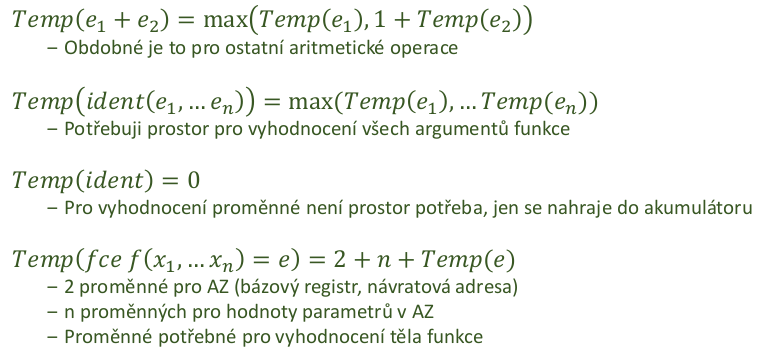

- interpretace a preklad
    - rozdil je jen v zaverecne fazi
        - prekladac generuje kod - vytvari soubor s instrukcemi pro CPU
        - interpret vykonvava program rovnou

- vstup
    - AST - pruchod stromem urcuje poradi vykonavani operaci (obdoba rekurzivniho sestupu)
    - mezijazyk (trojice, ctverice) - snazsi zpracovani nez samotny strom
        - umozneni obecnych optimalizaci bez ohledu na konretni architekturu

- pozice optimalizatoru
    - AST
        - nezavisle na cilove architekture
        - pomerne abstraktni struktura -> muze byt slozite vymyslet pravidla
    - Cilovy kod
        - lze vyuzit vlastnosti cilove platformy a pro tu konkretne optimalizovat vysledny kod
    - mezijazyk (= vysokourovnovy assembler, bytecode)
        - nezavisle na cilove architekture
        - konkretni realizace instrukci -> snazsi navrh pravidel

- jazyk trojic
    
    

    - nemusi resit alokaci docasne promenne (jsou implicitni)
    - v podstate obdoba AST
        - misto docasne promenne - reference na dalsi trojici
        - odpovida instrukcim PL/0

- jazyk ctveric
    
    

    - podobne jako instrukce CPU -> lze snaze prevest do JIS
    - snadne pro zpracovani optimalizatorem
        - vzdy vim kde jdou data
    - potrebuji pamet pro pomocne promenne (mezivysledky)
        - realne pak registry CPU

- Generovani mezijazyka
    - jednodussi problem nez generovani instrukci (napr architektura MIPS je komplikovanejsi nez PL/0)

- Generovani instrukci
    - na vetsine platforem lze primocase simulovat zasobnikovy automat
    - potrebuji mit prehled o cilove platforme
        - jake instrukce jsou k dispozici, jaky knihovny, jake registry, ...

- zasobnik pro aritmetiku MIPS
    - zasobnik neni spravovan automaticky
    - musime rucne menit hodnotu registru $s - stack pointer

    
    

    - podle chovani cilove platformy se prekladac musi starat o "vsechno"
    - s instrukcemi a interpretem PL/0 snazsi zivot

- generovani kodu obecne
    - podobna strategie jako u rekurzivniho sestupu
        - pro kazdy fragment generuji kod, ktery
            - ma vysledek ulozeny na definovnem miste (vrcho zasobniku / akumulator)
            - uklidi po sobe vsechny nezadouci efekty
        - snadne pro aritmetiku
        - slozitejsi pro ridici konstrukce (if else, while, ...)

- zpracovani konstant
    - vlozeni konstanty do pracovniho prostredi
        - vrchol zasobniku / akumulator

    

- zpracovani aritmetiky
    - pro jeden uzel AST -> jednu aritmetickou/logickou operaci

    

    - poradi operaci
        - urceno
            - strukturou derivacniho stromu/AST
            - dodatecnymi pravidly pro priority a smer cteni operatoru
        - pro zpracovani vyrazu lze kod generovat rekurzivnim sestupem

- zpracovani podminek
    - isntrukce rizeni toku programu
    - podmineny/nepodmineny skok
    - kdyz ma cilova patforma navesti (naspr MIPS), tak nemusime adresu skoku zpetne dopocitavat
    - u PL/0 nezname adresu skoku - musime ji pak zpetne dopocitat

    

- zpracovani volani podprogramu
    - volani podprogramu je skok
        - musime najit polohu podprogramu (leze staticky)
    - navrat z podprogramu je skok
        - musim si pamatovat navratovou adresu -> nelze staticky (nevim kdo me bude volat a kolikrat)
    - navratova hodnota
        - po skonceni funkce je vysledek v pracovnim prostredi (vrchol zasobniku / akumulator); dle architektury
    - potrebuji spravovat obsah zasobniku (pokud nemam instrukce jako je call co to udelaji za me)

- aktivacni zaznam
    - ukazatel na vrchol zasobniku -> vim kam pridavat data
    - ukazatel na bazi zasobniku -> vim kde aktualni zasobnik zacina (relativni adresy)
    - staticky ukazatel -> ukazatel na bazi nadrazeneho zasobniku
        - pristup ke statickym nadrazenym promennym
    - ukazatel na bazi volajiciho zasobniku - dynamicky ukazatel
        - vim kde bude baze po skonceni volani aktualniho podprogramu

    

- zpracovani volani - volajici
    - v MIPS si musim sam ridit obsah zasobniku
    - v PL0 mam instrukci call ktera to udela za me

    

    - rezijni operace na zacatku funkce (pri prekladu deklarace funkce)
        - doplneni AZ (aktivacni zaznam)
        - alokace pameti pro predane parametry, lokalni promenne

- zpracovani parametru/lokalnich promennych
    - jedine promenne jsou parametry
        - vsechny jsou v AZ, ulozene po volani funkce
        - adresy (v tabulce symbolu) maji pevny offset k bazovemu registru
    - postup
        - vypocet baze + offset (v PL0 automaticke - instrukce LOD)
        
    

    - potrebuji tabulku symbolu a jasny mechanismus prideleni pameti
    - postup:
        - ziska data pro praci

    

- zpracovani deklaraci
    - nepotrebuje explicitni kod
        - pokud jde o inicializaci pri deklaraci, tak stejne jako u prirazeni
    - potrebuje prideleni pameti
        - zaznam v tabulce symbolu

- docasne promenne
    - funkce Temp(e) = pocet docasnych promennych k vyhodnoceni e
        - lze vyhodnotit pro kazdy podstrom zvlast, zavisle na mechanice vypoctu
    - Temp(a+b)
        - pokud jsou `a` a `b` cele cisla, kolik bude docasnych promennych?
            - Temp(a+b) = 1

    

    - Temp(a+b) = ?
        - kdyz jsou `a` a `b` obecne vyrazy
        - Temp(a+b) = Temp(a) + Temp(b) + 1

    

- vyuziti docasnych promennych
    - generator kodu musi vedet kolik jich aktualne pouziva
        - musi umet najit misto pro dalsi docasnou promennou

    

- objektove jazyky
    - navic polymorfni chovani
        - v dobe prekladu nejsou znamy adresy skoku na volane metody (virtualni funkce)

- struktura objektu (CIR) v pameti
    - struktura podobna jako u zaznamu
        - atributy maji pevnou pozici vyci bazi zaznamu
        - oznaceni tridy jako cislo
        - odkaz na tabulku skoku
    - ulozeny v dynamicke pameti
    - tabulky skoku (Dispath table)
        - stejne v ramci tridy -> ne primo v CIR
        - kazda trida ma pevny seznam metod (vcetne zdedenych, pro usnadneni)
        - tabulka jako index pro adresy skoku
        - adresa metody na fixni pozici vuci bazi tabulky

- tabulka skoku
    - v dobe prekladu obtizne rozhodnout jake volani se provede
        - ne vzdycky je mozne staticky zjistit na co ukazuje zadana reference

    - pristup podobny jako u atributu
        - metody na fixni pozici vuci bazi tabulky
        - pri generovani kodu jde alespon urcit offsety
        - pri dedicnosti tabulka roste ve vsech radcich

    
    