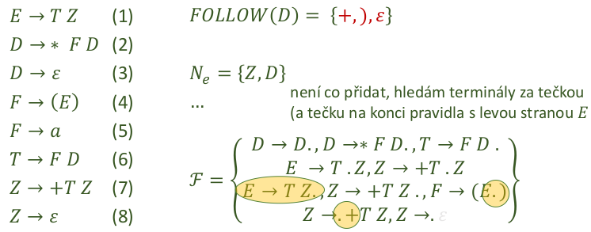
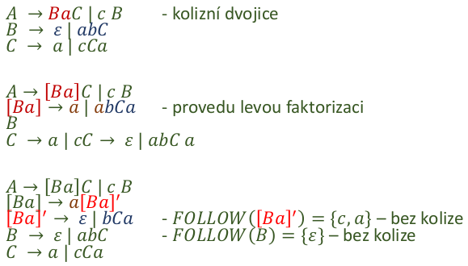
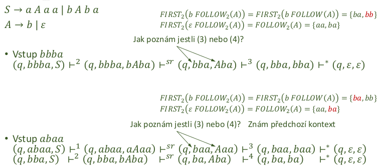

- zasobnikovy automat
    - = abstraktni model vypocetniho stroje - syntaktickeho analyzatoru
    - jednocestny
    - nedeterministicky (realne muzeme potrebovat backtracking)
        - tim jak ktere pravidlo pouzit
        - deterministicky pouze pokud ta gramatika ma dalsi vlastnosti jako schopnost rozhodnout pravidlo z prvnich n terminalnich symbolu

    

- formalni popis PDA
    - 𝑃𝐷𝐴 = { 𝑄, Σ, Γ, 𝛿, 𝑞0 , 𝑧0 , 𝐹}
        - 𝑄 = konecne mnozina stavu radice
        - Σ = vstupni abeceda
        - Γ = abeceda zasobnikovych symbolu (muze byt T U N), teoreticky jakekoliv znaky
        - 𝛿 = prechodova funkce - aktualni vstup, vrchol zasobniku, aktualni stav -> novy stav + novy obsah zasobniku
        - 𝑞0 ∈ 𝑄 = pocatecni stav radice
        - 𝑧0 ∈ Γ = dno zasobniku (typycky #, nemuze podtect)
        - 𝐹 ⊂ 𝑄 = mnozina koncovych stavu
    - konfigurace PDA: (𝑞, 𝑤, 𝛼) ∈ 𝑄 × Σ ∗ × Γ ∗
    - akceptacni automat - vystupem je ano/ne (prijimam/neprijimam slovo)

- priklad - PDA pro L = {0^n1^n}

    

- vztah BKG a zasobnikovych automatu
    - pro kazdou BGK jde sestrojit nedeterministicky zasobnikovy automat
        - typicky ale chceme determinismus
    - syntakticka analyza shora dolu
        - intiutivnejsi
        - problem s levou rekurzi
        - LL parsery, Antlr
    - syntakticka analyza zdola nahoru
        - naivni postup = backtracking (casove slozite)
        - poradi si s levou rekurzi a obecne vetsi skupinou gramatik
        - LR parsery, yacc, bison
        - ne prilis intuitivni

- postup shora dolu
    - pro bezkontextovou gramatiku G lze sestavit PDA a naopak
    - 2 operace ktere automat pouziva (definice 𝛿)
        - exanze
            - 𝛿(𝑞, 𝑐𝑜𝑘𝑜𝑙𝑖𝑣, 𝐴) = {(𝑞, 𝐴) : 𝐴 → 𝛼 ∈ 𝑃}, ∀ 𝐴 ∈ 𝑁
        - redukce / srovnani
            - 𝛿(𝑞, 𝑎, 𝑎) = {(𝑞, 𝜀 )}, ∀ 𝑎 ∈

- priklad shora dolu

    

- LL(k) analyzatory
    - podmnozina BKG umoznujici deterministickou analyzu (konstrukci deterministickeho PDA)
        - cte vstup zleva doprava
        - provaci nejlevejsi derivaci s prihlednutim ke `k` symbolum vstupniho retezce
    - analyza v O(n)
    - navic k predchozimu prikladu je potreba dopsat pravidla pro volbu prave strany
        - automat / prechodova funkce 𝛿 je popsana tabulkou

- jednoducha LL gramatika
    - gramatika zapsana v Greinbachove normalni forme 𝑋 → 𝑎𝑌1 … 𝑌𝑛 , 𝑛 > 0, 𝑌1 … 𝑌𝑛 ∈ (𝑁 − 𝑆 ) ∪ 𝜀 nebo 𝑆 → 𝜀
    - kazdy bezkontextovy jazyk ma takovou gramatiku, ale pocet pravidel po prevedeni O(n^4) - neprakticky velka
    - vzdy lze sestavit rozhladovou tabulku
        - v kazde bunce jen jedno pravidlo - lisi se prvnim symbolem prave strany

- LL(1) - trivialni priklad

    
    

    - derivacni strom lze ziskat primo z automatu tim jak akceptujeme vstupni data

        

- LL analyzator
    - jednoducha implementace
        - pomoci tabulky
        - potrebujeme jen lexer co nam doda tokeny
        - realna implementace pomoci switchu

- LL analyzator - mozne kompikace
    - co kdyz je jako prvni symbol neterminalni symbol? -> musim pouzit funkci first abych vedel kdy dane pravidlo muzu pouzit (pro jake vstupy)

    

- funkce first
    - detekce cim vsim muze zacinat dana vetna forma
    - hodi se pro rozliseni jaky terminal ma vest k prislusne prave strane
    - ma smysl jen pro zadani retezec vuci dane gramatice
    - vstup: libovolny retezec pro ktery se analyza provadi + gramatika
    - vysput: mozina terminalnich symbolu, ktere mohou byt na zacatku vetne formy

    
    

    - tim padem muzu pravidlo 1) pouzit pro vstupy `b` a `c`
    
    

    - formalne je defnovava rekurzivne
        1) pokud a = e FIRST(a) = {e}
        2) pokd a je terminalni symbol -> FIRST(a) = {a}
        3) pokud S -> a|b|c.. -> first(S) = {a,b,c,...}
        4) S -> AB kde A je v mnozine Ne (muze se prepsat na e) -> FIRST(S) = FIRST(A) - e U FIRST(B) 
        5) S -> AB kde A neni v mnozine Ne -> FIRST(S) = FIRST(A)

    
    
    

- funkce FIRST() poznamky
    - casto zvladnutelne metodou "kouknu a vidim"
        - pokud je na zacatku terminalni symbol -> je to vysledek
        - pokud je v retezci alespon jeden terminalni symbol -> nedostanu se za nej
        - aby mohl byt vysledek 𝜀 -> musim hledat funkci first jen pro retezce neterminalnich symbolu (jsou v mnozine Ne)

- LL analyzator - mozne komplikace - e pravidla
    - pro volbu pravidla musim pouzit prvni symbol prave strany - co s prazdnou pravou stranou?

    

- funkce follow()
    - detekuje co vsechno se muze objevit za zadanym symbolem
        - definovana pro terminalni i neterminalni symboly
        - nema smysl pro retezce (je stejna jako pro posledni symbol daneho retezce)
        - poznam jaky symbol ve vetne forme muze nasledovat za tim, ktery ma "zmizet" (S -> e)

    - vstup: jeden symbol pro ktery se analyza provadi (+ gramatika)
    - vystup: mnozine terminalnich symbolu, ktere za nim mohou nasladovat v libovolne vetne forme

    
    

- funkce follow() ke zpracovani 𝜺 pravidel
    - pro volbu pravidla musim pouzit prvni symbol prave strany
        - pravidlo (4) pokud nam ve vstupu symboly ktere mohou stat za A

    

- rekurzivni idea vypoctu follow()
    - vstup: symbol A ∈ (𝑁 ∪ 𝑇 ) a gramatika G = {N,T,P,S}
    - zacni s FOLLOW(A) = {}
    - pokud A = S (je pocatecni symbol), pak do FOLLOW(A) pridej 𝜀
        - urcite muze stat na konci - hned na zacatku derivovani 
    - projdi vsechny prave strany v G, ktere obsahuji A (maji tvar 𝛼𝐴𝛽) a pridej do FOLLOW(A) vsechny FIRST(𝛽); pokud v nejake bude 𝜀, nepridavej ho
    - pokud jev G pravidlo 𝐿 → 𝛼𝐴 nebo 𝐿 → 𝛼𝐴𝛽 a zaroven 𝜀 ∈ 𝐹𝐼𝑅𝑆𝑇(𝛽), pak pridej do FOLLOW(A) takve FOLLOW(L)

- Algoritmus vypoctu funkce FOLLOW()
    
    
    

- FOLLOW() - poznamky
    - podstatne mene intuitivni
    - je treba mit prehled
        - ktera pravidla uz byla zpracovana
        - ktere kroky byly na pravidlo aplikovany
        - hlidat si pozice tecky
        - nezapomenout na peclive vyhodnoceni Ne - chyba v ni znamena vynechani pravidel...
        - 𝜀 tam patri pokud symbol muze stat na konci nejake vetne formy

- obecna LL(1) gramatika
    - nemusi byt v Greinbachove normalni forme
    - bezkontextova gramatika, nema levou rekurzi
    - musi navic platit

        

- Kolize pri hledani LL(1) gramatiky kolize
    - kdyz sestavuji tabulku (parser) a v jedne bunce mam vic pravidel => nevim ktere vybrat (jak se rozhodnout)

    

- priklad first-first kolize
    - prave stany zacinaji stejnym terminalem / skupinou terminalu
        - nevim jeke pravidlo zvolit
        - muzu zkusit lookahead (casova slozitost?)
        - muzu gramatiku zkusit upravit - najit LL(1) gramatiku bez kolize pro stejny jazyk

    

    - leva faktorizace

        

        - zjevne generuje stejne retezce jako puvodni gramatika
        - neobsahuje kolizi zpusobenou 𝛼
        - muze obsahovat dalsi kolize - nevim nic o 𝛼1 , 𝛼2 … 𝛼𝑛

        

- priklad first-follow kolize
    - prava stana zacina terminalem, ktery je ve follow mnozine leve strany prepsatelne na 𝜀
        - objevuje se pri existenci 𝜀 pravidel, bez nich se ji nemusim obavat
        - opet budu hledat jinou LL(1) gramatiku pro stejny jazyk

    
    

    - pohlceni terminalu
        - Ostatnich pravidel si opet nevsimam, potrebuji ale identifikovat vsechna mista vedouci k 𝑎 ∈ 𝐹𝑂𝐿𝐿𝑂𝑊(B) (dvojice Ba)
        - lze vytvorit novy neterminalni symbol [Ba], kterym nahradim vsechny vyskyty Ba
    
        

        - nevim nic o 𝛾1 … 𝛾𝑛 -> mohou vzniknout (zrejme) first-first kolize, leve rekurze, ...

        

        
    
    - pohlceni terminalu (priklad 2)

        

- priklad s odstranenim e pravidel

    

- FIRST-k a FOLLOW-k funkce
    - nekdy se hodi analyzovat delsi retezce nez jen prvni neterminalni symbol
    - intuitivne
        - FIRST-k = hleda k-znakove (a kratsi) zacatky vetnych forem
        - FOLLOW-k = hleda k-znakove (a kratsi) nasledujici vetne formy
    - definice moc nepomahaji hledani

- silne LL(k) gramatiky
    - kdyz se nepovede LL(1) analyzator, mozna mohu rozhodnout na zaklade prvnich k-symbolu
        - neni skutecny lookahead (ten je az v LR analyze)

    - definice podobna jako u LL(1)

        

- LL(k) gramatiky
    - rozdil mezi silnout LL(k) a obecnou LL(k) gramatikou
        - silne LL(k) gramatiky jsou zaroven LL(k), ale ne naopak
        - LL(1) je vzdy silna gramatika - pro ni definice splynou
        - obecne LL(k) parser rozhoduje na zaklade vsech nactenych symbolu + vrcholu zasobniku + k symbolu ze vstupu, silne LL(k) potrebuji jen zasobnik a vstup

    

- LL(k) gramatika priklad
    
    

    - => neni LL(1) gramatika

    

    - podle definice (prazdne pruniky) je toto LL(2) gramatika

    

- slaba LL(2) gramatika 

    

    - ocividne se nejedna o LL(1) gramatiku, jedna se alespon o slabou LL(2)?

    

    - => splneny podminky slabe LL(2) gramatiky, jedna se i o silnou LL(2) gramatiku?

    

    - => neni silna LL(2)!

- slaba LL(2) - akceptace
    
    