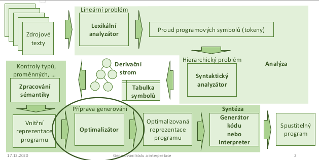

- kde optimalizovat
    - nad AST
        - nezavisle na cilove platforme
        - vysoka uroven -> rada veci jeste neni rozhodnuta (adresy v pameti, ...)
        - inlining, eliminace mrtveho kodu, vyhodnocovani konstant

    - nad cilovym jazykem (assembly)
        - rada prilezitosti dane architekturou
        - zavisle na platforme -> nova implementace pro kazdou platformu
        - alokace registru, vyuziti cache, rozbaleni smycek

    - nad mezijazyek (= vysokourovnovy assembler, v podstate i instrukce PL/0)
        - nezavisle na platforme
        - potrebuji vnitrni reprezentaci programu (viz jazyk trojic/ctveric)
        - hledani nejlevnejsich instrukci, eliminace podvyrazu

- zakladni blok
    - posloupnost instrukci bez navesti (s vyjimkou prvni instrukce) a bez skoku (s vyjimkou posledni instrukce)
    - co nejdelsi
    - nejde skocit do stredu bloku (musi se vykonat od zacatku do konce)

- Graf toku rizeni (Control-Flow Graph, CFG)
    - orientovany graf
    - uzly jsou zakladni bloky

        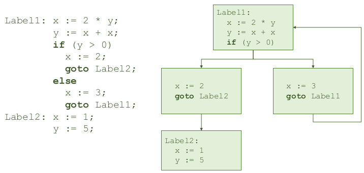

- cile optimalizace
    - zlepseni vyuziti zdroju
        - zkraceni doby vykonavani
        - zmenseni velikosti programu
        - zmenseni mnozstvi zprav (napr pri sitove komunikaci)
    - NESMI zmenit chovani programu z pohledu uzivatele
        - vypocet skonci se stejnym vysledkem

- cena za optimalizaci
    - ne vzdy se musi vyplatit pouzit vsechny optimalizace
    - problemy:
        - tezka implementace
        - preklad trva prilis dlouho
        - nektere optimalizace nemaji prilis velky prinos
    - -> vazit mezi optimalizacemi a vykonem prekladace

- cena za optimalizaci - smycky
    
    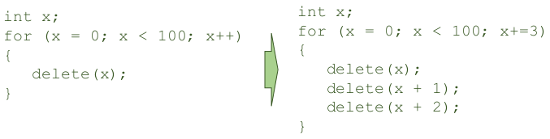

    - delsi program (vice instrukci zpomali vykonavani jen trochu, ale snizi opakovanou rezii)

- lokalni optimalizace
    - nejsnazsi implementace
        - nepotrebuji analyzovat cely program, jen aktualni zakladni blok -> nemusim resit nic s rizenim toku programu

- vkladani konstant
    - operace nad konstantami muze vykonat prekladac
    - konstanty se objevuji napr v adresaci poli, definovani rozmeru, atd

    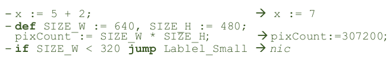

- rozvoj maker v C/C++ - RIZIKA!!

    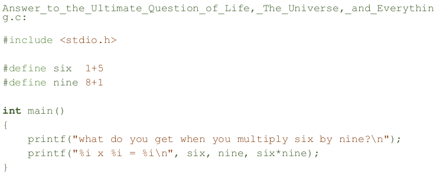

- pozn `constexpr` v C++ :)
    
    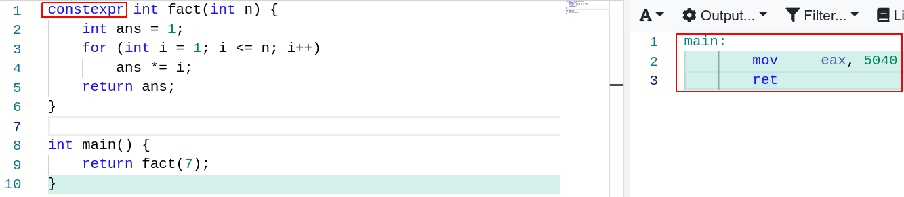

     - kompilator provede cely vypocet pri prekladu

- zjednoduseni algebry
    - obecnejsi nez zpracovani konstant, ale podobne
    - nektere operace nedelaji nic uzitecneho => mohu je odstranit

        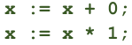

    - nektere oprace lze zjednodusit

        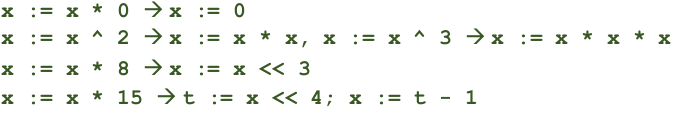
    
    - potrebuji sadu konkretnich pravidel ktere muzu uplatnit

        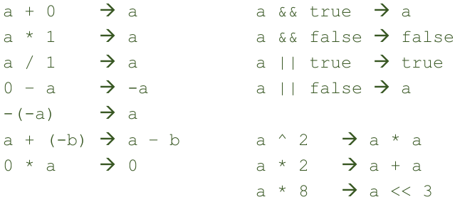
    
    - vyhody zjednodusene algebry
        - programator nemusi nad tim nemusi premyslet
        - snizuje # instrukci
        - umoznuje dalsi optimalizace opakovanou aplikaci podobnych pravidel

- implementace
    - hledam kandidaty na aplikaci pravidel ve stromech vyrazu
    - nemusi byt videt na prvni pohled

        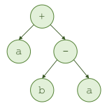

    - -> nejprve prevod vyrazu do kanonickeho tvaru
        - soucty soucinu, nejprve konstanty a pak promenne
    
- kanonicka podoba - vyhody
    - preskladani operaci ukaze dalsi moznosti optimalizace
        - konstanty poskladame vedle sebe -> lze vyhodnoti rovnou

    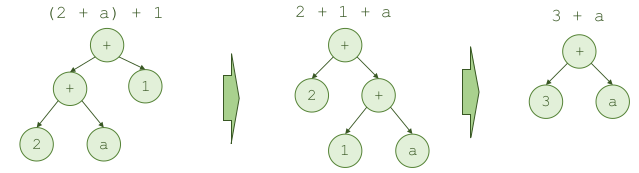

kanonicka podoba - rizika
    - prevod muze vest k nespravnemu chovani
    - zjednoduseny vyraz nemusi byt ekvivalentni

- propagace konstant
    - substituce promenne za konstantu (pokud vim ze jeji hodnota v dane casti je konstnace - muzu se k ni tak chovat)

    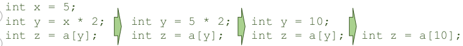

- propagace prirazeni / kopirovani
    - pokud je jedna promenna prirazena druhe, muzu je zkusit "sloucit"
    - samo o sobe je k nicemu ale muze vest k odhaleni mrtveho kodu
    - musim zjisit kde vsude se promenna vyuziva a nahradit ji

- eliminace mrtveho kodu
    - pokud vykonani prikazu nema zadne vedlejsi efekty -> nemusim ho delat
    - nepouzite promenne
    - nedosazitelna cast kodu
    - muze byt chyba programatora -> warning / unreachable code
    - klicove slovo `volatile`!!!

    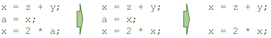

- inlining
    - nahrada funkce jejim telem
    - pozor na nazvy promennych
    - usetrim volani metody (vytvareni AZ, alokace pameti, ...)

    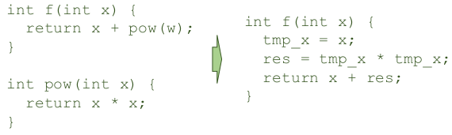

- eliminace spolecneho podvyrazu
    - protiklad k inliningu
    - hledam stejny opakovany vypocet a nahradim ho jednou predpoctenou promennou

    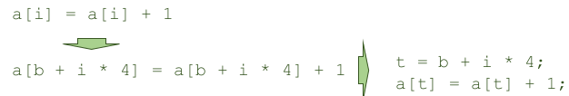

- optimalizace smycek
    - pouziti nastroju na profilaci

- nahrada invariantniho vyrazu
    - pokud se vyraz nemeni -> nemusime ho volat porad dokola

    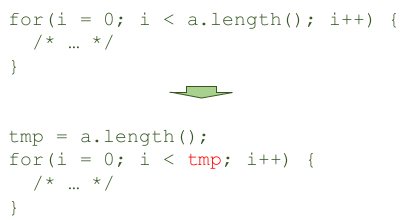