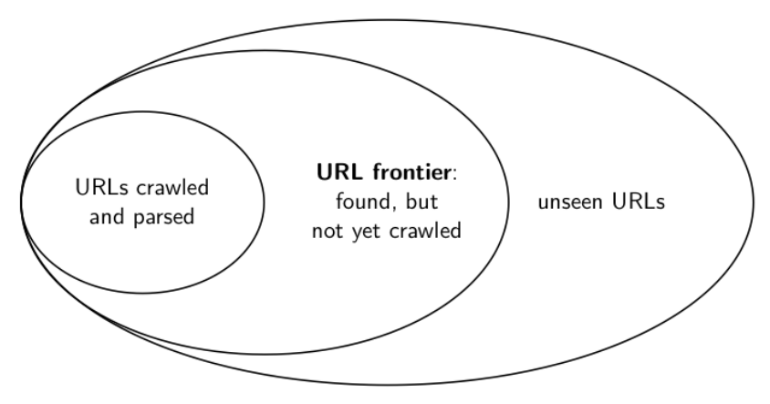
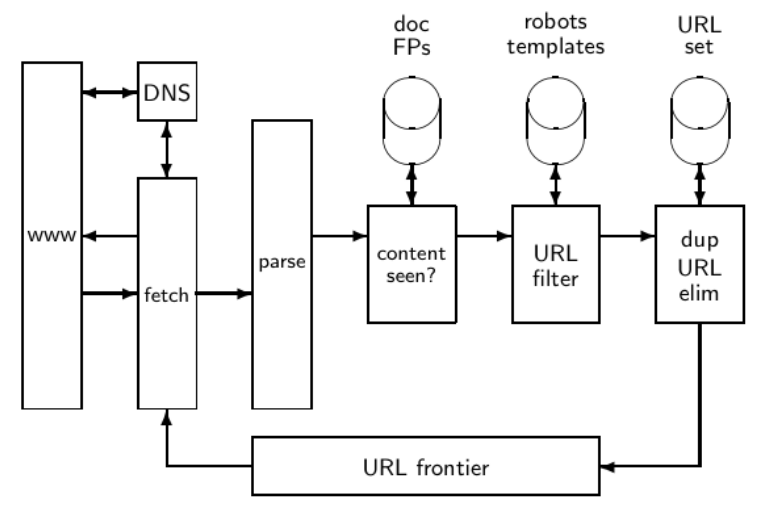
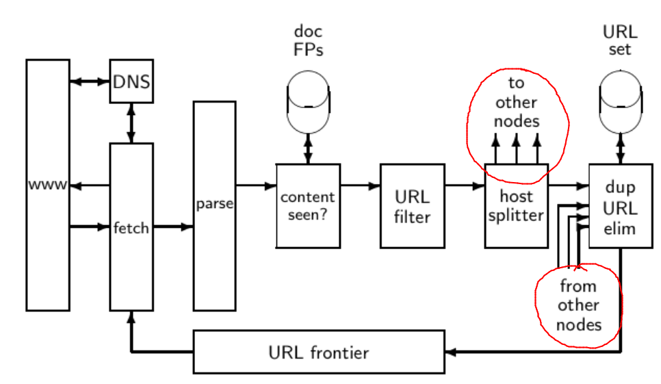
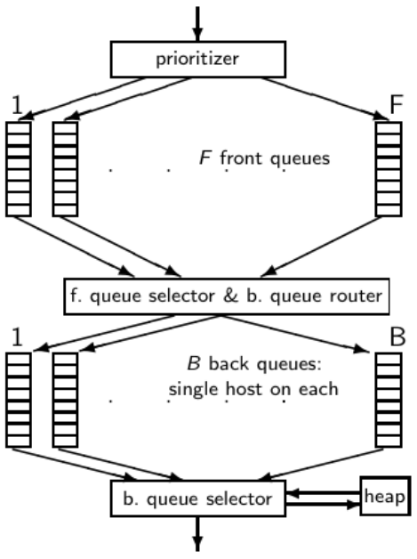
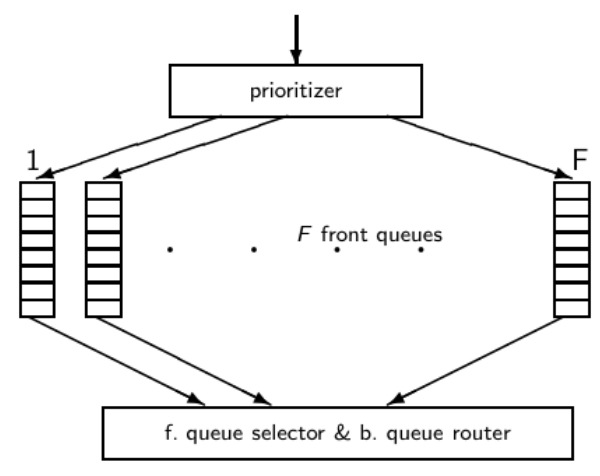
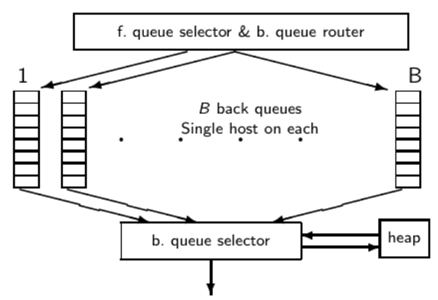

- web search engines musi krolovat web
    - pro mnoho jinych systemu je to jednoduche
        - napr. souborovy system na disku = rekurzivni sestup
    - u webovych vychledavacich systemu trva zistavani obsahu dokumentu o neco dele (zpozdeni prenosu dat po siti - pres internet)

- zakladni operace crawleru
    - inicializovat frontu s URL cilovych stranek
    - opakuj:
        - vyjmi URL z fronty
        - stahni obsah stranky + parsovani
        - ziskej vsechny URL ktere jsou obsahem dane stranky a uloz je do fronty
    - zakladni predpoklad: The web is well linked
    - problemy tohoto pristupu?
        - skalovatelnost (potrebujeme cely system distribuovat)
        - musime zabranit duplicitam (kontrola jestli jsme dane URL us nakrolovali nebo ne)
        - detekce spider traps (zamerne dynamicky se menici cyklus URL => zacykleni krolera)
        - politeness - "nebombardovat dane stranky dotazama" => delay [ms]
        - aktualnost: musime krolovat periodicky
            - kvuli velikosti webu nemuzeme krolovat vsechno (pouze podmnozinu)
                - probelm vyberu podmnoziny, priorita?
        - kroler musi byt robustni
    - robots.txt = soubor obsahujuci povelene stranky, ktere kroler (robot) muze navstivit => dobry zvyk je se podivat jestli robots.txt existuje na dane strance
        - je dobre tento soubor cachovat pro kazdou stranku kterou navstivime

    - URL frontier (hranice)

      

    - datova struktura, ktera drzi a spravuje URL ktere jsem videli ale jeste nebyly nakrolovany
    - muze obsahovat vice stranek od stejneho hosta (serveru)
        - musi se snazit tomu je NESTAHNOUT vsechny ve stejny cas (zatizeni serveru)
    - vsechny vlakna chceme mit zaneprazdneny (vsichni musi makat)

     

    - normalizace URL
        - nektere URL ziskane z dokumentu jsou relativni URL
        - behem parsovani musime normalizovat URL => zbavit se parametru atd
    
    - pro kazdy stazeny dokument se podivame jestli jsme dany obsah uz videli
        - napr podle jeho struktury + fingerprints
        - pokud jsme dokument jiz videli => skip

    - distribuovane krolovani
        - vice vlaken co kroluji (potencionalne i na jinych uzlech v siti => geograficka distribuce)
    
    - distribuovany crawler

     

    - pokud se v obsahu dokumentu objevi URL na jiny server (treba geograficka lokace) => preposleme URL uzlu, ktery kroluje v dane oblasti

    - frontier: dva zakladni "pozadavky"
        - politeness
        - freshness (aktualnost)
        - neni tak jednoduche -> obycejna prioritni fronta nebude fungovat

- Mercator URL frontier

     

    - URL postupuji od shora dolu
    - horni fronty zajistuji prioritu
    - spodni fronty (back queues) zajistuji politeness
    - kazda fronta = FIFO

    - front queues

         

        - prioritezer priradi kazde URL cislo mezi 1 az F a pote priradi URL do prislusne fronty
        - pro prirazeni cislo (priority) se pouzivaji heuristiky: refresh rate, PageRank, ...
        - vyber z front queues je zahajen dolnima frontama (back queues)
            - vybere frontu ze ktere se popne dalsi URL (Round Robin, nahodne a nebo s pouzitim vice sofistifikovanych metod) => musi ale zajisit prednost URL s vyssi prioritou

    - back queues

        

        - obykle kazda fronta obsahuje URL od stejneho hosta (serveru - domeny)
        - heap:
            - jeden zaznam pro kazdou back queue
            - zaznam = nejblizsi cas kdy muzeme znovu poslat pozadavek na hosta odpovidajici dane fronte
                - urcene nazaklade doby posledniho dotazu (kdy) a casove mezery (heuristika)
        - jak fetcher interaguje s back queue:
            - vyjmy back queue `q` z heap a stahni (fetchni) URL na vrcholu dany fronty dokud neni fronta `q` prazdna
        - jakmile je fronta `q` prazdna:
            - vyzvedneme URLs z front queues a priradime je do prislusnych back queues (dokud nedostaneme URL ktera nespada do zadne back queue - host)
                - vytvorime novou heap entry pro dane URL