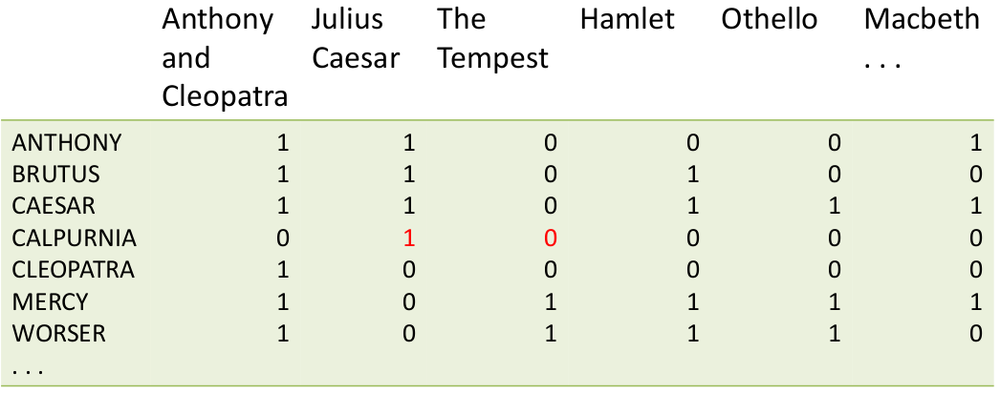
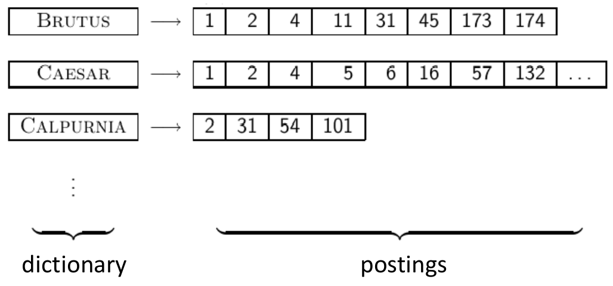
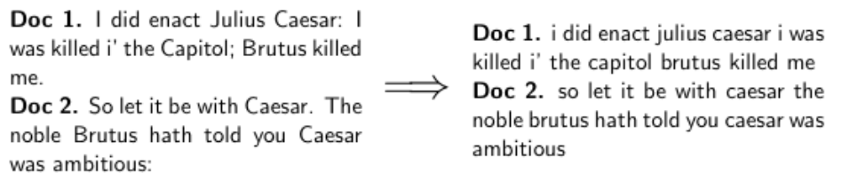
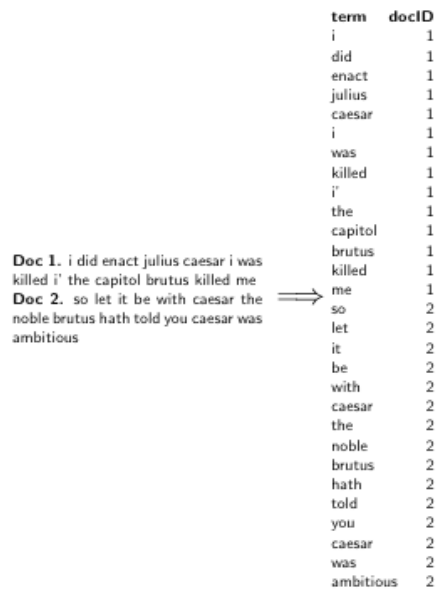
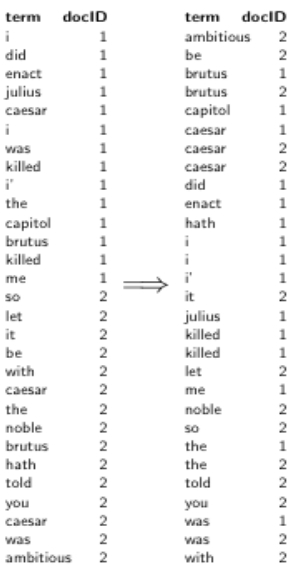
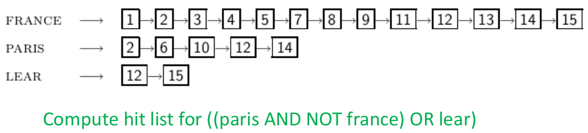
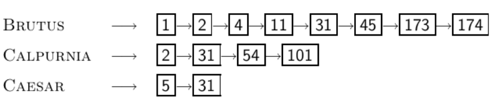
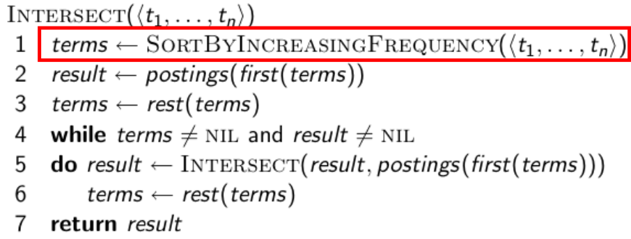

- booleovske vyhledavani
    - nejjednodussi model na kterem se da system vyhledavani informace zalozit
    - dotazy jsou booleovske vyrazy (CAESAR & BRUTUS)
    - search engine vraci vsechny dokumenty ktere odpovidaji logickemu vyrazu
    - pozuiva Google booleovsky model?
        - pokud zadame `w1 w2 w3`, Google to defaultne interpretuje jako `w1 & w2 & w3`
        - pripady kdy se jako vysledek vrati dokument ktery nebosahuje zadane klicove slovo:
            - anchor text = text viditelny v odkazu (naptr klikete `zde`)
            - stranky ktere obsahuji varianty daneho slova (oprava preklepu, deti vs dite atd)
            - dlouhe dotazy
            - boolevske vyrazi ktere generuji malo vysledku => neco se k nim prida co by asi mohlo odpovidat tomu co uzivatel chtel vyhledat
    
    - jednoduche booleovske vyhledavani vs ranking (ohodnocovani) vysledku
        - booleovske vyhledavani vraci vysledky vyhledavani v libovolnem poradi
        - Google (a i ostatni vyhledavace) ohodnoty vysledky a seradi je od nejlepi po nejhorsi (relevantnost)

- invertovany index
    - nestrukturovane data
        - ktere shakespearovske hry obsahuji RUTUS a AESAR a ne ALPURNIA?
        - muzeme pouzit `grep` (Linux) - proc je to spatny napad?
            - pomaly
            - grep je line-oriented a IR je documen-oriented
            - NOT ALPURNIA neni tak jednoduche
            - nalezeni napriklad slov v okoli nejakeho slova neni mozne
    
    - Term-ocument incidencni matice
        
         

        - `1` = dany term se vyskytuje v danem dokumentu (napr CALPURNIA se vyskutuje ve hre Julius Caesar); `0` otherwise
        
        - incidencni vektory
            - pro kazdy zadznam (term) mame vektor nul a jednicek 1/0
            - odpoved na dotaz `BRUTUS AND CAESAR AND NOT CALPURNIA`:
                - vezmem vektory pro BRUTUS, CAESAR a NOT CALPURNIA (komplement)
                - udelame bitovou operaci nad temito vektory
                - `110100 AND 110111 AND 101111 = 100100`

        - vetsi kolekce
            - napr 10^6 dokumentu a kazdy ma cca 1000 tokenu => 10^9 tokenu
            - v prumeru mame 6B na kazdy token (vcetne punkce a mezer) => celkova velikost kolekce je 6B * 10^9 = 6GB
            - predpokladejme ze je v kolekci M = 500,000 ruznych termu (500,000 * 10^6 jednicek a nul 1/0)
            - matice muze byt velice ridka => muzeme zaznamenavat pouze pozice jedicek = invertovany index :)

    - inverted index

         

        - pro kazdy term si drzime seznam dokumentu ve kterych se dany term nachazi
        - vytvoreni invertovaneho indexu
            - shromazdit (posbirat) vsechny dokumenty ktere chceme zaindexovat
            - tokenizace jejich obsahu ("rozdeleni na slova")
            - lingvisticke upravy (preprocessing), normalizace tokenu (napr friends -> friend)

                 

            - vytvoreni invertovaneho indexu na zaklade daneho termu a vsech dokumentu ve kterych se vyskytuje (slovink + posting list)

        - generovani posting listu

             

        - serazeni abecedne dle termu

             

            - umoznuje rychlejsi vyhledavani termu => binarni vyhledavani (pokud se samozrejme nepouzije hasmapa)
            - u kazdeho termu si take drzime jeho frekvenci (v kolika dokumentech se vyskytuje = pocet prvku posting listu)

- zpracovani booleovskych dotazu
    - napr: `BRUTUS AND CALPURNIA`
        - 1) najdi term BRUTUS ve slovniku a ziskej odpovidajici posting list
        - 2) najdi term CALPURNIA ve slovniku a ziskej odpovidajici posting list
        - 3) udelej prunik danych posting listu
        - 4) vrat vysledek uzivateli (seznam dokumentu kde se vyskytuje BRUTUS a CALPURNIA)

    - prunik dvou spojovych seznamu
        - linearni slozitost O(n) kde n je delka KRATSIHO dokumentu
        - vyzaduje aby posting listy byly serazene 

         

         

        - 
        ```
        NOT FRANCE = 6, 10
        PARIS AND NOT FRANCE = 6, 10
        (PARIS AND NOT FRANCE) OR LEAR = 6, 10, 12, 15
        ```

    - model booleovskeho vyhledavani je schopen odpoved jakekoli dotazy ktere predstavuji booleovsky (logicky) vyraz
        - operace AND, OR, NOT
        - je presny -> dokument bud dany term obsahuje nebo ne

    - vhodny napriklad pro pravniky kterych se zajimaji o presnou definici nejakeho slova a presne kde je obsazeno (zakony atd)
    - pouziti napr pri hledani v emailu, intranetu atd

- optimalizace booleovskeho vyrazy
    - uvazujme dotaz ktery se sklada z logickych AND (napr BRUTUS AND CALPURNIA AND CAESAR)
    - jaky je nejlepsi poradi zpracovani (pocitani pruniku posting listu)?
        - v poradi s rostouci frekvenci
        - zacit s nejkratsim seznamem; proc?
            - velikost pruniku dvou seznamu je <= velikosti kratsiho seznamu
            - kratky seznamy = kratke vysledky = mensi pocet kroku pro zpracovani
            - vyzaduje razeni

        

        

- vice obecna optimalizace
    - query: (MADDING OR CROWD) and (IGNOBLE OR STRIFE)
    - ziskat frekvence vsech termu
    - odhadnout velikost kazdeho OR tim ze secteme prislusne frekvence
    - pote aplikujeme zpracovani podle rostouci frekvence (stejne jako v pripade obycejneho AND)