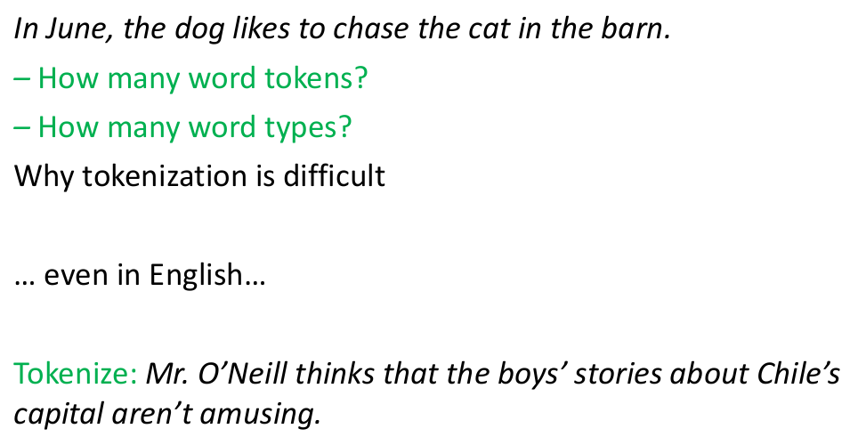
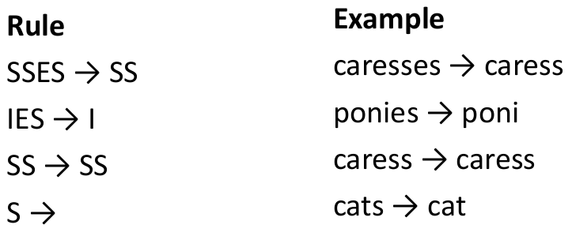
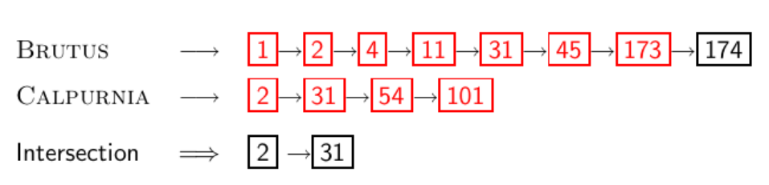
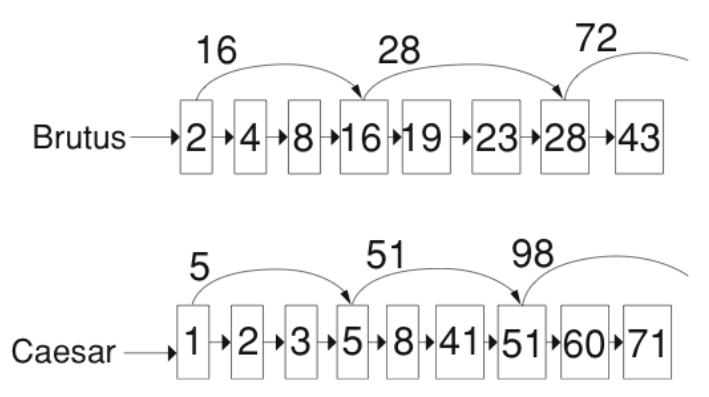
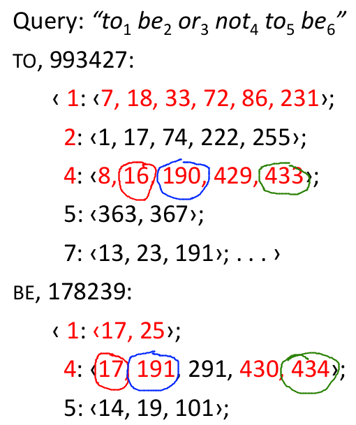

- predpoklad: umime strojove precist kazdy dokument
    - toto muze byt v realu velmi komplexni 
    - musime resit format (pdf, word, excel, html, ...) a jazyk kazdeho dokumentu
    - jaka znakova sada je pouzita
    - alternativne muzeme pouzit heuristiku

- komplikace co se tyce jazyka
    - jeden index obvykle obsahuje termy z vice jazyku
        - nekdy dokument muze obsahovat vice jazuku nebo formatu
        - spanelsky email s anglickou prilohou
    - co je jednotka dokumentu pro indexaci?
        - soubor? emal? email s 5 prilohami? skupina souboru (prezentace .ppt)?
        - => odpovedet na otazku co to je dokument neni jednoduche

- definice!!!
    - slovo: ohranicena skupina znaku vyskytujici se v texu
    - term: normalizovane slovo (velka/mala pismena, zakladni tvar, oprava preklepu)
    - token: instance slova nebo termu vyskytujici se v dokumentu
    - type: stejny jako term (ve vetsine pripadu), ekvivalentni trida tokenu

- normalizace
    - potrebujeme normalizovat slova vyskytujici se jak v dokumentu tak i v dotazu => aby mely stejny tvar
    - napr U.S.A a USA
    - vetsinou specificky definujeme tridy ekvivalence pro dany term (USA, US, U.S.A, U.S.)
    - alernativne muzeme udelat asymetrickou expanzi
        - window -> window, windows
        - windows -> Windows, windows
        - Windows -> (ne expansion)
        - pro nedame Windows, Window a window do jedne tridy ekvilance?
            - Windows = operacni system vs okno? :)

- normalizace: dalsi jazyky
    - PETER WILL NICHT MIT.
    - He got his PhD from MIT. → MIT ≠ mit

- priklad:
    - vstup: Friends, Romans, countrymen, So, let, it, be, with, Caesar
    - vystup: friend, roman, countrymen, so
    - jaka jsou vhodna slova pro vynechani?

     

- problemy
    - jedno slovo vs dve slova (nebo nekolik)?
        - co-education, data base, San Francisco, Los Angeles-based company
    - cisla
        - 3/20/91 (US), 20/3/91, Mar 20, 1991, B-52, 100.2.86.144 (IP), (800) 234-2333 (tel. cislo)
        - nektere IR systemy nemusi indexovat cisla ale obecne je to uzitecna informace
    - cinstina
        - nema bile znaky (mezery)
        - nejednoznacne oddeleni: dve znaky maji oddelene kazde svuj vyznam ale dohrmady maji take vyznam ale jiny (pozname z kontextu, ale jak?)
    - japonstina:
        - 4 ruzne abecedy, zadne mezery (jako cinstina)
    - arabstina:
        - cte a pise se z prava do leva 
        - cisle se ctou z leva do prava (napr letopocty)
    - accenty (hacky, carky, ...)
        - résumé vs resume
        - nejdulezitejsi: Jak budou uzivatele psat jejich dotazy?
    - velka/mala pismena
        - prevest vsechno na mala pismena (uzivatele stejne vsechno pravdepodobne budou psat s malymi pismeny - dotazy)
        - vyjimky
            - MIT vs mit
            - FED vs fed

- stop words
    - extreme casta slova kere nenesou velky vyznam pri vyberu relevantnich dokumentu
    - napr EN: a, an, and, or, are, as, at, be, by, for, from, has, he, in, is, it, ....
    - potrebujeme je indexovat v pripade frazoveho vyhledavani ("King of Denmark")

- Trideni podle vice ekvivalenci
    - soundex: foneticka ekvivalnce (rekne se to stejne), Mullet = Mueller
    - Thesauri: semanticka ekvivalence, car = automobile

- lematizace
    - prevedeni slova na zakladni tvar
    - am, are, is -> be
    - car, cars, car's, cars' -> car
    - the boy's cars are different colors -> the boy car be different color
    - lematizace implikuje redukci velikosti slovniku

- stemming
    - heuristicky proces ktery odrezava konce slov
    - hledani korene slova (casti slova nesouci vyznam)
    - lisi se pro kazdy jazyk
    - napr.: automate, automatic, automation -> automat

- porter algoritmus
    - nejbeznejsi stemming algoritmus pro anglictinu
    - konvence + 5 fazi redukci ktere jsou aplikovane sekvencne
    - kazda faze se sklada z mnoziny prikazu
        - napr:
            - smaz koncove "ement" pokud to co zbyde je delsi nez 1 znak
            - replacement -> replac
            - cement -> cement
    - priklad konvence:
        - z pravidel ve slozenem prikazu vyberte to ktere se vztahuje na nejdelsi priponu

     

    - dalsi priklady stemmeru: Lovins stemmer, Paice stemmer
    - zlepsuje stemming efektivitu?
        - obecne ji zlepsuje pro urcite dotazy a zhorsuje zase pro jine dotazy
        - obecne zlepsi efektivitu co se tyce dotazu obsahujici slov z nejake tridy ekvivalence
            - napr trida oper obsahuje: operate, operating, operates, operation, operative, operatives, operational
    - dotazy kde stemming spis skodi
        - operational AND research
        - operating AND system
        - operative AND dentistry

- Skip pointers

    

    - jak urychlime vypocet pruniku? => pouzijeme skip pointers
    - preskocime postings ktere se vysledku 100% neobjevi
    - nektere posting listy obsahuji nekolik milionu zaznamu
        - problem efektivity muze byt i obycejny linearni algoritmus O(n)

    

    - kam vsude ulozime skip pointery?
        - vice skip pointeru: kazdy skip preskoci pouze nekolik polozek ale zas je muzeme pouzit casto
        - mene skip pointeru: kazdy skip preskoci hodne polozek ale zas je nemuzeme pouzit tak casto
        - jednoducha heuristika
            - pokud je delka posting listu `P` pak pocet skip pointeru bude `sqrt(P)`
        - jednoduche kdyz je index staticky (kdyz je dynamicky tak se stuktura a delka meni)
        - drive urcyhlovaly vyhledavani hodne ale s dnesnim HW uz tolik ne

- frazove vyhledavani
    - chceme zodpoved dotazy jako napr. "stanford university" = fraze
        - "The inventor Stanford Ovshinsky never went to
university" = neodpovida hledanemu dotazu
    - problem pro invertovany index -> uz nam nestaci
    - 2 moznosti rozsireni invertovaneho seznamu
        - biwords
        - positional index

- biwords index
    - indexujeme kazdou dvojici po sobe jdoucich termu v textu jako frazi
    - napriklad: Friends, Romans, Countrymen => "Friends Romans", "Romans Countrymen"
    - kazda dvojice slov je nyni dalsi term ve slovniku
    - dvouslovne fraze mohou byt vyhledana

    - vyhledavani delsich frazi
        - napr "stanford university palo alto"
        - muze byt nahrazeno "STANFORD UNIVERSITY" AND "UNIVERSITY PALO" AND "PALO ALTO"
    - musime doimplementovat post-filering ktere identifikuje dokumenty ktere obsahuji celou ctryrslovnou frazi (musi byt bezprostredne za sebou)

    - extended biwords
        - naparsovat dokument a provest part-of-speech otagovani
        - rozdeleni termu do napriklad podstatnych jmen (N) a napr predlozek (X)
            - catcher in the rye => N X X N
        - kazdy string tvaru NX*N je extended biword (predlozky ohranicene podstatnymi jmeny)
        - King of Denmark => N X N
        - pridame extended biwords take do slovniku

    - problemy
        - falesne pozitivni
        - rychly narust velikosti slovniku

- Positional indexes
    - vice efektivni alternativa k biword indexum
    - posting list v nepozicnim indexu: kazda polozka je pouze docID (id dokumentu)
    - posting list v pozinim indexu: kazda polozka je docID a seznam pozic na kterych se dany term v dokumentu docID nachazi

    

- proximity search
    - positional index lze pouzit pro frazove vyhledavani -> lze ho take pouzit pro proximity search
    - napriklad: employment /4 place = najdi vsechny dokumenty ktere obsahuji EMPLOYMENT a PLACE a tyto slova nejsou odsebe vzalena vice jak 4 slova
        - priklad takove dokumentu "Employment agencies that place healthcare workers are seeing growth is a hit"
    - nejjednodussi algoritmus:
        - podivat se na kartezky soucin pozic slova EMPLOYMENT a slova PLACE v danem dokumentu
        - nevhodny pro slova s velkou frekvenci (specialne stop slova)
    - dulezite pro dynamicke souhrny (summaries)

- kombinacni schema
    - biword indexy a pozicni indexy se mohou prokombinovat
    - vyskyt hodne biwordu je pomerne castu (Michal Jackson atd.)
        - pro takove fraze chceme urychlit vyhledavani (oproti postitional posting vyhledavani)
    - kombinovane vyhledavani
        - zahrnout biwords s vysokou frekvenci jako termy slovniku
        - vsechny ostatni praze se budou vyhledavat pomoci positional vyhledavani
    - pro webove vyhledavace je pozicni vyhledavani mnohem narocnejsi nez obycejne booleovske

    