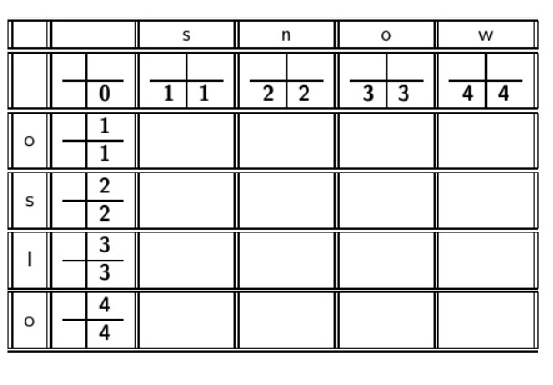
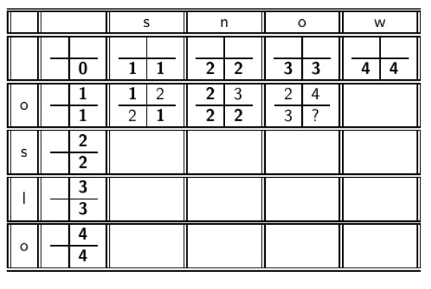

### Invertovaný index

- Invertovaný index se skládá z Dictionary a příslušných posting listů  
  - Dictionary je datová struktura držící slovník termů
  - Posting list je list identifikátorů dokumentů, ve kterých se daný term nachází

### Slovník jako pole s prvky fixní délky

- Ke každému termu se uchovává informace o df a pointeru na příslušný posting list

### Datové struktury pro vyhledávání termů
- Hlavní třídy:
  - Stromy
  - Hashe
  
- Kritéria výběru:
  - Bude počet termů statický, nebo bude narůstat?
  - Relativní frekvence se kterými se bude k jednotlivým termům přistupovat?
  - Kolik přibližně termů budeme mít?

#### Hashe
- Každý term slovníku je reprezentován číslem (zahashovaný term)
- Snaha o nejmenší kolize
- Postup vyhledávání:
  - Zahashovat query term
  - vyřešit kolize
  - nalezení termu podle číselné hodnoty
- Plusy:
  - Rychlé vyhledávání
- Mínusy:
  - Nemožnost nalezení malých variant (resume x résumé)
  - Nelze vyhledáváat podle prafixu (najdi termy začínající na auto...)
  - pokud slovník poroste, je drahé rehashování

#### Stromy
- Řeší problém s vyhledáváním podle prefixů

- Nejjednodušší je binární strom
  - vyhledávání pomalejší než hashe (konstantní vs O(logM) M je velikost slovníku)
  - O(logM) platí pouze pro vyvážený strom - B-stromy

- B-stromy
  - možnost vyvážení stromu
  - každý node stromu má určitý počet potomků v intervalu [a, b] kde a, b jsou odpovídající pozitivní čísla např. [2,5].

### Wildcard dotazy
- dotazy s určitou syntaxí umožňující vyhledávat termy podle podřetězců
- mon* - najít všechny dokuemnty které obsahují jakýkoliv term začínající na mon 
- Jednoduché pro B-stromy
  - vrátí všechny termy v rozsahu mon <= term < moo
  - průchod po větvích stromu
  - Pro * mon - termy uloženy pozpátku
- Vrátí výsledný set termů a s tím i příslušné posting listy s identifikátory dokumentů

#### Podřetězce uprostřed termů
- p * aha
  - bylo by možné nejprve vyhledat všechny termy začínající na p a poté končící na aha
  - příliž drahé a náročné
  - použijeme index permutací termu aka \bf{permuterm index}

#### Permuterm Index
- pro každý term se do slovníku přidají všechny jeho rotace, tedy:
  - pro slovo strom:
    - strom$, trom$s, rom$st, om$str, m$stro
    - $ je speciální word boundary symbol
  

- takovéto permutermy jsou ukládány do slovníku a ten zase bývá stromem
- Ke každému takto vznikajícímu permutermu je přiřazen odpovídající term ve slovníku

- Vyhledávání:
  - vyhledávaný wildcard query term se také přerotuje tak aby wildcard operátor byl vpravo
    - ro * ace -> ace$ro *
    - tento permuterm pak bude vyhledáván mezi permutermy ve slovníku

- Permuterm index:
  - + -> rychlé vyhledávání podřetězců
  - - -> až čtyřikrát větší velikost slovníku

#### K-gram indexy
- K-gram indexy jsou co se paměti týče úspornější než permuterm indexy
- příklad:
  - nájem - $ n, ná , áj , je , em , m $
- nutné držet si invertovaný index z bigramů na termy, které tyto bigramy obsahují
  - držíme si teda dva indexy: jeden klasickej (term - dokumenty) a druhej k-gram index (pro vyhledávání termů na zhákladě dotazu obsahujícího k-gramy)
 
 - Vyhledávání:
  - například pro dotaz aut* provedeme: $a AND au AND ut
  - po nalezení příslušných termů v normmálních (term - dokumenty) invertovaném indexu pomocí invertovaného indexu pro vyhledávání termů obsahujících bigramy.
    - vrací i false positive: pro mon* vrátí i term moon
    - tyto false positive je třeba následně filtrovat vůči zadanému dotazu
  - pro výsledné termy se pak dohledají dokumenty

- k.gram vs permuterm index:
  - k-gram - zabere méně místa
  - permuterm - není nutná filtrace false positive

### Edit distance
- oprava spelling chyb u indexovaných dokumentů a zadávaných dotazů
- dvě metody:
  - spelling opravy u izolovaných slov:
    - kontroluej pouze podobu slov jako takovou (ženy odešli - neopraví měkké i, neboť slovo odešli existuje)
  - kontext sensitive opravy:
    - podle okolních slov (opravilo by ženy odešli na ženy odešly)

#### Oprava u dokumentů
- týká se především OCR zpracovaných dokumentů - opraví chyby slov, ne jejich význam

#### Oprava dotazů
- Potřebujeme:
 - slovník všech správných slov se kterými srovnávat
 - možnost počítání vzdálenosti mezi srovnávanými slovy
- velká výpočetní složitost
- netriviální získávání slovníku správných slov

#### Edit distance
- minimální počet základních operací, které je nutné provézt, aby byla slova stejná
- Levenshtein distance:
  - definuje operace: insert, delete, replace
- Dameraou-Levenshtein distance:
  - přidává ještě možnost transpozice

#### Levenshtein distance:
- postup:
  - postavíme si tabulku 

  - poté procházíme jednotlivé řádky a vždy se rozhodujeme:
    - jsou daná písmena stejná?
      - pokud ne přidává se k číslu zleva nahoře jednička

      - pokud ano jednička se nepřídává pro čísla shora a zleva se přidává vždy

- na místo otazníku přijde nejmenší číslo v okénku tabulky
- tímto způsobem se vyplní celá tabulka
- zpětným průchodem podle operací ze kterých se brala hodnota na místo otazníku pak dostaneme nutné operace k opravě slov

- Levenshtein vzdálenost je zde 3

### Oprava spelling chyb
- Pro izolovaná slova -> k-gram indexy
  - query term se rozdělí na bigramy a pomocí bigramů se vyhledají správná slova, která sedí k vyhledávaným k gramům
  - hranice podobnosti určena pomocí počtu kgramů, která se slovem souvisí (např. 3)
  
- Kontext sensitive opravování
  - hit-based opravy
    - flew form munich
    - pro každé slovo najdeme pomocí edit distance slovo nejpodobnější (flew - flea, form - from, munich - munch)
    - vyzkoušíme pak kombinace těchto slov postupným nahrazováním
    - verze dotazu s nejvíc hity(?) je pak vybrána jako správná
  - hit- based opravy nejsou moc efektivní.
  - Lepší je se podívat na kolekci dotazů než kolekci dokumentů - ???

#### Problémy se spelling opravami
- UI
  - automatická a suggested oprava
  - did you mean je pouze jeden opravný návrh
- Cost
  - spelling opravy mohou být potenciálně výpočetně náročné
    - vyhnout se spellingu pro každý dotaz (např. jenom pro dotazy co vrací málo dokumentů)

### Soundex
- Nalezení foneticky podobných slov při opravách slov
- chebyshev / tchebyscheff
- postup:
  - přepracovat každý token do čtyř charakterové podoby 
  - to samé pro tokeny v dotazu
  - sestav a hledej v indexu těchto redukovaných podob

- Algoritmus:
  - slova převedem do podoby podle obrázku
  - smažeme nuly
  - dále mažeme duplikované číslice
  - nakonec případně doplníme nulami
 
- Není příliž uživečný pro information retrieval (proč se ho učíme?)
- OK pro high recall tasky - vetšina vrácených výsledků je relevantní (např. Interpol)
